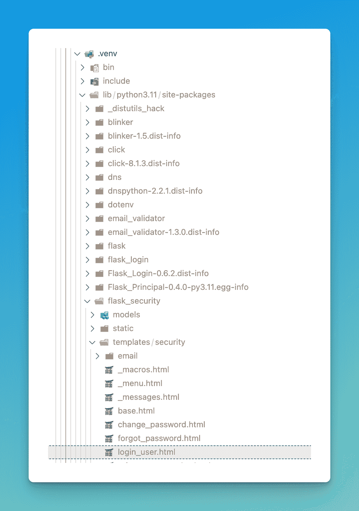

# 如何定制 Flask-Security 的页面和电子邮件

> 原文：<https://blog.teclado.com/customise-pages-emails-flask-security-too/>

当我们使用 Flask-Security-Too 时，我们可能想要定制两件事情:页面和电子邮件。例如，登录页面或帐户确认电子邮件。下面我们来看看怎么做。

这是这个博客系列的最后一篇文章，我将向您展示如何使用 Flask-Security:

1.  [使用 Flask-Security-Too 在 Flask 中进行用户验证](https://blog.teclado.com/user-authentication-flask-security-too/)
2.  [用户电子邮件确认 Flask-Security-Too](https://blog.teclado.com/email-confirmation-flask-security-too/)
3.  定制 Flask-Security-Too 的模板和电子邮件(本文)

Flask-Security-Too 中的所有页面和电子邮件模板都是使用 HTML 和 Jinja 编写的，你可以在虚拟环境的文件夹中找到它们，然后在`lib/python3/site-packages/flask_security/templates/security`中找到它们。



在本文中，我们将定制三个模板:

*   `login_user.html`
*   `_macros.html`
*   `register_user.html`

这样做将帮助您学习如何定制任何模板，这样您就可以对您想要修改的其他模板进行同样的操作。

## 定制登录模板

首先打开`login_user.html`默认模板并复制其内容。

然后，在你的 Flask 应用程序的`templates`文件夹中，创建一个`security`文件夹。在里面，创建`login_user.html`，并粘贴从默认模板中复制的内容。

通过这样做，你的 Flask 应用程序将使用你的模板，而不是默认模板。目前，它们有相同的内容！我们来看看如何改变内容。

我写这篇文章的时候，这是`login_user.html`的内容:

```





<h1>{{ _fsdomain('Login') }}</h1>
  <form action="{{ url_for_security('login') }}" method="POST" name="login_user_form">
    {{ login_user_form.hidden_tag() }}
    {{ render_form_errors(login_user_form) }}
    
      {{ render_field_with_errors(login_user_form.email) }}
    
    
      
        <h3>{{ _fsdomain("or") }}</h3>
      
      {{ render_field_with_errors(login_user_form.username) }}
    
    <div class="fs-gap">
      {{ render_field_with_errors(login_user_form.password) }}</div>
    {{ render_field_with_errors(login_user_form.remember) }}
    {{ render_field_errors(login_user_form.csrf_token) }}
    {{ render_field(login_user_form.submit) }}
  </form>
  
    <hr class="fs-gap">
    <h2>{{ _fsdomain("Use WebAuthn to Sign In") }}</h2>
    <div>
      <form method="GET" id="wan-signin-form" name="wan_signin_form">
        <input id="wan_signin" name="wan_signin" type="submit" value="{{ _fsdomain('Sign in with WebAuthn') }}"
          formaction="{{ url_for_security("wan_signin") }}">
      </form>
    </div>
  

 
```

如您所见，这里没有多少实际的 HTML。主要是导入其他文件和使用一些预定义的宏。如果我们想改变页面的样式，我们需要替换所有内容:

*   `security/_messages.html`文件。
*   用于呈现字段的宏。
*   `security/_menu.html`文件。

最近，我的所有 CSS 都使用 TailwindCSS，所以如果你正在使用它，这里有两个你可以使用的模板。

```

<div class="flex flex-col min-h-full items-center justify-center py-12 px-4 sm:px-6 lg:px-8">
  <div class="w-full max-w-md space-y-8">
    
    
      <div class="w-full my-6">
        
          <p>{{ message }}</p>
        
      </div>
    
    <div>
      <h2 class="mt-6 text-center text-3xl font-bold tracking-tight text-gray-900">Sign in to your account</h2>
      <p class="mt-2 text-center text-sm text-gray-600">
        Or
        <a href="{{ url_for_security('register') }}" class="font-medium text-indigo-600 hover:text-indigo-500">sign up instead?</a>
      </p>
    </div>
    <form action="{{ url_for_security('login') }}" method="POST" class="mt-8 space-y-6">
      {{ login_user_form.hidden_tag() }}
      {{ render_signup_login_field_w_errors(login_user_form.email, placeholder="Email", autocomplete="email") }}
      {{ render_signup_login_field_w_errors(login_user_form.password, placeholder="Password", autocomplete="current-password") }}
      {{ render_checkbox_with_errors(login_user_form.remember) }}

      <div>
        <button
          type="submit"
          class="w-full flex justify-center py-2 px-4 border border-transparent rounded-md shadow-sm text-sm font-medium text-white bg-indigo-600 hover:bg-indigo-700 focus:outline-none focus:ring-2 focus:ring-offset-2 focus:ring-indigo-500"
        >
          Sign in
        </button>
      </div>
    </form>
  </div>
</div>
 
```

而在`security/_macros.html`:

```

  <div class="relative flex items-start">
    <div class="flex items-center h-5">
    {{ field(class_="focus:ring-indigo-500 h-4 w-4 text-indigo-600 border-gray-300 rounded", **kwargs)|safe }}
    </div>
    <div class="ml-3 text-sm">
    {{ field.label(class_="text-gray-700") }}</div>
    
      <ul>
      
        <li>{{ error }}</li>
      
      </ul>
    
  </div>



  <p class="{{ class_ }}">
    {{ field.label(class_="sr-only") }} {{ field(class_="relative block w-full appearance-none rounded-md border border-gray-300 px-3 py-2 text-gray-900 placeholder-gray-500 focus:z-10 focus:border-indigo-500 focus:outline-none focus:ring-indigo-500 sm:text-sm", **kwargs)|safe }}
    
      <ul>
      
        <li>{{ error }}</li>
      
      </ul>
    
  </p>
 
```

然后在`security/register_user.html`中:

```




<div class="flex min-h-full items-center justify-center py-12 px-4 sm:px-6 lg:px-8">
  <div class="w-full max-w-md space-y-8">
    <div>
      <h2 class="mt-6 text-center text-3xl font-bold tracking-tight text-gray-900">Create your account</h2>
      <p class="mt-2 text-center text-sm text-gray-600">
        Or
        <a href="{{ url_for_security('login') }}" class="font-medium text-indigo-600 hover:text-indigo-500">log in instead?</a>
      </p>
    </div>
    <form action="{{ url_for_security('register') }}" method="POST" class="mt-8 space-y-6">
      {{ register_user_form.hidden_tag() }}
      {{ render_signup_login_field_w_errors(register_user_form.full_name, placeholder="Full name", autocomplete="name") }}
      {{ render_signup_login_field_w_errors(register_user_form.email, placeholder="Email", autocomplete="email") }}
      
      {{ render_signup_login_field_w_errors(register_user_form.username, placeholder="Full name", autocomplete="name") }}
      
      {{ render_signup_login_field_w_errors(register_user_form.password, placeholder="Password", autocomplete="current-password") }}
      
      {{ render_signup_login_field_w_errors(register_user_form.password_confirm, placeholder="Confirm password") }}
      

      <div>
        <button
          type="submit"
          class="w-full flex justify-center py-2 px-4 border border-transparent rounded-md shadow-sm text-sm font-medium text-white bg-indigo-600 hover:bg-indigo-700 focus:outline-none focus:ring-2 focus:ring-offset-2 focus:ring-indigo-500"
        >
          Create your account
        </button>
        <p class="mt-3 text-center text-sm text-slate-700">By creating an account, you agree to our <a class="font-semibold" href="{{ url_for('resource_page', page_slug='terms-of-service') }}">Terms of Service</a> and <a class="font-semibold" href="{{ url_for('resource_page', page_slug='privacy-policy') }}">Privacy Policy</a>.</p>
      </div>
    </form>
  </div>
</div>
 
```

### 通过链接样式表自定义模板

如果您想添加一个 CSS 样式表，而不是更改模板，那会容易得多。您可以复制并粘贴原始文件内容，并链接 CSS 样式表，如下所示:

```




<link rel="stylesheet" href="{{ url_for('static', filename='css/auth.css) }}">




<h1>{{ _fsdomain('Login') }}</h1>
  <form action="{{ url_for_security('login') }}" method="POST" name="login_user_form">
    {{ login_user_form.hidden_tag() }}
    {{ render_form_errors(login_user_form) }}
    
      {{ render_field_with_errors(login_user_form.email) }}
    
    
      
        <h3>{{ _fsdomain("or") }}</h3>
      
      {{ render_field_with_errors(login_user_form.username) }}
    
    <div class="fs-gap">
      {{ render_field_with_errors(login_user_form.password) }}</div>
    {{ render_field_with_errors(login_user_form.remember) }}
    {{ render_field_errors(login_user_form.csrf_token) }}
    {{ render_field(login_user_form.submit) }}
  </form>
  
    <hr class="fs-gap">
    <h2>{{ _fsdomain("Use WebAuthn to Sign In") }}</h2>
    <div>
      <form method="GET" id="wan-signin-form" name="wan_signin_form">
        <input id="wan_signin" name="wan_signin" type="submit" value="{{ _fsdomain('Sign in with WebAuthn') }}"
          formaction="{{ url_for_security("wan_signin") }}">
      </form>
    </div>
  

 
```

上面代码中添加到原始内容的唯一内容是 imports 下的内容。这里假设 CSS 文件名在`static/css/auth.css`下:

```

<link rel="stylesheet" href="{{ url_for('static', filename='css/auth.css) }}">
 
```

记住，这个原始模板扩展了`security/base.html`模板，所以您可以查看那个模板，看看有哪些不同的`block`元素可用。

## 定制确认电子邮件模板

接下来，我喜欢改变电子邮件确认模板的外观。默认模板是基本的，只有文本。您可以在虚拟环境中的`flask_security`文件夹中的`templates/email/welcome.html`文件中找到它。

您还可以找到`welcome.txt`，它是电子邮件内容的文本表示。这将用于那些不支持 HTML 渲染(或禁用它)的电子邮件客户端。

创建一个`templates/email/welcome.html`文件。

这是我的模板的样子:

```
{# This template receives the following context:
  confirmation_link - the link that should be fetched (GET) to confirm
  confirmation_token - this token is part of confirmation link - but can be used to
    construct arbitrary URLs for redirecting.
  user - the entire user model object
  security - the Flask-Security configuration
#}
<!DOCTYPE html PUBLIC "-//W3C//DTD XHTML 1.0 Transitional//EN" "http://www.w3.org/TR/xhtml1/DTD/xhtml1-transitional.dtd">
<html  style="font-family: 'Helvetica Neue', Helvetica, Arial, sans-serif; box-sizing: border-box; font-size: 14px; margin: 0;">
<head>
<meta name="viewport" content="width=device-width" />
<meta http-equiv="Content-Type" content="text/html; charset=UTF-8" />
<title>Confirm your email</title>

<style type="text/css">
img {
max-width: 100%;
}
body {
-webkit-font-smoothing: antialiased; -webkit-text-size-adjust: none; width: 100% !important; height: 100%; line-height: 1.6em;
}
body {
background-color: #f6f6f6;
}
@media only screen and (max-width: 640px) {
  body {
    padding: 0 !important;
  }
  h1 {
    font-weight: 800 !important; margin: 20px 0 5px !important;
  }
  h2 {
    font-weight: 800 !important; margin: 20px 0 5px !important;
  }
  h3 {
    font-weight: 800 !important; margin: 20px 0 5px !important;
  }
  h4 {
    font-weight: 800 !important; margin: 20px 0 5px !important;
  }
  h1 {
    font-size: 22px !important;
  }
  h2 {
    font-size: 18px !important;
  }
  h3 {
    font-size: 16px !important;
  }
  .container {
    padding: 0 !important; width: 100% !important;
  }
  .content {
    padding: 0 !important;
  }
  .content-wrap {
    padding: 10px !important;
  }
  .invoice {
    width: 100% !important;
  }
}
</style>
</head>

<body itemscope itemtype="http://schema.org/EmailMessage" style="font-family: 'Helvetica Neue',Helvetica,Arial,sans-serif; box-sizing: border-box; font-size: 14px; -webkit-font-smoothing: antialiased; -webkit-text-size-adjust: none; width: 100% !important; height: 100%; line-height: 1.6em; background-color: #f6f6f6; margin: 0;" bgcolor="#f6f6f6">

<table class="body-wrap" style="font-family: 'Helvetica Neue',Helvetica,Arial,sans-serif; box-sizing: border-box; font-size: 14px; width: 100%; background-color: #f6f6f6; margin: 0;" bgcolor="#f6f6f6"><tr style="font-family: 'Helvetica Neue',Helvetica,Arial,sans-serif; box-sizing: border-box; font-size: 14px; margin: 0;"><td style="font-family: 'Helvetica Neue',Helvetica,Arial,sans-serif; box-sizing: border-box; font-size: 14px; vertical-align: top; margin: 0;" valign="top"></td>
        <td class="container" width="600" style="font-family: 'Helvetica Neue',Helvetica,Arial,sans-serif; box-sizing: border-box; font-size: 14px; vertical-align: top; display: block !important; max-width: 600px !important; clear: both !important; margin: 0 auto;" valign="top">
            <div class="content" style="font-family: 'Helvetica Neue',Helvetica,Arial,sans-serif; box-sizing: border-box; font-size: 14px; max-width: 600px; display: block; margin: 0 auto; padding: 20px;">
                <table class="main" width="100%" cellpadding="0" cellspacing="0" itemprop="action" itemscope itemtype="http://schema.org/ConfirmAction" style="font-family: 'Helvetica Neue',Helvetica,Arial,sans-serif; box-sizing: border-box; font-size: 14px; border-radius: 3px; background-color: #fff; margin: 0; border: 1px solid #e9e9e9;" bgcolor="#fff"><tr style="font-family: 'Helvetica Neue',Helvetica,Arial,sans-serif; box-sizing: border-box; font-size: 14px; margin: 0;"><td class="content-wrap" style="font-family: 'Helvetica Neue',Helvetica,Arial,sans-serif; box-sizing: border-box; font-size: 14px; vertical-align: top; margin: 0; padding: 20px;" valign="top">
                            <meta itemprop="name" content="Confirm Email" style="font-family: 'Helvetica Neue',Helvetica,Arial,sans-serif; box-sizing: border-box; font-size: 14px; margin: 0;" /><table width="100%" cellpadding="0" cellspacing="0" style="font-family: 'Helvetica Neue',Helvetica,Arial,sans-serif; box-sizing: border-box; font-size: 14px; margin: 0;"><tr style="font-family: 'Helvetica Neue',Helvetica,Arial,sans-serif; box-sizing: border-box; font-size: 14px; margin: 0;"><td class="content-block" style="font-family: 'Helvetica Neue',Helvetica,Arial,sans-serif; box-sizing: border-box; font-size: 14px; vertical-align: top; margin: 0; padding: 0 0 20px;" valign="top">
                                        Hey, {{user.username}}! {{ _fsdomain('Please confirm your email through the link below:') }}
                                    </td>
                                </tr><tr style="font-family: 'Helvetica Neue',Helvetica,Arial,sans-serif; box-sizing: border-box; font-size: 14px; margin: 0;"><td class="content-block" itemprop="handler" itemscope itemtype="http://schema.org/HttpActionHandler" style="font-family: 'Helvetica Neue',Helvetica,Arial,sans-serif; box-sizing: border-box; font-size: 14px; vertical-align: top; margin: 0; padding: 0 0 20px;" valign="top">
                                        <a href="{{ confirmation_link }}" class="btn-primary" itemprop="url" style="font-family: 'Helvetica Neue',Helvetica,Arial,sans-serif; box-sizing: border-box; font-size: 14px; color: #FFF; text-decoration: none; line-height: 2em; font-weight: bold; text-align: center; cursor: pointer; display: inline-block; border-radius: 5px; text-transform: capitalize; background-color: #4F46E5; margin: 0; border-color: #4F46E5; border-style: solid; border-width: 6px 20px;">{{ _fsdomain('Confirm my account') }}</a>
                                    </td>
                                </tr><tr style="font-family: 'Helvetica Neue',Helvetica,Arial,sans-serif; box-sizing: border-box; font-size: 14px; margin: 0;"><td class="content-block" style="font-family: 'Helvetica Neue',Helvetica,Arial,sans-serif; box-sizing: border-box; font-size: 14px; vertical-align: top; margin: 0; padding: 0 0 20px;" valign="top">
                                        If clicking the button doesn't work, please copy this link and paste it into your browser's address bar:
                                    </td>
                                </tr><tr style="font-family: 'Helvetica Neue',Helvetica,Arial,sans-serif; box-sizing: border-box; font-size: 14px; margin: 0;"><td class="content-block" style="font-family: 'Helvetica Neue',Helvetica,Arial,sans-serif; box-sizing: border-box; font-size: 14px; vertical-align: top; margin: 0; padding: 0 0 20px; max-width: 20em;" valign="top">
                                        <a href="{{ confirmation_link }}">{{ confirmation_link }}</a>
                                    </td>
                                </tr>
                                <tr style="font-family: 'Helvetica Neue',Helvetica,Arial,sans-serif; box-sizing: border-box; font-size: 14px; margin: 0;"><td class="content-block" style="font-family: 'Helvetica Neue',Helvetica,Arial,sans-serif; box-sizing: border-box; font-size: 14px; vertical-align: top; margin: 0; padding: 0 0 20px;" valign="top">
                                        &mdash; Jose and the Teclado team
                                    </td>
                                </tr></table></td>
                    </tr></table><div class="footer" style="font-family: 'Helvetica Neue',Helvetica,Arial,sans-serif; box-sizing: border-box; font-size: 14px; width: 100%; clear: both; color: #999; margin: 0; padding: 20px;">
                    <table width="100%" style="font-family: 'Helvetica Neue',Helvetica,Arial,sans-serif; box-sizing: border-box; font-size: 14px; margin: 0;"><tr style="font-family: 'Helvetica Neue',Helvetica,Arial,sans-serif; box-sizing: border-box; font-size: 14px; margin: 0;"><td class="aligncenter content-block" style="font-family: 'Helvetica Neue',Helvetica,Arial,sans-serif; box-sizing: border-box; font-size: 12px; vertical-align: top; color: #999; text-align: center; margin: 0; padding: 0 0 20px;" align="center" valign="top">Follow <a href="http://twitter.com/tecladocode" style="font-family: 'Helvetica Neue',Helvetica,Arial,sans-serif; box-sizing: border-box; font-size: 12px; color: #999; text-decoration: underline; margin: 0;">@tecladocode</a> on Twitter.</td>
                        </tr></table></div></div>
        </td>
        <td style="font-family: 'Helvetica Neue',Helvetica,Arial,sans-serif; box-sizing: border-box; font-size: 14px; vertical-align: top; margin: 0;" valign="top"></td>
    </tr></table></body>
</html> 
```

正如你所看到的，它很长，相当混乱！那是因为用 HTML 写邮件真的很难。电子邮件客户端如此之多，它们并不都支持相同的 CSS。

我的邮件来自 Mailgun 的官方模板，你可以在这里看到，我已经根据我的需要进行了修改。Mailgun 对 HTML 邮件做了很好的描述，你可以在这里阅读。

好了，现在就这些了！非常感谢您的阅读，希望这一系列文章对您有用。如果你想学习更多关于使用 Flask 进行 web 开发的知识，可以考虑参加我们的 [Web 开发者训练营 Flask 和 Python](https://go.tecla.do/web-dev-course-sale) ！这是一个完整的视频课程，涵盖了使用 Flask 构建和部署多个 web 应用程序。

下次见！