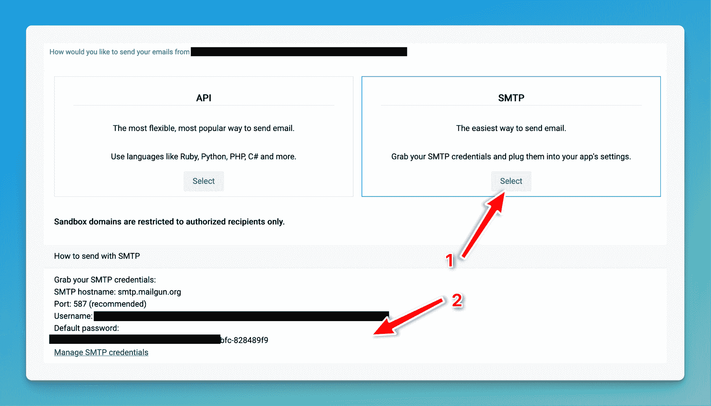
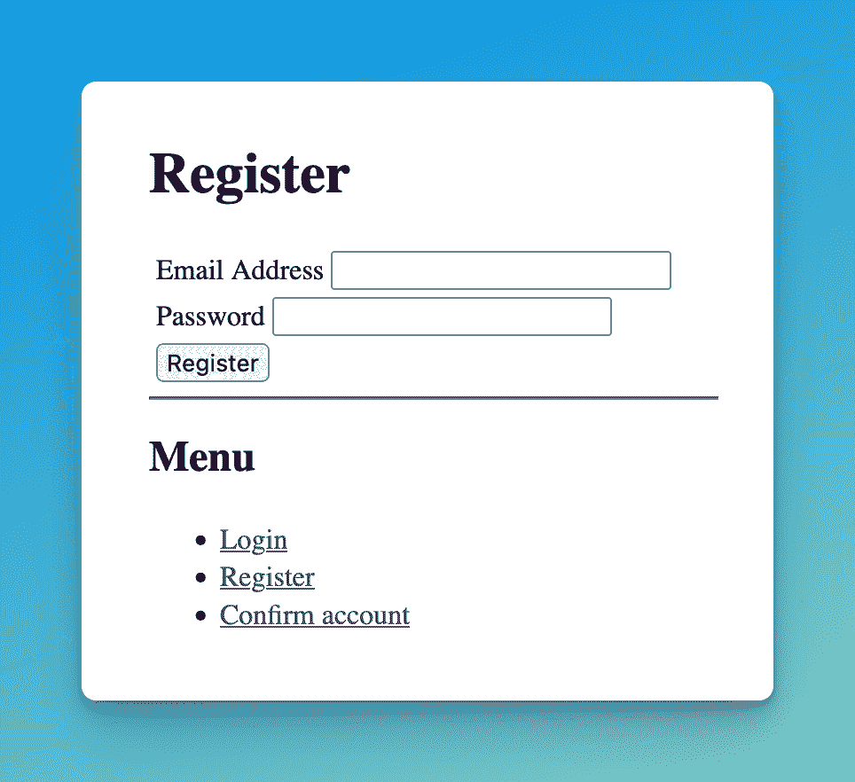
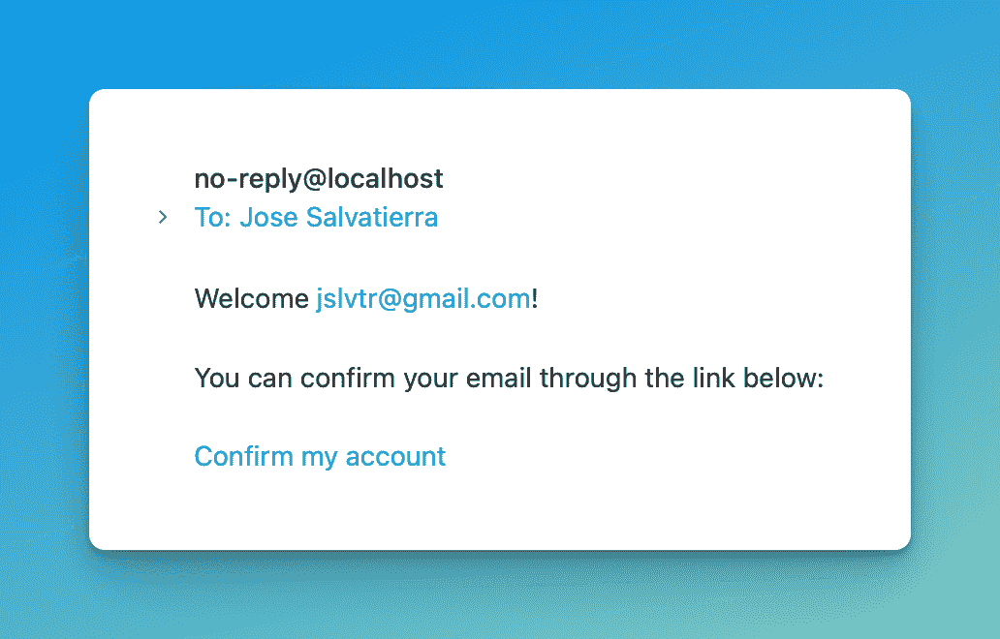
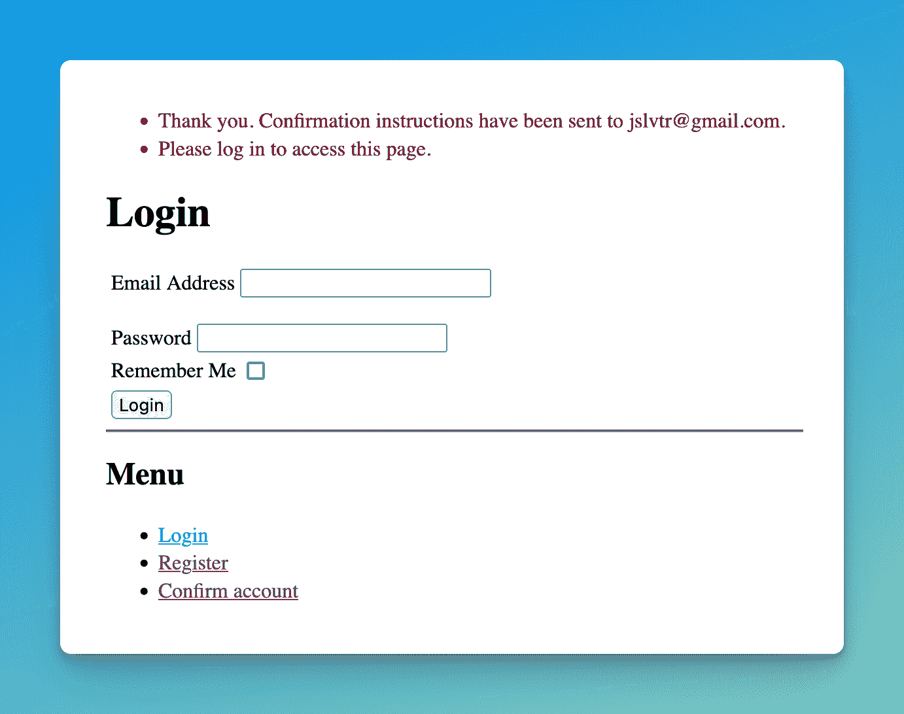
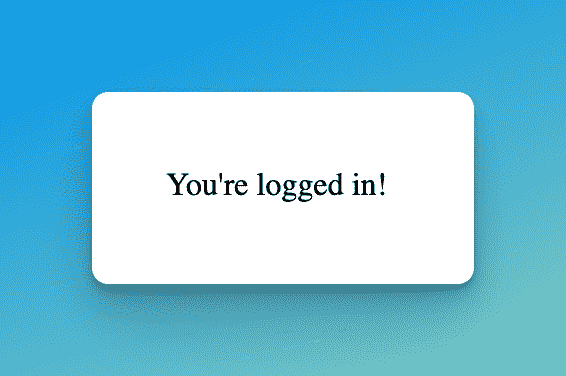

# 使用 Flask-Security-Too 的用户电子邮件确认

> 原文：<https://blog.teclado.com/email-confirmation-flask-security-too/>

为了防止 bot 注册并减少垃圾邮件，您可以要求用户在注册到您的 web 应用程序时点按他们收到的电子邮件中的链接。Flask-Security-Too 可以通过一些配置来处理这个问题。

这是关于 Flask-Security 的系列文章的第 2 篇，共 3 篇:

1.  [使用 Flask-Security-Too 在 Flask 中进行用户验证](https://blog.teclado.com/user-authentication-flask-security-too/)
2.  使用 Flask-Security-Too 的用户电子邮件确认(本文)
3.  [定制 Flask-Security-Too 的模板和电子邮件](https://blog.teclado.com/customise-pages-emails-flask-security-too/)

我们开始吧！

用户确认的棘手之处在于电子邮件的发送。要真正发送电子邮件并让它们到达用户的收件箱(而不是以垃圾邮件结束)，您需要几样东西:域名、电子邮件递送服务和适当的配置。我们在我们的[REST API with Flask 和 Python](https://go.tecla.do/rest-apis-sale) 课程中深入讨论了这一点，你可以在这里阅读课程电子书[的那一部分。](https://rest-apis-flask.teclado.com/docs/task_queues_emails/send_emails_python_mailgun/)

我喜欢电子邮件递送服务 Mailgun。创建一个帐户，你会得到一个沙盒域。您可以使用该域名向“授权收件人”发送电子邮件。您可以将自己添加为授权收件人，这样您也可以测试 Flask-Security 的电子邮件确认功能。如何做到这一点的一步一步的指导是[在这里](https://rest-apis-flask.teclado.com/docs/task_queues_emails/send_emails_python_mailgun/#setting-up-for-mailgun)。在继续之前，请阅读“设置 Mailgun”部分！

将来，如果你想购买一个域名，你可以用它通过 Mailgun 发送电子邮件(尽管这不是免费的)。

现在您已经有了自己的 Mailgun 帐户，让我们来看看 SMTP 的详细信息。您可以通过单击“SMTP”下的“选择”按钮来完成此操作:



让我们将这些添加到我们的`.env`文件中:

```py
DATABASE_URL="sqlite:///data.db"
MAIL_SERVER=smtp.mailgun.org
MAIL_PORT=587
MAIL_USERNAME=
MAIL_PASSWORD= 
```

现在我们可以告诉 Flask-Security-Too 使用带有一个配置设置的电子邮件确认:

```py
app.config["SECURITY_CONFIRMABLE"] = True 
```

这样做是为了使用户账户在被标记为`confirmed`之前无效(这是我们的`UserModel`类中的一列，你可以在`models/auth.py`中看到)。当用户点击注册后收到的电子邮件中的链接时，用户帐户将成为`confirmed`。

接下来，我们将配置 Flask-Mailman 库，Flask-Security-Too 使用它来发送电子邮件。在`app.py`中:

```py
# At top of file
from flask_mailman import Mail

# After 'Create app'
app.config["MAIL_SERVER"] = os.getenv("MAIL_SERVER")
app.config["MAIL_PORT"] = os.getenv("MAIL_PORT")
app.config["MAIL_USE_SSL"] = False
app.config["MAIL_USE_TLS"] = True
app.config["MAIL_USERNAME"] = os.getenv("MAIL_USERNAME")
app.config["MAIL_PASSWORD"] = os.getenv("MAIL_PASSWORD")
mail = Mail(app) 
```

请注意，`MAIL_USE_SSL`和`MAIL_USE_TLS`值将取决于您使用的提供商。Mailgun 使用 TLS，所以这就是为什么我们将 SSL 设置为`False`，将 TLS 设置为`True`。

现在，当你注册一个账户时，你会收到一封确认邮件，里面有一个你必须点击的链接。如果您不点击该链接，该帐户将不会被视为有效。

我们可以通过创建一个受保护的端点(需要登录的端点)来测试这一点。然后我们可以注册，但不要点击电子邮件链接，看看我们是否可以访问它。

为了创建受保护的端点，我们使用了`@login_required`装饰器:

```py
# At top of file
from flask_security import login_required

# At bottom of file
@app.route("/protected")
@login_required
def protected():
    return "You're logged in!" 
```

现在让我们试一试。删除您的`data.db`文件，并使用`flask shell`重新创建它:

```py
>>> from app import app, db
>>> with app.app_context():
	 	db.create_all() 
```

然后用`flask run`启动 app，填写你的报名表。有趣的是，当我们启用电子邮件确认时，Flask-Security 也会自动禁用注册表单中的密码确认。现在只有一个密码字段，而不是两个:



请填写，确保使用您在 Mailgun 的“授权收件人”中使用的电子邮件地址。

然后你应该会收到一封电子邮件(可能在你的垃圾邮件文件夹中，因为我们使用的是 Mailgun 沙盒域):



先不要点击链接。相反，使用您的浏览器导航到`/protected`端点:[http://127 . 0 . 0 . 1:5000/protected](http://127.0.0.1:5000/protected)。您应该被重定向到登录页面，并且应该看到一个错误:



这些错误使用 Flask 的[闪烁消息](https://flask.palletsprojects.com/en/2.2.x/patterns/flashing/)，您可以看到有两条消息:

*   谢谢你。确认说明已发送至(我的电子邮件)。
*   请登录以访问此页面。

它们看起来都像错误，但第一个只是注册成功时 Flask-Security-Too 闪烁的消息。闪烁的信息必须显示一次，因为直到现在还没有地方可以显示，所以它一直停留在那里。理想情况下，您应该在注册后将用户重定向到的页面中使用消息闪烁来显示该消息。

第二条消息*是*我们预期的错误！

现在，单击电子邮件中的确认链接，然后重试。应该能行！



这就是你如何使用 Flask-Security-Too 来轻松地将使用注册和确认添加到你的 Flask 应用程序中。很自然，您会希望设计登录、注册和确认页面的样式来匹配应用程序的其余部分。我们将在本系列的第 3 部分中讨论这个问题。

感谢您的阅读！如果你想学习更多关于使用 Flask 进行 web 开发的知识，可以考虑参加我们的 [Web 开发者训练营 Flask 和 Python](https://go.tecla.do/web-dev-course-sale) ！这是一个完整的视频课程，涵盖了使用 Flask 构建和部署多个 web 应用程序。