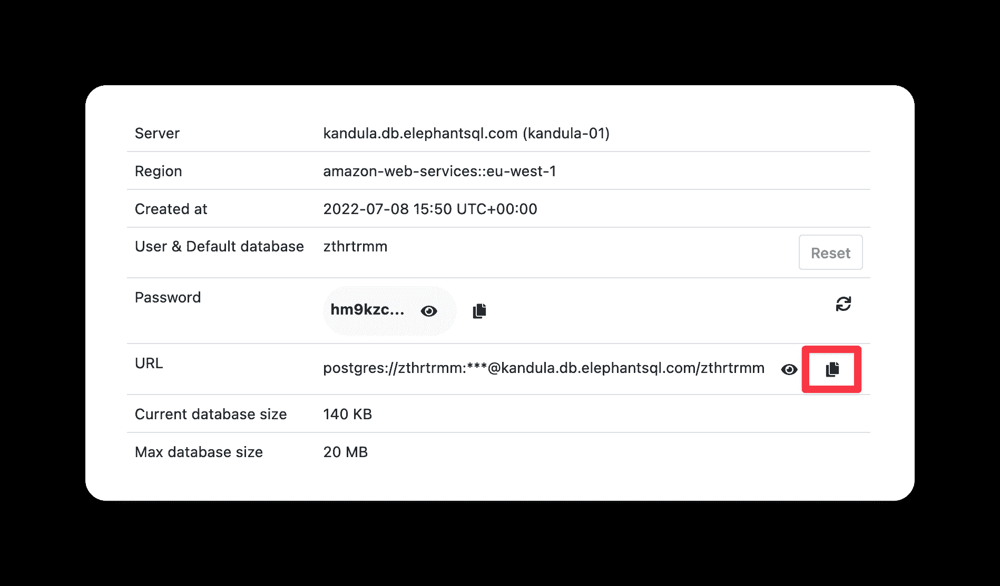

# 用 Flask 和 PostgreSQL 构建您的第一个 REST API

> 原文：<https://blog.teclado.com/first-rest-api-flask-postgresql-python/>

REST APIs 无处不在。在几乎每个 web 和移动应用程序的背后，都有一个 REST API 支持数据库交互、与其他客户端共享功能等等。

在这篇文章中，我们将向您展示如何使用 Flask 创建自己的 REST API，将家庭自动化数据存储在 PostgreSQL 中，并从任何地方访问它！

Flask 和 REST API 开发有许多替代方案，包括 Django、Quart 和 FastAPI 等。它们各有利弊。在这篇博客中，我们曾经比较过 [Flask 和 Django](https://blog.teclado.com/learn-python-flask-or-django/) 。

[https://www.youtube.com/embed/DlNIXC9SaF4?feature=oembed](https://www.youtube.com/embed/DlNIXC9SaF4?feature=oembed)

VIDEO

YouTube video guide of this blog post. The written version has some more details and covers more Flask than the video. It was going to be way too long otherwise!

## 项目的目标

我们将构建的 REST API 将帮助您存储家庭自动化数据。具体来说就是你家不同房间的温度。即使您不使用家庭自动化，学习如何做到这一点也会向您展示许多有用的东西，例如:

*   如何编写一个从客户端接收数据的 REST API？
*   如何将数据保存到 PostgreSQL 中？
*   如何使用 PostgreSQL 读取和查询数据以准确检索您需要的内容。
*   如何存储你的 REST API 使用了，但是你不想和别人分享的秘密？

REST APIs 由端点组成:客户端可以向其发送请求的地址。对于每个请求，客户端都可以包含数据。然后，REST API 可以使用这些数据并将其存储在数据库中，或者将一些其他数据返回给客户端。

以下是我们的 REST API 将拥有的端点:

*   会让客户将房间名称发送给我们，我们将在数据库中创建一个房间，我们可以根据它存储温度。
*   会让客户将房间和温度发送给我们，我们会在进行一些格式化后将其存储在数据库中。
*   会让客户给我们发送一个房间标识符，我们会返回一个房间自创建以来的平均温度。或者，客户将能够指定一个`term`(以天为单位)，我们将做出适当的响应。
*   自从我们开始收集数据以来，将允许客户请求所有房间的平均温度。

如你所见，没有很多端点。Python 代码可以放在一个文件中！

我们开始吧💪

## 如何为 Python 项目安装 Flask

每当您开始一个 Python 项目时，您可能会希望使用虚拟环境。如果你需要复习，我们有我们的博客文章，[使用 Python 虚拟环境:完整指南](https://blog.teclado.com/python-virtual-environments-complete-guide/)告诉你你需要的一切！

让我们创建虚拟环境并安装 Flask:

```py
python -m venv .venv
source .venv/bin/activate   # different in windows
pip install flask 
```

## 如何运行 Flask 应用程序并连接到数据库

让我们开始编写烧瓶代码吧！我将创建一个名为`app.py`的文件:

```py
from flask import Flask

app = Flask(__name__) 
```

这是你能编写的最基本的 Flask 应用程序。它什么也不做！

但是如果您在控制台上输入:

```py
flask run 
```

您应该会看到如下所示的输出:

```py
 * Environment: production
   WARNING: This is a development server. Do not use it in a production deployment.
   Use a production WSGI server instead.
 * Debug mode: off
 * Running on http://127.0.0.1:5000 (Press CTRL+C to quit) 
```

那是烧瓶运行！现在它能够接受来自客户的请求，并对此做些事情。

两个问题:

1.  我们正在使用“生产”模式，这是不推荐的。使用“开发”模式使事情变得简单一些。
2.  我们还没有告诉它如何处理传入的请求！

让我们一次解决一个问题。

### 如何在“开发”模式下启动 Flask 应用程序

让我们在项目中创建一个名为`.flaskenv`的文件，放在`app.py`旁边。

在里面，写下这两行字:

```py
FLASK_APP=app
FLASK_DEBUG=1 
```

这些是环境变量样式参数。我们的 Flask 应用程序将能够读取它们，并相应地配置自己。但是首先，我们需要再安装一个依赖项:

```py
pip install python-dotenv 
```

如果我们这样做了:

```py
flask run 
```

您应该会看到以下输出:

```py
 * Serving Flask app 'app' (lazy loading)
 * Environment: development
 * Debug mode: on
 * Running on http://127.0.0.1:5000 (Press CTRL+C to quit)
 * Restarting with stat
 * Debugger is active!
 * Debugger PIN: 145-515-717 
```

太棒了。我们准备继续第二步:告诉应用程序如何处理传入的请求！

但是首先，让我们创建 PostgreSQL 数据库。对于易于创建的开发数据库，我经常使用 [ElephantSQL](https://www.elephantsql.com/) 。它是一个很棒的 PostgreSQL 提供商，你可以从他们那里获得免费的小型数据库。

使用 ElephantSQL 的一个替代方法是在您的计算机上本地安装 PostgreSQL，但是这需要更多的工作。

所以如果你还没有的话，创建一个 ElephantSQL 账户，并创建一个“小海龟(免费)”数据库。为数据库选择一个离您最近的区域，这样请求会更快。

现在您已经创建了一个数据库，获取 URL:



为了在我们的代码中访问数据库 URL，让我们将它添加到一个名为`.env`的新文件中:

```py
DATABASE_URL=your_url 
```

接下来，安装 Flask 库，它允许我们连接到 PostgreSQL 数据库，`psycopg2`:

```py
pip install psycopg2-binary 
```

然后我们可以进入`app.py`并连接到数据库:

```py
import os
import psycopg2
from dotenv import load_dotenv
from flask import Flask

load_dotenv()  # loads variables from .env file into environment

app = Flask(__name__)
url = os.environ.get("DATABASE_URL")  # gets variables from environment
connection = psycopg2.connect(url) 
```

这样，我们就可以开始查询数据库了！让我们先创建新的房间。

## 如何使用 Flask 创建 PostgreSQL 表并插入数据

我们需要两个查询:

*   一个是创建表，如果它还不存在的话。我们需要知道我们希望表包含哪些列。
*   一个用于向表中插入一行。为此，我们需要要插入行中的数据。

要创建该表，我们将使用以下查询:

```py
CREATE TABLE IF NOT EXISTS rooms (id SERIAL PRIMARY KEY, name TEXT); 
```

为了插入数据，我们将使用:

```py
INSERT INTO rooms (name) VALUES (%s) RETURNING id; 
```

我们将让这个查询返回插入的`id`列，这样我们就可以将它发送回 API 的客户端。这样，他们可以在后续请求中使用`id`来插入与新房间相关的温度。

让我们将这两个查询作为常量保存在我们的文件中。把这些放在最上面，在进口之后。

```py
CREATE_ROOMS_TABLE = (
    "CREATE TABLE IF NOT EXISTS rooms (id SERIAL PRIMARY KEY, name TEXT);"
)

INSERT_ROOM_RETURN_ID = "INSERT INTO rooms (name) VALUES (%s) RETURNING id;" 
```

现在让我们告诉应用程序如何处理传入的请求。

当客户端向`/api/room`端点发出请求时，我们将期待房间名称被发送给我们。然后，我们将在表中插入一行，并返回新房间`id`:

```py
from flask import Flask, request

...

@app.post("/api/room")
def create_room():
    data = request.get_json()
    name = data["name"]
    with connection:
        with connection.cursor() as cursor:
            cursor.execute(CREATE_ROOMS_TABLE)
            cursor.execute(INSERT_ROOM_RETURN_ID, (name,))
            room_id = cursor.fetchone()[0]
    return {"id": room_id, "message": f"Room {name} created."}, 201 
```

这里有几个新东西！

*   我们使用装饰器告诉 Flask 接受数据的端点。你可以阅读[这个系列](https://blog.teclado.com/decorators-in-python/)了解更多关于装修工的知识。
*   我们期望客户端向我们发送 JSON 数据，我们使用`request.get_json()`从[传入的请求](https://blog.teclado.com/learn-python-interacting-with-rest-apis-with-python/)中检索这些数据。
*   我们连接到数据库，并使用光标与之交互。这里我们使用[上下文管理器](https://www.psycopg.org/docs/usage.html#with-statement)，这样我们就不必记得手动关闭连接。
*   我们创建表(因为它只运行`IF NOT EXISTS`)，并插入记录。
*   我们得到运行查询的结果，应该是插入的行`id`。
*   我们返回一个 Python 字典，Flask 可以方便地将其转换成 JSON。
*   返回状态码为`201`，表示“已创建”。这是我们的 API 简洁地告诉客户端请求状态的一种方式。

接下来，让我们为新创建的房间添加新的温度读数。为此，我们希望客户端发送一个包含温度读数和房间`id`的请求。

然后我们会:

1.  创建温度读数表，包含 3 列(房间 id、温度读数和可选日期)。
2.  如果提供了日期，请使用它。否则使用当前日期。
3.  将温度读数插入表中。
4.  向客户端返回成功消息。

让我们定义将用于此目的的 SQL 查询。首先，创建温度读数表:

```py
CREATE TABLE IF NOT EXISTS temperatures (room_id INTEGER, temperature REAL, 
date TIMESTAMP, FOREIGN KEY(room_id) REFERENCES rooms(id) ON DELETE CASCADE); 
```

这使用了一个`FOREIGN KEY`约束将表链接到`rooms`表。所有这些都是为了确保引用的完整性(即不能为一个不存在的房间输入一个`room_id`)。使用`ON DELETE CASCADE`也意味着如果我们删除一个房间，它的所有参考温度也将被删除。

要插入温度:

```py
INSERT INTO temperatures (room_id, temperature, date) VALUES (%s, %s, %s); 
```

将这些也作为常量添加。这是我的常量部分现在的样子:

```py
CREATE_ROOMS_TABLE = (
    "CREATE TABLE IF NOT EXISTS rooms (id SERIAL PRIMARY KEY, name TEXT);"
)
CREATE_TEMPS_TABLE = """CREATE TABLE IF NOT EXISTS temperatures (room_id INTEGER, temperature REAL, 
                        date TIMESTAMP, FOREIGN KEY(room_id) REFERENCES rooms(id) ON DELETE CASCADE);"""

INSERT_ROOM_RETURN_ID = "INSERT INTO rooms (name) VALUES (%s) RETURNING id;"
INSERT_TEMP = (
    "INSERT INTO temperatures (room_id, temperature, date) VALUES (%s, %s, %s);"
) 
```

接下来，让我们定义我们的端点。它类似于创建房间的方法，但是因为传入的`date`是可选的，所以如果没有提供，我们需要使用今天的日期:

```py
@app.post("/api/temperature")
def add_temp():
    data = request.get_json()
    temperature = data["temperature"]
    room_id = data["room"]
    try:
        date = datetime.strptime(data["date"], "%m-%d-%Y %H:%M:%S")
    except KeyError:
        date = datetime.now(timezone.utc)
    with connection:
        with connection.cursor() as cursor:
            cursor.execute(CREATE_TEMPS_TABLE)
            cursor.execute(INSERT_TEMP, (room_id, temperature, date))
    return {"message": "Temperature added."}, 201 
```

现在我们已经有了创建房间和插入数据的端点，让我们继续从数据库读取数据！

## 如何为 REST API 从 PostgreSQL 中检索数据

从 PostgreSQL 检索数据的最简单的端点是我们的全局平均端点，`/api/average`。

该端点将使用以下查询计算并返回`temperatures`表中所有温度读数的平均值:

```py
SELECT AVG(temperature) as average FROM temperatures; 
```

然而，向我们的客户返回这个平均值所基于的天数也是很有趣的。要计算我们存储了多少天的数据，我们将使用以下查询:

```py
SELECT COUNT(DISTINCT DATE(date)) AS days FROM temperatures; 
```

这里，我们使用`DATE(date)`将`date`列转换成 PostgreSQL `DATE`。然后当我们使用`DISTINCT`时，它只选择不同的日期。如果我们不这样做，因为我们在表中存储小时、分钟和秒，所以即使日期相同，每一行也会不同(因为时间会不同)。

让我们将这两个查询存储为常量:

```py
GLOBAL_NUMBER_OF_DAYS = (
    """SELECT COUNT(DISTINCT DATE(date)) AS days FROM temperatures;"""
)
GLOBAL_AVG = """SELECT AVG(temperature) as average FROM temperatures;""" 
```

然后我们可以定义调用这两个查询的端点:

```py
@app.get("/api/average")
def get_global_avg():
    with connection:
        with connection.cursor() as cursor:
            cursor.execute(GLOBAL_AVG)
            average = cursor.fetchone()[0]
            cursor.execute(GLOBAL_NUMBER_OF_DAYS)
            days = cursor.fetchone()[0]
    return {"average": round(average, 2), "days": days} 
```

这个端点不需要来自客户端的任何数据，并返回平均温度和计算平均温度的不同天数。

注意，这个端点不返回状态代码。默认状态码为`200`，表示“OK”。对于这种类型的响应，这是一个合适的状态代码！

## 如何为 REST API 从 PostgreSQL 中搜索数据

对于我们的下一个端点，客户端将向我们发送他们想要获取数据的`room_id`,我们将用:

*   房间名称。
*   房间的最高平均温度。
*   从多少天开始计算平均值。

所以这和全球平均水平差不多，只是针对一个特定的房间！

我们将使用三个查询，每个数据点一个。要获取房间的名称:

```py
SELECT name FROM rooms WHERE id = (%s) 
```

要获得某个房间的所有时间平均值:

```py
SELECT AVG(temperature) as average FROM temperatures WHERE room_id = (%s); 
```

并计算该房间存储了多少天的数据:

```py
SELECT COUNT(DISTINCT DATE(date)) AS days FROM temperatures WHERE room_id = (%s); 
```

让我们将这些作为常量添加到`app.py`:

```py
ROOM_NAME = """SELECT name FROM rooms WHERE id = (%s)"""
ROOM_NUMBER_OF_DAYS = """SELECT COUNT(DISTINCT DATE(date)) AS days FROM temperatures WHERE room_id = (%s);"""
ROOM_ALL_TIME_AVG = (
    "SELECT AVG(temperature) as average FROM temperatures WHERE room_id = (%s);"
) 
```

然后让我们定义我们的端点，`/api/room/<int:room_id>`。这里我们使用一个动态 URL 段，这样用户就可以在 URL 中包含房间 ID，比如`/api/room/2`:

```py
@app.get("/api/room/<int:room_id>")
def get_room_all(room_id):
    with connection:
        with connection.cursor() as cursor:
            cursor.execute(ROOM_NAME, (room_id,))
            name = cursor.fetchone()[0]
            cursor.execute(ROOM_ALL_TIME_AVG, (room_id,))
            average = cursor.fetchone()[0]
            cursor.execute(ROOM_NUMBER_OF_DAYS, (room_id,))
            days = cursor.fetchone()[0]
    return {"name": name, "average": round(average, 2), "days": days} 
```

### 用 PostgreSQL 计算一个日期范围内的平均值

到目前为止，我们所有的数据获取端点都处理了所有的数据库记录。因此，它们可能包含非常旧的数据。我认为，通常情况下，客户可能只想查看过去 30 天或过去 7 天的情况。让我们为*术语*添加功能，即客户端可以请求的时间长度。

在`/api/room<int:room_id>`端点中，我们可以选择接受一个`term`查询字符串参数。这个术语将有一个相关联的值，它或者是`"week"`或者是`"month"`。如果值是`"week"`，我们将检索过去 7 天的数据。如果是`"month"`，从最近 30 天开始。

为此，我们需要一个数据库查询，它可以接受天数，并检索适当的数据:

```py
SELECT
    DATE(temperatures.date) as reading_date, AVG(temperatures.temperature)
FROM temperatures
WHERE temperatures.room_id = (%s)
GROUP BY reading_date
HAVING DATE(temperatures.date) > (SELECT MAX(DATE(temperatures.date))-(%s) FROM temperatures); 
```

这是一个相当复杂的查询，因为它使用一个子查询来只获取具有一个`date`行的记录，该行的值大于数据库中最新的行减去我们所请求的期限内的天数。

该查询还将返回表中每个日期的一行**，以及每个日期的平均温度。这不同于以前的查询，在以前的查询中，我们从数据库中检索最终的平均值。有了这些数据，我们仍然需要在 Python 代码中做一点处理来计算该术语的平均温度。**

下面的代码将得到房间名称和 7 天内每天的温度。然后，它通过将每天的温度相加并除以返回的天数来计算整个期限的平均值。注意，我们不能除以`term`，因为数据库可能没有每天的温度读数。这样做，我们可以确保平均值是根据我们实际拥有的数据计算出来的。

```py
with connection:
    term = 7
    with connection.cursor() as cursor:
        cursor.execute(ROOM_NAME, (room_id,))
        name = cursor.fetchone()[0]
        cursor.execute(ROOM_TERM, (room_id, term))
        dates_temperatures = cursor.fetchall()
average = sum(day[1] for day in dates_temperatures) / len(dates_temperatures) 
```

让我们定义一个接受`room_id`和`term`的函数，并运行这段代码。

```py
def get_room_term(room_id, term):
    terms = {"week": 7, "month": 30}
    with connection:
        with connection.cursor() as cursor:
            cursor.execute(ROOM_NAME, (room_id,))
            name = cursor.fetchone()[0]
            cursor.execute(ROOM_TERM, (room_id, terms[term]))
            dates_temperatures = cursor.fetchall()
    average = sum(day[1] for day in dates_temperatures) / len(dates_temperatures)
    return {
        "name": name,
        "temperatures": dates_temperatures,
        "average": round(average, 2),
    } 
```

`term`参数可以包含字符串`"week"`或`"month"`，然后我们使用`terms`字典获得适当的值。

然后，我们可以在端点中调用这个`get_room_term()`函数:

```py
@app.get("/api/room/<int:room_id>")
def get_room_all(room_id):
    term = request.args.get("term")
    if term is not None:
        return get_room_term(room_id, term)
    else:
        with connection:
            with connection.cursor() as cursor:
                cursor.execute(ROOM_NAME, (room_id,))
                name = cursor.fetchone()[0]
                cursor.execute(ROOM_ALL_TIME_AVG, (room_id,))
                average = cursor.fetchone()[0]
                cursor.execute(ROOM_NUMBER_OF_DAYS, (room_id,))
                days = cursor.fetchone()[0]
        return {"name": name, "average": round(average, 2), "days": days} 
```

这样，我们就完成了 API 的创建！你可以在这里看到完成的 API 代码:[https://github.com/tecladocode/rooms-temp-rest-api](https://github.com/tecladocode/rooms-temp-rest-api)。

## 下一步是什么？

在开发 REST APIs 时，您应该不断地测试它！使用像[邮递员](https://www.postman.com/)或[失眠休息](https://insomnia.rest/)这样的工具来测试你的 API 相对简单。

我们将在我们的完整课程[REST API 与 Flask 和 Python](https://go.tecla.do/rest-apis-sale) 中涵盖所有这些内容以及更多内容。如果您想更深入地研究并构建专业级 REST APIs，请考虑报名！使用[此链接](https://go.tecla.do/rest-apis-sale)获得最优惠的价格。

如果您想与您的用户共享您的 REST API，那么您需要将它部署到一个公开可用的服务器上。这个有很多免费选项，比如[Render.com](https://render.com/docs/deploy-flask)(我推荐)或者 [Heroku](https://python-web.teclado.com/section08/lectures/04_getting_app_ready_for_heroku/) 。

为了进行部署，您需要在 GitHub 中托管您的代码，因此您还应该[了解一些关于那个](https://git-workshop.tecladocode.com/)的知识！

就像我上面提到的，所有这些以及更多都包含在我们的[完整课程](https://go.tecla.do/rest-apis-sale)中！