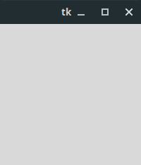
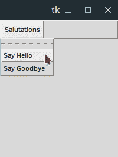
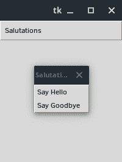
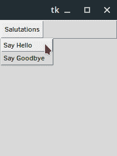
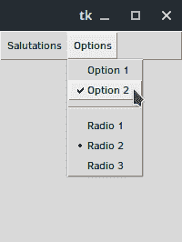

# 如何向 Tkinter 应用程序添加菜单

> 原文：<https://blog.teclado.com/how-to-add-menu-to-tkinter-app/>

在这篇文章中，我们将学习如何利用 Tkinter 的`Menu`小部件在我们的 GUI 应用程序中创建不同类型的菜单。

在这篇文章中，我们将使用一个非常简单的应用程序。它不显示任何东西，在我们添加菜单之前，它也不会真正做任何事情。Tkinter 的`Menu`小部件是完全独立的单元，除了根窗口之外，不依赖于我们应用中的任何东西。

为了简单起见，我们的起始代码应该是这样的:

```
import tkinter as tk

root = tk.Tk()

root.mainloop() 
```

我们甚至不需要导入`ttk`，因为`Menu`部件不是主题部件。我们非常激动人心的 Tkinter 应用程序应该是这样的:



Tkinter 将尝试使窗口与您的操作系统相匹配，所以如果您的窗口看起来有点不同，请不要担心。

向我们的应用程序添加一个`Menu`小部件就像添加任何其他元素一样。我们将把新的`Menu`小部件分配给`menubar`变量，并且我们将把`root`作为`Menu`父对象传入。

```
menubar = tk.Menu(root) 
```

我们还需要添加另一行来告诉根窗口这个`menubar`是窗口的菜单:

```
root.config(menu=menubar) 
```

如果您在此时运行应用程序，您不太可能看到太多的不同。这是因为我们的菜单没有任何内容，所以它的高度已经崩溃到接近零。

那么，我们如何向菜单中添加项目呢？我们有几个选项，但我们将从添加触发命令的简单按钮开始。

我们可以通过调用我们创建的`Menu`小部件实例上的`add_command`方法来添加一个按钮。

当调用这个方法时，我们将传递两个配置:一个`label`和一个`command`。我们可以设置各种其他值，但大多数只是以某种方式控制按钮的外观。例如，我们也可以设置`state`来禁用按钮。

传递给`command`参数的值决定了当用户点击按钮时会发生什么，而`label`决定了选项将如何在菜单中显示。如果你愿意，你也可以用`image`来代替。

以下是几个简单的按钮示例:

```
from tkinter import ttk

root = tk.Tk()

menubar = tk.Menu(root)
menubar.add_command(label="Say Hello", command=lambda: print("Hello"))
menubar.add_command(label="Say Goodbye", command=lambda: print("Goodbye"))

root.config(menu=menubar)

root.mainloop() 
```

注意，我们在这里必须使用 lambda 函数，因为我们将参数传递给了`print`。如果我们编写类似于`command=print("Hello")`的代码，函数将在`add_command`执行期间运行，并且`print("Hello")`的返回值将作为`command`参数的值传入。一般不是我们想要的。

这样，我们的应用程序现在有了一个工作菜单！


如果我们点击`Say Hello`按钮，我们将`Hello`打印到控制台，`Say Goodbye`打印`Goodbye`。没有什么疯狂的，但我们可以使用相同的原则来运行任何我们想要的操作。

例如，我们可以用一个使用`root.destroy`关闭应用程序的`Quit`按钮来代替`Say Goodbye`。

```
import tkinter as tk
from tkinter import ttk

root = tk.Tk()

menubar = tk.Menu(root)
menubar.add_command(label="Say Hello", command=lambda: print("Hello"))
menubar.add_command(label="Quit", command=root.destroy)

root.config(menu=menubar)

root.mainloop() 
```

在这种情况下不需要 lambda，因为我们不想向`destroy`方法传递任何参数。

当我们的程序变得更加复杂时，我们经常希望能够将应用程序菜单组织成各种子菜单，以便于导航。主菜单有许多标题，每个标题触发一个不同的下拉菜单。

为了在 Tkinter 中做到这一点，我们需要为每个子菜单创建一个不同的`Menu`小部件，并为菜单栏本身再创建一个。

让我们首先创建一个名为`salutations`的新菜单，它将容纳我们的`Say Hello`和`Say Goodbye`按钮。

```
salutations = tk.Menu(menubar)
salutations.add_command(label="Say Hello", command=lambda: print("Hello"))
salutations.add_command(label="Say Goodbye", command=lambda: print("Goodbye"))
```

注意这个`Menu`小部件的父部件不是`root`:它是主`menubar`小部件。

我们现在可以使用`add_cascade`方法将这个新的子菜单添加到`menubar`中，如下所示:

```
menubar.add_cascade(label="Salutations", menu=salutations) 
```

我们再次设置了一个`label`，它将决定这个子菜单的标题。`menu`参数接受一个`Menu`小部件，它将作为与该标签相关联的子菜单。

总的来说，代码看起来像这样:

```
import tkinter as tk
from tkinter import ttk

root = tk.Tk()

menubar = tk.Menu(root)

salutations = tk.Menu(menubar)
salutations.add_command(label="Say Hello", command=lambda: print("Hello"))
salutations.add_command(label="Say Goodbye", command=lambda: print("Goodbye"))

menubar.add_cascade(label="Salutations", menu=salutations)

root.config(menu=menubar)

root.mainloop() 
```

我们的应用现在可以做到这一点:



你可能没有预料到的一件事是`Say Hello`上面的虚线。这是什么意思？为什么会在那里？

这条虚线代表穿孔，表示菜单可以撕掉。这在现代应用中并不常见，但它允许我们这样做:



如果你想让你的用户能够分离菜单并在屏幕上移动它们，你很幸运，因为这是默认行为！如果您不希望这样，那么我们需要通过向我们的`Menu`小部件传递一些额外的配置来关闭它。幸运的是这非常简单，我们只需要添加一个附加的关键字参数。

官方文档使用`tearoff=0`，但是`tearoff=False`也可以，我认为它更有意义，所以我在这里使用它:

```
import tkinter as tk
from tkinter import ttk

root = tk.Tk()

menubar = tk.Menu(root)

salutations = tk.Menu(menubar, tearoff=False)
salutations.add_command(label="Say Hello", command=lambda: print("Hello"))
salutations.add_command(label="Say Goodbye", command=lambda: print("Goodbye"))

menubar.add_cascade(label="Salutations", menu=salutations)

root.config(menu=menubar)

root.mainloop() 
```

再见，撕下的菜单:



除了按钮和子菜单，我们还有一些其他的东西可以添加到菜单中。

下面是一个菜单，其中包含一些附加选项:

```
option_1 = tk.StringVar()
option_2 = tk.StringVar()
radio_option = tk.StringVar()

options = tk.Menu(menubar, tearoff=False)
options.add_checkbutton(label="Option 1", variable=option_1, command=lambda: print(option_1.get()))
options.add_checkbutton(label="Option 2", variable=option_2, command=lambda: print(option_2.get()))
options.add_separator()
options.add_radiobutton(label="Radio 1", variable=radio_option, value="Radio Option 1")
options.add_radiobutton(label="Radio 2", variable=radio_option, value="Radio Option 2")
options.add_radiobutton(label="Radio 3", variable=radio_option, value="Radio Option 3")

menubar.add_cascade(label="Options", menu=options) 
```

首先，我们有一个`checkbutton`，它的工作方式非常类似于主`Checkbutton`小部件。我们可以指定一个变量来保存当前的选中状态；我们可以为选中和未选中状态设置值；我们可以设置一个命令，在每次点击`checkbutton`时触发。在我们的例子中，它从变量中检索新的选中状态。

接下来我们有`add_separator`方法，它向菜单添加一行来帮助区分选项组。您可以使用它，无需任何额外的配置。

最后，我们在菜单里有一些`radiobutton`项目。同样，这些功能非常类似于主`Radiobutton`小部件。在上面的菜单中，我们刚刚设置了一个变量来存储哪个选项被切换，并且我们为每个按钮设置了一个值。

您可以在下面看到此菜单的示例:



## `add`法

除了这些专门的方法，如`add_checkbutton`、`add_cascade`和`add_command`，还有一个通用的`add`方法。

我们可以使用`add`来复制任何其他方法:我们只需要传入要作为字符串添加的项的类型。这可以是位置参数，也可以是使用键`itemType`的关键字参数:

```
salutations.add(itemType="command", label="Say Hello", command=lambda: print("Hello"))
salutations.add("command", label="Say Goodbye", command=lambda: print("Goodbye")) 
```

使用您喜欢的版本。

## 包扎

这就是关于 Tkinter `Menu` widgets 的这篇文章。我希望你学到了一些新的东西，如果你热衷于深入挖掘 Tkinter，一定要看看我们的 [GUI 开发课程](https://www.udemy.com/course/desktop-gui-python-tkinter/)！