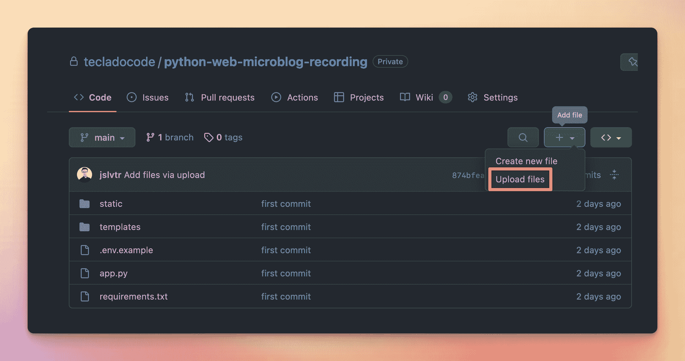
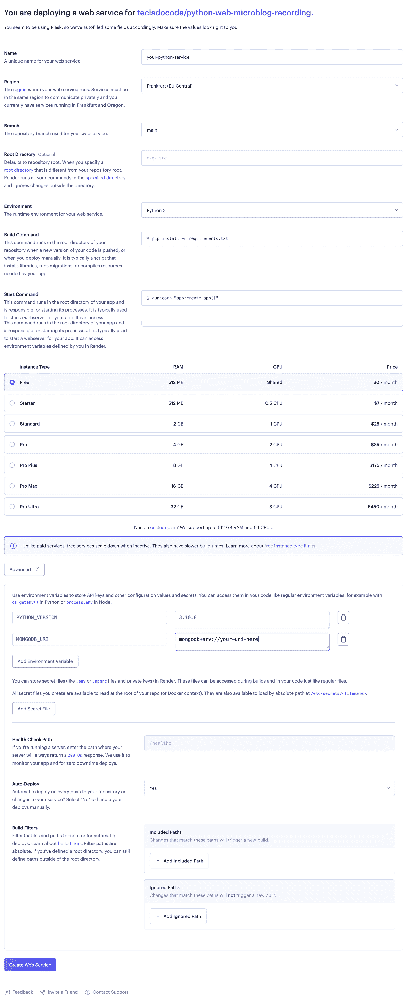

# 如何部署 Flask 和 MongoDB 进行渲染

> 原文：<https://blog.teclado.com/how-to-deploy-flask-and-mongodb-to-render/>

让我们快速浏览一下在 Render.com 上部署 Flask 应用程序和 MongoDB 数据库的最快和最便宜的方法！

我们将:

*   为部署准备 Flask 应用程序。
*   获取 MongoDB 数据库。
*   创建一个渲染 web 服务来托管我们的应用程序。
*   部署！

## 准备您的 Flask 应用程序进行部署

要在 Render.com 部署 Flask 应用，你需要清楚两件事:

*   app 有哪些依赖关系？
*   app 应该用什么 Python 版本？

一旦你知道这些问题的答案，你就可以回答它们:

*   在`requirements.txt`文件中写下你的应用依赖关系，如果你还没有写的话。确保添加`gunicorn`作为依赖项，因为 Render 将使用它来运行您的应用程序。
*   在步骤 3 中创建渲染 web 服务时，您将选择 Python 版本。

## 获取 MongoDB 数据库

获得 MongoDB 数据库的最快和最便宜的方法是使用 MongoDB Atlas，这是 MongoDB 的官方云数据库服务。小型数据库免费！

前往[https://www.mongodb.com/atlas/database](https://www.mongodb.com/atlas/database)报名。然后你可以为你的 Flask 应用创建一个免费的集群。

创建数据库后，您需要配置两个安全设置:**数据库访问**和**网络访问**。

在数据库访问下，创建一个带有密码的用户。确保使用安全的密码！对于用户的角色，您可以选择“读取和写入任何数据库”。

然后进入网络访问，点击“添加 IP 地址”按钮，然后点击“添加当前 IP 地址”。

这样，只有您的计算机才能访问数据库。当您创建渲染服务时，您将获得另一个 IP 地址添加到此列表中。

这就是 MongoDB 需要的全部配置！现在你可以回到“数据库”菜单，点击“连接”，然后“连接你的应用程序”。找到您使用的 Python 版本，并复制连接字符串。这是您的`MONGODB_URI`，但是记住用您在“数据库访问”步骤中生成的用户的安全密码替换`<password>`。

## 为您的 Flask 应用程序创建一个渲染 web 服务

要部署渲染，您需要将您的应用程序放在 GitHub 中。创建一个 GitHub 帐户和一个新的 GitHub 存储库。可以是公有的，也可以是私有的。

如果您不熟悉 Git，可以使用 UI 将项目文件添加到 GitHub:

一旦你的文件在 GitHub 库中，你可以去 Render.com。

要创建渲染 web 服务，您需要创建一个帐户，然后单击右上角的 New -> Web Service。

如果你现在还没有，你需要把你的 GitHub 账号和 Render 链接起来。这样做之后，您将在 Render 中看到 GitHub 库的列表。在你的库上点击“连接”,这将允许 Render 从 GitHub 下载你的代码。

现在是渲染的设置。对于 Flask 应用程序，它们应该几乎总是这样(长图像警告，右键单击并在新标签中打开以放大):

这幅图像中的情况是这样的:

*   您可以随意命名您的服务。
*   对于一个地区，选择离你和你的用户近的。
*   您的分支名称应该与在 GitHub 中选择的分支名称相匹配。
*   构建步骤安装您的依赖项。既然我们用的是`requirements.txt`，这个应该是`pip install -r requirements.txt`。
*   start 命令实际上运行您的应用程序。这里我们使用`gunicorn "app:create_app()"`,因为我们假设您使用的是 Flask app 工厂模式。如果不是，可以用`gunicorn app:app`代替。
*   我们选择一个免费的服务器。免费服务器有一些限制，但是它们很适合尝试部署。
*   在环境变量部分，我们添加了`PYTHON_VERSION`来告诉 Render 使用哪个 Python 版本，并添加了`MONGODB_URI`来存储您的 Flask 应用程序使用的 MongoDB 的连接字符串。

当你点击“创建 Web 服务”，它应该开始部署！这可能需要几分钟的时间，所以准备好茶，5 分钟后回来查看！

这就是这篇博文的全部内容。我想向您展示如何在 Render 中使用 MongoDB 和 Flask，但是我们还有另一篇关于部署 [Flask 和 PostgreSQL](https://blog.teclado.com/how-to-deploy-your-first-rest-api-with-flask-for-free/) 的博文。

如果你想了解更多关于 web 开发和 Flask 的知识，可以考虑参加我们的 [Web 开发者训练营 Flask 和 Python](https://go.tecla.do/web-dev-course-sale) 课程！这是一个很长的视频课程，涵盖了 HTML、CSS、Flask、MongoDB、部署等等。通过我们的链接，你会以最优惠的价格买到它。

感谢阅读，我们下次再见！