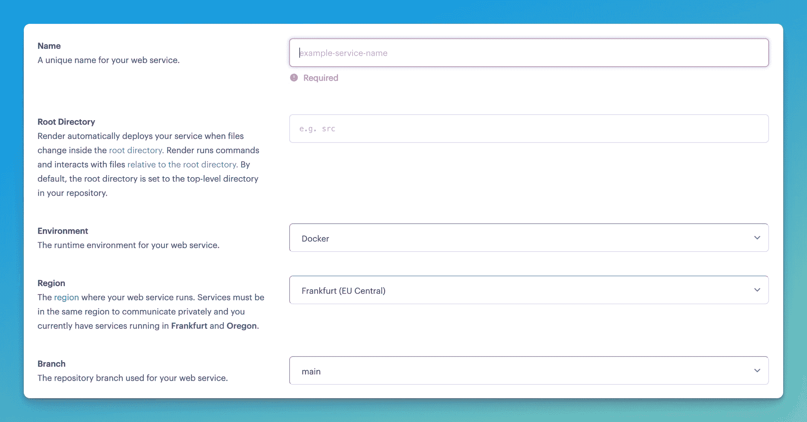
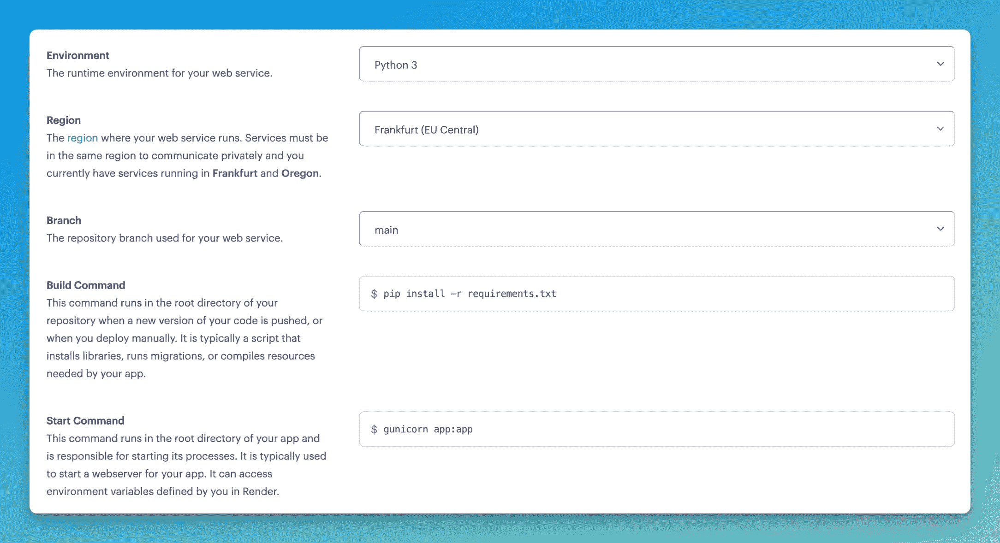
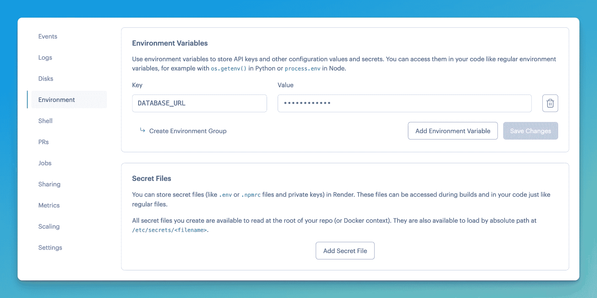

# 如何免费使用 Flask 部署您的第一个 REST API

> 原文：<https://blog.teclado.com/how-to-deploy-your-first-rest-api-with-flask-for-free/>

在我们之前的博客文章中，我们帮助你创建了你的第一个 REST API 项目。现在是时候部署它了！

将您的应用程序部署到云将使其可以通过 URL 访问。这意味着您将能够与您的朋友分享它，并在网络上使用它，而不必在本地运行它！

在这篇文章中，我们将向你展示如何使用[Render.com](https://render.com/)和 [Fly.io](https://fly.io/) 免费部署你的 REST API 项目。

## 部署到 Render.com

我们将首先使用 Render.com 部署我们的应用程序，因为它(几乎)不需要对项目进行任何更改。唯一需要做的更改是将`gunicorn`添加到`requirements.txt`文件中。我们不会在这篇博文中涉及`gunicorn`，但是你可以查看[官方文档](https://docs.gunicorn.org/en/stable/)以获得更多信息。

完成之后，将更新后的项目推送到 GitHub，因为您需要一个 Git 存储库来部署您的项目。如果你不确定如何去做，[我们已经为你准备好了](https://git-workshop.tecladocode.com/)！

现在您的项目已经全部设置好了，让我们来部署它吧！

你首先需要注册参加[Render.com](https://dashboard.render.com/register)。我建议注册你的 GitHub 帐户，因为它会让以后的一些任务变得更容易。

登录后，访问[仪表板](https://dashboard.render.com/)。在页面的右上角，您会看到`+New`按钮。按下并选择**网络服务**。下一步将是连接存储库。如果你已经注册了你的 GitHub 帐户，那么你应该有一个可用库的列表供你选择。如果您没有连接您的 GitHub 帐户，您需要现在进行连接，您会看到一个`Connect GitHub`按钮。

现在 GitHub 已经连接好了，选择包含您的应用程序的存储库。然后，您将被重定向到此设置的主页:



您首先需要为您的 web 服务选择一个名称。尝试将它与应用程序的名称放在一起，因为这将使您以后开始部署新应用程序时更容易组织。对于环境，选择`Python3`。

当您选择`Python3`作为环境时，默认情况下，Render 将使用 Python 3.7 运行应用程序。如果你想改变 Python 的版本，你可以使用一个名为`PYTHON_VERSION`的环境变量，这个变量的值就是你想使用的 Python 的版本，比如`3.10.8`。当我们谈到环境变量时，下面会有更多的内容。

下一部分是地区。您应该选择一个尽可能靠近您和您的数据库的区域，因为它会影响性能。例如，我位于塞尔维亚，我在斯德哥尔摩有一个数据库，所以我将选择法兰克福的服务器，因为它是离我和我的数据库最近的可用服务器。

我推荐您的 web 服务使用的分支是`main`或`master`,因为您只想部署经过审查和批准的代码。

接下来的两个步骤是设置用于运行代码的命令。Build command 是一个命令，每当推出新版本的代码或手动部署它时，它都会在存储库的根目录中运行。构建命令将是`pip install -r requirements.txt`,因为我们希望确保在运行应用程序之前安装所有的模块。

start 命令在应用程序的根目录中运行，并处理其进程的启动。我们项目的开始命令将是`gunicorn app:app`。start 命令可以访问在 Render 中设置的环境变量。这很重要，因为我们稍后将设置一个环境变量。

### 使用应用工厂？

如果你正在使用一个 app factory，有一个像`create_app()`这样的函数，那么开始命令很可能是`gunicorn "app:create_app()"`。

要完成安装，请选择免费计划并创建 web 服务。构建将开始，但会失败，因为我们还有一件事要做。

这是在下一步之前完成的设置的样子:



导航至`Environment`页面。在`Environment Variables`部分，按下`Add Environment Variable`。我们将使用的键是`DATABASE_URL`，值是您的数据库的 URL(通常如果您使用 MongoDB 数据库而不是 PostgreSQL，环境变量将被称为`MONGODB_URI`)。设置变量后，部署应该会重新启动。如果没有，请手动启动新的部署。



### 不同的 Python 版本

就像我们上面提到的，Render 默认会使用 Python 3.7。如果您想使用不同的 Python 版本，创建另一个名为`PYTHON_VERSION`的环境变量，并赋予它您想使用的 Python 版本的值，比如`3.10.8`。

如果你做了所有的事情，恭喜你！您的应用程序现已部署！在左上方，你的应用程序名称的下方，你会看到一个链接，如果你想查看你的 API，你可以拷贝它在浏览器或 Postman 中使用。

## 部署到 Fly.io

部署到 Fly.io 有点复杂。对于项目的这一部分，您将需要一个 Docker 图像。一如既往，我们会保护你！您可以阅读 Docker 的[简介，其中涵盖了此次部署所需的一切。](https://rest-apis-flask.teclado.com/docs/docker_intro/)

我们用于部署应用程序的 Docker 图像如下所示:

```py
FROM python:3.10
EXPOSE 8080
WORKDIR /app
COPY requirements.txt requirements.txt
RUN pip3 install -r requirements.txt
COPY . .
CMD ["gunicorn", "--bind", "0.0.0.0:8080", "--workers", "2", "app:app"] 
```

创建 Docker 映像后，下一步是在 Fly.io 上创建一个帐户。然后，您需要下载他们的 CLI 工具 Flyctl。关于设置工具和注册的完整指南可在官方文档中找到。如果你注册成功，你应该可以[登录你的 Fly 账户](https://fly.io/docs/getting-started/log-in-to-fly/)。

一旦你登录到你的账户，在你的项目的工作文件夹中打开一个终端并输入`flyctl launch`。这将为您创建一个新的应用程序，您可以选择配置详细信息。选择一个尽可能靠近你的地区的服务器，因为它会使你的应用程序在部署后运行得更快。如果这个命令对您不起作用，请用以下内容创建一个名为`fly.toml`的文件:

```py
app = "rest-apis"
kill_signal = "SIGINT"
kill_timeout = 5
processes = []

[env]

[experimental]
  allowed_public_ports = []
  auto_rollback = true

[[services]]
  http_checks = []
  internal_port = 8080
  processes = ["app"]
  protocol = "tcp"
  script_checks = []
  [services.concurrency]
    hard_limit = 25
    soft_limit = 20
    type = "connections"

  [[services.ports]]
    force_https = true
    handlers = ["http"]
    port = 80

  [[services.ports]]
    handlers = ["tls", "http"]
    port = 443

  [[services.tcp_checks]]
    grace_period = "1s"
    interval = "15s"
    restart_limit = 0
    timeout = "2s" 
```

另外需要注意的是，Fly.io 为你提供了一个免费的数据库。我们建议您在配置 Fly 应用程序时创建一个新的数据库。如果您想要使用第三方数据库，请确保将数据库 URL 作为秘密变量添加到您的 Fly 应用程序中。运行以下命令:`flyctl secrets set DATABASE_URL=url`。如果您选择了第一个选项，则不需要这一步，因为 Fly 会自动向您的应用程序添加一个秘密。

一旦你这样做了，你可以导航到你的[仪表板](https://fly.io/dashboard)，你会看到你的应用程序正在运行！如果您点击您的应用程序，您将能够获得 URL，您可以使用 Postman 来测试您的应用程序。还有一些很酷的功能，比如监控和度量！

## 比较两者

因为这篇文章是基于免费的应用程序部署，我们想通过比较我们使用的每个云的免费层来结束这篇博客。

先说渲染。正如我们已经看到的，Render 的优点是部署过程很简单。它还有很酷的度量选项，可以搜索日志，这非常有用。如果不添加信用卡，它的免费层中就没有数据库。之后你可以免费使用数据库，但只有 90 天。90 天后，数据库将被删除。这意味着您需要在 Render 的免费层中使用第三方数据库。渲染的主要缺点是构建速度慢。根据云的负载，构建时间可能会达到五分钟以上，有些用户报告说时间甚至会增加一倍。

当使用 Fly.io 时，注册和部署过程更复杂，但速度差异很明显。它比 Render 更少依赖于用户界面，但是他们有一个很棒的 CLI 工具，非常好用。然而，文档在某些方面仍然缺乏，所以你将不得不经常求助于 Fly 的社区来帮助你解决你的问题。免费计划中包括 Postgres 数据库，以及 Redis。

## 结论

这两种云各有优势:Render 有更发达的 UI 和日志，而 Fly.io 更适合那些主要关心速度的人。我们已经介绍了这两种方法，因此您可以试用它们并选择最适合您的方法！

如果你喜欢这篇博文，并且想了解更多关于 REST API 开发的知识，可以考虑参加我们的课程[REST API with Flask and Python](https://www.udemy.com/course/rest-api-flask-and-python/)。它涵盖了使用 PostgreSQL 和 Docker 构建完整的 REST API，以及 SQLAlchemy、数据库迁移和身份验证！