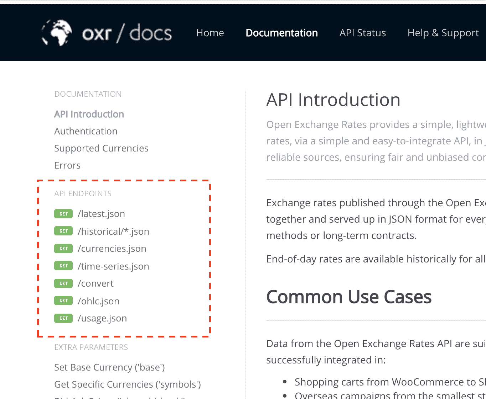

# 如何使用 Python 与 API 交互

> 原文：<https://blog.teclado.com/how-to-interact-with-apis-using-python/>

通常我们开始学习编码是因为我们想用代码做一些事情。例如，您可能想从 Shopify 下载一份销售清单，并将其放入电子表格中。或者你可能会在 Twitter 上搜索，数一数你的网站被人们分享了多少次。你可能每天晚上都想做这些事情，因此从长远来看，写一些代码来帮助你将会节省你很多时间。

这就是 API 的用武之地。

API 是一个程序，它接受你的数据，并把数据返回给你。比如 Twitter 有一个 API。

这个 API 接受数据(您的搜索词)并返回数据(与搜索词匹配的推文)。

Twitter 的 API 也可以接受其他东西，比如用户名，并返回用户的信息。

这些 API 通常被设计成允许你以一种更加程序友好的方式检索网站持有的信息。不用加载网站，你可以直接获取你感兴趣的数据。

归根结底，网站是给人们使用的。您可以使用 Twitter 网站获取 Twitter 的数据。它以一种很好的方式展示出来，这样你会喜欢使用这个网站并再次访问它。程序不需要精确，所以当你与 API 交互时，程序得到的只是原始数据。大概是这样的:

```py
{
  "tweets": [
    {
      "body": "Learning #Python today with @TecladoCode!",
      "user": "Phil Best"
    },
    {
      "body": "We've just put out a new #Python course, going from beginner to expert. #LearnPython",
      "user": "TecladoCode"
    },
    {
      "body": "Writing some code to search the Twitter API for cat images. So far just getting back dog images though... :thinking:",
      "user": "Rolf Smith"
    }
  ]
} 
```

这是 API **返回的数据可能**的样子。而在网站上，你会看到这些卡片和彩色的推文等等，程序只需要最少的。像这样通过互联网发送文本比发送整个网站要快得多，也便宜得多。

## 发送一个 API 需要哪些数据？

简而言之:取决于 API。Twitter 搜索 API 需要一个搜索词。如果您想要使用 Shopify Orders API 来检索订单，您将需要您想要从中获取数据的月份，以及许多其他信息:

*   你想拿回多少订单；
*   你是想得到挂单还是所有订单；
*   您是否希望获得付款、退款、作废或所有订单；
*   是否要拿到已经发货的订单；

API 通常会给你一个冗长的引用，准确地列出你可以发送给它们的所有内容，这样它们就可以把你感兴趣的数据发送给你。

为了完整起见，这里有 [Shopify 订单 API 参考](https://help.shopify.com/en/api/reference/orders/order#index)。刚开始看的时候很混乱！

## API 返回什么数据？

还是那句话，取决于 API。Twitter 搜索 API 返回与您的搜索词匹配的推文。Shopify Orders API 返回发生在 Shopify 商店的订单。Shopify Customers API 返回在您的商店购物的人的客户信息。诸如此类。

当你想从一个网站获取数据时，检查一下他们的 API 是值得的，看看他们是否能给你你想要的。

有些网站没有 API。这可能是因为他们还没有开发它们，或者因为他们不想让你访问他们的数据！

## 除了获取和返回数据，API 还能做什么吗？

是的，API 也可以执行处理或存储。例如，可能存在一个 API，您可以向它发送一个图像，它将压缩该图像并将其存储在互联网上的服务器上。

我希望像这样的 API 给你一个地址，你可以用它来访问图像。

例如，imgur API 就是这样做的。你给它发一张图片，他们会存储下来并给你一个链接。转到该链接会将图像加载到您的浏览器中。

下面是 [imgur 图像上传 API 文档](https://apidocs.imgur.com/#c85c9dfc-7487-4de2-9ecd-66f727cf3139)。

## 交互示例:OpenExchangeRates

在本例中，我们将与 OpenExchangeRates API 通信，使用 Python 检索汇率，以便我们可以将一种货币转换为另一种货币。

API 通常会要求您向它们注册。这是因为 API 需要花钱来维护。他们必须为服务器和带宽付费，所以许多 API 不会是免费的。

Twitter、Shopify 和 imgur APIs 可以免费使用。OpenExchangeRates API 不是免费的，但是有一个免费的计划，在这个计划中，您可以每月与它交互 1000 次。

为了使用 OpenExchangeRates API，首先您[必须注册](https://openexchangerates.org/signup/free)。

然后，您必须生成一个**应用 ID** 。

每当您向 OpenExchangeRates 发出请求时，您还需要向他们发送您的应用 ID。这就是 API 知道您有一个帐户的方式。

一旦你获得了你的应用 ID，用 Python 安装`requests`库:

```py
pip install requests 
```

然后我们就可以开始编写与 OpenExchangeRates 交互的代码了！

```py
import requests

APP_ID = "72dba35061ifjs4cf9ad3ffbbjha8de9174" 
```

接下来，您必须找到需要与之通信的 URL，以便获取汇率信息。

API 文档会有一个 URL 列表。当谈到 API 时，这些被称为“端点”。



API Endpoints (screenshot from [https://docs.openexchangerates.org/](https://docs.openexchangerates.org/))

我们想要访问最新的货币兑换信息，所以我们将使用`GET /latest.json`。

点击它会把我们带到[文档](https://docs.openexchangerates.org/)，它告诉我们我们想要发送数据的 URL 是`https://openexchangerates.org/api/latest.json`。让我们把它添加到我们的程序中:

```py
import requests

APP_ID = "72dba35061ifjs4cf9ad3ffbbjha8de9174"
ENDPOINT = "https://openexchangerates.org/api/latest.json" 
```

接下来，我们可以看看例子，看看我们必须如何与 API 通信。

在示例中，我们可以看到我们必须发出这样的请求:

```py
https://openexchangerates.org/api/latest.json?app_id=YOUR_APP_ID
```

这意味着我们必须使用 Python 向这个 URL 发送一个`GET`请求，确保其中包含我们的应用 ID。有几种不同类型的请求，比如`GET`和`POST`。这只是 API 期望的另一部分数据。根据请求类型，有时 API 会在单个端点中做不同的事情。

然后我们将得到类似这样的结果(在官方文档中也有显示):

```py
{
    disclaimer: "https://openexchangerates.org/terms/",
    license: "https://openexchangerates.org/license/",
    timestamp: 1449877801,
    base: "USD",
    rates: {
        AED: 3.672538,
        AFN: 66.809999,
        ALL: 125.716501,
        AMD: 484.902502,
        ANG: 1.788575,
        AOA: 135.295998,
        ARS: 9.750101,
        AUD: 1.390866,
        /* ... */
    }
} 
```

让我们继续使用 Python 代码来发出请求:

```py
import requests

APP_ID = "72dba35061ifjs4cf9ad3ffbbjha8de9174"
ENDPOINT = "https://openexchangerates.org/api/latest.json"

response = requests.get(f"{ENDPOINT}?app_id={APP_ID}")
print(response.content) 
```

这里我们已经构建了最终的 URL，`f"{ENDPOINT}?app_id={APP_ID}"`，然后将它传递给`requests.get()`，后者发出一个`GET`请求。

然后我们打印出 API 发出的响应的`.content`属性。

运行这个程序，我们会得到这样的结果:

```py
b'{\\n  "disclaimer": "Usage subject to terms: <https://openexchangerates.org/terms>",\\n  "license": "<https://openexchangerates.org/license>",\\n  "timestamp": 1555491600,\\n  "base": "USD",\\n  "rates": {\\n    "AED": 3.673158,\\n    "AFN": 77.858,\\n    "ALL": 110,\\n    "AMD": 485.09686,\\n    "ANG": 1.865264,\\n    "AOA": 319.444,\\n    "ARS": 42.326,\\n    "AUD": 1.388915,\\n    "AWG": 1.799996,\\n    "AZN": 1.7025,\\n    "BAM": 1.730939,\\n    "BBD": 2,\\n    "BDT": 84.466,\\n    "BGN": 1.728662,\\n    "BHD": 0.377029,\\n    "BIF": 1832.588039,\\n    "BMD": 1,\\n    "BND": 1.350506,\\n    "BOB": 6.91995,\\n    "BRL": 3.905103,\\n    "BSD": 1,\\n    "BTC": 0.000191995978,\\n    "BTN": 69.571652,\\n    "BWP": 10.619946,\\n    "BYN": 2.104887,\\n    "BZD": 2.018566,\\n    "CAD": 1.332235,\\n    "CDF": 1639.646042,\\n    "CHF": 1.007504,\\n    "CLF": 0.023989,\\n    "CLP": 661.937398,\\n    "CNH": 6.68448,\\n    "CNY": 6.6885,\\n    "COP": 3135.861326,\\n    "CRC": 599.770986,\\n    "CUC": 1,\\n    "CUP": 25.75,\\n    "CVE": 97.7155,\\n    "CZK": 22.688056,\\n    "DJF": 178.05,\\n    "DKK": 6.596294,\\n    "DOP": 50.645,\\n    "DZD": 118.94,\\n    "EGP": 17.3057,\\n    "ERN": 14.996713,\\n    "ETB": 28.744636,\\n    "EUR": 0.883718,\\n    "FJD": 2.127047,\\n    "FKP": 0.766763,\\n    "GBP": 0.766763,\\n    "GEL": 2.69,\\n    "GGP": 0.766763,\\n    "GHS": 5.1291,\\n    "GIP": 0.766763,\\n    "GMD": 49.545,\\n    "GNF": 9143.139456,\\n    "GTQ": 7.638581,\\n    "GYD": 209.929837,\\n    "HKD": 7.845773,\\n    "HNL": 24.482066,\\n    "HRK": 6.57345,\\n    "HTG": 85.159527,\\n    "HUF": 282.042195,\\n    "IDR": 14011.55,\\n    "ILS": 3.575446,\\n    "IMP": 0.766763,\\n    "INR": 69.361,\\n    "IQD": 1194.896167,\\n    "IRR": 42105,\\n    "ISK": 119.860455,\\n    "JEP": 0.766763,\\n    "JMD": 129.98,\\n    "JOD": 0.708001,\\n    "JPY": 112.00975,\\n    "KES": 101.24,\\n    "KGS": 68.658487,\\n    "KHR": 4081.48868,\\n    "KMF": 436.375832,\\n    "KPW": 900,\\n    "KRW": 1132.98,\\n    "KWD": 0.304023,\\n    "KYD": 0.833511,\\n    "KZT": 380.443475,\\n    "LAK": 8663.377025,\\n    "LBP": 1509.05,\\n    "LKR": 174.64,\\n    "LRD": 166.000015,\\n    "LSL": 14.104137,\\n    "LYD": 1.391801,\\n    "MAD": 9.5813,\\n    "MDL": 17.874788,\\n    "MGA": 3622.722764,\\n    "MKD": 54.395,\\n    "MMK": 1517.16056,\\n    "MNT": 2513.624129,\\n    "MOP": 8.079097,\\n    "MRO": 357,\\n    "MRU": 36.6,\\n    "MUR": 34.78973,\\n    "MVR": 15.35504,\\n    "MWK": 728.489606,\\n    "MXN": 18.829774,\\n    "MYR": 4.140531,\\n    "MZN": 64.481897,\\n    "NAD": 14.104137,\\n    "NGN": 360.77,\\n    "NIO": 32.882163,\\n    "NOK": 8.469935,\\n    "NPR": 111.463545,\\n    "NZD": 1.484078,\\n    "OMR": 0.384954,\\n    "PAB": 1,\\n    "PEN": 3.300003,\\n    "PGK": 3.379726,\\n    "PHP": 51.715,\\n    "PKR": 141.65,\\n    "PLN": 3.778095,\\n    "PYG": 6217.386761,\\n    "QAR": 3.640738,\\n    "RON": 4.207089,\\n    "RSD": 104.24191,\\n    "RUB": 63.9525,\\n    "RWF": 906.006092,\\n    "SAR": 3.7497,\\n    "SBD": 8.171964,\\n    "SCR": 13.728573,\\n    "SDG": 47.687925,\\n    "SEK": 9.224838,\\n    "SGD": 1.352501,\\n    "SHP": 0.766763,\\n    "SLL": 8390,\\n    "SOS": 579.371256,\\n    "SRD": 7.458,\\n    "SSP": 130.2634,\\n    "STD": 21050.59961,\\n    "STN": 21.73,\\n    "SVC": 8.751192,\\n    "SYP": 514.989937,\\n    "SZL": 14.104106,\\n    "THB": 31.7655,\\n    "TJS": 9.436072,\\n    "TMT": 3.50998,\\n    "TND": 3.019007,\\n    "TOP": 2.262773,\\n    "TRY": 5.754018,\\n    "TTD": 6.78365,\\n    "TWD": 30.820944,\\n    "TZS": 2313,\\n    "UAH": 26.752,\\n    "UGX": 3740.410238,\\n    "USD": 1,\\n    "UYU": 34.130689,\\n    "UZS": 8450.117652,\\n    "VEF": 248487.642241,\\n    "VES": 4091.49358,\\n    "VND": 23168.81998,\\n    "VUV": 111.129115,\\n    "WST": 2.607179,\\n    "XAF": 579.681272,\\n    "XAG": 0.06653372,\\n    "XAU": 0.00078336,\\n    "XCD": 2.70255,\\n    "XDR": 0.717165,\\n    "XOF": 579.681272,\\n    "XPD": 0.00073341,\\n    "XPF": 105.455657,\\n    "XPT": 0.00113123,\\n    "YER": 250.300682,\\n    "ZAR": 13.954551,\\n    "ZMW": 12.293,\\n    "ZWL": 322.355011\\n  }\\n}' 
```

这看起来像是一大堆胡言乱语，但它几乎和我们之前看到的一样。

如果我们使用`.json()`而不是`.content`,`requests`库将获取内容并将其转换成 Python 字典:

```py
import requests

APP_ID = "72dba35061ifjs4cf9ad3ffbbjha8de9174"
ENDPOINT = "https://openexchangerates.org/api/latest.json"

response = requests.get(f"{ENDPOINT}?app_id={APP_ID}")
print(response.content) 
```

跑步给了我们:

```py
{'disclaimer': 'Usage subject to terms: <https://openexchangerates.org/terms>', 'license': '<https://openexchangerates.org/license>', 'timestamp': 1555491600, 'base': 'USD', 'rates': {'AED': 3.673158, 'AFN': 77.858, 'ALL': 110, 'AMD': 485.09686, 'ANG': 1.865264, 'AOA': 319.444, 'ARS': 42.326, 'AUD': 1.388915, 'AWG': 1.799996, 'AZN': 1.7025, 'BAM': 1.730939, 'BBD': 2, 'BDT': 84.466, 'BGN': 1.728662, 'BHD': 0.377029, 'BIF': 1832.588039, 'BMD': 1, 'BND': 1.350506, 'BOB': 6.91995, 'BRL': 3.905103, 'BSD': 1, 'BTC': 0.000191995978, 'BTN': 69.571652, 'BWP': 10.619946, 'BYN': 2.104887, 'BZD': 2.018566, 'CAD': 1.332235, 'CDF': 1639.646042, 'CHF': 1.007504, 'CLF': 0.023989, 'CLP': 661.937398, 'CNH': 6.68448, 'CNY': 6.6885, 'COP': 3135.861326, 'CRC': 599.770986, 'CUC': 1, 'CUP': 25.75, 'CVE': 97.7155, 'CZK': 22.688056, 'DJF': 178.05, 'DKK': 6.596294, 'DOP': 50.645, 'DZD': 118.94, 'EGP': 17.3057, 'ERN': 14.996713, 'ETB': 28.744636, 'EUR': 0.883718, 'FJD': 2.127047, 'FKP': 0.766763, 'GBP': 0.766763, 'GEL': 2.69, 'GGP': 0.766763, 'GHS': 5.1291, 'GIP': 0.766763, 'GMD': 49.545, 'GNF': 9143.139456, 'GTQ': 7.638581, 'GYD': 209.929837, 'HKD': 7.845773, 'HNL': 24.482066, 'HRK': 6.57345, 'HTG': 85.159527, 'HUF': 282.042195, 'IDR': 14011.55, 'ILS': 3.575446, 'IMP': 0.766763, 'INR': 69.361, 'IQD': 1194.896167, 'IRR': 42105, 'ISK': 119.860455, 'JEP': 0.766763, 'JMD': 129.98, 'JOD': 0.708001, 'JPY': 112.00975, 'KES': 101.24, 'KGS': 68.658487, 'KHR': 4081.48868, 'KMF': 436.375832, 'KPW': 900, 'KRW': 1132.98, 'KWD': 0.304023, 'KYD': 0.833511, 'KZT': 380.443475, 'LAK': 8663.377025, 'LBP': 1509.05, 'LKR': 174.64, 'LRD': 166.000015, 'LSL': 14.104137, 'LYD': 1.391801, 'MAD': 9.5813, 'MDL': 17.874788, 'MGA': 3622.722764, 'MKD': 54.395, 'MMK': 1517.16056, 'MNT': 2513.624129, 'MOP': 8.079097, 'MRO': 357, 'MRU': 36.6, 'MUR': 34.78973, 'MVR': 15.35504, 'MWK': 728.489606, 'MXN': 18.829774, 'MYR': 4.140531, 'MZN': 64.481897, 'NAD': 14.104137, 'NGN': 360.77, 'NIO': 32.882163, 'NOK': 8.469935, 'NPR': 111.463545, 'NZD': 1.484078, 'OMR': 0.384954, 'PAB': 1, 'PEN': 3.300003, 'PGK': 3.379726, 'PHP': 51.715, 'PKR': 141.65, 'PLN': 3.778095, 'PYG': 6217.386761, 'QAR': 3.640738, 'RON': 4.207089, 'RSD': 104.24191, 'RUB': 63.9525, 'RWF': 906.006092, 'SAR': 3.7497, 'SBD': 8.171964, 'SCR': 13.728573, 'SDG': 47.687925, 'SEK': 9.224838, 'SGD': 1.352501, 'SHP': 0.766763, 'SLL': 8390, 'SOS': 579.371256, 'SRD': 7.458, 'SSP': 130.2634, 'STD': 21050.59961, 'STN': 21.73, 'SVC': 8.751192, 'SYP': 514.989937, 'SZL': 14.104106, 'THB': 31.7655, 'TJS': 9.436072, 'TMT': 3.50998, 'TND': 3.019007, 'TOP': 2.262773, 'TRY': 5.754018, 'TTD': 6.78365, 'TWD': 30.820944, 'TZS': 2313, 'UAH': 26.752, 'UGX': 3740.410238, 'USD': 1, 'UYU': 34.130689, 'UZS': 8450.117652, 'VEF': 248487.642241, 'VES': 4091.49358, 'VND': 23168.81998, 'VUV': 111.129115, 'WST': 2.607179, 'XAF': 579.681272, 'XAG': 0.06653372, 'XAU': 0.00078336, 'XCD': 2.70255, 'XDR': 0.717165, 'XOF': 579.681272, 'XPD': 0.00073341, 'XPF': 105.455657, 'XPT': 0.00113123, 'YER': 250.300682, 'ZAR': 13.954551, 'ZMW': 12.293, 'ZWL': 322.355011}} 
```

我们现在可以使用这些数据将`USD`(基数)转换成任何其他货币。让我们试着把`USD`转换成`GBP`(英镑):

```py
import requests

APP_ID = "72dba35061ifjs4cf9ad3ffbbjha8de9174"
ENDPOINT = "https://openexchangerates.org/api/latest.json"

response = requests.get(f"{ENDPOINT}?app_id={APP_ID}")
exchange_rates = response.json()

usd_amount = 1000
gbp_amount = usd_amount * exchange_rates['rates']['GBP']

print(f"USD{usd_amount} is GBP{gbp_amount}") 
```

运行这个程序会告诉我们 1000 美元等于多少英镑:

```py
USD1000 is GBP766.7629999999999 
```

瞧！我们已经与我们的第一个 API 进行了交互。

*   API 需要一些数据，比如请求类型(`GET`、`POST`等)...)，以及处理您的请求所需的任何数据(如应用 ID、Twitter 搜索词、Shopify 商店信息等)。
*   API 返回数据，以便您的程序可以使用它们。API 不是给人们看的(这就是网站的用途！).
*   开发 API 是为了获取数据并以数据响应——所以它们非常具体。你不能只是给他们发送任何东西，然后期望他们用有效的输出来响应！
*   可以使用 Python 中的`requests`库与 API 进行交互，这可能是最流行的一种！