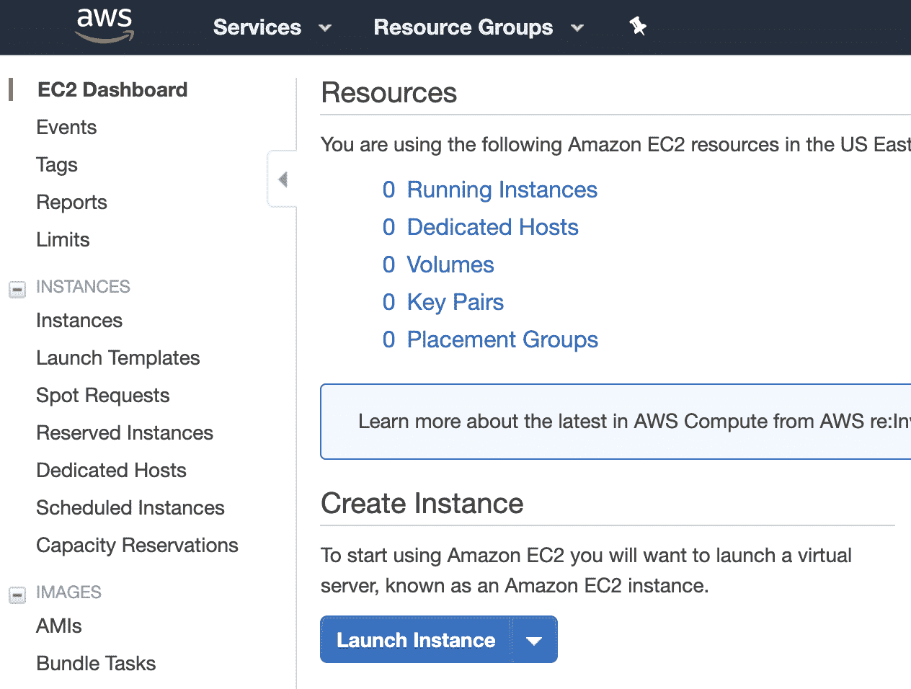
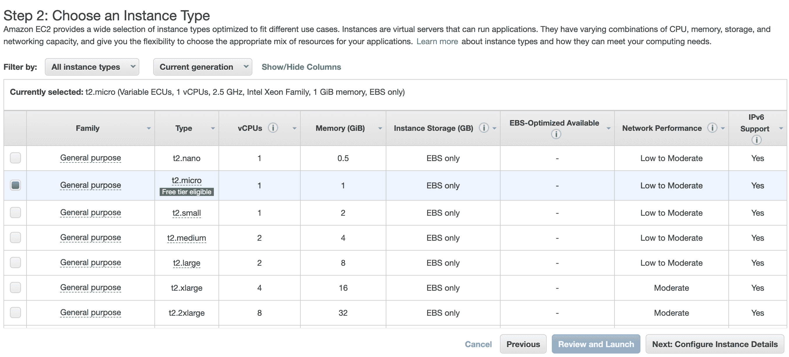
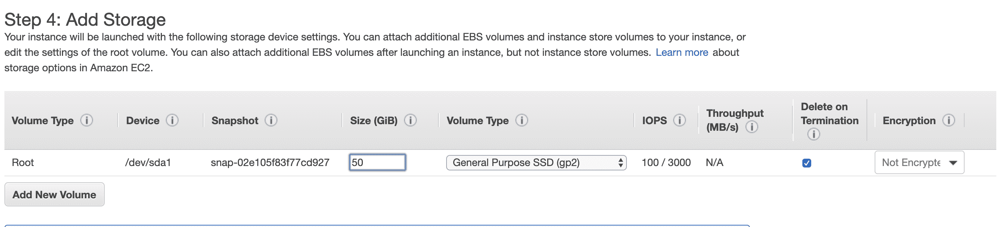
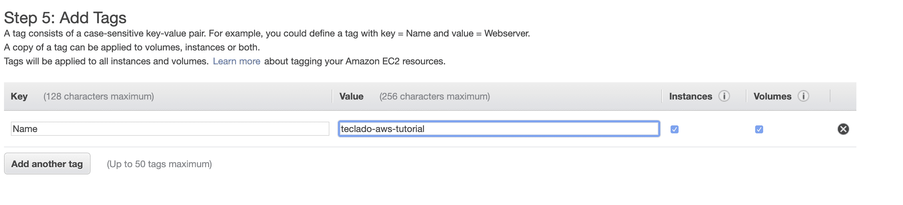
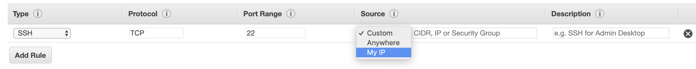
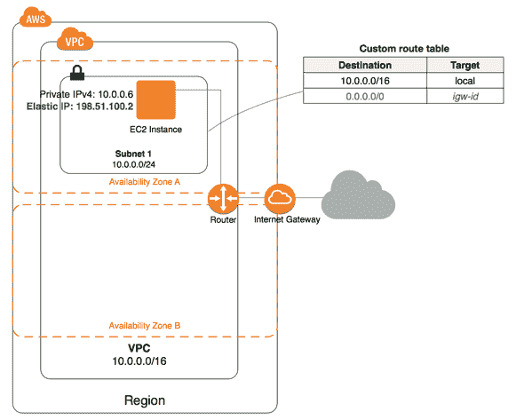

# 如何使用 AWS 设置服务器

> 原文：<https://blog.teclado.com/how-to-set-up-a-server-using-aws/>

Amazon Web Services 是当今云计算最流行的选择之一。您可以在 AWS 中找到相应的解决方案，满足您服务的几乎任何特定需求。然而，对于新的学习者来说，开始可能有点吓人。本文将指导您设置带有 AWS 的服务器，通常称为 EC2 实例，并提供 AWS 架构的高级视图。

我们选择 EC2 作为例子，因为它是许多其他服务的基础。它的特点是最常见的需求:启动一台你可以完全控制的服务器。从那里，你可以建立和主持你的辉煌的想法。EC2 还涉及 AWS 可以提供的几乎所有东西，但我们不一定需要马上使用它们。这种选择加入战略使我们能够使我们的服务经济高效、安全可靠并具有扩展能力。

## 关于成本的一个注记

AWS 具有灵活的定价策略，具体取决于服务器层级和附加服务。但是，请注意潜在的成本。对于低层服务器，AWS 通常在第一年左右(不时变化)为新注册用户提供免费服务。您可以毫无问题地使用免费层服务来阅读本文。即使你不是 free-tier 的合格用户，你也不会被收费，直到启动服务。

关于定价的更多细节，请参考官方文档:[https://aws.amazon.com/pricing](https://aws.amazon.com/pricing)

# 使用 AWS EC2 启动服务器

本节是关于如何使用 **AWS EC2** 启动服务器的分步指南。

## EC2 仪表板

登录 AWS 帐户后，通过`Services -> Compute -> EC2`导航到 EC2 仪表板。在仪表盘上会有很多信息，但我们现在不需要担心。你所需要做的就是点击**启动实例**按钮。



## 选择图像

你将导航到标题为 ***的页面第一步:选择一个亚马逊机器镜像(AMI)*** 。在那里，你可以选择你喜欢的操作系统， **EC2** 支持大多数常见的选项。我们将以最新版本的 *Ubuntu* 为例。点击 ***选择*** 按钮，您将导航至下一页。


## 选择实例类型

在此页面中，您将看到一个服务器选项列表，这些选项根据 CPU 内核、内存大小、磁盘类型、网络速度等而有所不同。自由层服务器通常标记为“符合自由层条件”。大多数配置都很直观，某些术语上通常会有信息工具提示。由于我们只介绍架构，我们将使用自由层服务器`t2-micro`进行演示。接下来，我们点击 ***下一步:配置实例细节*** 按钮，**非*****审核并启动*** 按钮。



## 配置实例详细信息

在这个页面中，您将被要求配置许多选项，其中一些选项是 AWS 特有的，可能会令人困惑。这些是更高级的特性，我们现在应该把它们保留为默认特性。我们可以通过点击 ***下一步:添加存储*** 按钮进入下一步。

## 添加存储

在此页面中，您可以指定服务器所需的磁盘空间。根据服务器层的不同，您可能会有不同的存储选项。默认选项:通用 SSD 将满足最常见的使用情况。请注意，更多高级选项，如调配的 SSD、加密等。花费更多的钱。自由层服务器也可能会限制磁盘大小(~200GB)以保持空闲。



点击 ***下一步:添加标签*** 按钮继续。

您可以在 EC2 实例中指定任何称为标记的键值对。它可以用于过滤不同的指标。尽管这是完全可选的，但我们强烈建议您至少添加一个标签，即 ***名称*** 标签。这个标记将直接在 EC2 仪表板中使用，当您有多个实例运行时，它将帮助您识别该实例的用途。



然后我们点击 ***下一步:配置安全组*** 按钮进行最后的配置。

## 安全组

这是 AWS 最重要的特性之一。安全组包含一组关于传入和传出流量的规则。您可以指定要允许的协议，以及端口和 IP 地址或范围。它非常类似于防火墙，但有更多的优点。它允许您通过将其他实例附加到同一个安全组来重用这些规则。您还可以将多个安全组附加到一个实例。这有点像面向对象编程中的多重继承。



我能想到的一个常见场景是只允许从我自己的 IP 使用 SSH，并且只允许在某些端口上使用 HTTP/HTTPS，在这些端口上您的服务是公开的。

## 启动实例。

最后一步是检查和启动实例。检查您的任何配置是否发生了意外更改，并在一切正常时继续启动。因为 AWS 默认使用 SSH，所以会弹出一个窗口提示您选择或创建一个密钥。

EC2 实例可能需要一段时间来引导，因为正在进行大量的配置。请注意，在 EC2 仪表板中，您可以使用 *Name* 标记来定位您的实例，当状态显示“2/2 状态检查通过”时，您可以使用这个键继续连接到您的服务器。您将能够使用名为 *ubuntu* 的用户安全地连接到服务器:

```
ssh -i <path/to/your/key> [[email protected]](/cdn-cgi/l/email-protection)<ip> 
```

注意， *ubuntu* 不是 *root* 用户，但是它有 *sudo* 权限。简而言之，这是一个满足最常见需求的正确预配置的用户。

## 包裹

我们刚刚经历了设置过程，这涉及到许多步骤。随着你对它越来越熟悉，它就变得越来越例行公事。如果你是新来的，我会建议你自己从头再来一遍这个过程。

当然，记住 ***终止*** 现有实例以避免被收费(**停止**只会暂停服务器，你仍然会被收费)。

# 高级概念

在本节中，我们将介绍 AWS 中稍微高级一些的概念。这将是一个非常简短的介绍，只是为了阐明它有多么强大。

## 虚拟私有云

正如我们前面介绍的，安全组可以像防火墙一样保护您的服务器。然而，在生产中，我们通常希望有比防火墙更多的保护措施。例如，数据库应该保存在一个更私人的网络中，最好与公众隔离。这就是虚拟专用云(VPC)发挥作用的时候了。VPC 通常由几个子网组成。创建子网时，您可以指定公共可访问性，并决定是否可以从您的 VPC 外部访问该子网。典型的设置是:将数据库托管在私有子网中，将 API 托管在公共子网中。那么您的 API 将被分配一个公共 IP 地址，而您的数据库将只有一个私有 IP 地址(类似于 10.0.0.1)。然后，您需要定义路由表，以允许流量从您的公共子网流向您的私有子网。这样，用户将只与您的 API 对话，然后 API 可以以一种安全的、定义好的方式与您的数据库通信。

## 可用性区域

在一个 VPC 中，您可以定义几个可用性区域(az ),这保证了物理隔离。由于 AWS 提供了抽象的服务器，这意味着它们可能会也可能不会将一个强大的服务器或磁盘分成几个部分，并作为单独的服务器/磁盘提供，因此用户可能会在一台机器上运行两个逻辑上不相关的服务器。

它有助于降低成本并充分利用每台服务器。然而，在生产中，它可能不够好。尽管 AWS 很少停机，但您可能不想冒这个风险。这就是可用性区域发挥作用的时候了。

当启动一个实例，尤其是一个生产数据库时，您可以选择加入多 AZ 选项(多个可用性区域)。它要求您至少定义两个 az。如果您的实例连接到多个 AZ，那么当其中一个服务器关闭时，另一个 AZ 中的服务器将接替它的位置，并保持您的服务正常运行。



# AWS 条款备忘单

*   AWS:亚马逊网络服务——亚马逊的服务集合。
*   EC2:弹性云计算。服务器
*   RDS:关系数据库服务。SQL 数据库
*   AMI:亚马逊机器镜像-服务器镜像(Ubuntu，Windows 服务器等。)
*   弹性块存储磁盘
*   VPC:虚拟专用云——一个你可以定义公共可访问性的逻辑网络
*   IAM:身份和访问管理-封装的用户组
*   安全组:封装的防火墙
*   IGW:互联网网关