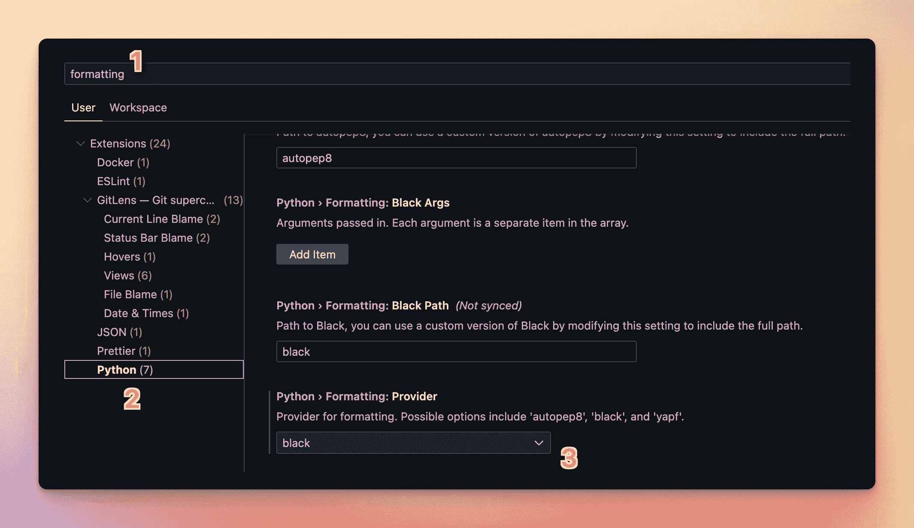

# 如何为 Python 开发设置 Visual Studio 代码

> 原文：<https://blog.teclado.com/how-to-set-up-visual-studio-code-for-python-development/>

在这篇文章中，我们将看看如何使用 Visual Studio 代码在 Python 中开发。我还将向您展示一些扩展，它们可以让您在使用 Python 时更加轻松！

## 初始设置

当你安装 Python 时(我推荐你通过[官方安装程序](https://www.python.org/downloads/)安装)，记住你安装它的文件夹。在 Windows 上，确保在官方安装程序的第一个屏幕中勾选“将 Python 添加到路径”。

下载 [Visual Studio 代码](https://code.visualstudio.com/)并像安装其他应用程序一样安装它。

打开 Visual Studio 代码并导航到左侧的扩展面板。在那里，找到 Python 扩展并安装它:


一旦安装完毕，你就可以使用 Visual Studio 代码打开任何文件夹，并创建一个以`.py`结尾的文件。Python 扩展为您提供了语法高亮，并通过提供建议和提示来帮助您编码。


您可以通过点击右下角来更改该扩展使用的 Python 版本，在截图中显示为“Python 3.10.0”。

创建虚拟环境后，您应该为您工作的每个 Python 项目创建虚拟环境，您可以通过单击“Python 3.10.0”按钮选择它作为 Python 解释器。

我们的文章[“使用虚拟环境:完整指南”](https://blog.teclado.com/python-virtual-environments-complete-guide/)，将帮助你学习如何使用虚拟环境，如果你还不熟悉它们的话。

这里有一个 Python 扩展的链接:[https://marketplace.visualstudio.com/items?itemName=ms-python.python](https://marketplace.visualstudio.com/items?itemName=ms-python.python) 。

## 使用 VSCode 对导入进行林挺、格式化和排序

### 林挺与拉夫在 Visual Studio 代码

linter 是一个检查你的代码中常见问题的工具，如果发现任何问题，它会向你发出警告。Python 生态系统中有许多 linters，但最近我更喜欢 Ruff。它速度快，可扩展。

让它在 Visual Studio 代码中工作的最简单的方法是安装 [Ruff 扩展](https://marketplace.visualstudio.com/items?itemName=charliermarsh.ruff)。这里有一个到 [ruff 库](https://github.com/charliermarsh/ruff)和[扩展库](https://github.com/charliermarsh/ruff-vscode)的链接，如果你想进一步阅读的话。

### Visual Studio 代码中的黑色格式

我喜欢 Python 的`black`格式化程序，因为它有合理的默认值，这意味着你根本不需要配置它。只需安装它，告诉 VSCode 运行它，就可以了。

要安装`black`，请确保您已经创建了一个 Python 虚拟环境，并在 VSCode 中选择它作为您的解释器。

然后，使用控制台安装它(确保控制台也激活了虚拟环境):

```
pip install black 
```

接下来，打开 VSCode 设置(用`CMD+,`或`CTRL+,`)，找到“Python 格式提供者”设置。设置为`black`:



### 在 Visual Studio 代码中使用 isort 导入排序

对您的导入进行分类听起来可能是一件完全无用的事情，但我们这样做是为了保持一致性。如果你和其他人一起开发一个代码库，这是非常有用的。

对导入进行排序意味着当您导入一个内置库(例如`os`)时，它会放在最上面。然后，去第三方库，像`flask`。最后从你自己的代码库中导入。在这三个部分中，它按字母顺序对进口进行排序。

如果您有许多这样的导入，这将使您更容易找到您想要的导入。

当您为 VSCode 安装 Python 扩展时，您也无意中安装了处理排序导入的 isort 扩展。你要做的就是运行它。

您可以通过打开命令面板(`CMD+SHIFT+P`或`CTRL+SHIFT+P`)来运行 isort，然后键入“Python Refactor: Sort Imports”。

### 使用 VSCode 在保存时对导入进行排序和格式化

要在保存时启用格式化和导入排序，请打开 VSCode 设置，然后使用此按钮以 JSON 格式打开它们:


在那里，确保这些设置在那里(注意不要有重复的设置):

```
{
    "[python]": {
        "editor.codeActionsOnSave": {
            "source.organizeImports": true,
            "source.fixAll": true
        }
    },
    "ruff.organizeImports": false,
    "editor.formatOnSave": true,
    "python.formatting.provider": "black"
} 
```

最后一个设置应该已经存在了，因为您之前选择了黑色作为格式化程序，但是其他的可能是新的。

以下是每个键的含义:

*   `[python]`:以下设置仅适用于 Python 语言。
*   `editor.codeActionsOnSave`:以下设置定义了保存文件时编辑器将运行的动作。
*   `source.organizeImports`:告诉编辑器在保存时对导入进行排序。
*   告诉编辑使用 linter 来修复所有它能修复的问题(那些它不能修复的问题只是留下来作为警告)。
*   `ruff.organizeImports`:将此项设置为`false`意味着我们将使用`isort`而不是`ruff`来对进口商品进行分类。
*   `editor.formatOnSave`:保存文件时用黑色格式化代码。
*   `python.formatting.provider`:使用哪个格式化程序。

现在每当你保存一个文件，isort 会对你的导入进行排序，ruff 会尝试修复它能修复的(并警告你它不能修复的)，然后 black 会格式化代码。

### 保存时文本闪烁？

默认情况下，当您使用 isort 对导入进行排序时，您最终会得到如下结果:

```
from module import (abc1, abc2, abc3,
                    abc4, abc5, abc6) 
```

但是如果你用黑色来格式化你的代码，它会把输入变成这样:

```
from module import (
    abc1,
    abc2,
    abc3,
    abc4,
    abc5,
    abc6,
) 
```

因为 isort 首先处理文件，然后 Black 处理结果，所以在文件以第一种格式保存的几毫秒内，您可能会看到文本闪烁。

要解决这个问题，我们应该告诉 isort 使用与 Black 相同的格式。这样文字就不会闪烁了。

在 Python 项目根目录下创建一个名为`pyproject.toml`的新文件。这个文件用于 Python 配置，它兼容大多数 Python 工具(包括 isort 和 black)。

在文件中，添加以下内容:

```
[tool.isort]
profile = "black" 
```

然后，通过启动命令面板(`CMD+SHIFT+P`或`CTRL+SHIFT+P`)并键入“isort Formatter: Restart Server”，告诉 VSCode 重新启动 isort formatting 服务器。

现在保存的时候文字就不会再闪烁了！

## 缩进-彩虹扩展

一个名为“indent-rainbow”的扩展将 Python 中的每一个缩进层次都用稍微不同的颜色来着色，因此您可以很容易地分辨出代码的哪些部分处于哪个缩进层次。

这是扩展将做的事情:


链接:[https://marketplace.visualstudio.com/items?itemName = oder wat . indent-rainbow](https://marketplace.visualstudio.com/items?itemName=oderwat.indent-rainbow)

## 彩虹括号扩展

如果您喜欢缩进-彩虹扩展，您可能也会喜欢彩虹括号扩展，它突出显示了不同颜色的嵌套括号、方括号和花括号，使跟踪嵌套括号更加容易。

链接:[https://marketplace.visualstudio.com/items?itemName = 2 gua . rainbow-brackets #概述](https://marketplace.visualstudio.com/items?itemName=2gua.rainbow-brackets#overview)

## vscode-icons 扩展

虽然运行 Python 代码并不需要这个扩展，但是它改变了侧边栏中文件和文件夹旁边显示的图标。我发现这使得它们更容易扫描！

链接:[https://marketplace.visualstudio.com/items?itemName = vs code-icons-team . vs code-icons](https://marketplace.visualstudio.com/items?itemName=vscode-icons-team.vscode-icons)

## LiveShare 扩展

VSCode 在与他人协作方面有很大的扩展。它允许您共享您的整个 VSCode 工作区，以便其他人可以加入它并与您一起编码。我经常用它来进行结对编程，尽管它对于寻求帮助也很有用！

在此下载并安装 LiveShare 扩展:[https://marketplace.visualstudio.com/items?itemName = MS-vsliveshare . vsliveshare](https://marketplace.visualstudio.com/items?itemName=MS-vsliveshare.vsliveshare)

安装后，您会在 VSCode 窗口的底部看到一个“Live Share”图标和文本。按下该按钮将启动一个实时共享会话，并提供一个链接，您可以与您希望加入共享会话的任何人共享该链接。

## 结论

就是这样！只要您的 Python 版本在您的路径中(这在 Mac 和 Linux 上是自动发生的，并且您必须在 Windows 的安装程序中勾选这个框)，Python 扩展将直接开箱即用！

如果你有任何问题，谷歌是你最好的朋友，因为成千上万的人使用这些扩展，所以你很可能能够找到解决方案。开发团队在他们的 GitHub 页面上也很有帮助。

GitHub 页面还包含大量关于如何启动和运行扩展的指南和信息，如果有必要的话！

希望这对您有所帮助，您的环境现在已经设置好了。编码快乐！

## 变更日志

*   2023 年 3 月:删除了“Code Runner”扩展，因为我发现自己根本不用它。添加了林挺、格式和导入排序。