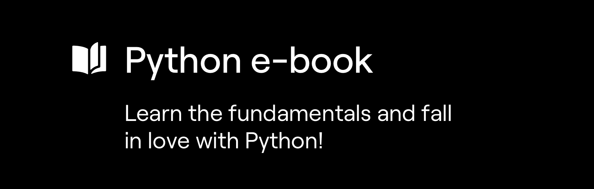
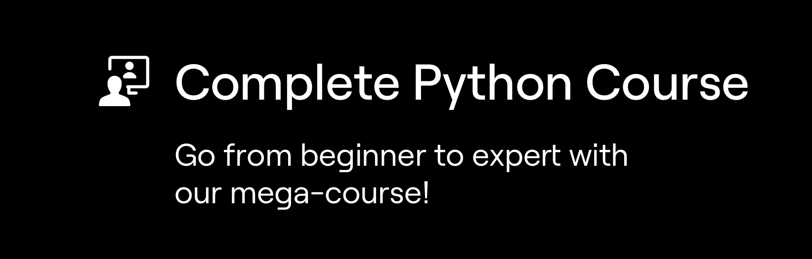

# 如何开始学习 Python

> 原文：<https://blog.teclado.com/how-to-start-learning-python/>

我们很乐意帮助你学习 Python！从绝对基础，到 web 开发和 REST APIs，甚至软件测试。

## 不熟悉 Python？

我们为你提供了两个很好的选择:免费的 Python 电子书和付费的视频课程。

我们的 [Python 电子书](https://python.tecladocode.com/)指导你学习 Python 的基础知识，从变量和数据类型到 if 语句、循环和函数。这是一个很好的入门资源，尤其是如果你以前从未做过任何编程的话。

除了 Python 电子书，我们还有远程 Python Bootcamp。这是一个 6 小时长的 Python 课程，我们免费直播。你可以在这里听到录音:[https://www.youtube.com/watch?v=Chy-32X2tqk](https://www.youtube.com/watch?v=Chy-32X2tqk)

我们的[完整 Python 课程](https://www.udemy.com/the-complete-python-course/?couponCode=BLOGGER)长达 30 多个小时，涵盖了所有基础主题，以及更多更多内容。

如果你想像专家一样学习 Python 和编程，这是我们得到的最好的资源。它涵盖了诸如面向对象编程、web 抓取、web 开发、浏览器自动化等主题。

它简洁明了，可以帮助您构建多个项目。我们很希望你能来！

## 这个博客

我们每周写和发布两次博客文章——在周一和周四。

每周一我们都会发布一篇 Python 片段的帖子，一些关于 Python 的有用和有趣的东西。这些对于保持与 Python 的联系和不断学习新的东西是非常棒的！

每周四我们都会针对某个特定的话题发布一篇较长的帖子，比如 web 开发或者编码面试问题。这些更深入，对编码和获得新技能很有帮助！

如果你感兴趣，请在 Twitter 上关注我们，并注册我们的电子邮件列表。如果你感兴趣，在这一页的底部有一个表格。

* * *

最重要的是，我们在 Discord 上有一个庞大的 Python 开发者和学生社区。如果你加入我们，我们会很高兴，和其他学生聊天，获得帮助，并在学习中合作:[https://discord.gg/78Nvd3p](https://discord.gg/78Nvd3p)

加入我们，加入我们的 Python 之旅吧！