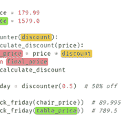

# Python 中面向对象编程的介绍

> 原文：<https://blog.teclado.com/introduction-to-object-oriented-programming-in-python/>

在这篇文章中，我们将讨论面向对象编程(OOP)。这篇文章是针对初学者的，但是如果你是一个有经验的开发人员，你也可以从中找到一些有用的信息。

我们将从名称空间和作用域的概念开始，因为这是理解类如何工作的良好起点。然后，我们将讨论 Python 中的类、对象和不同类型的方法。

读完这篇文章后，你将能够回答以下问题:

*   什么是名称空间和范围？
*   什么是类、对象、方法和属性？
*   类属性和实例属性有什么不同？
*   什么是特殊方法？
*   `__init__`方法是做什么的？
*   有哪些`__repr__`和`__str__`的方法？

我们还将简要讨论使用面向对象编程来代替函数式编程。

# Python 名称空间和范围

## 什么是名称空间？

在 Python 中，每当我们创建变量、函数或类时，我们都会给它们命名。这些允许我们在后面的代码中引用相关的值。

例如:

```py
name = "Lincoln State Bank"
net_income = [7480, 1983, 7799, 4466, 4672]

def print_info():
    return f"{name}'s net income is ${sum(net_income)}." 
```

这里我们创建了三个名字:`name`、`net_income`和`print_info`。

名称空间是名称到它们的值的映射。

当您输入一个函数定义时，会创建一个新的名称空间，每个函数都有一个不同的名称空间。函数内部定义的名字是函数命名空间的一部分。

您创建的每个模块也有自己的名称空间。模块是一个 Python 文件，包含函数、类或[命令代码](https://www.ionos.com/digitalguide/websites/web-development/imperative-programming/)形式的源代码。

您可以通过使用内置函数`dir()`来查看模块名称空间中的名称:

```py
import math

print(dir(math)) 
```

该示例的输出如下所示:

```py
['acos', 'acosh', 'asin', 'asinh', 'atan', 'log' ..., ...] 
```

您可以通过在模块和名称之间使用点`.`符号进行关联来访问模块名称空间中的每个名称。在这种情况下，`math`和`log`:

```py
import math

x = 5
log_of_x = math.log(x)
print(log_of_x) 
```

如果您运行上面的代码，您的输出应该如下所示:

```py
1.6094379124341003 
```

*注意:`dir()`不能保证在给定的名称空间中提供详尽的名称列表。点击了解更多[。](https://docs.python.org/3/library/functions.html#dir)*

Python 有很多名称空间。例如，`requests`模块和`dict`对象都有一个`get()`方法。但是因为它们在不同的名称空间中，所以不会互相干扰。

“名称空间”这个词已经告诉我们，它是 Python 存储名称的空间。这些名称是我们在创建变量、函数、类或其他任何东西时分配给几乎所有 Python 值的名称。

## 范围是什么？

*作用域*被定义为程序的一个给定部分，其中一个名称空间是可直接访问的。换句话说，作用域指向程序中可以访问和使用元素的位置。

文件顶层的变量是该文件全局范围的一部分。在文件的任何地方都可以访问它们。在下面的文件中，变量名`x`的作用域是全局的:

```py
import math

x = 5

def get_log_of_x():
    log_of_x = math.log(x)
    print(log_of_x)

print(x)  # 5
get_log_of_x()  # 1.6094379124341003 
```

在赋值的情况下，变量作用域从函数级开始。函数中的变量是局部的，它们只对程序的给定部分可见。局部范围通常指当前函数的局部命名空间:

```py
import math

def get_log_of_x():
    x = 5
    log_of_x = math.log(x)
    print(log_of_x)

print(x)  # NameError: name 'x' is not defined
get_log_of_x()  # 1.6094379124341003 
```

这里的`x`是函数局部作用域的一部分，所以它在函数外部是不可访问的。

如果我们试图在定义变量之前使用它，Python 将会引发一个运行时错误:

```py
import math

def get_log_of_x():
    log_of_x = math.log(x)
    x = 5

    print(log_of_x)

get_log_of_x()
# UnboundLocalError: local variable 'x' referenced before assignment
# Process finished with exit code 1 
```

不同命名空间中的名称没有关系。在下面的例子中，我们在两个不同的函数中使用了变量名`x`。因为每个函数都有自己的名称空间，所以使用相同的变量名不会导致任何范围问题。在每个函数中，变量`x`是局部范围的一部分:

```py
import math

def get_log_of_x():
    x = 5
    log_of_x = math.log(x)
    print(log_of_x)

get_log_of_x()  # 1.6094379124341003

def square_root_x():
    x = 21
    sqrt = math.sqrt(x)
    print(sqrt)

square_root_x() # 4.58257569495584 
```

如果你调用一个函数，解释器将按照特定的顺序寻找关联:局部、封闭、全局和内置(从内向外)。

在下图中，您可以看到一个嵌套函数(一个函数在另一个函数内):



如果您想查看该图的完整展示，请点击[此处](https://i.ibb.co/qp18HnK/diagram-full.png)。

如果解释器在最里面的(局部)作用域中没有找到变量名`discount`，它将向上移动到下一个(封闭)作用域，到倒数第二个(全局)作用域，直到最外面的(内置)作用域。如果它没有找到它，它将引发一个错误。

如果您想了解更多关于名称空间的知识，请访问这篇文章。

现在，让我们继续讨论面向对象编程。

# Python 类

当您将数据和功能结合在一起时，您就创建了一个`class`。这是一个新的*类型*的对象，允许产生其*类型*的新实例。实例可以用某些特征来维护它的状态，比如**属性**。您可以通过使用类中定义的**方法**来改变实例的状态。

让我们在下面的部分中分解上面提到的新概念。

## 介绍

下面的例子以字典的形式展示了两个银行。两者都试图解决同一个问题:当`net_income`值改变时更新`average_income`值。

```py
bank_1 = {
    'name': 'Lincoln State Bank',
    'net_income': [7480, 1983, 7799, 4466, 4672],
    'average_income': 0
}

bank_2 = {
    'name': 'Rock Canyon Bank',
    'net_income': [3901, 1118, 1979, 6349, 5843],
    'average_income': 0
} 
```

要解决这个问题，你可以这样做:

```py
def average(bank):
    bank['average_income'] = sum(bank['net_income']) / len(bank['net_income'])
    return bank['average_income']

print(average(bank_1))
print(average(bank_2))

print(bank_1)
print(bank_2) 
```

上面代码的一些问题:

*   `bank`必须是一个字典，并且必须有特定的键，因为函数依赖于它们。
*   创建许多类似的字典会非常冗长，因为我们必须定义每个字典中的键。
*   银行和平均函数之间没有依赖关系。在生产环境中，它们可能位于不同的文件中。在这种情况下，很难确定这里应该使用`average`函数。

字典中最好有一些返回该银行的`average_income`的内容。这个函数将和它所使用的数据放在同一个地方，这样更容易使用。

例如:

```py
bank_1 = {
    'name': 'Lincoln State Bank',
    'net_income': [7480, 1983, 7799, 4466, 4672],
    'average_income': sum(bank_1['net_income']) / len(bank_1['net_income'])
} 
```

不幸的是，这段代码不起作用，因为我们在`bank_1`的定义中使用了`bank_1`。此外，即使它工作了，当`net_income`值改变时，它也不会自动更新`average_income`键。为此，您必须使用类。

## 什么是课？

下面是一个名为`Bank`的类的例子:

```py
class Bank:
    pass 
```

用关键字`class`和类名声明一个类。尽管它现在什么都不做，我还是创建了一个类。关键字`pass`是未来代码的占位符。

每当您输入一个类定义时，都会创建一个新的命名空间。变量赋值和函数定义放在这个新的名称空间中。在类内部，**变量**变成了**属性**。

从长远来看，一个类就像一个蓝图，从这个蓝图中你可以创建多个**对象**。

# Python 对象

可以对一个类执行两种类型的操作:**实例化**和**属性引用**。

## 实例化

实例化是指创建新的**类实例**(称为对象)。这个过程非常类似于调用函数:一个类是一个孤立的代码块，只在“调用”时执行。

下面是一个名为`lincoln_state_bank`的对象的例子:

```py
class Bank:
    pass

lincoln_state_bank = Bank() 
```

在上面的例子中，我们创建了一个新的`Bank`类实例(我们称之为对象),并将它赋给变量`lincoln_state_bank`,这就是它的名字。在这个类中，你可以拥有任意数量的属性，比如`name`和`net_income`:

```py
class Bank:
    name = 'Lincoln State Bank'
    net_income = [7480, 1983, 7799, 4466, 4672]

lincoln_state_bank = Bank()
print(lincoln_state_bank) 
```

如果您运行代码，您可能会得到如下奇怪的输出:

```py
<__main__.Bank object at 0x000001FC48AE4FD0> 
```

要获得有意义的输出，您需要引用 print 语句中的属性。下一节再说吧。

## 属性引用

属性引用对本文第一部分讨论的名称关联使用标准的点`.`符号。引用`Bank.name`将返回`name`属性的值，即`'Lincoln State Bank'`:

```py
class Bank:
    name = 'Lincoln State Bank'
    net_income = [7480, 1983, 7799, 4466, 4672]
    average_income = None

print(Bank.name)  # Lincoln State Bank 
```

属性有两种:**类属性**和**实例属性**。到目前为止，你看到的是类属性。来说说他们吧。

### 类别属性

类属性是类的名称空间中的变量名。它们在所有类实例中都可见:

```py
class Bank:
    bank_type = 'Central Bank'

lincoln_state_bank = Bank()
rock_canyon_bank = Bank()

print(lincoln_state_bank.bank_type)  # Central Bank
print(rock_canyon_bank.bank_type)  # Central Bank 
```

因此，每个对象的数据保存在属性中，如`name`、`net_income`和`average_income`:

```py
class Bank:
    name = 'Lincoln State Bank'
    net_income = [7480, 1983, 7799, 4466, 4672]
    average_income = None

lincoln_state_bank = Bank()
rock_canyon_bank = Bank()

print(lincoln_state_bank.name)  # Lincoln State Bank
print(rock_canyon_bank.name)  # Lincoln State Bank 
```

然而，这并不理想。我们需要两个具有不同属性值的对象。因此可以创建**实例属性**。

### 实例属性

实例属性是存储在像`lincoln_state_bank`和`rock_canyon_bank`这样的对象中的名称。在这种情况下，属性是`name`:

```py
class Bank:
    pass

lincoln_state_bank = Bank()
rock_canyon_bank = Bank()

lincoln_state_bank.name = "Lincoln State Bank"
rock_canyon_bank.name = "Rock Canyon Bank" 
```

每个类实例的实例属性都是唯一的。它们在方法中定义，通常在名为`__init__`的特殊方法中定义:

```py
class Bank:
    def __init__(self):
        pass 
```

`self`的值是 Python 给每个方法调用的，所以你不必为它提供值。因此，当你创建对象时，你必须**而不是**为`self`提供任何参数:

```py
class Bank:
    def __init__(self):
        pass

lincoln_state_bank = Bank() 
```

`self.name`和`self.net_income`定义了两个将被绑定到唯一对象的实例属性。然后，它分配我们创建对象时提供的值:

```py
class Bank:
    def __init__(self, name, net_income):
        self.name = name
        self.net_income = net_income

lincoln_state_bank = Bank(name='Lincoln State Bank', net_income=[7480, 1983, 7799, 4466, 4672])
rock_canyon_bank = Bank(name='Rock Canyon Bank', net_income=[3901, 1118, 1979, 6349, 5843])

print(rock_canyon_bank.name)  # Rock Canyon Bank
print(lincoln_state_bank.name)  # Lincoln State Bank 
```

认为`self.name`和`self.net_income`是物体自身的属性(self)。每个对象可能有自己的一组属性值不同的属性。

每当您创建一个类的新实例时，Python 都会为您调用特殊的方法`__init__`。例如，当我创建`lincoln_state_bank`实例时，Python 解释器调用了特殊方法`__init__`。

在上面的例子中，我们创建了两个对象。它们是从同一个类中创建的，非常像一个蓝图。两者都是`Bank`类的实例，但是它们是不同的对象:

```py
# same type
print(isinstance(lincoln_state_bank, Bank))  # True
print(isinstance(rock_canyon_bank, Bank))  # True

# different objects
print(id(lincoln_state_bank))  # 21515952681152
print(id(rock_canyon_bank))  # 2162583515524 
```

`isinstance()`函数的语法是`isinstance(object, type)`。如果第一个参数是第二个参数指定的类型，则返回`True`；否则，返回`False`。

`id()`函数返回一个整数形式的对象标识。如果 id 不同，这意味着对象不同。

下面的例子展示了从一个类中创建的两个对象，这两个对象同时具有*类属性和*实例属性:

```py
class Bank:
    bank_type = 'Central bank'  # class attribute

    def __init__(self, name, net_income):
        self.name = name  # instance attribute
        self.net_income = net_income  # instance attribute

lincoln_state_bank = Bank(name='Lincoln State Bank', net_income=[7480, 1983, 7799, 4466, 4672])  # object 1
rock_canyon_bank = Bank(name='Rock Canyon Bank', net_income=[3901, 1118, 1979, 6349, 5843])  # object 2 
```

两个对象使用相同的`bank_type`属性，但是每个对象都有自己的`name`和`net_income`。

上面的例子使用对象重新创建了银行字典。现在，平均函数看起来像这样:

```py
def average(bank):
        return sum(bank.net_income) / len(bank.net_income)

average(lincoln_state_bank) 
```

但是，我们可以将这个函数移到类内部，并将其作为一个方法来使用。然后，您应该使用`self`,而不是将`Bank`对象传递给函数的参数:

```py
class Bank:
    def __init__(self, name, net_income):
        self.name = name
        self.net_income = net_income

    def average(self):
        return sum(self.net_income) / len(self.net_income)

lincoln_state_bank = Bank(name='Lincoln State Bank', net_income=[7480, 1983, 7799, 4466, 4672])
rock_canyon_bank = Bank(name='Rock Canyon Bank', net_income=[3901, 1118, 1979, 6349, 5843])

print(lincoln_state_bank.average())  # 5280.0
print(rock_canyon_bank.average())  # 3838.0 
```

注意，`average`方法也使用特殊参数`self`。现在，当您更新实例属性`net_income`时，您应该得到一个新的平均值:

```py
lincoln_state_bank.net_income.append(591000)

print(lincoln_state_bank.average())  # 102900.0
print(rock_canyon_bank.average())  # 3838.0 
```

即使我们修改了第一个对象的实例属性`net_income`，第二个对象仍然保持不变。让我们继续讨论 Python 方法。

# Python 方法

把方法想象成一个类中的标准函数。在 Python 中，我们有三类方法:**实例方法**、**静态方法**和**类方法**。

我们只讨论了实例方法(`__init__`和`average`)。实例方法是最常见的，也是默认的方法类型。你可以在这里了解更多关于其他类型的 Python 方法[。](https://blog.teclado.com/python-methods-instance-static-class/)

# Python 特殊方法

特殊方法在分数下被**d**double**包围，这就是为什么它们通常被称为 dunder 方法。你也可能会遇到称之为神奇方法的人。然而，在[官方 Python 文档](https://docs.python.org/3/reference/datamodel.html#special-method-names)中，并没有提到这样的术语。**

我们已经看到了`__init__`特殊方法，但是还有更多不同的方法。让我们给你看看最受欢迎的。

Python 有两种输出信息的特殊方法:

*   `__str__`通常用于以漂亮的格式向用户显示数据。
*   `__repr__`用于开发人员的调试、记录或输出。

这些特殊的方法允许您在不访问任何 is 属性的情况下打印对象。

正常情况下，在没有定义`__str__`或`__repr__`的情况下打印对象，会得到对象的内存地址:`<__main__.Bank object at 0x0000024211E5DFA1>`:

```py
class Bank:
    def __init__(self, name, net_income):
        self.name = name
        self.net_income = net_income

    def average(self):
        return sum(self.net_income) / len(self.net_income)

rock_canyon_bank = Bank(name='Rock Canyon Bank', net_income=[3901, 1118, 1979, 6349, 5843])

print(rock_canyon_bank)  # <__main__.Bank object at 0x0000024211E5DFA1> 
```

在这个例子中，你可以看到`__str__`和`__repr__`是如何帮助用户和开发者的:

```py
class Bank:
    def __init__(self, name, net_income):
        self.name = name
        self.net_income = net_income

    def __str__(self):
        return f"{self.name}. Net income: {self.net_income}"

    def average(self):
        return sum(self.net_income) / len(self.net_income)

lincoln_state_bank = Bank(name='Lincoln State Bank', net_income=[7480, 1983, 7799, 4466, 4672])
rock_canyon_bank = Bank(name='Rock Canyon Bank', net_income=[3901, 1118, 1979, 6349, 5843])

print(lincoln_state_bank)  # Lincoln State Bank. Net income: [7480, 1983, 7799, 4466, 4672]
print(rock_canyon_bank)  # Rock Canyon Bank. Net income: [3901, 1118, 1979, 6349, 5843] 
```

`__repr__`特殊方法的工作方式类似:

```py
def __repr__(self):
    return f"Bank({self.name!r}, {self.net_income!r})" 
```

请记住，如果您同时定义了`__str__`和`__repr__`，它们都将被使用，但是在不同的情况下:

*   当你`print()`一个对象或者用这个对象作为参数调用`str()`函数时，会用到`__str__`。
*   当您以对象作为参数调用`repr()`函数时，将使用`__repr__`。大多数调试器这样做是为了显示关于对象的信息。

这里有一个例子:

```py
print(repr(lincoln_state_bank))  # Bank("Lincoln State Bank", 15) 
```

尽管两者都可以使用，但大多数情况下，你最终会使用其中一个。记住——使用`__str__`是为了美观，使用`__repr__`是为了开发。

# 面向对象编程与函数式编程

OOP 的一个主要好处是使用数据的动作(或函数)与数据本身一起存储。这种共存可以简化事情。此外，我们经常谈论对象*执行*动作。这种思维方式可以让编码在某些场景下更有直观感。

```py
bank_income = [9048, 1581, 9811, 5150, 5191]

class Bank:
    def __init__(self, name, net_income):
        self.name = name
        self.net_income = net_income

    def average(self):
        return sum(self.net_income) / len(self.net_income)

lincoln_state_bank = Bank(name='Lincoln State Bank', net_income=past_years_income)

print(lincoln_state_bank.average())  # 6156.2 
```

现在来看看用一个函数重新创建相同代码的尝试:

```py
bank_income = [9048, 1581, 9811, 5150, 5191]

def average_year_income(incomes):
    return sum(incomes) / len(incomes)

print(f"Lincoln State Bank: {average_year_income(bank_income)}")
# Lincoln State Bank: 6156.2 
```

绝对更短的代码！毫无疑问，如果这是你编码的范围，你应该选择函数式方法。

但是这里有两个场景，OOP 可能会给你带来一些好处:

## 扩展类

比方说，你希望你的银行能够做得更多。例如，提供贷款。

我们需要记录每家银行贷出了多少钱，我们需要确保它不会超过银行的总收入。

使用 OOP，相对简单:

```py
class Bank:
    def __init__(self, name, net_income):
        self.name = name
        self.net_income = net_income
        self.loan_value = 0

    def average(self):
        return sum(self.net_income) / len(self.net_income)

    def offer_loan(self, amount):
        if self.loan_value + amount > sum(self.net_income):
            raise ValueError(f"{self.name} can't offer a loan for {amount}. Not enough money.")
        self.loan_value += amount
        return amount 
```

使用函数方法也是可行的，但是它开始变得更加复杂:

```py
bank = {
    "name": "Lincoln State Bank"
    "income": [9048, 1581, 9811, 5150, 5191],
    "loan_amount": 0
}

def average_year_income(incomes):
    return sum(incomes) / len(incomes)

def offer_loan(bank, amount):
    if bank["loan_amount"] + amount > sum(bank["income"]):
        raise ValueError(f"{bank["name"]} can't offer a loan for {amount}. Not enough money.")
    bank["loan_amount"] += amount
    return amount 
```

随着我们添加更多的功能，功能方法的好处会有所减少:

*   在我们应用程序的不同部分，如果我们想要使用它(和我们制作的其他函数)，我们需要导入`offer_loan`函数。
*   我们可能需要跟踪多个银行字典，如果我们犯了一个错误，一些可能会丢失一些必需的属性。

相比之下，使用 OOP:

*   使用了`Bank`对象的应用程序的所有部分都可以在这些对象上使用`offer_loan`方法。不需要导入更多的函数并将它们保存在名称空间中。
*   不可能有缺少某些关键属性的对象，因为这些属性是在`__init__`方法中定义的。

除此之外，使用 OOP 方法，我们可以说**银行可以提供贷款**，这很直观:

```py
bank.offer_loan(500) 
```

我认为这里的函数方法更难理解:

```py
offer_loan(bank, 500) 
```

然而，这在某种程度上也取决于个人偏好。

这个例子对于 OOP 来说并不是一个完美的例子，但是当你考虑使用哪种方法时，它绝对是一个值得考虑的问题。

## 更改传入数据

假设我们从一个 API 获取银行的收入数据。

有一天，API 发生了变化，不再返回银行的收入列表，而是返回一个将收入分成几年的字典。比如这个:

```py
past_years_income = {
    '2018': [7480, 1983, 7799, 4466, 4672],
    '2019': [8491, 8571, 8119, 8191, 5678],
    '2020': [9048, 1581, 9811, 5150, 5191]
} 
```

如果您使用的是函数式方法，那么使用这些数据的每个函数都有可能发生变化。

这并不是世界末日，但是使用 OOP 可以节省一些工作。在`__init__`方法中，您可以修改传入的 API 数据，使其与旧的数据格式相匹配:

```py
from itertools.chain import from_iterable

class Bank:
    def __init__(self, name, net_yearly):
        self.name = name
        self.net_yearly = net_yearly
        # Below: turns all dictionary values into a single list
        self.net_income = list(from_iterable(net_yearly.values()))
        self.loan_value = 0 
```

现在这些方法都不需要改变，如果你想在其他方法中使用`self.net_yearly`,你仍然可以使用。

这是一个小例子，但是 OOP 的其他特性也是有用的。这些例子有`@classmethod`工厂、属性或使用抽象类。

所有这些，以及一般意义上的 OOP，都应该在它简化你的代码并使之更容易使用的时候使用。很多时候，功能更简单、更快速或者更容易测试。在这种情况下，您应该坚持使用功能方法。

当你开始使用函数式和面向对象的方法时，你将发展出在不同的情况下做出正确决定的技能。

# 结论

今天我们采用了一种不同的方法来解释面向对象编程，这与我们的其他帖子和课程不同。我希望你喜欢这本书，并且觉得它很有用！

如果你想学习更多关于 Python 的知识，可以考虑参加我们的[完整 Python 课程](https://go.tecla.do/complete-python-sale)，它将带你从初级到高级(包括 OOP、web 开发、异步开发等等！).我们有一个 **30 天退款保证**，所以你真的没有什么损失去尝试一下。我们很希望你能来！

Cover photo by [Arif Riyanto](https://unsplash.com/@arifriyanto?utm_source=unsplash&utm_medium=referral&utm_content=creditCopyText) on [Unsplash](https://unsplash.com/s/photos/coding?utm_source=unsplash&utm_medium=referral&utm_content=creditCopyText)