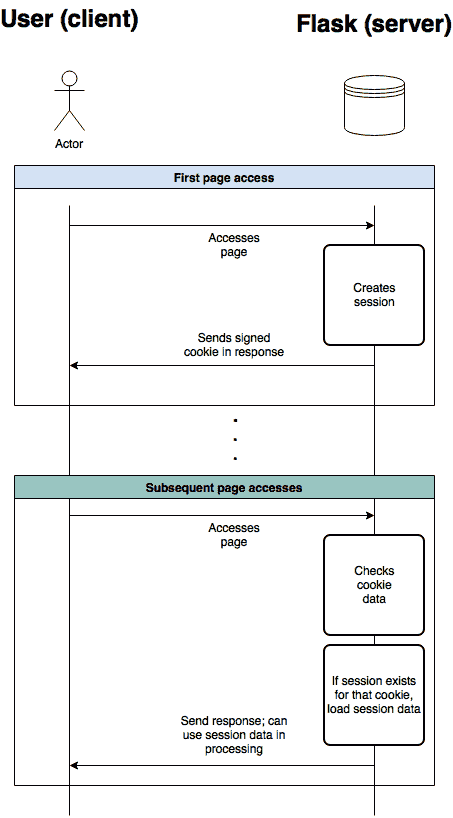

# 在 Flask 中定义用户访问级别

> 原文：<https://blog.teclado.com/learn-python-defining-user-access-roles-in-flask/>

通常在您的 web 应用程序和 REST APIs 中，您将拥有不同级别的访问权限:来宾、用户、管理员，可能还有其他人。这篇文章讨论了使用 Flask 的一个可能的实现。

## 你是如何管理登录的？

为了理解这篇博文，我们需要先看看您的应用程序目前是如何管理登录的。一般来说，在我的培训和课程中，我建议了两种管理登录的方法:如果你正在用 Flask 创建一个 web 界面，那么使用 [sessions](https://blog.teclado.com/how-to-add-user-logins-to-your-flask-website/) ，如果你正在创建一个没有界面(比如 REST API)的服务，那么使用 [JWT 令牌](https://blog.teclado.com/simple-jwt-authentication-with-flask-jwt/)。

### 使用会话管理登录

Flask 带有一个内置的会话管理器。每当用户访问你的站点时，Flask 会向浏览器发送一个签名的 cookie，并在其中存储会话 ID。Flask 可以在该会话 ID 下在服务器中存储一些数据。

它是这样工作的:



用户第一次访问页面时，会为他们创建一个会话；创建一个 cookie 并发送回浏览器。

在每个后续请求中，浏览器都会包含该 cookie。Flask 看到了它，并可以检查是否有与之相关联的有效会话。如果有，它可以加载会话数据并在向用户返回另一个页面之前使用它。

例如，当用户登录时，我们可以将其电子邮件地址保存到他们的会话中。每当 cookie 中带有会话标识符的请求返回时，我们都会看到会话中有一个电子邮件地址。我们可以用这些数据告诉我们:

*   用户是谁；和
*   用户已经登录。

下面是你如何用 Flask 实现这样的东西:

```py
@app.route('/login', methods=['GET', 'POST'])
def login_user():
    if request.method == 'POST':
        email = request.form['email']
        password = request.form['password']

        try:
            # Check if the user is valid, this would go through a database.
            if User.is_login_valid(email, password):
                session['email'] = email
                return redirect(url_for("home"))  # When we redirect them, we already have data saved in the session
        except Exception as e:
            return render_template("users/login_error.jinja2")  # Send user to an error page if something happened during login.

    return render_template("users/login.jinja2")  # This template shows a login form, only called if the request.method was not 'POST'. 
```

如果您有显示登录表单的模板，上面的端点可以连接到该表单并允许用户登录。

请记住:用户登录只是意味着我们已经将他们的电子邮件保存到了一个会话中！如果他们转到不同的浏览器，它不会有相同的 cookie，他们会显示为已注销。

#### 检查用户是否登录到另一个端点

一旦我们在会话中保存了一些数据来告诉我们用户已经登录，我们就可以从其他端点检查会话数据。例如，假设我们有一个`profile`端点:

```py
@user_blueprint.route('/profile')
def profile():
    if not session.get('email'):
        return redirect(url_for('login_user'))
    user = User.find_by_email(session['email'])
    return render_template("users/profile.jinja2", user=user) 
```

这里我们检查会话是否有一个`'email'`属性。如果没有，我们将用户发送到登录屏幕；否则，我们会将他们发送到个人资料页面。我们可以在 Jinja2 页面中包含用户对象，这样我们就可以显示关于用户的一些信息。

那是另一篇博文的主题！

### 使用 JWTs 管理登录

我讨论的关于登录的另一个主要方法是使用 JWTs。我们可以生成一个加密的令牌，秘密地包含用户的标识符(例如，他们的电子邮件或唯一的 ID)，而不是将东西存储在会话和 cookies 中。

每当我们的应用程序接收到这个 JWT，它就可以解密它，查看它的内部，并获得用户标识符。然后，它可以从数据库中加载用户数据，并在处理中使用它。

在这种情况下，“登录”意味着“用户向我们发送了有效的 JWT”。

我推荐使用类似于 [Flask-JWT 扩展的](http://flask-jwt-extended.readthedocs.io/en/latest/basic_usage.html)，一个 Flask 插件，来管理 JWT 的登录。这个话题比较长，我就不在这个视频里讲了。然而，当用户使用 Flask-JWT-Extended 登录时，我们将可以从库中访问`get_jwt_identity()`，这将为我们提供当前登录的用户(只要他们在请求中发送了有效的 JWT)。

## 定义用户访问角色

现在，来说说这篇博文的内容吧！我们已经研究了管理登录的不同方法，但是一旦用户登录，我们希望只允许他们访问某些端点，而不允许其他端点。

我们将从在我们的用户模型中定义一个新的属性开始，它可以被称为`access_level`。该属性也应该与用户的其他数据一起存储在数据库中。

对于这个例子，我将把`0`定义为“无访问权限”，把`1`定义为“用户”，把`2`定义为“管理员”:

```py
ACCESS = {
    'guest': 0,
    'user': 1,
    'admin': 2
}

class User():
    def __init__(self, name, email, password, access=ACCESS['user']):
        self.name = name
        self.email = email
        self.password = password
        self.access = access

    def is_admin(self):
        return self.access == ACCESS['admin']

    def allowed(self, access_level):
        return self.access >= access_level 
```

我们的应用程序应该在某个时候定义用户的访问级别。默认情况下，所有用户将被创建为具有“用户”的权限:`1`。

如果我们想创建一个管理员用户，我们应该修改每个用户，并使他们的属性`access`等于`2`。

然后，在任何端点，我们可以检查访问属性来做不同的事情。

### 在模板中显示不同的内容

在任何 Jinja 模板中，我们可以将`user`属性作为数据传递，然后根据访问级别显示不同的内容。

在下面的例子中，我们只允许管理员邀请新用户；所有用户都可以看到用户列表。

```py
<div class="users">
    
        <a href="{{ url_for('users.invite_user') }}">Invite new user</a>
    
    <a href="{{ url_for('users.view_users') }}"><i class="fa fa-list"></i> View users</a>
</div> 
```

这是安全的，因为模板是在服务器中呈现的。用户不能通过浏览器中的开发工具修改他们的访问级别或显示和隐藏元素。

### 限制对端点的访问

代替在模板中显示和隐藏东西，我们可以限制对一些端点的访问，我们称之为“仅管理”。例如，我们可以限制只有管理员才能访问“控制面板”;而不是对用户或客人。

```py
@app.route('/control-panel')
def profile():
    if not session.get('email'):
        return redirect(url_for('login'))

    user = User.find_by_email(session['email'])
    if not user.is_admin():
        return redirect(url_for('login'))

    return render_template('control_panel.jinja2') 
```

我们可以为每个需要保护的终端都这样做。

不过，这很快就会被重复！相反，我们也可以把它抽象出来，放在一个装饰器中。这是一个稍微高级一点的话题！如果你还没有遇到装修工，我建议你先去看看。

```py
from functools import wraps
from flask import url_for, request, redirect, session
from user import User

def requires_access_level(access_level):
    def decorator(f):
        @wraps(f)
        def decorated_function(*args, **kwargs):
            if not session.get('email'):
                return redirect(url_for('users.login'))

            user = User.find_by_email(session['email'])
            elif not user.allowed(access_level):
                return redirect(url_for('users.profile', message="You do not have access to that page. Sorry!"))
            return f(*args, **kwargs)
        return decorated_function
    return decorator 
```

上面定义的装饰器接受一个参数`access_level`，这是用户为了访问端点而必须拥有的最低访问级别。例如，`1`意味着只有用户和管理员可以访问终端。

如果用户不存在，我们重定向到登录页面。如果用户没有访问权限，我们会重定向到他们的个人资料，并附上一条消息说他们没有访问权限。否则，我们继续。

我们会这样称呼它:

```py
@app.route('/control-panel')
@requires_access_level(ACCESS['admin'])
def profile():
    return render_template('control_panel.jinja2') 
```

简单多了，不是吗？

装饰器本身需要更多的工作，但是现在它可以在许多端点上重用，以轻松保护它们。

* * *

我希望这篇文章在考虑定义 Flask 应用程序的访问级别时会有用！记住:访问级别可以只是一个数字，然后由你决定限制什么访问级别。

如果您开始觉得需要许多不同的访问级别，那么可能是时候考虑不同的方法了。但那完全是另一篇博文的内容！