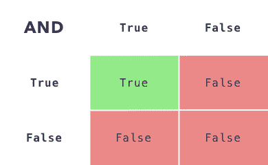
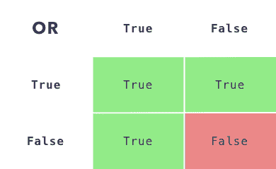

# Python 中的逻辑比较:and & or

> 原文：<https://blog.teclado.com/logical-comparisons-in-python-and-or/>

Python 的`and`和`or`关键字可能会让初学程序员感到困惑，但对于来自其他编程语言的程序员也是如此。这是因为在 Python 中，这些操作符的行为可能与其他语言不同！

传统上用`and`和`or`来比较真假值。我们也用英语这样做:

*   当这个和那个都为真时，这个也为真:“如果这个人既是男人又未婚，他就是单身汉”。
*   当这个或那个(或两者都)为真时，这是真的。

为了简单起见，这里有一张`and`如何工作的示意图。如果两个条件都为真，则结果为真。如果任一条件为假，则结果为假。



`or`有些相反:只有两个条件都为假，结果才为假。否则，结果为真。



在 Python 中，我们会在`True`和`False`关键字之间写`and`或`or`。像这样:

```
>>> True and True
True
>>> True and False
False
>>> True or False
True
>>> False or False
False 
```

## Python 中的布尔逻辑

Python 将这种逻辑评估向前推进了一步:

*   `and`如果计算结果为 false，则返回第一个值，否则返回第二个值。
*   `or`如果计算结果为 true，则返回第一个值，否则返回第二个值。

### 和

让我们从`and`开始，回头看看上面的代码:

```
>>> False and True
False
>>> True and True
True
>>> True and False
False 
```

在第一个例子`False and True`中，第一个值是`False`。根据我们的真值表，当任意值为`False`时，结果将始终为`False`。Python 知道这一点，所以一遇到`False`，它就返回那个。它甚至不检查第二个值！

对于第二个例子`True and True`，Python 将查看这两个值。虽然两者一样，但其实是在给我们第二个`True`。

我们可以在最后一个例子`True and False`中看到这一点，Python 检查了第一个值，它是`True`，所以它给了我们第二个值`False`。同样，它不需要检查这个值。

### 或者

```
>>> True or False
True
>>> False or True
True
>>> False or False
False 
```

在第一个例子`True or False`中，Python 从查看第一个值开始。它是`True`，所以它立即返回。回头看看上表，如果其中一个值是`True`，结果将总是`True`，因此 Python 通过在第一个值之后立即返回来节省时间。

在第二个例子`False or True`中，第一个值是`False`。Python 然后返回第二个值。

在第三个例子中，同样的事情发生了。第一个值是`False`，所以 Python 返回第二个值——也是`False`。

我们正在讨论返回第一个或第二个值，这可能看起来很奇怪，但是如果我们将所有这些与前面的 true/false 表进行比较，您会看到它们完全对应。另外，Python 可以在不涉及`True`和`False`的其他场景中使用它！

## 用这个没有真假

您也可以对布尔值以外的值使用这些运算符。

### 和

记住，当使用`and`时，Python 会返回第一个值，如果它的计算结果是`False`。那么这个呢？

```
>>> None and '35'
None 
```

这会给你一个错误吗？

在许多编程语言中它会，但是在 Python 中它给你`None`。那是因为在 Python 中，`None`的计算结果是`False`。我们稍后会解释原因！

这里还有几个例子:

```
>>> None and '35'
None
>>> x = []
>>> x and 12
[]
>>> 10 and 20
20 
```

在这些例子中，`None`和`[]`的计算结果是`False`，所以在这两种情况下`and`操作符都返回了它们，因为它们是第一个值。`10`的计算结果为`True`，因此`and`操作符返回第二个值。

### 或者

对于`or`，如果第一个值的计算结果为`True`，则返回第一个值。看看这个:

```
>>> None or '35'
'35' 
```

由于`None`的计算结果为`False`，因此`'35'`被返回。

这里还有几个例子:

```
>>> None or '35'
'35'
>>> x = []
>>> x or 12
12
>>> 10 or 20
10 
```

这里，`None`和`[]`的计算结果为`False`，因此`or`运算符在两种情况下都返回第二个值。`10`的计算结果为`True`，因此`or`操作符返回第一个值。

## 什么是“真”和“假”的价值观？

在 Python 中，当一个值评估为`True`时，我们称之为“真值”。类似地，当它评估为`False`时，我们称之为“Falsy”。

Python 中的大多数值都是“真实的”。这意味着当你将它们传递给`bool()`函数时，它会返回`True`:

```
>>> bool(None)
False
>>> bool('35')
True
>>> bool(10)
True
>>> bool([])
False
>>> bool([1, 2, 3])
True 
```

“虚假”的值是:

*   空字符串、列表、元组、字典和其他空的可重复项。
*   `None`
*   `0`等零号(如`0.0`)。
*   在这个[链接](https://docs.python.org/3/library/stdtypes.html#truth-value-testing)中可以看到所有的“Falsy”值。

## 概述

*   `or`关键字返回它前面的值(第一个值)如果是“Truthy”。否则，它返回第二个值。
*   `and`关键字如果是“Falsy”则返回第一个值，否则返回第二个值。