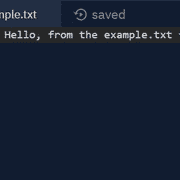
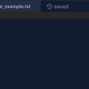
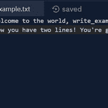

# 第 14 天:使用文件| Teclado

> 原文：<https://blog.teclado.com/python-30-day-14-files/>

欢迎来到 Python 系列 [30 天的第 14 天。今天是令人兴奋的一天，因为我们将学习如何操作文件。](https://blog.teclado.com/30-days-of-python)

这为我们打开了许多大门，因为在这篇文章结束时，你将能够永久存储信息。到目前为止，程序一关闭，我们在程序中做的任何事情都会丢失。让我们解决这个问题！

## `open`功能

我们需要开始处理文件的第一个工具是`open`函数。当我们调用`open`时，它会给我们一种方法来访问我们指定的文件中的数据。

我们实际上可以向`open`传递许多参数，这些参数会改变它的行为，但是我们将只从一个参数开始:我们想要访问的文件的名称。

首先，我们需要创建一个要访问的文件。我们将要开始处理的文件是一个简单的文本文件，我已经将它添加到我的 repl 中的`main.py`文件旁边。文件名为`example.txt`，内容是一条明文短信:

```py
`Hello, from the example.txt file!` 
```

访问这个文件实际上相当简单。我们需要做的就是在我们的`main.py`文件中写入以下内容:

```py
`example_file = open("example.txt")` 
```

因为`example.txt`文件与我们的`main.py`文件在同一个目录(文件夹)中，所以我们可以只写文件名和它的文件扩展名。

我们也可以这样写:

```py
`example_file = open("./example.txt")` 
```

这里的`.`表示“当前目录”，所以我们说的是当前目录中的`example.txt`文件。

如果我们愿意，也可以指定该文件的完整路径。在我的例子中，repl it 上文件的完整路径是:

```py
`/home/runner/AnotherHuskySyntax/example.txt` 
```

每个版本都有它的用途，所以知道您有选择来识别您想要处理的文件是很好的。

默认情况下，当使用`open`访问一个文件时，我们将被授予对该文件的读取权限，这意味着我们可以从该文件中获取数据，但我们不能修改该文件。

我们可以通过对返回给我们的东西`open`调用`read`方法来查看文件的内容。

```py
`example_file = open("example.txt")
print(example_file.read())` 
```

如果我们运行这段代码，我们会看到我们在`example.txt`中写的小问候被打印到控制台上！

我们现在需要做最后一件事，这是非常重要的。我们需要关闭文件。

```py
`example_file = open("example.txt")
print(example_file.read())
example_file.close()` 
```

你可以在这个 StackOverflow 帖子中看到一些原因。

## 以不同模式打开文件

既然我们能够从文件中读取一些数据，让我们来讨论另一个可以传递给`open`的参数:模式。

默认情况下，`open`将以读取模式打开我们的文件，这就是为什么我们只有读取权限。这种模式由字符串`"r"`表示。

如果我们想更明确(通常是件好事)，我们可以像这样重写上面的代码:

```py
`example_file = open("example.txt", "r")
print(example_file.read())
example_file.close()` 
```

如果需要，我们也可以使用关键字参数:

```py
`example_file = open("example.txt", mode="r")
print(example_file.read())
example_file.close()` 
```

这些都是功能等效的。

然而，正如您所料，读取模式并不是我们访问文件的唯一方式。我们还有写模式，用字符串`"w"`表示。

让我们通过创建一个新文件来测试这一点。当我们使用写模式时，如果文件还不存在，Python 会为我们创建一个文件，所以我们可以这样写:

```py
`write_file = open("write_example.txt", "w")
write_file.close()` 
```

如果我们运行这段代码，我们可以看到有一个名为`write_example.txt`的新的空文件。如果我们想的话，我们可以通过调用`write`方法将信息写入这个文件。

```py
`write_file = open("write_example.txt", "w")
write_file.write("Welcome to the world, write_example.txt!")
write_file.close()` 
```

我们可以使用很多其他模式，你可以在官方文档中找到这些模式的信息。

现在，我们只需要再学习一个:追加模式。附加模式是另一种类型的写入模式，由字符串`"a"`表示。

我们必须知道的一件事是，当我们打开文件时，写模式会截断文件。这意味着它会删除文件中的所有数据。Append 模式允许我们写到文件的末尾，所以当我们只想扩展文件的内容时，这是很有用的。

我们可以用与写模式完全相同的方式写入以追加模式打开的文件。

```py
`write_file = open("write_example.txt", "a")
write_file.write("\nNow you have two lines! You're growing up so fast!")
write_file.close()` 
```

现在我们的`write_example.txt`文件看起来像这样:

## 用于处理文件的上下文管理器

到目前为止，我们只访问了几个文件，但总是在我们完成工作后关闭文件已经变得有点乏味了。

因为这是我们每次打开文件都要做的事情，Python 给了我们一个方便的工具，叫做上下文管理器，它为我们处理这些重复的动作。

语法如下所示:

```py
`with open("example.txt", "r") as example_file:
    print(example_file.read())` 
```

这乍一看可能有点奇怪，但它的功能与此相同:

```py
`example_file = open("example.txt", "r")
print(example_file.read())
example_file.close()` 
```

首先我们有`with`关键字，它向 Python 表明我们正在使用上下文管理器。接下来我们调用`open`函数，就像我们之前做的一样，但是为了将结果赋给一个变量，我们需要使用这个`as`关键字。

当文件打开时，我们想做的所有事情都放在第一行下面的缩进块中，然后当这个块中没有代码可以运行时，Python 会为我们关闭文件。

重要的是，我们首先学习和理解更长版本的语法，但在实践中，当处理文件时，您真的应该总是使用上下文管理器语法。当我们手动操作文件时，即使是最优秀的人有时也会忘记关闭文件，而上下文管理器使这变得不可能。

这里还有几个例子，这样你就可以看到上下文管理器的长版本。

这个:

```py
`write_file = open("write_example.txt", "w")
write_file.write("Welcome to the world, write_example.txt!")
write_file.close()` 
```

可以改写成这样:

```py
`with open("write_example.txt", "w") as write_file:
    write_file.write("Welcome to the world, write_example.txt!")` 
```

这个版本带有附加模式:

```py
`write_file = open("write_example.txt", "a")
write_file.write("\nNow you have two lines! You're growing up so fast!")
write_file.close()` 
```

可以改写成这样:

```py
`with open("write_example.txt", "a") as write_file:
    write_file.write("\nNow you have two lines! You're growing up so fast!")` 
```

## CSV 数据

既然我们已经熟悉了如何进行一些基本的文件操作，那么让我们来谈谈如何处理一种通用格式的数据:CSV。

CSV 代表逗号分隔值，这是我们以纯文本形式存储数据的最简单方法之一。顾名思义，值由逗号分隔，通常这些数据像表格一样排列，每行值在文件中的不同行上。

CSV 有许多不同的风格或“方言”,但我们将保持简单，使用仅使用逗号和换行符的版本。

让我们首先创建一个新的 repl，并将一个名为`iris.csv`的文件放入我们的新 repl 中，我们将在其中放入以下数据:

```py
`sepal_length,sepal_width,petal_length,petal_width,species
5.1,3.5,1.4,0.2,Iris-setosa
4.9,3,1.4,0.2,Iris-setosa
4.7,3.2,1.3,0.2,Iris-setosa
4.6,3.1,1.5,0.2,Iris-setosa
5,3.6,1.4,0.2,Iris-setosa
7,3.2,4.7,1.4,Iris-versicolor
6.4,3.2,4.5,1.5,Iris-versicolor
6.9,3.1,4.9,1.5,Iris-versicolor
5.5,2.3,4,1.3,Iris-versicolor
6.5,2.8,4.6,1.5,Iris-versicolor
6.3,3.3,6,2.5,Iris-virginica
5.8,2.7,5.1,1.9,Iris-virginica
7.1,3,5.9,2.1,Iris-virginica
6.3,2.9,5.6,1.8,Iris-virginica
6.5,3,5.8,2.2,Iris-virginica` 
```

这是机器学习中使用的一个非常著名的数据集的一个子集，称为[鸢尾花数据集](https://en.wikipedia.org/wiki/Iris_flower_data_set)。

它包含了各种鸢尾花的不同部分的测量值，以及这些测量值所来自的特定种类的鸢尾。

在上面的数据集中，我们有 150 个条目中的 15 个，最上面一行包含了数据表的标题，这样我们就知道每个值指的是什么。

您可以在下表中更好地看到数据:

5.1 3.5 1.4 0.2 4.9 3 1.4 0.2 4.7 3.2 1.3 0.2 4.6 3.1 1.5 0.2 5 3.6 1.4 0.2 7 3.2 4.7 1.4 6.4 3.2 4.5 1.5 6.9 3.1 4.9 1.5 5.5 2.3 4 1.3 6.5 2.8 4.6 1.5 6.3 3.3 6 2.5 5.8 2.7 5.1 1.9 7.1 3 5.9 2.1 6.3 2.9 5.6 1.8 6.5 3 5.8 2.2

|萼片 _ 长度|萼片 _ 宽度|花瓣 _ 长度|花瓣 _ 宽度|种类| | - | - | - | - | - | | 5.1 | 3.5 | 1.4 | 0.2 |鸢尾属| 4.9 | 3 | 1.4 | 0.2 |鸢尾属| 4.7 | 3.2 | 1.3 | 0.2 |鸢尾属| 4.6 | 3.1 | 1.5 | 0.2 |鸢尾属|鸢尾属| 5 | 3.6 | 1.4 | 0 3.2 | 4.7 | 1.4 |蝴蝶花| 6.4 | 3.2 | 4.5 | 1.5 |蝴蝶花| 6.9 | 3.1 | 4.9 | 1.5 |蝴蝶花| 5.5 | 2.3 | 4 | 1.3 |蝴蝶花| 6.5 | 2.8 | 4.6 | 1.5 |蝴蝶花| 6.3 | 3.3 | 6 | 2.5 |鸢尾花| 5.8 | 2.7 2.1 |鸢尾-海滨草| | 6.3 | 2.9 | 5.6 | 1.8 |鸢尾-海滨草| | 6.5 | 3 | 5.8 | 2.2 |鸢尾-海滨草|

我们在这一部分的目标是获取这组 CSV 数据，并从中创建一个字典列表。

### 步骤 1:从文件中获取数据

首先，我们需要打开文件并从中获取 CSV 数据。使用我们已经看到的技术，我们可以这样做:

```py
`with open("iris.csv", "r") as iris_file:
    iris_data = iris_file.read()` 
```

### 步骤 2:将数据拆分成行

现在，如果我们要打印`iris_data`，我们会将文件的内容打印到控制台。

问题是，如何从文件中获取单独的行，以便我们可以开始处理单独的项目？

由于数据显示在单独的行上，我们知道一件非常重要的事情。每一行都以换行符结束，以标记换行符。因此，我们可以根据`"\n"`字符分割数据，将每一行作为一个列表。

```py
`with open("iris.csv", "r") as iris_file:
    iris_data = iris_file.read().split("\n")` 
```

然而，因为这是一个非常常见的操作，Python 给了我们一个工具来做几乎相同的事情。不叫`read`，我们可以叫`readlines`。

```py
`with open("iris.csv", "r") as iris_file:
    iris_data = iris_file.readlines()` 
```

两者之间的主要区别是`readlines`将保留这个`"\n"`字符，所以我们需要记住把它剪掉。

### 步骤 3:创建新的列表并修剪标题行

接下来，我将创建一个名为`irises`的空列表，这是我们放置最终字典的地方。

```py
`with open("iris.csv", "r") as iris_file:
    iris_data = iris_file.readlines()

irises = []` 
```

现在我将使用一个`for`循环来迭代`iris_data`中的列表。记住第一行并不是真正的数据。只是表格标题。因此，我不会迭代所有的虹膜数据，我将迭代一个[切片](/30-days-of-python/python-30-day-7-split-join)。

```py
`with open("iris.csv", "r") as iris_file:
    iris_data = iris_file.readlines()

irises = []

for row in iris_data[1:]:
    pass` 
```

### 步骤 4:将行拆分成单独的项目

对于每次迭代，我将从去掉`"\n"`字符开始，并使用逗号作为分隔字符串来拆分字符串。

为了便于以后引用这些值，我将析构从`split`返回的列表。

```py
`with open("iris.csv", "r") as iris_file:
    iris_data = iris_file.readlines()

irises = []

for row in iris_data[1:]:
    sepal_length, sepal_width, petal_length, petal_width, species = row.strip().split(",")` 
```

### 步骤 5:从每一行创建一个字典

现在我们已经将所有的数据分配给这些变量，我们可以构建我们的字典并将其附加到`irises`:

```py
`with open("iris.csv", "r") as iris_file:
    iris_data = iris_file.readlines()

irises = []

for row in iris_data[1:]:
    sepal_length, sepal_width, petal_length, petal_width, species = row.strip().split(",")

    iris_dict = {
        "sepal_length": sepal_length,
        "sepal_width": sepal_width,
        "petal_length": petal_length,
        "petal_width": petal_width,
        "species": species
    }

    irises.append(iris_dict)` 
```

如果我们想更简洁一点，我们可以在进行`append`调用时定义字典:

```py
`with open("iris.csv", "r") as iris_file:
    iris_data = iris_file.readlines()

irises = []

for row in iris_data[1:]:
    sepal_length, sepal_width, petal_length, petal_width, species = row.strip().split(",")

    irises.append({
        "sepal_length": sepal_length,
        "sepal_width": sepal_width,
        "petal_length": petal_length,
        "petal_width": petal_width,
        "species": species
    })` 
```

## 使用`dict`功能

这是一个非常好的方法，但是我想向您展示使用`dict`函数的另一种方法。

`dict`是创建字典的另一种方法，在我们如何称呼它方面[相当灵活。用 dict 创建字典的一种方法是给它传递一个 iterables 的 iterable，其中每个内部 iterables 包含一个键和一个值。](https://docs.python.org/3/library/functions.html#func-dict)

例如，假设我有一个这样的列表:

```py
`iris = [
    ("sepal_length", "5.1"),
    ("sepal_width", "3.5"),
    ("petal_length", "1.4"),
    ("petal_width", "0.2"),
    ("species", "Iris-setosa")
]` 
```

这个列表包含许多两个元素的元组，我们可以认为这些元组包含一个键值对。每个元组中的第一个元素是键，第二个元素是关联值。

如果我们将这个列表传递给`dict`，Python 能够为我们构建一个字典，如下所示:

```py
`{
    "sepal_length": "5.1",
    "sepal_width": "3.5",
    "petal_length": "1.4",
    "petal_width": "0.2",
    "species": "Iris-setosa"
}` 
```

这对我们非常有用，因为我们可以通过使用`zip`创建一个与此非常相似的结构。

让我们存储标题行的值，并像处理不同的数据行一样处理它们，而不是扔掉标题行。

```py
`with open("iris.csv", "r") as iris_file:
    iris_data = iris_file.readlines()

headers = iris_data[0].strip().split(",")` 
```

现在让我们再次遍历这些行，但是这一次，让我们使用`zip`将每个标题项匹配到给定行中的一个值。

```py
`with open("iris.csv", "r") as iris_file:
    iris_data = iris_file.readlines()

headers = iris_data[0].strip().split(",")
irises = []

for row in iris_data[1:]:
    iris = row.strip().split(",")
    iris_dict = dict(zip(headers, iris))

    irises.append(iris_dict)` 
```

这样，我们就有了字典格式的 CSV 数据！

## 练习

使用上下文管理器重写以下代码:

```py
 `f = open("hello_world.txt", "w")
 f.write("Hello, World!")
 f.close()` 
```

使用 append 模式在上面的`hello_world.txt`文件的第二行写入`"How are you?"`。

将我们从 Iris flower 数据集创建的字典列表以 CSV 格式写入一个新文件。

## 项目

今天是第二周的周末，所以这意味着另一个周末项目！

这一次我们将创建一个阅读列表应用程序，以便用户可以存储他们想要阅读的书籍的信息。这应该有助于巩固我们在过去一周学习的概念。

今天的项目其实有两个版本，难度不同。

我建议您先试试普通版，因为更难的版本是在普通版的基础上构建的，增加了一些更复杂的功能。

祝你好运，编码快乐！

## 额外资源

如果您有兴趣了解更多关于如何有效处理 CSV 数据的信息，我们有专门针对该主题的[视频，您可以观看。](https://www.youtube.com/watch?v=W7QByFjVom8)