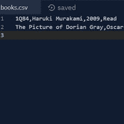

# 第 14 天项目:阅读清单(硬)|泰克拉多

> 原文：<https://blog.teclado.com/python-30-day-14-project-hard/>

欢迎来到第 14 天阅读清单项目的第二篇文章，在这里我们将处理这个项目的更难的版本。

如果你还没有尝试过这个项目的常规版本，我建议你尝试一下，因为这个版本共享了很多功能。但是，您可以在下面找到完整的简介，以及完整的模型解决方案。

## 案情摘要

对于这个较难版本的项目，应用程序需要具有以下功能:

*   用户应该能够通过提供书名、作者姓名、出版年份以及该书是否被阅读来将一本书添加到他们的阅读列表中。
*   该程序应该在一个名为`books.csv`的文件中存储所有这些书籍的信息，这些数据应该以 CSV 格式存储。
*   用户应该能够检索他们阅读列表中的书籍，并且这些书籍应该以用户友好的格式打印出来。
*   用户应该能够通过提供书名来搜索特定的书籍。
*   用户应该能够通过输入书名将一本书标记为已读。如果有多本书名相同的书，您可以将第一本匹配的书标记为已读。
*   用户应该能够通过提供他们想要删除的书的书名来从他们的阅读列表中删除书。同样，您可以删除第一本匹配的图书。
*   用户应该能够从文本菜单中选择这些选项，并且他们应该能够在不重启程序的情况下执行多个操作。你可以在 while loops(第 8 天)的文章中看到一个工作菜单的例子。#第 14 天项目:阅读清单(硬版本)

欢迎来到第 14 天阅读清单项目的第二篇文章，在这里我们将处理这个项目的更难的版本。

如果你还没有尝试过这个项目的常规版本，我建议你尝试一下，因为这个版本共享了很多功能。但是，您可以在下面找到完整的简介，以及完整的模型解决方案。

编码快乐！

## 我们的解决方案

就像这个项目的常规版本一样，第一步是在项目工作空间中创建一个`books.csv`文件。

我已经在`books.csv`文件中添加了几本示例书籍，这样我们可以更容易地测试我们的应用程序，如下图所示:不要忘记最后的空行，因为我们希望任何新添加的内容都放在它们自己的行上。

你可以随意给我用不同的书，但是如果你想用同样的书，这里有我的例子:

```
`1Q84,Haruki Murakami,2009,Read
The Picture of Dorian Gray,Oscar Wilde,1890,Not Read` 
```

现在我们已经有了`books.csv`文件，并且已经填充了一些示例书籍，让我们开始制作菜单。

因为菜单会很长，我强烈建议您将提示存储在一个变量中。否则会把菜单弄得乱七八糟。

```
`menu_prompt = """Please enter one of the following options:

- 'a' to add a book
- 'd' to delete a book
- 'l' to list the books
- 'r' to mark a book as read
- 's' to search for a book
- 'q' to quit

What would you like to do? """` 
```

菜单本身与我们之前看到的非常相似。现在，我们只是通过打印出用户选择的选项来检查事情是否正常。如果他们输入一个无效的选项，我们将在一个`else`子句中捕捉到这个问题，并打印一条消息通知他们这个问题。

```
`menu_prompt = """Please enter one of the following options:

- 'a' to add a book
- 'd' to delete a book
- 'l' to list the books
- 'r' to mark a book as read
- 's' to search for a book
- 'q' to quit

What would you like to do? """

# Get a selection from the user
selected_option = input(menu_prompt)

# Run the loop until the user selected 'q'
while selected_option != "q":
    if selected_option == "a":
        print("You selected 'a'.")
    elif selected_option == "d":
        print("You selected 'd'.")
    elif selected_option == "l":
        print("You selected 'l'.")
    elif selected_option == "r":
        print("You selected 'r'.")
    elif selected_option == "s":
        print("You selected 's'.")
    else:
        print(f"Sorry, '{selected_option}' isn't a valid option.")

    # Allow the user to change their selection at the end of each iteration
    selected_option = input(menu_prompt)` 
```

我们可以改进这个菜单的一个方法是处理用户的选择，确保去掉空格，并且大小写正确。这种额外的灵活性确实会改善用户体验。

```
`menu_prompt = """Please enter one of the following options:

- 'a' to add a book
- 'd' to delete a book
- 'l' to list the books
- 'r' to mark a book as read
- 's' to search for a book
- 'q' to quit

What would you like to do? """

# Get a selection from the user
selected_option = input(menu_prompt).strip().lower()

# Run the loop until the user selected 'q'
while selected_option != "q":
    if selected_option == "a":
        print("You selected 'a'.")
    elif selected_option == "d":
        print("You selected 'd'.")
    elif selected_option == "l":
        print("You selected 'l'.")
    elif selected_option == "r":
        print("You selected 'r'.")
    elif selected_option == "s":
        print("You selected 's'.")
    else:
        print(f"Sorry, '{selected_option}' isn't a valid option.")

    # Allow the user to change their selection at the end of each iteration
    selected_option = input(menu_prompt).strip().lower()` 
```

此时测试菜单以确保一切正常是个好主意。一旦你满意了，我们就可以开始添加功能，从把书添加到阅读列表开始。

这个函数需要做几件事:

1.  它需要从用户那里获得一些信息。
2.  它需要将这些信息以正确的格式放入我们的文件中。
3.  它需要将这些信息写到文件的末尾。

我假设用户添加到阅读列表中的书还没有被阅读过，所以我只从用户那里获取书名、作者和出版年份。

然后，我将使用上下文管理器在 append 模式(`"a"`)下打开该文件，并且我将使用 f 字符串格式化我们想要写入的字符串。

```
`def add_book():
    title = input("Title: ").strip().title()
    author = input("Author: ").strip().title()
    year = input("Year of publication: ").strip()

    with open("books.csv", "a") as reading_list:
        reading_list.write(f"{title},{author},{year},Not Read\n")` 
```

如您所见，我还对用户输入做了一些处理，只是为了确保以后检索时格式正确。

现在我们已经写好了函数，我们可以在菜单中调用它并进行测试。

```
`def add_book():
    title = input("Title: ").strip().title()
    author = input("Author: ").strip().title()
    year = input("Year of publication: ").strip()

    with open("books.csv", "a") as reading_list:
        reading_list.write(f"{title},{author},{year},Not Read\n")

menu_prompt = """Please enter one of the following options:

- 'a' to add a book
- 'd' to delete a book
- 'l' to list the books
- 'r' to mark a book as read
- 's' to search for a book
- 'q' to quit

What would you like to do? """

# Get a selection from the user
selected_option = input(menu_prompt).strip().lower()

# Run the loop until the user selected 'q'
while selected_option != "q":
    if selected_option == "a":
        add_book()
    elif selected_option == "d":
        print("You selected 'd'.")
    elif selected_option == "l":
        print("You selected 'l'.")
    elif selected_option == "r":
        print("You selected 'r'.")
    elif selected_option == "s":
        print("You selected 's'.")
    else:
        print(f"Sorry, '{selected_option}' isn't a valid option.")

    # Allow the user to change their selection at the end of each iteration
    selected_option = input(menu_prompt).strip().lower()` 
```

我们现在应该能够将书籍添加到`books.csv`文件中。尝试几次，并查看文件，看看是否所有内容都添加正确。如果您没有发现任何问题，我们可以进入下一个功能。

下一个函数我们将编写一个小的帮助函数来从`books.csv`文件中获取我们的图书数据。目标是将文件的每一行都转换成一个字典，这样我们就可以更容易地在应用程序中处理数据。我要把这个函数叫做`get_all_books`。

为了将每一行转换成字典，我将使用`split`方法根据逗号分隔数据。然后，我们可以获取结果值，并创建一个字典，将这些值映射到适当的键。

然后，我们可以通过将这些字典附加到一个列表中来收集它们，然后我们可以从函数中返回这个列表。

```
`# Helper function for retrieving data from the csv file
def get_all_books():
    books = []

    with open("books.csv", "r") as reading_list:
        for book in reading_list:
            # Extracts the values from the CSV data
            title, author, year = book.strip().split(",")

            # Creates a dictionary from the csv data and adds it to the books list
            books.append({
                "title": title,
                "author": author,
                "year": year
            })

    return books` 
```

接下来，我认为我们应该着手印刷我们的书。我要调用这个函数`show_books`。

这个函数实际上会带一个参数，因为我希望它不仅可以用于整个阅读列表，还可以用于我们通过搜索找到的书籍的子集。

当用户从菜单中选择`"l"`时，我们将首先使用新的`get_all_books`函数收集整个阅读列表，并将结果传递给`show_books`以获得一些不错的输出。

```
`def add_book():
    title = input("Title: ").strip().title()
    author = input("Author: ").strip().title()
    year = input("Year of publication: ").strip()

    with open("books.csv", "a") as reading_list:
        reading_list.write(f"{title},{author},{year},Not Read\n")

# Helper function for retrieving data from the csv file
def get_all_books():
    books = []

    with open("books.csv", "r") as reading_list:
        for book in reading_list:
            # Extracts the values from the CSV data
            title, author, year, read_status = book.strip().split(",")

            # Creates a dictionary from the csv data and adds it to the books list
            books.append({
                "title": title,
                "author": author,
                "year": year,
                "read": read_status
            })

    return books

def show_books(books):
    # Adds an empty line before the output
    print()

    for book in books:
        print(f"{book['title']}, by {book['author']} ({book['year']}) - {book['read']}")

    print()

menu_prompt = """Please enter one of the following options:

- 'a' to add a book
- 'd' to delete a book
- 'l' to list the books
- 'r' to mark a book as read
- 's' to search for a book
- 'q' to quit

What would you like to do? """

# Get a selection from the user
selected_option = input(menu_prompt).strip().lower()

# Run the loop until the user selected 'q'
while selected_option != "q":
    if selected_option == "a":
        add_book()
    elif selected_option == "d":
        print("You selected 'd'.")
    elif selected_option == "l":
        # Retrieves the whole reading list for printing
        reading_list = get_all_books()
        show_books(reading_list)
    elif selected_option == "r":
        print("You selected 'r'.")
    elif selected_option == "s":
        print("You selected 's'.")
    else:
        print(f"Sorry, '{selected_option}' isn't a valid option.")

    # Allow the user to change their selection at the end of each iteration
    selected_option = input(menu_prompt).strip().lower()` 
```

我们必须注意的一个小问题是，当阅读列表为空时，用户试图查看他们的阅读列表。

我认为这里一个好的方法是检查变量`reading_list`的真值，如果`reading_list`有内容就只调用`show_books`。

```
`elif selected_option == "l":
    # Retrieves the whole reading list for printing
    reading_list = get_all_books()

    # Check that reading_list contains at least one book
    if reading_list:
        show_books(reading_list)
    else:
        print("Your reading list is empty.")` 
```

我们应该再次检查所有这些工作，然后我们可以处理搜索功能。

对于我的搜索功能的实现，如果用户的搜索词是书名的子字符串，我将认为一本书是匹配的。换句话说，如果用户输入部分匹配，比如`1Q`，我将返回`1Q84`。如果一个搜索词匹配几本书，我将提供所有这些匹配的书。

这个函数不会做的一件事是打印出匹配的书籍:我们只是返回书籍，并让我们的`show_books`函数处理输出。这将允许我们在删除书籍并将它们标记为已读时重用这一搜索功能。

第一步是调用我们的`get_all_books`函数，这样我们在过滤时就有了一个集合。我还将创建一个名为`matching_books`的空列表。这是我们要放符合我们搜索条件的书的地方。

```
`def find_books():
    reading_list = get_all_books()
    matching_books = []` 
```

现在我们需要从用户那里获取我们的搜索词。像往常一样，我们将去掉结果字符串中的任何空白，但是我们也将把字符串转换成小写。

在比较术语时，我们还将把书名转换成小写，这将允许我们匹配大小写与用户指定不同的书籍。

```
`def find_books():
    reading_list = get_all_books()
    matching_books = []

    search_term = input("Please enter a book title: ").strip().lower()` 
```

现在进行实际的过滤。这里我们将使用一个`for`循环来迭代书籍。然后，我们将把每本书追加到`matching_books`中，如果它们满足某个条件的话。

对于该条件，我们将使用`in`关键字，它将告诉我们搜索词是否包含在书名中。

```
`def find_books():
    reading_list = get_all_books()
    matching_books = []

    search_term = input("Please enter a book title: ").strip().lower()

    for book in reading_list:
        if search_term in book["title"].lower():
            matching_books.append(book)` 
```

现在我们有了匹配书籍的列表，我们可以将其退回。

```
`def find_books():
    reading_list = get_all_books()
    matching_books = []

    search_term = input("Please enter a book title: ").strip().lower()

    for book in reading_list:
        if search_term in book["title"].lower():
            matching_books.append(book)

    return matching_books` 
```

在菜单内部，我们将采取与我们在条件语句的`"l"`分支中所做的相似的方法。首先我们将调用`find_books`来获取匹配的书籍。如果我们有匹配的书籍，我们将把列表传递给`show_books`，否则我们将打印一条消息说我们没有找到任何东西。

```
`def add_book():
    title = input("Title: ").strip().title()
    author = input("Author: ").strip().title()
    year = input("Year of publication: ").strip()

    with open("books.csv", "a") as reading_list:
        reading_list.write(f"{title},{author},{year},Not Read\n")

def find_books():
    reading_list = get_all_books()
    matching_books = []

    search_term = input("Please enter a book title: ").strip().lower()

    for book in reading_list:
        if search_term in book["title"].lower():
            matching_books.append(book)

    return matching_books

# Helper function for retrieving data from the csv file
def get_all_books():
    books = []

    with open("books.csv", "r") as reading_list:
        for book in reading_list:
            # Extracts the values from the CSV data
            title, author, year, read_status = book.strip().split(",")

            # Creates a dictionary from the csv data and adds it to the books list
            books.append({
                "title": title,
                "author": author,
                "year": year,
                "read": read_status
            })

    return books

def show_books(books):
    # Adds an empty line before the output
    print()

    for book in books:
        print(f"{book['title']}, by {book['author']} ({book['year']}) - {book['read']}")

    print()

menu_prompt = """Please enter one of the following options:

- 'a' to add a book
- 'd' to delete a book
- 'l' to list the books
- 'r' to mark a book as read
- 's' to search for a book
- 'q' to quit

What would you like to do? """

# Get a selection from the user
selected_option = input(menu_prompt).strip().lower()

# Run the loop until the user selected 'q'
while selected_option != "q":
    if selected_option == "a":
        add_book()
    elif selected_option == "d":
        print("You selected 'd'.")
    elif selected_option == "l":
        # Retrieves the whole reading list for printing
        reading_list = get_all_books()

        # Check that reading_list contains at least one book
        if reading_list:
            show_books(reading_list)
        else:
            print("Your reading list is empty.")
    elif selected_option == "r":
        print("You selected 'r'.")
    elif selected_option == "s":
        matching_books = find_books()

        # Checks that the seach returned at least one book
        if matching_books:
            show_books(matching_books)
        else:
            print("Sorry, we didn't find any books for that search term")
    else:
        print(f"Sorry, '{selected_option}' isn't a valid option.")

    # Allow the user to change their selection at the end of each iteration
    selected_option = input(menu_prompt).strip().lower()` 
```

接下来，让我们解决删除书籍的问题。我将这样处理它:

1.  我要用`get_all_books`抓取整个阅读列表。

2.  我将使用`find_books`函数来获取与用户想要删除的书名相匹配的图书列表。

3.  我将检查这个搜索是否至少返回了一个值，如果是，我将从阅读列表中删除这个集合中的第一个值。如果没有，我会让用户知道我们没有找到任何匹配的书籍。

4.  我将以写模式打开`books.csv`文件，并将所有剩余的书籍添加回该文件。

```
`def delete_book():
    books = get_all_books()
    matching_books = find_books()

    if matching_books:
        books.remove(matching_books[0])

        with open("books.csv", "w") as reading_list:
            for book in books:
                reading_list.write(f"{book['title']},{book['author']},{book['year']},{book['read']}\n")
    else:
        print("Sorry, we didn't find any books matching that title.")` 
```

现在我们只需要在条件语句的`"d"`分支中调用菜单中的`delete_book`。

我们将使用非常相似的方法来更新书籍的阅读状态。主要区别是我们要找出匹配书的索引，然后我们要更新它的值。

```
`def mark_book_as_read():
    books = get_all_books()
    matching_books = find_books()

    if matching_books:
        index = books.index(matching_books[0])
        books[index]['read'] = "Read"

        with open("books.csv", "w") as reading_list:
            for book in books:
                reading_list.write(f"{book['title']},{book['author']},{book['year']},{book['read']}\\n")
    else:
        print("Sorry, we didn't find any books matching that title.")` 
```

另一种方法是在迭代`books`列表时检查匹配的图书。当我们找到想要更新的书时，我们可以向文件中写入一个不同的字符串。

然而，我们上面采用的方法的好处是，我们现在有两个基本相同的函数。这允许我们做一些重构来减少重复。

让我们创建一个名为`update_reading_list`的函数来代替这两个函数。这个函数会有点特别，因为我们要传入另一个函数作为参数。

然后我们将削减`delete_book`和`mark_book_as_read`来处理一个非常小的操作。

```
`def delete_book(books, book_to_delete):
    books.remove(book_to_delete)

def mark_book_as_read(books, book_to_update):
    index = books.index(book_to_update)
    books[index]['read'] = "Read"

def update_reading_list(operation):
    books = get_all_books()
    matching_books = find_books()

    if matching_books:
        operation(books, matching_books[0])

        with open("books.csv", "w") as reading_list:
            for book in books:
                reading_list.write(f"{book['title']},{book['author']},{book['year']},{book['read']}\\n")
    else:
        print("Sorry, we didn't find any books matching that title.")` 
```

完成这一步后，如果你觉得有点失落，也不要担心。这涉及到一些更复杂的技术，如果您想坚持使用有一些重复代码的版本，这完全没问题。

至此，我们已经实现了所有需要的功能，完成的程序如下所示:

```
`def add_book():
    title = input("Title: ").strip().title()
    author = input("Author: ").strip().title()
    year = input("Year of publication: ").strip()

    with open("books.csv", "a") as reading_list:
        reading_list.write(f"{title},{author},{year},Not Read\n")

def delete_book(books, book_to_delete):
    books.remove(book_to_delete)

def find_books():
    reading_list = get_all_books()
    matching_books = []

    search_term = input("Please enter a book title: ").strip().lower()

    for book in reading_list:
        if search_term in book["title"].lower():
            matching_books.append(book)

    return matching_books

# Helper function for retrieving data from the csv file
def get_all_books():
    books = []

    with open("books.csv", "r") as reading_list:
        for book in reading_list:
            # Extracts the values from the CSV data
            title, author, year, read_status = book.strip().split(",")

            # Creates a dictionary from the csv data and adds it to the books list
            books.append({
                "title": title,
                "author": author,
                "year": year,
                "read": read_status
            })

    return books

def mark_book_as_read(books, book_to_update):
    index = books.index(book_to_update)
    books[index]['read'] = "Read"

def update_reading_list(operation):
    books = get_all_books()
    matching_books = find_books()

    if matching_books:
        operation(books, matching_books[0])

        with open("books.csv", "w") as reading_list:
            for book in books:
                reading_list.write(f"{book['title']},{book['author']},{book['year']},{book['read']}\n")
    else:
        print("Sorry, we didn't find any books matching that title.")

def show_books(books):
    # Adds an empty line before the output
    print()

    for book in books:
        print(f"{book['title']}, by {book['author']} ({book['year']}) - {book['read']}")

    print()

menu_prompt = """Please enter one of the following options:

- 'a' to add a book
- 'd' to delete a book
- 'l' to list the books
- 'r' to mark a book as read
- 's' to search for a book
- 'q' to quit

What would you like to do? """

# Get a selection from the user
selected_option = input(menu_prompt).strip().lower()

# Run the loop until the user selected 'q'
while selected_option != "q":
    if selected_option == "a":
        add_book()
    elif selected_option == "d":
        update_reading_list(delete_book)
    elif selected_option == "l":
        # Retrieves the whole reading list for printing
        reading_list = get_all_books()

        # Check that reading_list contains at least one book
        if reading_list:
            show_books(reading_list)
        else:
            print("Your reading list is empty.")
    elif selected_option == "r":
        update_reading_list(mark_book_as_read)
    elif selected_option == "s":
        matching_books = find_books()

        # Checks that the seach returned at least one book
        if matching_books:
            show_books(matching_books)
        else:
            print("Sorry, we didn't find any books for that search term")
    else:
        print(f"Sorry, '{selected_option}' isn't a valid option.")

    # Allow the user to change their selection at the end of each iteration
    selected_option = input(menu_prompt).strip().lower()` 
```

如果你想在这方面继续努力，我们还有很多可以改进的地方，所以请自便吧！

## 额外资源

您可以在[官方文档](https://docs.python.org/3/tutorial/datastructures.html#data-structures)中找到关于本解决方案中使用的`index`方法的更多信息。

Python 3.8 中还有一种新的语法，叫做赋值表达式。你可以在我们的博客上读到这个[。在这个解决方案中，有很多地方我们可以使用赋值表达式，所以你可能想自己尝试一下。](https://blog.teclado.com/python-assignment-expressions/)