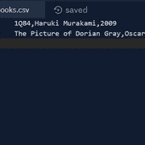

# 第 14 天项目:阅读清单|泰克拉多

> 原文：<https://blog.teclado.com/python-30-day-14-project-regular/>

欢迎来到 Python 系列 [30 天的第二个周末项目！这次我们要创建一个程序，它可以存储和检索与用户阅读列表相关的信息。](https://blog.teclado.com/30-days-of-python)

我们在第 12 天的早些时候解决了类似的问题，但今天我们将添加更多的功能，并将他们的数据永久存储在一个文件中！这样，即使在他们关闭程序后，我们也能重新加载他们的数据。

下面是完整的项目简介以及我们解决方案的演示。像往常一样，有许多方法来处理这样的问题，所以如果你的解决方案与我们的略有不同，请不要担心。

## 案情摘要

对于这个项目，应用程序需要具有以下功能:

*   用户应该能够通过提供书名、作者姓名和出版年份将一本书添加到他们的阅读列表中。
*   该程序应该在一个名为`books.csv`的文件中存储所有这些书籍的信息，这些数据应该以 CSV 格式存储。
*   用户应该能够检索他们阅读列表中的书籍，并且这些书籍应该以用户友好的格式打印出来。
*   用户应该能够通过提供书名来搜索特定的书籍。
*   用户应该能够从文本菜单中选择这些选项，并且他们应该能够在不重启程序的情况下执行多个操作。你可以在 while loops(第 8 天)的文章中看到一个工作菜单的例子。

这个项目比我们以前处理过的项目要大得多，所以要确保一次处理一个项目。

如果你想挑战自己，我们也有这个项目的[一个稍微难一点的版本](/30-days-of-python/python-30-day-14-project-hard/)，你可以试试，它有额外的功能。

祝你好运，希望你玩得开心！

## 我们的解决方案

你可以在下面找到我们的演练。如果你想要一个[视频演示](https://youtu.be/afdCyIwsWiQ)，试试吧！

对于这个项目，我们需要采取的第一步是在项目工作空间中创建一个`books.csv`文件。

实际上，我打算在我的书里增加几本测试书，我建议你也这样做。这将使测试我们程序的各个方面变得更加容易，比如搜索和打印书籍，而不必每次都手动添加书籍。

因此，我的 repl 应该是这样的:正如你所看到的，我的`books.csv`文件中有两本书，最后有一个空行。这将使我们以后的工作更容易。

如果你想用和我一样的书，这里有数据:

```
`1Q84,Haruki Murakami,2009
The Picture of Dorian Gray,Oscar Wilde,1890` 
```

现在我们已经有了我们需要的一切，我认为我们应该处理的第一个功能是菜单。

因为我们的菜单有很多选项，我认为我们应该把提示写成一个多行字符串，并把它存储为一个变量。当我们想让用户选择一个菜单选项时，我们可以将这个变量传递给`input`函数。这将使我们的菜单更加整洁。

```
`menu_prompt = """Please enter one of the following options:

- 'a' to add a book
- 'l' to list the books
- 's' to search for a book
- 'q' to quit

What would you like to do? """` 
```

您可以为提示写些什么，但是我们应该为用户提供一个详尽的选项列表。目前我们没有处理这个项目的更难的版本，所以我们只是提供添加、查看和搜索书籍的选项。

现在我们有了一个提示，我们可以创建菜单的框架了:

```
`menu_prompt = """Please enter one of the following options:

- 'a' to add a book
- 'l' to list the books
- 's' to search for a book
- 'q' to quit

What would you like to do? """

# Get a selection from the user
selected_option = input(menu_prompt)

# Run the loop until the user selected 'q'
while selected_option != "q":
    if selected_option == "a":
        print("You selected 'a'.")
    elif selected_option == "l":
        print("You selected 'l'.")
    elif selected_option == "s":
        print("You selected 's'.")

    # Allow the user to change their selection at the end of each iteration
    selected_option = input(menu_prompt)` 
```

现在我们只是打印选择，这允许我们测试一切都在工作。

目前还缺少一些东西，我认为我们应该加以补充。首先，如果用户选择了无效选项，我们目前不会通知用户。我认为这将改善用户体验，因为如果用户只是被提示一个新选项而没有任何解释，这可能会令人困惑。

第二个问题是，目前我们对用户的错误不是很宽容。如果他们输入的是`"A"`而不是`"a"`，我们不会处理他们的请求，尽管用户的意图非常清楚。我们也不允许输入空格，所以`"a "`无效。

我们可以通过使用可信的`strip`和`lower`方法来处理从用户那里得到的字符串，从而解决这两个问题。

```
`menu_prompt = """Please enter one of the following options:

- 'a' to add a book
- 'l' to list the books
- 's' to search for a book
- 'q' to quit

What would you like to do? """

# Get a selection from the user
selected_option = input(menu_prompt).strip().lower()

# Run the loop until the user selected 'q'
while selected_option != "q":
    if selected_option == "a":
        print("You selected 'a'.")
    elif selected_option == "l":
        print("You selected 'l'.")
    elif selected_option == "s":
        print("You selected 's'.")
    else:
        print(f"Sorry, '{selected_option}' isn't a valid option.")

    # Allow the user to change their selection at the end of each iteration
    selected_option = input(menu_prompt).strip().lower()` 
```

确保您测试了菜单，如果一切正常，我们可以定义我们的函数来将书籍添加到阅读列表中。

我将调用这个函数`add_book`，但是可以随意选择另一个名称，只要它能充分描述这个函数。

这个函数需要做几件事:

1.  它需要从用户那里获得一些信息。
2.  它需要将这些信息以正确的格式放入我们的文件中。
3.  它需要将这些信息写到文件的末尾。

让我们从获取用户输入开始，用对`add_book`的调用替换菜单中的`print("You selected 'a'.")`行。

```
`def add_book():
    title = input("Title: ")
    author = input("Author: ")
    year = input("Year of publication: ")

menu_prompt = """Please enter one of the following options:

- 'a' to add a book
- 'l' to list the books
- 's' to search for a book
- 'q' to quit

What would you like to do? """

# Get a selection from the user
selected_option = input(menu_prompt).strip().lower()

# Run the loop until the user selected 'q'
while selected_option != "q":
    if selected_option == "a":
        add_book()
    elif selected_option == "l":
        print("You selected 'l'.")
    elif selected_option == "s":
        print("You selected 's'.")
    else:
        print(f"Sorry, '{selected_option}' isn't a valid option.")

    # Allow the user to change their selection at the end of each iteration
    selected_option = input(menu_prompt).strip().lower()` 
```

这是测试一切正常的另一个好方法。假设我们没有任何问题，我们可以格式化数据以匹配`books.csv`中的其余书籍，我们可以稍微处理用户输入。

```
`def add_book():
    title = input("Title: ").strip().title()
    author = input("Author: ").strip().title()
    year = input("Year of publication: ").strip()

    book = f"{title},{author},{year}\n"` 
```

注意，我在行尾添加了一个换行符。这确保了我们添加的下一本书自成一行。

现在我们有了正确格式化的字符串，我们可以将它写入`books.csv`。这里我将使用一个上下文管理器，但是如果您还不习惯这种方法，可以随意手动打开和关闭文件。

当打开文件时，我们将在追加模式(`"a"`)下这样做，这意味着我们的数据将被写入现有文件内容的末尾。

```
`def add_book():
    title = input("Title: ").strip().title()
    author = input("Author: ").strip().title()
    year = input("Year of publication: ").strip()

    book = f"{title},{author},{year}\n"

    with open("books.csv", "a") as reading_list:
        reading_list.write(book)` 
```

我们可以通过将 f 字符串直接写在`write`调用中来将它缩短一点:

```
`def add_book():
    title = input("Title: ").strip().title()
    author = input("Author: ").strip().title()
    year = input("Year of publication: ").strip()

    with open("books.csv", "a") as reading_list:
        reading_list.write(f"{title},{author},{year}\n")` 
```

有了这些，我们应该可以给`books.csv`增加新书了。试试吧！

接下来，我们将编写一个小的助手函数来从`books.csv`文件中获取我们的图书数据。目标是将文件的每一行都转换成一个字典，这样我们就可以更容易地在应用程序中处理数据。我要把这个函数叫做`get_all_books`。

为了将每一行转换成字典，我将使用`split`方法根据逗号分隔数据。然后，我们可以获取结果值，并创建一个字典，将这些值映射到适当的键。

然后，我们可以通过将这些字典附加到一个列表中来收集它们，然后我们可以从函数中返回这个列表。

```
`# Helper function for retrieving data from the csv file
def get_all_books():
    books = []

    with open("books.csv", "r") as reading_list:
        for book in reading_list:
            # Extracts the values from the CSV data
            title, author, year = book.strip().split(",")

            # Creates a dictionary from the csv data and adds it to the books list
            books.append({
                "title": title,
                "author": author,
                "year": year
            })

    return books` 
```

接下来，我认为我们应该着手印刷我们的书。我要调用这个函数`show_books`。

这个函数实际上会带一个参数，因为我希望它不仅可以用于整个阅读列表，还可以用于我们通过搜索找到的书籍的子集。

当用户从菜单中选择`"l"`时，我们将首先使用新的`get_all_books`函数收集整个阅读列表，并将结果传递给`show_books`以获得一些不错的输出。

```
`def add_book():
    title = input("Title: ").strip().title()
    author = input("Author: ").strip().title()
    year = input("Year of publication: ").strip()

    with open("books.csv", "a") as reading_list:
        reading_list.write(f"{title},{author},{year}\n")

# Helper function for retrieving data from the csv file
def get_all_books():
    books = []

    with open("books.csv", "r") as reading_list:
        for book in reading_list:
            # Extracts the values from the CSV data
            title, author, year = book.strip().split(",")

            # Creates a dictionary from the csv data and adds it to the books list
            books.append({
                "title": title,
                "author": author,
                "year": year
            })

    return books

def show_books(books):
    # Adds an empty line before the output
    print()

    for book in books:
        print(f"{book['title']}, by {book['author']} ({book['year']})")

    print()

menu_prompt = """Please enter one of the following options:

- 'a' to add a book
- 'l' to list the books
- 's' to search for a book
- 'q' to quit

What would you like to do? """

# Get a selection from the user
selected_option = input(menu_prompt).strip().lower()

# Run the loop until the user selected 'q'
while selected_option != "q":
    if selected_option == "a":
        add_book()
    elif selected_option == "l":
        # Retrieves the whole reading list for printing
        reading_list = get_all_books()
        show_books(reading_list)
    elif selected_option == "s":
        print("You selected 's'.")
    else:
        print(f"Sorry, '{selected_option}' isn't a valid option.")

    # Allow the user to change their selection at the end of each iteration
    selected_option = input(menu_prompt).strip().lower()` 
```

我们必须注意的一个小问题是，当阅读列表为空时，用户试图查看他们的阅读列表。

我认为这里一个好的方法是检查变量`reading_list`的真值，如果`reading_list`有内容就只调用`show_books`。

```
`elif selected_option == "l":
    # Retrieves the whole reading list for printing
    reading_list = get_all_books()

    # Check that reading_list contains at least one book
    if reading_list:
        show_books(reading_list)
    else:
        print("Your reading list is empty.")` 
```

我们应该再次检查所有这些工作，然后我们可以解决最后一个问题:搜索功能。

对于搜索功能，我要解决的方法是，如果用户的搜索词是书名的子字符串，我就认为这本书是匹配的。换句话说，如果用户输入部分匹配，比如`1Q`，我将返回`1Q84`。如果我们得到几个匹配，我还将提供多个结果。

第一步是调用我们的`get_all_books`函数，这样我们在过滤时就有了一个集合。我还将创建一个名为`matching_books`的空列表。这是我们要放符合我们搜索条件的书的地方。

```
`def find_books():
    reading_list = get_all_books()
    matching_books = []` 
```

现在我们需要从用户那里获取我们的搜索词。像往常一样，我们将去掉结果字符串中的任何空白，但是我们也将把字符串转换成小写。

在比较术语时，我们还将把书名转换成小写，这将允许我们匹配大小写与用户指定不同的书籍。

```
`def find_books():
    reading_list = get_all_books()
    matching_books = []

    search_term = input("Please enter a book title to search for: ").strip().lower()` 
```

现在进行实际的过滤。这里我们将使用一个`for`循环来迭代书籍。然后，我们将把每本书追加到`matching_books`中，如果它们满足某个条件的话。

对于该条件，我们将使用`in`关键字，它将告诉我们搜索词是否包含在书名中。

```
`def find_books():
    reading_list = get_all_books()
    matching_books = []

    search_term = input("Please enter a book title to search for: ").strip().lower()

    for book in reading_list:
        if search_term in book["title"].lower():
            matching_books.append(book)` 
```

现在我们要做出选择。是否应该在`find_books`函数内部调用`show_books`？或者我们应该返回这些值并在别处调用`show_books`函数？

在我看来，我们应该做后者。我们创建的这个函数非常有用，但是有些情况下我们可能会使用这个函数而不想打印结果。因此，我认为我们最好把这个功能完全集中在过滤书籍上。

现在，我们可以采用与菜单的`"l"`分支相似的方法。

```
`def add_book():
    title = input("Title: ").strip().title()
    author = input("Author: ").strip().title()
    year = input("Year of publication: ").strip()

    with open("books.csv", "a") as reading_list:
        reading_list.write(f"{title},{author},{year}\n")

def find_books():
    reading_list = get_all_books()
    matching_books = []

    search_term = input("Please enter a book title to search for: ").strip().lower()

    for book in reading_list:
        if search_term in book["title"].lower():
            matching_books.append(book)

    return matching_books

# Helper function for retrieving data from the csv file
def get_all_books():
    books = []

    with open("books.csv", "r") as reading_list:
        for book in reading_list:
            # Extracts the values from the CSV data
            title, author, year = book.strip().split(",")

            # Creates a dictionary from the csv data and adds it to the books list
            books.append({
                "title": title,
                "author": author,
                "year": year
            })

    return books

def show_books(books):
    # Adds an empty line before the output
    print()

    for book in books:
        print(f"{book['title']}, by {book['author']} ({book['year']})")

    print()

menu_prompt = """Please enter one of the following options:

- 'a' to add a book
- 'l' to list the books
- 's' to search for a book
- 'q' to quit

What would you like to do? """

# Get a selection from the user
selected_option = input(menu_prompt).strip().lower()

# Run the loop until the user selected 'q'
while selected_option != "q":
    if selected_option == "a":
        add_book()
    elif selected_option == "l":
        # Retrieves the whole reading list for printing
        reading_list = get_all_books()

        # Check that reading_list contains at least one book
        if reading_list:
            show_books(reading_list)
        else:
            print("Your reading list is empty.")
    elif selected_option == "s":
        matching_books = find_books()

        # Checks that the seach returned at least one book
        if matching_books:
            show_books(matching_books)
        else:
            print("Sorry, we didn't find any books for that search term.")
    else:
        print(f"Sorry, '{selected_option}' isn't a valid option.")

    # Allow the user to change their selection at the end of each iteration
    selected_option = input(menu_prompt).strip().lower()` 
```

加上这最后一项，我们就完成了！

## 奖励材料

如果你想挑战自己，你应该试试这个项目的更难版本。如果你卡住了，我们有第二个版本的专用演练。