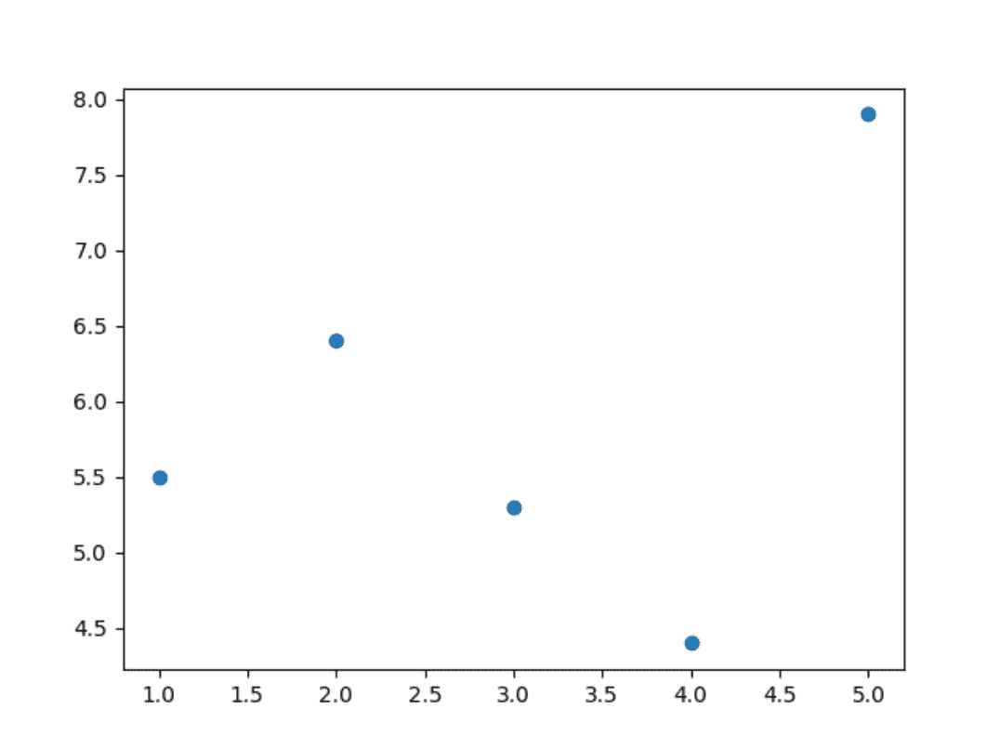
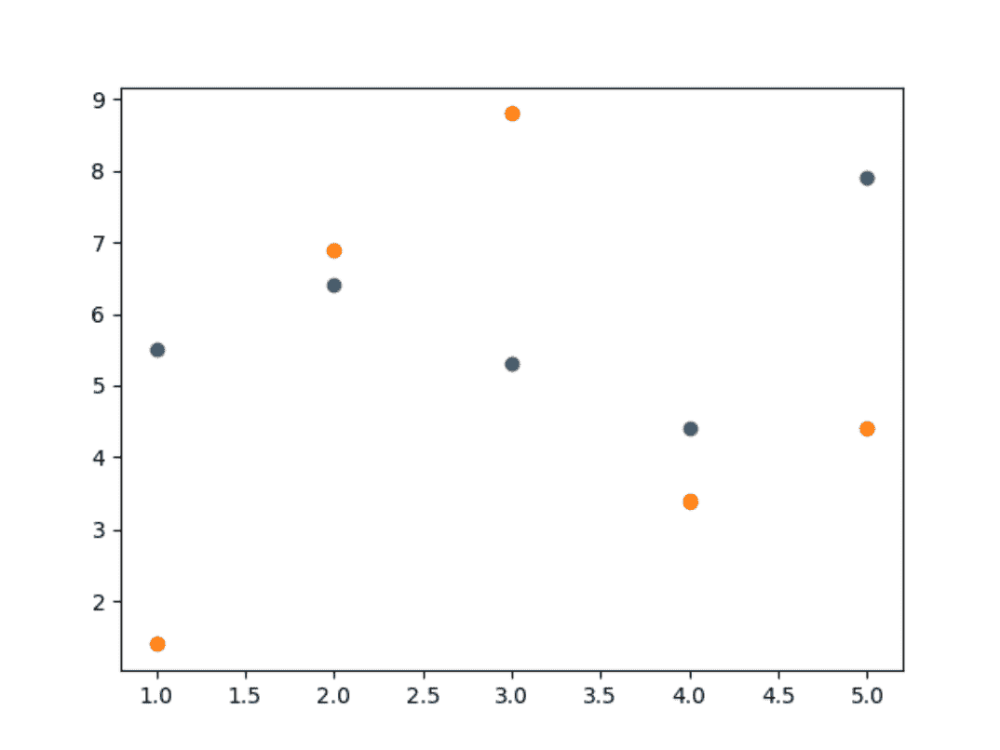
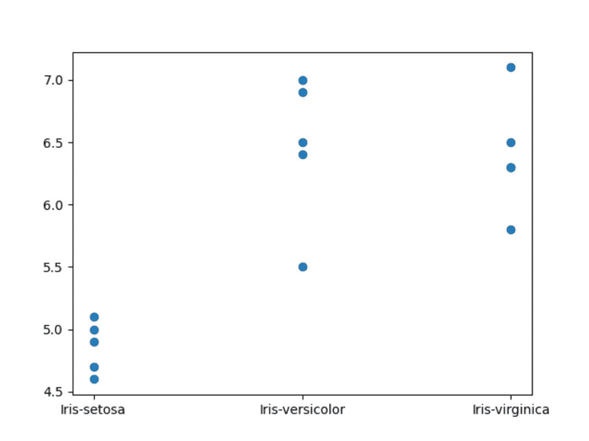

# 第 21 天项目:绘制图表

> 原文：<https://blog.teclado.com/python-30-day-21-project/>

欢迎来到 Python 系列 [30 天](https://blog.teclado.com/30-days-of-python/)[第 21](/30-days-of-python/python-30-day-21-multiple-files) 天项目！今天，我们将构建一个多文件应用程序，允许用户为来自[第 14 天](/30-days-of-python/python-30-day-14-files)的花卉数据创建图表。

我们要做的很多工作都围绕着如何很好地构建我们的应用程序，以便我们可以轻松地开发它。然而，我们也需要学习如何创建图表！为此，我们将使用`matplotlib`模块。具体来说就是`pyplot`子模块，它让绘制简单的图形变得很容易！

在我们讨论项目简介之前，让我们来看看如何使用`matplotlib.pyplot`创建一个简单的图表。

还记得我们已经得到了[视频版本](https://youtu.be/LEcaLU-DNtg)的演练。

## 绘制图表

关于`matplotlib.pyplot`还有很多要学的，但幸运的是，对我们来说，记下基础知识并创建一些简单的图表是相当简单的。

开始使用`pyplot`的第一件事是导入它。我推荐这样导入:

```py
`from matplotlib import pyplot` 
```

如果你正在使用 [repl.it](http://repl.it) ，这应该会自动工作。如果你在自己的电脑上运行 Python，你必须安装`matplotlib`才能运行。使用 [repl.it](http://repl.it) 的好处之一！

你可以在这里找到安装指南[。](https://matplotlib.org/users/installing.html)

现在我们已经可以访问`pyplot`，我们可以用它来画一个图。

对于我们的数据集，我们将使用散点图，看起来像这样:下面是我们如何用`pyplot`绘制一个简单的散点图:

```py
`from matplotlib import pyplot

x_data = [1, 2, 3, 4, 5]
y_data = [5.5, 6.4, 5.3, 4.4, 7.9]

pyplot.scatter(x_data, y_data)
pyplot.savefig("graph.png")` 
```

如果您输入并运行它，您会看到一个新文件出现在您的 [repl.it](http://repl.it) 项目中，名为`graph.png`。这就是包含`pyplot`输出的图像文件。

除了导入`pyplot`，我们所做的是:

*   定义要绘制的 **x** 和 **y** 值。
*   告诉`pyplot`用这些数据画一个散点图。
*   告诉`pyplot`将生成的输出保存到文件中。

### 要绘制的值

我们已经定义了两个列表变量`x_data`和`y_data`。每个包含 5 个值。

创建散点图时，`pyplot`取`x_data`的第一个值和`y_data`的第一个值，并在它们指定的位置画一个小圆。然后重复第二个值，然后是第三个值。

因此，`x_data`和`y_data`的长度必须相同。否则你可能会得到一些有 **x** 位置而没有 **y** 位置的点！

### 定义轴

请注意，我们从未告诉过`pyplot`轴应该有多大。它会根据绘制的最大值自动计算每个轴的大小。

如果我们绘制的数值是数字，可以这样做。如果我们绘制字符串，它就做不到这一点，因为它不知道如何获得字符串列表的最大值。

### 创建多个图表

当你一遍又一遍地要求用户为他们创建新的图表和新的文件时，你可能会遇到一个问题:`pyplot`默认情况下会向现有的图表添加新的数据点，而不是创建新的图表。

如果我们像这样运行:

```py
`from matplotlib import pyplot

x_data = [1, 2, 3, 4, 5]
y_data = [5.5, 6.4, 5.3, 4.4, 7.9]

pyplot.scatter(x_data, y_data)
pyplot.savefig("graph.png")

y_data = [1.4, 6.9, 8.8, 3.4, 4.4]

pyplot.scatter(x_data, y_data)
pyplot.savefig("graph.png")` 
```

文件`graph.png`将只存在一次，因为我们覆盖了它。然而，它将包含两个`y_data`变量的数据，就像这样:这是因为默认情况下，`pyplot`创建一个*图*:一个绘制图表的地方。

如果我们想每次都创建单独的图表，我们必须告诉它在创建图表之前创建一个新的图形:

```py
`from matplotlib import pyplot

x_data = [1, 2, 3, 4, 5]
y_data = [5.5, 6.4, 5.3, 4.4, 7.9]

figure = pyplot.figure()
pyplot.scatter(x_data, y_data)
figure.savefig("graph.png")

y_data = [1.4, 6.9, 8.8, 3.4, 4.4]

figure = pyplot.figure()
pyplot.scatter(x_data, y_data)
figure.savefig("graph.png")` 
```

通过这样做，`pyplot`创建一个新图形并自动“选择”它。然后当我们`.scatter()`的时候，它就借鉴了那个图。然后我们做`figure.savefig()`，这就创建了图像文件。

## 案情摘要

在我们开发这个应用程序时，请记住，要绘制散点图，我们只需要我们想要绘制的 **x** 和 **y** 值。我们将编写的大部分代码都与获取这些数据有关，因此我们只需几行代码就可以轻松地绘制出图表。

首先，你可能要创建一个文件，命名为`iris.csv`。使其包含以下数据:

```py
`sepal_length,sepal_width,petal_length,petal_width,species
5.1,3.5,1.4,0.2,Iris-setosa
4.9,3,1.4,0.2,Iris-setosa
4.7,3.2,1.3,0.2,Iris-setosa
4.6,3.1,1.5,0.2,Iris-setosa
5,3.6,1.4,0.2,Iris-setosa
7,3.2,4.7,1.4,Iris-versicolor
6.4,3.2,4.5,1.5,Iris-versicolor
6.9,3.1,4.9,1.5,Iris-versicolor
5.5,2.3,4,1.3,Iris-versicolor
6.5,2.8,4.6,1.5,Iris-versicolor
6.3,3.3,6,2.5,Iris-virginica
5.8,2.7,5.1,1.9,Iris-virginica
7.1,3,5.9,2.1,Iris-virginica
6.3,2.9,5.6,1.8,Iris-virginica
6.5,3,5.8,2.2,Iris-virginica` 
```

在我们完成这个项目后，也可以随意试验其他数据集！

对于这个项目，用户应该能够:

*   创建一个散点图，其中`x`轴是`species`，而`y`轴是其他列中的一列。
*   通过用户菜单，告诉我们他们想要在`y`轴中绘制的列。
*   同样通过菜单，告诉我们他们想要创建的包含最终绘图图像的文件的名称。

我建议这样处理这个项目:

1.  使用文件`[main.py](<http://main.py>)`包含用户菜单。
2.  创建一个文件，比如`data_storage.py`，它包含读取`iris.csv`数据文件的函数。
3.  创建第三个文件`graphing.py`，它包含一个函数，该函数根据`x`和`y`值创建散点图。

## 我们的解决方案

### 定义用户菜单

我们将有一个简单的用户菜单，这将允许用户选择他们想要的图表列。首先，我们将允许用户选择一个数字(例如“列 2”)，我们将绘制该列的图表。

稍后，如果您想要一个额外的挑战，您可以告诉用户哪些列是可用的，以便他们可以从中进行选择。

我还将创建一个函数`handle_chart`，当用户想要绘制一个新的图表时，它可以做我们需要做的任何事情。目前它大部分是空的。

main.py

```py
`user_menu = """Please choose from the following options:

- Enter 'c' to chart a new graph.
- Enter 'q' to quit.

Your selection: """

charting_menu = "Enter the column you'd like to chart: "

def handle_chart():
    column = int(input(charting_menu))

while True:
    user_selection = input(user_menu)
    if user_selection == "q":
        break
    elif user_selection == "c":
        handle_chart()
    else:
        print(f"Sorry, '{user_selection}' is not a valid option.")` 
```

### 创建图表文件

让我们创建一个名为`charts.py`的新文件，并创建一个函数来创建我们的图表和图像文件:

charts.py

```py
`from matplotlib import pyplot

def create_chart(x, y):
    pyplot.scatter(x, y)
    pyplot.savefig("graph.png")` 
```

注意，此时此刻，这个函数并没有做我们希望它做的所有事情。

那完全没问题！现在，我们正在构建应用程序的结构。稍后我们将对此进行改进。

注意这个`create_chart`函数需要两个参数。

让我们在菜单中调用这个函数，并传入两个列表。不要忘记导入您的文件！

main.py

```py
`from charts import create_chart

...

def handle_chart():
    column = int(input(charting_menu))
    create_chart(
        [1, 2, 3, 4, 5],
        [5.5, 6.4, 5.3, 4.4, 7.9]
    )

...` 
```

如果我们现在运行我们的程序，我们将得到这样的输出:

```py
`Please choose from the following options:

- Enter 'c' to chart a new graph.
- Enter 'q' to quit.

Your selection: c
Enter the column you'd like to chart: 3
Please choose from the following options:

- Enter 'c' to chart a new graph.
- Enter 'q' to quit.

Your selection: q` 
```

在这次运行中，您可以看到我选择了:

*   `c`创建新图表。
*   作为我想要绘制的列(尽管我们的程序还没有使用它)。
*   `q`退出第二次运行的循环。

在我的项目中，我最终得到了一个名为`graph.png`的文件，它展示了一个很酷的散点图！

虽然很酷，但如果它使用我们的`iris.csv`文件中的数据，那就更酷了。

### 从`iris.csv`读取数据

我们已经知道如何从文件中读取数据。

让我们创建一个新的 Python 文件，例如名为`data_storage.py`，并使用它与文件进行交互。

我将从编写一个返回列中数据的函数开始。

data_storage.py

```py
`def read_column(number):
    column_data = []
    with open("iris.csv", "r") as iris:
        for line in iris.readlines()[1:]:
            data = line.strip().split(",")
            column_data.append(data[number])

    return column_data` 
```

例如，第 2 列中的每一条数据都可以通过调用`read_column(2)`获得。

这里特别有用的一点是，在每一行中，`data[-1]`会给出花的种类。请记住，负索引从列表的末尾开始获取数据，每行的最后一个元素是物种。

让我们从我们的菜单叫这个。我们将使用`read_column(-1)`为 **x** 轴获取花卉种类，并为 **y** 轴获取用户选择的列。

main.py

```py
`from data_storage import read_column

...

def handle_chart():
    column = int(input(charting_menu))
    x = read_column(-1)
    y = read_column(column)
    create_chart(x, y)

...` 
```

如果我们运行这个，我们会得到一些非常奇怪的东西...显然，这是不对的。你可以查看一下 **y** 轴，这些数字并没有遵循任何有意义的顺序！

这是因为此时，`pyplot`正在绘制 **y** 轴上的字符串，而不是数字。因此它不知道最大值或最小值在哪里。图中的每一个点在 y 轴(T4 轴)上都有一个新的刻度，我们从这个图中什么也收集不到。

所以让我们用理解来解决这个问题，把每一个数据都变成一个`float`:

main.py

```py
`...

def handle_chart():
    column = int(input(charting_menu))
    x = read_column(-1)
    y = [float(n) for n in read_column(column)]
    create_chart(x, y)

...` 
```

注意，我们可以使用`map`来代替，代码会稍微短一些。请随意使用您喜欢的版本。

这是使用`map`的版本:

main.py

```py
`...

def handle_chart():
    column = int(input(charting_menu))
    x = read_column(-1)
    y = map(float, read_column(column))
    create_chart(x, y)

...` 
```

我们不需要把 x 轴变成数字，因为现在这些是物种的名字。

这才像话！有趣的是，`Iris-virginica`只有 4 个点，尽管我们知道文件中有 5 行数据。

那是因为两个点有完全相同的值。

为了使这更清楚，我们可以使分散点半透明。这样，当同一个位置有两个点时，该点会更暗。

在`charts.py`中，我们给`.scatter`添加一个新的关键字参数:

charts.py

```py
`from matplotlib import pyplot

def create_chart(x, y):
    pyplot.scatter(x, y, alpha=0.5)
    pyplot.savefig("graph.png")` 
```

现在结果有点清楚了！

### 创建多个图表

如果我们现在运行应用程序并运行两次图表创建菜单选项:

```py
`Please choose from the following options:

- Enter 'c' to chart a new graph.
- Enter 'q' to quit.

Your selection: c
Enter the column you'd like to chart: 0
Please choose from the following options:

- Enter 'c' to chart a new graph.
- Enter 'q' to quit.

Your selection: c
Enter the column you'd like to chart: 1
Please choose from the following options:

- Enter 'c' to chart a new graph.
- Enter 'q' to quit.

Your selection: q` 
```

我们将看到我们在`pyplot`中采用的简单方法的局限性:

每次我们使用`.scatter`，`pyplot`都会将我们正在绘制的新点添加到同一个图表中。所以我们第一次创建新图时，一切都很好。

然而第二次，这些点被**添加到**先前的图形中，而不是替换先前的图形。

为了解决这个问题，我们需要告诉`pyplot`每当我们创建一个图形时，它应该创建一个新的**图形**。

在`charts.py`中，我们可以做这个小小的改变:

charts.py

```py
`from matplotlib import pyplot

def create_chart(x, y):
    fig = pyplot.figure()
    pyplot.scatter(x, y, alpha=0.5)
    fig.savefig("graph.png")` 
```

现在我们用`pyplot.figure()`创建一个新的图形。然后，`pyplot`会自动“选择”它，并在那里绘制新的散点图。

当我们做`fig.savefig()`时，它保存的是那个数字，而不是旧的数字。

### 允许用户命名输出文件

我们项目的最后要求是允许用户命名输出文件！

在运行`create_chart()`之前，我们必须向用户询问他们想要的文件名，我们还必须将该文件名作为参数传递给函数。

首先，我们来修改一下`create_chart()`:

charts.py

```py
`from matplotlib import pyplot

def create_chart(x, y, filename):
    fig = pyplot.figure()
    pyplot.scatter(x, y, alpha=0.5)
    fig.savefig(f"{filename}.png")` 
```

这里我假设用户会给我一个文件名，我会在它的末尾加上`.png`。这样，我们确保我们只保存图像文件，即使用户给了我们一个可笑的名字，比如`chart.txt`。

请注意，这很荒谬，因为我们不能将图像放在`.txt`文件中！

现在，让我们转到菜单，询问用户他们想要的文件名:

main.py

```py
`...

filename_prompt = "Enter your desired file name: "

def handle_chart():
    column = int(input(charting_menu))
    x = read_column(-1)
    y = [float(n) for n in read_column(column)]

    filename = input(filename_prompt)
    create_chart(x, y, filename.strip())

...` 
```

就这样，我们结束了！

这是一个相当棘手和复杂的项目，但我希望你能够自己完成一些工作。重要的是你要好好去做！

你可以在这里查看最终代码[。请记住，如果您想要一个额外的挑战，您可以告诉用户哪些列是可用的，以便他们可以从中进行选择，而不只是键入一个数字。](https://repl.it/@tecladocode/30DaysOfPython-Day21-Project)

如果您对我们的实施有任何疑问，请加入我们的 [Discord](https://discord.gg/78Nvd3p) 服务器。我们非常乐意帮忙！

明天见！