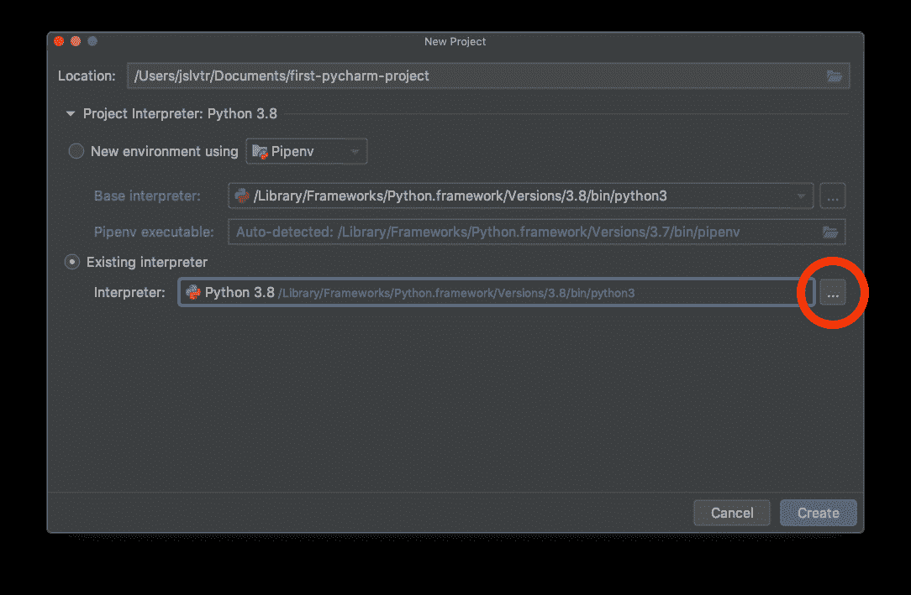
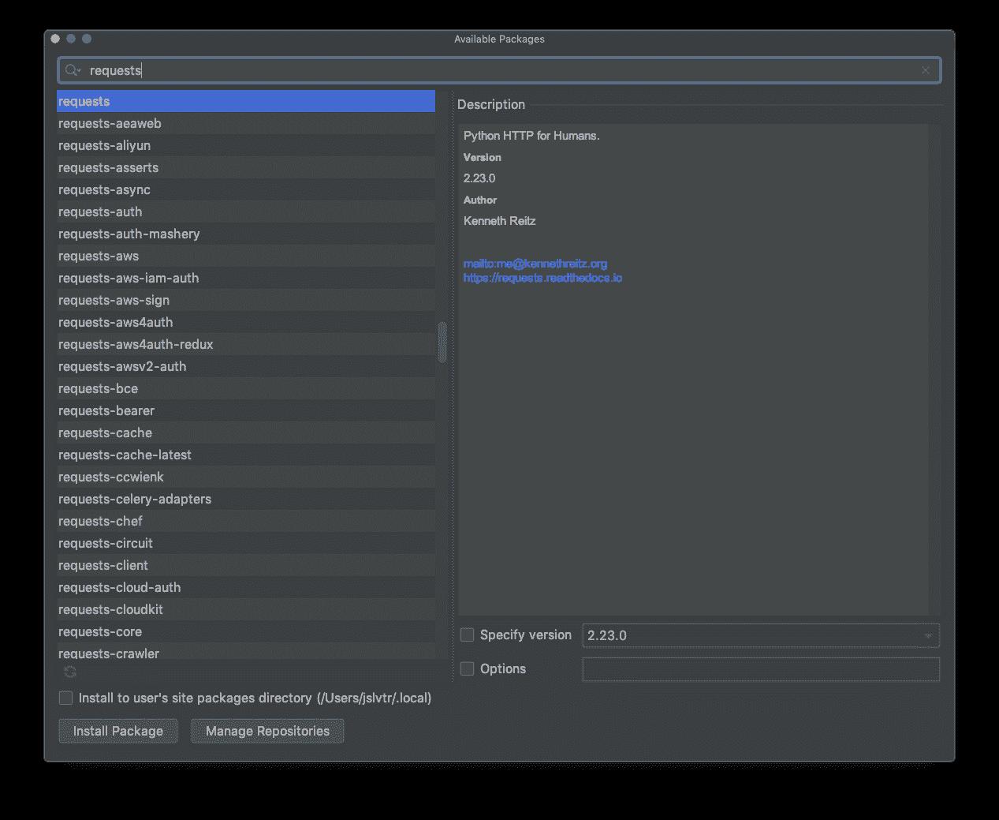

# 第 27 天:设置本地开发环境| Teclado

> 原文：<https://blog.teclado.com/python-30-day-27-local-development/>

欢迎来到 Python 系列 [30 天的第 27 天！今天我们将离开 repl.it，建立一个本地开发环境！](https://blog.teclado.com/30-days-of-python/)

这意味着我们将安装 Python 的本地版本，以及一个功能更全的编辑器 PyCharm。我们还将讨论如何安装软件包，以便您可以使用第三方库。

## 为什么要建立本地开发环境？

当考虑是否从 [repl.it](http://repl.it) 迁移到本地环境时，最重要的问题是:为什么？

第一个原因是可靠性。

如果你已经在电脑上安装了你的作品和代码编辑器，那么你就不需要依赖 [repl.it](http://repl.it) 为你工作来编写代码。你不需要互联网连接，也不需要 repl，它是服务器在工作。

第二个原因是速度。

随着应用程序变得越来越大越来越复杂， [repl.it](http://repl.it) 会变得很慢。这是因为在 [repl.it](http://repl.it) 上运行代码需要很多额外的步骤。毕竟，使用 replit 时，我们实际上不是在自己的电脑上运行代码，而是在*他们的*电脑上运行代码。

您的计算机也可能比 repl.it 使用的计算机功能强大得多，因为功能强大的计算机运行起来更昂贵。

Repl.it 非常适合入门、分享代码和创建小应用程序。随着您越来越熟练并创建更大的应用程序，使用本地开发环境变得不可避免。

## 您当地的发展选择

当建立本地开发环境时，我们需要做的第一件事是建立一个新的地方来实际编写我们的代码。在本帖中，我们将设置 PyCharm。

PyCharm 是一个代码编辑器，因为它允许您编辑代码，但它实际上远不止于此。它有内置的工具来帮助您处理数据库、网络连接和非常大的 Python 应用程序。这是一个完全围绕开发 Python 应用程序而构建的代码编辑器。

这当然不是你唯一的选择。代码编辑器，如 Atom、Sublime Text、Vim 或 Visual Studio 代码，也是优秀的工具，但它们通常需要更多的初始设置，并且它们不像 PyCharm 那样为您做很多事情。

随着您对 Python 了解的越来越多，以及您探索本地开发的不同选择，您可能会发现您更喜欢使用某种工具而不是另一种。

那完全没问题！每个人都有自己的喜好！

但是由于这是我们第一次设置本地开发环境，我们将指导您安装 PyCharm。我们认为这是你起步时最好的工具。

## 如何安装 Python

自然地，为了在你的计算机上编写和运行 Python 代码，我们现在必须安装 Python。

当我们安装 Python 时，我们得到了一个可以执行我们的 Python 文件的程序。

这个程序叫做“Python 解释器”。它解释并运行我们的 Python 代码，允许我们做 Python 能做的一切。

要安装 Python 我会推荐去[官网](https://python.org)下载最新版本。目前，这是 Python 3.8。

文件下载完成后，像打开普通程序一样打开安装程序。

### 注意

如果您使用的是 Windows，请确保在安装程序的第一个屏幕中选中“将 Python 添加到路径”复选框。

您应该将 Python 安装在您想要存储代码的同一个驱动器中。如果你只有一个驱动器，那么不要担心这个。

像往常一样浏览安装程序屏幕，当你看到告诉你*Python 将被安装在哪里的屏幕时，一定要记住它将被安装在哪里。我们以后需要这个！*

一旦安装完成，Python 就安装好了！

## 你的第一个 PyCharm 项目

### 安装 PyCharm

PyCharm 有两个版本:社区版和专业版。我们想安装社区版，因为它是免费的。

你可以从这里下载社区版:[https://www.jetbrains.com/pycharm/download/](https://www.jetbrains.com/pycharm/download/)

您可以像安装任何其他程序一样安装 PyCharm，只需运行安装程序屏幕。

### 选择口译员

当您启动 PyCharm 时，您会看到这样一个屏幕。我在那里有很多项目，但你目前不会有任何项目！我们想要创建一个新项目，所以让我们点击“创建新项目”按钮。然后您会看到类似这样的内容:这里我们想为我们的项目选择一个位置。对我来说，那就是`/Users/jslvtr/Documents/first-pycharm-project`。我的项目文件夹会是`first-pycharm-project`。我所有的代码都将存放在那里。

然后，我们想告诉 PyCharm 这个项目将在哪个版本的 Python 上运行。

为此，单击旁边的小箭头展开“项目解释器”下拉菜单:，然后选择“现有解释器”:，找到您已经安装的 Python 版本。您应该可以在那里看到 Python 3.8。

### 注意

如果您看不到 Python 3.8，并且您刚刚安装了 Python，请重启您的计算机，然后重试。如果这不起作用，那么我们必须告诉 PyCharm 在哪里可以找到 Python。

现在我们要添加一个新的解释器到 PyCharm，点击下拉菜单旁边的三个点:，然后点击“系统解释器”。在这个下拉列表中，您可以找到 Python 3.8。如果有，选择它并按“确定”。如果没有，那么单击这三个点，然后导航到安装 Python 的文件夹。然后找到`python.exe`文件(如果在 Windows 上)或`python`文件(如果在 Mac 或 Linux 上)。

单击 OK，PyCharm 现在将知道您的 Python 安装在哪里。

接下来，我们可以在新项目窗口中单击“Create ”, py charm 将开始创建我们的项目！

### 安装所需的软件包

我们经常需要使用外部包。在 [repl.it](http://repl.it) 上，每当我们运行使用它们的应用程序时，它们就会被自动安装。

在这里，我们必须在运行应用程序之前安装它们。

这样做的好处是，一旦安装了它们，就不必每次都重新安装。这样我们会节省很多时间！

要安装软件包，我们必须进入 PyCharm 设置(在 Windows 上)或 PyCharm 首选项(在 Mac 上)。

然后，找到项目{name} →项目解释器面板:一旦我们到了那里，我们会看到实际上已经安装了几个包。这很正常，因为 Python 附带了一些有用的包。你可能没有我安装的那么多软件包！

我们可以点击小的“加号”图标来找到要安装的新包:，在那里，键入我们想要的包的名称。比如`requests`。注意，可能会出现许多名称相似的包。我们必须小心选择正确的。

单击“安装”，软件包将被安装。从现在开始，任何使用与这个项目相同的解释器的 Python 项目都可以使用我们安装的包。

### 运行我们的 Python 文件

为了运行我们的 Python 文件，我们必须告诉 PyCharm 如何做。

首先，让我们通过右键单击项目文件夹(在左侧)来创建一个`app.py`文件，并在那里创建该文件。创建完成后，我们可以添加一些代码来确保它正常工作:

然后，右键单击该文件(不需要保存，PyCharm 会帮您保存)并找到“Run ...”菜单。就是这样！您应该在底部看到输出。

在右上方，你也可以看到一个“播放”按钮，只有在你运行该文件后它才会被激活。从现在开始，你可以用那个按钮运行同一个文件。

如果你想运行一个不同的文件，右击它并运行它。然后会添加到右上方，如下图:只要记得选择你要运行的文件就可以了！忘记这样做是一个常见的错误，然后当事情没有像预期的那样工作时，它会令人困惑！

## 练习

说到练习，我们今天没什么可要求你做的！

安装 PyCharm，创建一个项目，然后用它来玩一玩！试着在那里运行一些你的 repl.it 项目。

你也可以改变 PyCharm 的设置(如主题和字体)来适应你喜欢的。我经常使用深色主题，和比大多数人使用的更大的字体！

## 项目

虽然今天没有什么练习，但是今天是项目日！今天我们将学习如何使用一个名为`pandas`的非常强大的库，它用于处理关系数据。

我们将使用`pandas`非常容易地分析超过 18，000 行的真实数据集。点击查看[。](/30-days-of-python/python-30-day-27-project)