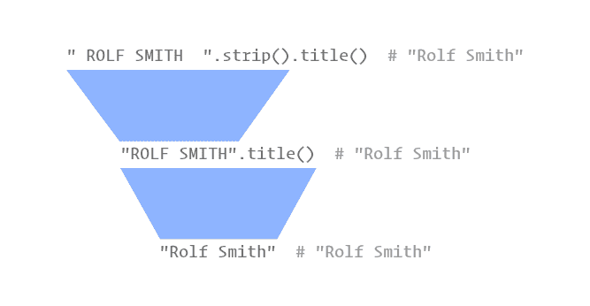

# 第 3 天:格式化字符串和处理用户输入

> 原文：<https://blog.teclado.com/python-30-day-3-string-formatting/>

欢迎来到 Python 系列 [30 天的第 3 天！在本帖中，我们将讨论连接字符串(将字符串连接在一起)、字符串插值(将值放入字符串)以及处理用户输入。我们还将讨论如何使用注释更好地记录我们的代码。](https://blog.teclado.com/30-days-of-python/)

如果你错过了[第二天](/30-days-of-python/python-30-day-2-strings-variables)，如果你对以下任何一点感到不舒服，我建议你检查一下:

*   用线串
*   定义变量
*   `input`功能
*   如何阅读错误信息

我希望你对此感到兴奋，因为这些工具将让我们做一些非常酷的事情！

## 串并置

我想从上一篇文章的练习中的一个例子开始:

```py
`hourly_wage = input("Please enter your hourly wage: ")
hours_worked = input("How many hours did you work this week? ")

print("Hourly wage:")
print(hourly_wage)

print("Hours worked:")
print(hours_worked)` 
```

这里我们要求用户提供两条信息，然后我们将这些信息连同一些标题一起打印回控制台。

这很好，但是如果我们能让`hourly_wage`值和`"Hourly wage:"`标签在同一行不是很好吗？这就是字符串连接(将两个或多个字符串连接在一起)的用武之地。

连接东西意味着把东西连接在一起，这就是我们想用绳子做的事情。我们想要获取字符串`"Hourly wage:"`，并且我们想要将我们分配给变量`hourly_wage`的字符串连接到它。

在 Python 中，我们可以使用`+`操作符来实现这一点，就像这样:

```py
`hourly_wage = input("Please enter your hourly wage: ")
hours_worked = input("How many hours did you work this week? ")

print("Hourly wage:" + hourly_wage)
print("Hours worked:" + hours_worked)` 
```

这里有一个问题，很像我们在编写输入提示时遇到的问题。`hourly_wage`和`hours_worked`的值将直接在我们要连接的字符串的最后一个字符旁边结束。为了避免这种情况，我们需要记住添加一个空格:

```py
`hourly_wage = input("Please enter your hourly wage: ")
hours_worked = input("How many hours did you work this week? ")

print("Hourly wage: " + hourly_wage)
print("Hours worked: " + hours_worked)` 
```

这个操作是另一个表达式，它将计算包含两个字符串的字符的新字符串。

就像我们使用`+`将数字相加一样，我们可以使用`+`将任意多的字符串链接在一起。但是，我们必须非常小心，不要组合类型。

例如，我们不能这样做，我们试图将一个整数连接到一个字符串上:

```py
`print("Hourly wage: " + 20)` 
```

如果我们运行这段代码，Python 将会引发一个异常:

```py
`Traceback (most recent call last):
    File "main.py", line 1, in <module>
        print("Hourly wage: " + 20)
TypeError: can only concatenate str (not "int") to str` 
```

这次我们得到了一个`TypeError`，它告诉我们我们已经尝试将一个`int`(整数)连接到一个`str`(字符串)，但是这个操作只在字符串之间受支持。

所以现在的问题是，如果我们需要执行一些算术运算，然后把结果放在一个字符串中，我们该怎么办？幸运的是，Python 为我们提供了一些将一种类型的值转换成另一种类型的工具。

## 转换字符串、整数和浮点数

首先，我们来谈谈整数和浮点到字符串的转换。我们将要使用的工具被方便地命名为`str`，我们可以认为它非常像一个函数。

当我们调用`str`时，传入一个整数或一个浮点数，我们将得到一个新的字符串，其中包含组成数字的数字，以及一个小数点字符(在浮点数的情况下)。

例如，我们可以这样写:

它会给`age`赋值，就像我们写的一样:

从字符串到整数或浮点数的转换稍微复杂一些，因为不是每个字符串都是有效数字。此外，即使一个字符串是一个有效的数字，它也可能不是我们要转换的类型的有效数字。

如果我们想把一个字符串转换成一个整数，我们需要调用`int`，传入字符串。字符串中的字符必须代表整数。

如果我们试图传递一个带有小数部分的数字的字符串表示，我们将得到一个`TypeError`。例如，类似这样的事情:

```py
`hourly_wage = int("18.50")` 
```

将引发以下异常:

```py
`Traceback (most recent call last):
    File "main.py", line 1, in <module>
        int("18.50")
ValueError: invalid literal for int() with base 10: '18.50'` 
```

Instead of `int` , we’d need to call `float` here instead:

```py
`hourly_wage = float("18.50")` 
```

`float`也可以处理没有小数成分的输入。例如，如果我们传入`"20"`，我们将把浮动`20.0`拿回来。

除了从字符串到整数和浮点数的转换，以及从*到整数和浮点数的转换*，我们还可以使用相同的`int`和`float`在整数和浮点数之间进行转换。在这种情况下，向`int`传递一个浮点数是可行的，但是它将“截断”这个浮点数，实质上是丢弃小数点后的所有内容。

截断是指通过删除某些部分来缩短某物的行为。例如，我们可以截断一个浮点数，这意味着我们要删除小数点后的所有内容。

## 用`format`方法进行字符串插值

字符串连接是一个需要了解的有用的东西，但是它有点笨拙，并且容易出现空格错误，正如我们已经看到的。更好的方法通常是使用字符串插值，尤其是在处理具有类似句子结构的内容时。

字符串插值是将一些新内容插入到现有字符串中的行为。

与串联不同，插值依赖于我们在字符串中放置占位符，我们可以用值来填充。这使得格式问题变得更加困难，因为占位符就在值将要占据的位置上。插值的另一个好处是:我们不用担心类型！Python 将确保我们得到所有值的字符串表示。

在 Python 中有几种方法可以执行字符串插值，但首先我们要看看如何使用`format`方法。

当使用`format`方法时，我们的值的占位符是花括号，看起来像这样:`{}`。例如，假设我们要编写一个字符串，如下所示:

但是，我们希望能够在这里写出任何姓名和年龄，而不仅仅是`"John"`和`"24"`。我们要做的就是用花括号替换`"John"`和`"24"`，就像这样:

这是一个完全有效的字符串，我们甚至可以以它当前的形式打印它。如果我们愿意，我们也可以把它赋给一个变量，这通常是非常有用的。

在这两种情况下，为了填充值，我们需要用占位符对字符串调用`format`方法，这将产生一个新的字符串。我们使用如下的点符号:

```py
`"{} is {} years old!".format()` 
```

但是我们还没有完成，因为`format`需要知道哪些值应该放入字符串中。实际上有几种方法可以做到这一点，但最简单的方法是按照我们希望占位符放置的顺序为每个占位符传递一个 format 表达式。

例如，我们可以这样做:

```py
`"{} is {} years old!".format("John", 24)` 
```

给我们一个新的字符串，结果字符串将包含:

## 使用`format`的替代方式

通常只需按顺序传入值就足够了，但是我们还有其他选择。

例如，假设我们有这样一个字符串:

```py
`"{} is {} years old, and {} works as a {}."` 
```

这里的目的是让我们的输出看起来像这样:

```py
`"John is 24 years old, and John works as a web developer"` 
```

这里我们在两个不同的地方使用这个名字。利用我们现有的知识，我们可以按顺序为每个占位符传入一个值:

```py
`output = "{} is {} years old, and {} works as a {}."

print(output.format("John", 24, "John", "web developer"))` 
```

然而，这有点笨拙。我们可以给占位符编号，而不是这样做，这将让我们重用值。

需要注意的一点是，我们在编程时从`0`开始计数，所以我们传入的第一个值是值`0`，而不是值`1`。

考虑到这一点，我们将上面的代码重写如下:

```py
`output = "{0} is {1} years old, and {0} works as a {2}."

print(output.format("John", 24, "web developer"))` 
```

这要好得多，尤其是如果我们一次又一次地使用相同的值。然而，更好的方法通常是为占位符使用名称。这很像使用变量。

我们首先在每个占位符中写一些名字，如下所示:

```py
`output = "{name} is {age} years old, and {name} works as a {job}."` 
```

现在我们可以这样调用`format`方法:

```py
`print(output.format(name="John", age=24, job="web developer"))` 
```

我们这里说的是，我们希望用`"John"`代替`name`；`age`替换为`24`；将`job`替换为`"web developer"`。

在本系列的后面，我们将更详细地了解实际发生的情况。

## 用 f-字符串进行字符串插值

`format`方法真的很有用，但是在 Python 3.6 中，我们有了一个叫做 f-strings 的新语法，这使得字符串插值在很多情况下变得更加容易。

我们先来看一个例子。这里是我们早期使用`format`的一个例子:

```py
`name = "John"
age = 24

"{} is {} years old!".format(name, age)` 
```

下面是使用较新的 f 字符串语法的相同示例:

```py
`name = "John"
age = 24

f"{name} is {age} years old!"` 
```

首先要注意的是这个`f`就在我们要插入值的字符串之前。这就是 f 字符串得名的地方，它告诉 Python 我们想要格式化下面的字符串。

另一件有趣的事情是，我们在占位符中直接引用了值。这不像在`format`中，我们命名占位符:我们直接引用花括号中的值。

我们可以在这里写任何我们想要的表达式。例如，让我们在字符串中计算 John 的月龄:

```py
`name = "John"
age = 24

f"{name} is {age  *  12} months old!"` 
```

如果你想知道的话，f 字符串也是表达式，所以我们可以把它们赋给名字，或者我们可以打印出来。

```py
`name = "John"
age = 24

print(f"{name} is {age  *  12} months old!")` 
```

## 评论

使用好的、描述性的名字，我们可以做很多事情来使我们的代码自文档化；然而，有时即使伟大的代码也很难推理。毕竟，有些事情很复杂。

在这种情况下，使用注释向我们代码的读者(包括我们)解释代码在做什么是很有用的。

为了写评论，我们只需要在想要写的消息前直接加一个`#`。这将告诉 Python 不要把后面的内容当作代码。

```py
`name = "John"
age = 24

# prints the person's name and age in months
print(f"{name} is {age  *  12} months old!")` 
```

尽量不要使用过多的注释，因为在每隔一行使用注释对于可读性来说弊大于利。

## 基本字符串处理

在这篇文章中，我想提到的最后一件事是一些常见的字符串处理操作，比如改变字母的大小写，或者删除空格(空格字符、制表符、换行符等等。)从弦的两端。当我们处理用户输入时，这种事情经常发生。

我们有许多不同的选项来改变字符串中字母的大小写。这里我们将重点关注四个重要选项:`lower`、`upper`、`capitalize`和`title`。

`lower`和`upper`分别将整个字符串变成小写和大写。没有大小写的字符，如标点符号，将被忽略。

`capitalize`将要把第一个字符变成大写，其余的都是小写。`title`将把字符串转换为标题大小写，这意味着每个单词都以大写字母开头，所有其他字母都转换为小写字母。

为了使用这些方法，我们只需要再次使用点符号，就像使用`format`一样。

```py
`"Hello, World!".lower()       # "hello, world!"
"Hello, World!".upper()       # "HELLO, WORLD!"
"Hello, World!".capitalize()  # "Hello, world!"
"hello, world!".title()       # "Hello, World!"` 
```

在每种情况下，我们都要写一个表达式，在所请求的情况下，表达式的值是一个新的字符串。

在改变大小写方面没有太多的问题，但是从字符串末尾删除空白又如何呢？为此，我们可以使用`strip`方法。

实际上比这要灵活得多，我们可以让它删除我们喜欢的任何内容，但默认情况下，它会给我们一个闪亮的新字符串，两端任何多余的空白都被删除了。

我们使用它的方式和`lower`、`upper`等完全一样。

```py
`"  Hello, World!  ".strip()  # "Hello, World!"` 
```

### 多次处理

我们可以对一个字符串应用多种处理方法。让我告诉你两种方法。

第一种方法是创建一个变量，并在每次方法调用时给它重新赋值，如下所示:

```py
`user_name = " ROLF SMITH  "
user_name = user_name.strip()  # "ROLF SMITH"
user_name = user_name.title()  # "Rolf Smith"` 
```

虽然这非常冗长，并且多次重新分配给一个变量通常感觉不是最佳的和低效的(尽管无论如何也不会*慢*，Python 可以非常快地重新分配给变量)。

第二种方法是使用每一步*的结果内联*，就像这样:

```py
`user_name = " ROLF SMITH  ".strip().title()` 
```

当我们看函数和返回值的时候，我们将会更好地了解它是如何工作的，但是现在把每个方法调用，比如`" ROLF SMITH ".strip()`，当作它将返回给你的字符串。

因此，即使在这样的内联调用中，这三个也是等价的:



## 练习

1.  使用下面的变量，打印`"Hello, world!"`。

```py
`greeting = "Hello, world"` 
```

您可以使用字符串串联、`format`或 f 字符串来添加缺少的感叹号。选择权在你。

1.  询问用户的姓名，然后问候用户，将他们的姓名作为问候的一部分。名称应该是大写的，并且不应该被任何多余的空格包围。

例如，如果用户输入`"lewis "`，您的输出应该是这样的:

1.  将字符串`"I am "`和整数`29`连接起来，产生一个字符串`"I am 29"`。

请记住，我们只能将字符串连接到其他字符串，因此在执行连接之前，您必须将整数转换为字符串。

1.  使用字符串插值法格式化并打印以下信息:

```py
`title = "Joker"
director = "Todd Phillips"
release_year = 2019` 
```

输出应该如下所示:

```py
`Joker (2019), directed by Todd Phillips` 
```

完成练习后，请务必对照[我们的答案](/30-days-of-python/python-30-day-3-exercise-solutions)检查您的答案。如果你有替代的解决方案，请在我们的[不和谐服务器](https://discord.gg/BBWwyMq)上分享！

## 项目

一旦你完成了上面的练习，你应该试试我们的第一个迷你项目。

## 额外资源

除了我们在这里看到的方法之外，还有大量的字符串方法可供我们使用。你可以在文档中找到一个全面的列表[。](https://docs.python.org/3/library/stdtypes.html#string-methods)

不要觉得你必须记住所有这些。如果忘记了方法名，您可以随时查找它们，文档描述了如何使用它们。

如果你感兴趣，我们也有[一个帖子](https://blog.teclado.com/python-a-closer-look-at-print/)涵盖了使用`print`时的一些额外选项。这篇文章的后半部分讨论了文件，我建议现在跳过这一部分。