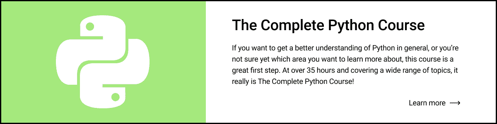
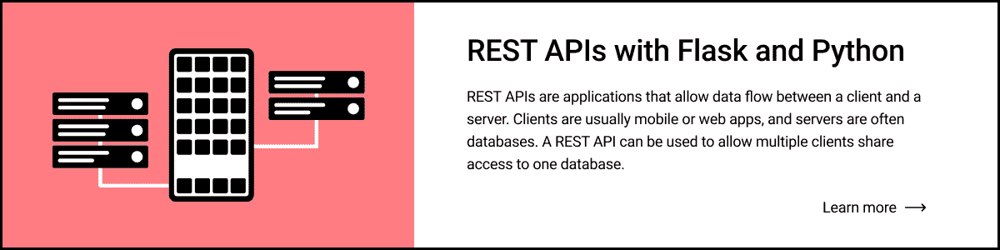
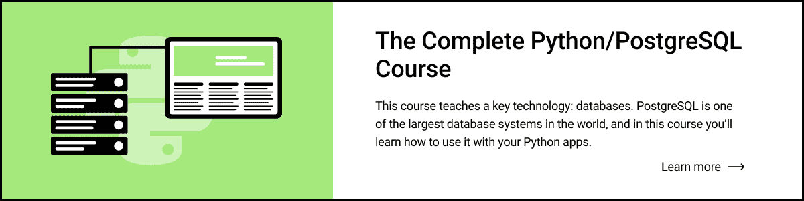
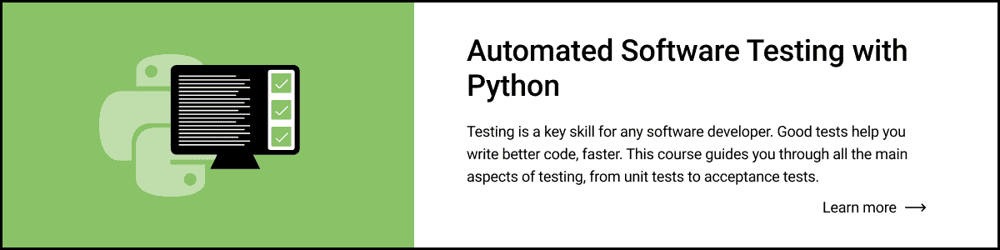

# 第 30 天:毕业

> 原文：<https://blog.teclado.com/python-30-day-30-graduation/>

欢迎来到 Python 系列 [30 天的最后一天！如果你从一开始就关注这个系列，你应该为自己感到非常自豪。干得好！](https://blog.teclado.com/30-days-of-python/)

这个月我们已经谈了很多，我希望你现在对自己处理一些小项目有信心了。

如果你还没有加入 Discord 的社区，我建议你加入并认识一些你的同学。我们将建立一个特殊的项目频道，在那里你可以展示你正在做的东西，你甚至可以找到人合作做更大的东西。

请确保您阅读到帖子的末尾，因为我们有一个很酷的毕业设计供您尝试！

## 从这里去哪里

在这篇文章的剩余部分，我想谈谈一些潜在的后续步骤，所以现在这个系列已经结束，你有一些方向。

### 做你自己的项目

首先，自己想一些项目来解决是个好主意。编程是一项实践性很强的活动，越来越好意味着你需要实际编写一些代码。你不要指望仅仅通过阅读跑步技巧就能在跑步方面取得更好的成绩:你需要锻炼你的肌肉，或者在这种情况下，锻炼你的大脑。

如果你想处理一些简单的项目，考虑像纸牌游戏或你可能和孩子一起玩的游戏。这些游戏的规则很简单，很多卡牌游戏甚至不需要玩家，因为胜负完全是靠运气决定的。

或者，您可能希望将我们在本系列中所做的一些项目扩展到功能更加完整的成熟应用程序中。

如果你陷入了项目想法，只需在谷歌中输入“初级 Python 项目”。有整整几页都是关于项目创意的。

### 我们的课程

我们有一个完整的 Python 课程，它涵盖了我们在这里没有涵盖的大量更高级的材料。它还包括许多品尝部分，我们在这些部分向您介绍 Python 开发的不同领域，例如使用 Flask 的 web 开发、使用 Tkinter 的 GUI 开发，以及测试等主题。  如果你想从总体上更好地理解 Python，或者你不确定你想专攻哪个领域，完整的 Python 课程是很好的第一步。

我们在 Udemy 上提供了几门更高级的课程，其中大部分都专注于 Python 开发的某个特定领域。

### 其他免费材料

除了我们在 Udemy 上的课程，我们在 YouTube 频道上还有大量免费内容。

我们还计划做更多的直播，在那里我们构建项目或谈论像版本管理这样的主题，以及 Python 开发的专业领域。如果你对此感兴趣，请确保在本页底部订阅，这样你就不会错过了！

如果你有兴趣学习用 Python 处理数据库，我们的网站上也有免费的电子书，你可以在这里找到。

## 项目

在毕业设计中，我们将使用名为`pygame.`的第三方库构建经典视频游戏《贪吃蛇》

今天的项目特别大，所以今天有两个项目帖子。

[第一个](/30-days-of-python/python-30-day-30-project-preparation)将是一个项目准备帖，它将带你了解你需要了解的关于`pygame`的一切。[第二个](/30-days-of-python/python-30-day-30-project)将包含整个项目的演练，还将包含项目简介。

祝你好运，并快乐编码！