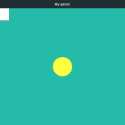

# 第 30 天:项目准备(pygame 基础)| Teclado

> 原文：<https://blog.teclado.com/python-30-day-30-project-preparation/>

欢迎来到 Python 系列 [30 天](https://blog.teclado.com/30-days-of-python/)[最后一天](/30-days-of-python/python-30-day-30-graduation)的两个项目帖子中的第一个。在这篇文章中，我们将学习如何使用`pygame`，这是我们将要用来构建我们的贪吃蛇游戏。

你可以在这里找到项目简介和演练[。](/30-days-of-python/python-30-day-30-project)

## 装置

安装`pygame`非常简单。

如果你正在使用 PyCharm，你可以遵循通常的过程，正如在 [day 27](/30-days-of-python/python-30-day-27-local-development/) 中所讨论的。

如果你正在使用不同的编辑器，或者出于某种原因你想使用`pip`，你可以在这里找到如何安装`pygame` [的详细说明。](https://www.pygame.org/wiki/GettingStarted)

## 创建一个`pygame`窗口

一旦我们安装了`pygame`，我们就可以用它来创建一个应用程序窗口。

下面是一个小的示例程序:

app.py

```py
`import pygame

pygame.init()

screen = pygame.display.set_mode([640, 480])

def main():
    while True:
        for event in pygame.event.get():
            if event.type == pygame.QUIT:
                return

main()` 
```

就在顶部，我们导入`pygame`，然后调用位于`pygame`包中的`init`函数。这个函数为我们做了大量的设置工作，但是我们不需要太担心幕后发生了什么。

在下一行，我们告诉`pygame`我们希望我们的应用程序窗口有多大。我们使用位于`display`模块中的`set_mode`函数来完成这项工作。

像我们自己的程序一样，`pygame`被分割成几个不同的文件，库的不同部分位于这些不同的文件中。可以在`display`模块中找到与主显示窗口相关的内容。我们会经常用到它。

`set_mode`函数实际上创建了显示窗口，如果我们愿意，我们可以不带任何参数调用它。如果我们不传递任何参数，我们会得到一个充满整个屏幕的窗口。如果我们想把窗口限制在某个特定的大小，我们可以传入一个两个元素的序列，比如一个链表或者一个元组。里面的值必须是整数，其中第一个以像素为单位表示窗口的宽度，第二个以像素为单位表示窗口的高度。

应用程序的其余部分关心的是保持窗口，并确保用户可以使用窗口控件关闭程序。我们在讨论事件时会更多地谈到他。如果我们想为窗口设置一个自定义标题，我们可以使用`display.set_caption`函数，如下所示:

app.py

```py
`import pygame

pygame.init()

pygame.display.set_caption("My game!")
screen = pygame.display.set_mode([640, 480])

def main():
    while True:
        for event in pygame.event.get():
            if event.type == pygame.QUIT:
                return

main()` 
```

现在我们的窗口看起来像这样:


这很酷，但是一旦我们有了一个比普通黑盒更好的东西，它会给人留下更深刻的印象，所以让我们来学习如何在这个窗口中绘制东西。

## 绘画基础

你可能之前一直在想，为什么我们要费心把调用`set_mode`的结果赋给一个变量。这是因为`set_mode`返回一个`Surface`对象。

如果你试着打印`screen`，你会看到这样的内容:

`Surface`物体被`pygame`用来代表一幅图像。它们也是我们可以在上面画画的表面，我们有几种方法来处理这种操作。

### `fill`法

我们要看的第一个是`fill`方法。`fill`允许我们用某种颜色填充表面的某个区域，用 RGB 或 RGBA 作为整数序列来指定。这些整数必须在 0 到 255 的范围内(包括 0 和 255)。

RGB 是使用红色、绿色和蓝色的比率来定义颜色的常用方法。这些颜色通道中的每一个都被赋予一个在`0`和`255`之间的值。

RGBA 还有一个附加价值，那就是透明度。A 代表阿尔法。

例如，让我们说，我们想使我们的窗口背景[茶色](https://xkcd.com/color/rgb/)而不是黑色。我想要的颜色的 RGB 组合是`(36, 188, 168)`，所以我们可以将这些值作为列表或元组传递给`screen.fill`。

app.py

```py
`import pygame

pygame.init()

pygame.display.set_caption("My game!")

screen = pygame.display.set_mode([640, 480])
screen.fill([36, 188, 168])

def main():
    while True:
        for event in pygame.event.get():
            if event.type == pygame.QUIT:
                return

main()` 
```

然而，这实际上似乎没有做任何事情。如果运行代码，屏幕仍然是黑色的。

这是因为这些绘图操作直到我们请求更新显示时才会显示。这是为了防止用户看到部分修改的图像。这些改变是在幕后完成的，当它们完成时，我们请求更新显示。

有几种方法可以做到这一点，但是我们将使用`display`模块中的`update`函数。

app.py

```py
`import pygame

pygame.init()

pygame.display.set_caption("My game!")

screen = pygame.display.set_mode([640, 480])
screen.fill([36, 188, 168])

pygame.display.update()

def main():
    while True:
        for event in pygame.event.get():
            if event.type == pygame.QUIT:
                return

main()` 
```

现在我们的背景是一种可爱的“tealish”色调。因为颜色是我们在应用程序中很多地方都要重复使用的东西，所以将颜色值存储在常量中是个好主意。这也可能是一个使用`namedtuple`的好机会，因为我们可以使用关键字参数创建一个`RGB`元组的实例，这为值提供了一些上下文。

app.py

```py
`import pygame
from collections import namedtuple

Colour = namedtuple("Colour", ["red", "green", "blue"])

BACKGROUND_COLOUR = Colour(red=36, green=188, blue=168)

pygame.init()

pygame.display.set_caption("My game!")

screen = pygame.display.set_mode([640, 480])
screen.fill(BACKGROUND_COLOUR)

pygame.display.update()

def main():
    while True:
        for event in pygame.event.get():
            if event.type == pygame.QUIT:
                return

main()` 
```

### `draw`模块

`draw`模块包含几个在表面上绘制简单形状的函数。

让我们从使用`rect`函数绘制一个矩形开始。`rect`需要几个不同的参数。

首先，它需要一个表面来绘制，这个表面可以是任何一个`Surface`对象。

第二个参数是`color`，它期望一种与我们讨论的`fill`相同格式的颜色。

最后一个必需的参数是`rect`，它要么是一个`Rect`对象，要么是一个包含信息的值序列，这些信息通常由一个`Rect`对象保存。

`Rect`对象其实只是四个重要值的容器:矩形左上角的 x 和 y 位置，用坐标表示；矩形的宽度；和矩形的高度。这意味着我们可以用包含相同信息的四元素列表或元组来替换它们。

记住这一点，让我们试着在左上角的`screen`表面画一个白色的圆圈。

### 注意

你必须记住的一点是，坐标`(0, 0)`在左上角，随着 x 和 y 值的增加，我们在屏幕上向右下方移动。

app.py

```py
`import pygame
from collections import namedtuple

Colour = namedtuple("Colour", ["red", "green", "blue"])

BACKGROUND_COLOUR = Colour(red=36, green=188, blue=168)
RECTANGLE_COLOUR = Colour(red=255, green=255, blue=255)

pygame.init()

pygame.display.set_caption("My game!")

screen = pygame.display.set_mode([640, 480])
screen.fill(BACKGROUND_COLOUR)

pygame.draw.rect(screen, RECTANGLE_COLOUR, [0, 0, 100, 50])

pygame.display.update()

def main():
    while True:
        for event in pygame.event.get():
            if event.type == pygame.QUIT:
                return

main()` 
```

白色的 RGB 代码是`(255, 255, 255)`，我创建了另一个常量来存储这种颜色。

窗口现在看起来像这样，左上角是我们的白色矩形，例外:现在让我们试着在屏幕中间画一个圆。我们可以用`draw.circle`函数做到这一点，它的签名与`rect`略有不同。

需要我们做四件事:要画的表面、圆的颜色、圆的中心点和圆的半径。

让我们在`screen`的中心画一个半径为 40px 的黄色圆圈。

app.py

```py
`import pygame
from collections import namedtuple

Colour = namedtuple("Colour", ["red", "green", "blue"])

BACKGROUND_COLOUR = Colour(red=36, green=188, blue=168)
CIRCLE_COLOUR = Colour(red=255, green=253, blue=65)
RECTANGLE_COLOUR = Colour(red=255, green=255, blue=255)

pygame.init()

pygame.display.set_caption("My game!")

screen = pygame.display.set_mode([640, 480])
screen.fill(BACKGROUND_COLOUR)

pygame.draw.rect(screen, RECTANGLE_COLOUR, [0, 0, 100, 50])
pygame.draw.circle(screen, CIRCLE_COLOUR, [320, 240], 40)

pygame.display.update()

def main():
    while True:
        for event in pygame.event.get():
            if event.type == pygame.QUIT:
                return

main()` 
```

现在我们的窗口看起来像这样:

### 注意

如果我们希望我们的代码能够考虑变化的窗口大小，这样圆圈总是在中间结束，我们可以使用`screen.get_height()`和`screen.get_width()`方法找到`screen`的大小。

### 绘图文本

在表面上绘制文本稍微复杂一些。我们首先必须从`pygame.font`模块中创建一个`Font`对象，如下所示:

```py
`font = pygame.font.Font(None, 28)` 
```

这里的第一个参数是文件名，但是我们可以在这里写`None`。第二个参数是字体大小。

一旦我们有了一个`Font`对象，我们就可以调用`render`方法来给我们一些我们可以实际绘制到表面上的东西。

`render`方法接受一个字符串，它将形成文本内容、一个布尔值和一个颜色。布尔值表示是否要使用抗锯齿。

```py
`font = pygame.font.Font(None, 28)
text = font.render("Woo! This is some text!", True, (0, 0, 0))` 
```

最后，我们可以通过在我们想要绘制的表面上调用`blit`方法来将文本绘制到表面上。

```py
`font = pygame.font.Font(None, 28)
text = font.render("Woo! This is some text!", True, (0, 0, 0))
screen.blit(text, (50, 50))` 
```

真的只是画的意思，但这是一个有趣的词，你将不得不习惯它。

`blit`方法接受你想要`blit`的东西，然后是一个位置。

## 移动项目

移动屏幕上的项目实际上只是在不同的位置重复地将项目绘制到屏幕上，并覆盖旧的内容。

在上面的例子中，这意味着用背景色填充`screen`，绘制新的形状，并使用`update`函数显示新的内容。

我们还需要一样东西，那就是一个`Clock`对象。通过设置最大帧速率，`Clock`将让我们限制窗口被绘制的频率。我们通过在循环内部给`tick`方法提供一个每秒帧数的值来做到这一点。

考虑到这一切。让我们删除白色矩形，使圆以 5px 的增量向右移动。

app.py

```py
`import pygame
from collections import namedtuple

Colour = namedtuple("Colour", ["red", "green", "blue"])

BACKGROUND_COLOUR = Colour(red=36, green=188, blue=168)
CIRCLE_COLOUR = Colour(red=255, green=253, blue=65)

pygame.init()

pygame.display.set_caption("My game!")

clock = pygame.time.Clock()
screen = pygame.display.set_mode([640, 480])

def main():
    circle_position = [320, 240]

    while True:
        for event in pygame.event.get():
            if event.type == pygame.QUIT:
                return

        screen.fill(BACKGROUND_COLOUR)
        pygame.draw.circle(screen, CIRCLE_COLOUR, circle_position, 40)
        pygame.display.update()

        circle_position[0] += 5

        clock.tick(60)

main()` 
```

圆圈很快离开了屏幕，但我们至少让它移动了。我们一会儿将回到碰撞检测，这样我们就可以将圆保持在窗口内。

不过，首先让我们谈谈事件。

## 事件

事件是`pygame`传达应用程序中发生了什么事情的方式。这可能就像用户移动他们的鼠标，或者按一个键，或者点击小十字来关闭应用程序。

从第一个例子开始，我们已经在`main`函数中编写了一些代码，用于检查`pygame.QUIT`事件。你可以在这里看到:

app.py

```py
`for event in pygame.event.get():
    if event.type == pygame.QUIT:
        return` 
```

在这里，我们正在检查`pygame`已经记录的一些事件集，并且我们正在查看这些事件中是否有任何一个是`pygame.QUIT`事件。当用户按下按钮关闭应用程序时，该事件被触发。

点击这个按钮实际上并没有关闭窗口:我们必须做一些事情来使它发生。在我们的例子中，我们从`main`函数中提取`return`，这使得 Python 不再需要运行代码。这将导致应用程序终止。

`pygame`有*许多不同事件类型的*，我们可以像检查`pygame.QUIT`一样检查这些事件。例如，我们可以使用`pygame.MOUSEMOTION`来检查鼠标的移动。

让我们创建一个新的应用程序，我们只需在控制台上打印出鼠标的位置。我们可以通过访问事件上名为`__dict__`的属性，从`pygame.MOUSEMOTION`事件中找到鼠标的位置。

这为我们提供了一个字典，其中有一个名为`"pos"`的键，包含了触发事件时鼠标位置的坐标。

app.py

```py
`import pygame

pygame.init()

pygame.display.set_caption("Mousetracker")
screen = pygame.display.set_mode([640, 480])

def main():
    while True:
        for event in pygame.event.get():
            if event.type == pygame.QUIT:
                return
            elif event.type == pygame.MOUSEMOTION:
                position = event.__dict__["pos"]
                print(position)

main()` 
```

这给了我们很多控制台输出，但是我们可以看到当我们在窗口中移动鼠标时，它记录了当前位置。

让我们升级这个小应用程序，使一个球跟随光标在屏幕上移动。

这相当简单，我们只需要用鼠标当前的位置替换圆圈的中心值。

app.py

```py
`import pygame
from collections import namedtuple

Colour = namedtuple("Colour", ["red", "green", "blue"])

BACKGROUND_COLOUR = Colour(red=36, green=188, blue=168)
CIRCLE_COLOUR = Colour(red=255, green=253, blue=65)

pygame.init()

pygame.display.set_caption("Mousetracker")

clock = pygame.time.Clock()
screen = pygame.display.set_mode([640, 480])

def main():
    circle_position = (screen.get_width() // 2), (screen.get_height() // 2)

    while True:
        for event in pygame.event.get():
            if event.type == pygame.QUIT:
                return
            elif event.type == pygame.MOUSEMOTION:
                circle_position = event.__dict__["pos"]

        screen.fill(BACKGROUND_COLOUR)
        pygame.draw.circle(screen, CIRCLE_COLOUR, circle_position, 20)
        pygame.display.update()

        clock.tick(60)

main()` 
```

## 弹跳球

让我们再看一个例子。

我想回到自己移动的球，但现在我想让它从侧面反弹，而不是飞出视野。

为了做到这一点，我们将跟踪球的速度，这将描述在我们的`clock`的每一次滴答中，球在给定的方向上将移动多远。为了保持有趣，我们可以将这个速度的初始值随机化。

app.py

```py
`import pygame
from collections import namedtuple
from random import randint

Colour = namedtuple("Colour", ["red", "green", "blue"])

BACKGROUND_COLOUR = Colour(red=36, green=188, blue=168)
BALL_COLOUR = Colour(red=255, green=253, blue=65)

BALL_RADIUS = 20

pygame.init()

pygame.display.set_caption("Bouncing Ball")

clock = pygame.time.Clock()
screen = pygame.display.set_mode([640, 480])

def main():
    ball_position = [(screen.get_width() // 2), (screen.get_height() // 2)]
    ball_velocity = [randint(-5, 5), randint(-5, 5)]

    while True:
        for event in pygame.event.get():
            if event.type == pygame.QUIT:
                return

        screen.fill(BACKGROUND_COLOUR)
        pygame.draw.circle(screen, BALL_COLOUR, ball_position, BALL_RADIUS)
        pygame.display.update()

        clock.tick(60)

main()` 
```

这里我们的应用程序窗口中间有一个圆圈。目前没有什么发生，但是我们已经定义了球的初始位置和速度。

下一步是检查球没有超出我们窗口的任何“墙”。如果有，我们需要改变球的方向，阻止它继续沿着当前的轨迹前进。为了做到这一点，我们要修改球的速度。

app.py

```py
`import pygame
from collections import namedtuple
from random import randint

Colour = namedtuple("Colour", ["red", "green", "blue"])

BACKGROUND_COLOUR = Colour(red=36, green=188, blue=168)
BALL_COLOUR = Colour(red=255, green=253, blue=65)

BALL_RADIUS = 20

pygame.init()

pygame.display.set_caption("Bouncing Ball")

clock = pygame.time.Clock()
screen = pygame.display.set_mode([640, 480])

def main():
    ball_position = [(screen.get_width() // 2), (screen.get_height() // 2)]
    ball_velocity = [randint(-5, 5), randint(-5, 5)]

    while True:
        for event in pygame.event.get():
            if event.type == pygame.QUIT:
                return

        screen.fill(BACKGROUND_COLOUR)
        pygame.draw.circle(screen, BALL_COLOUR, ball_position, BALL_RADIUS)
        pygame.display.update()

        # Check for left and right collisions
        if ball_position[0] - BALL_RADIUS < 0:
            ball_velocity[0] = -ball_velocity[0]
        elif ball_position[0] + BALL_RADIUS > screen.get_width():
            ball_velocity[0] = -ball_velocity[0]

        # Check for top and bottom collisions
        if ball_position[1] - BALL_RADIUS < 0:
            ball_velocity[1] = -ball_velocity[1]
        elif ball_position[1] + BALL_RADIUS > screen.get_height():
            ball_velocity[1] = -ball_velocity[1]

        clock.tick(60)

main()` 
```

最后，我们只需要在每次滴答时移动球，将当前速度加到球的位置上。

app.py

```py
`import pygame
from collections import namedtuple
from random import randint

Colour = namedtuple("Colour", ["red", "green", "blue"])

BACKGROUND_COLOUR = Colour(red=36, green=188, blue=168)
BALL_COLOUR = Colour(red=255, green=253, blue=65)

BALL_RADIUS = 20

pygame.init()

pygame.display.set_caption("Bouncing Ball")

clock = pygame.time.Clock()
screen = pygame.display.set_mode([640, 480])

def main():
    ball_position = [(screen.get_width() // 2), (screen.get_height() // 2)]
    ball_velocity = [randint(-5, 5), randint(-5, 5)]

    while True:
        for event in pygame.event.get():
            if event.type == pygame.QUIT:
                return

        screen.fill(BACKGROUND_COLOUR)
        pygame.draw.circle(screen, BALL_COLOUR, ball_position, BALL_RADIUS)
        pygame.display.update()

        # Check for left and right collisions
        if ball_position[0] - BALL_RADIUS < 0:
            ball_velocity[0] = -ball_velocity[0]
        elif ball_position[0] + BALL_RADIUS > screen.get_width():
            ball_velocity[0] = -ball_velocity[0]

        # Check for top and bottom collisions
        if ball_position[1] - BALL_RADIUS < 0:
            ball_velocity[1] = -ball_velocity[1]
        elif ball_position[1] + BALL_RADIUS > screen.get_height():
            ball_velocity[1] = -ball_velocity[1]

        ball_position[0] += ball_velocity[0]
        ball_position[1] += ball_velocity[1]

        clock.tick(60)

main()` 
```

我们现在拥有了解决[项目](/30-days-of-python/python-30-day-30-project)所需的一切！如果你想更深入地了解`pygame`，了解它的其他特性，你可以点击查看`pygame`网站[。](https://www.pygame.org/news)

还有一大堆其他人用`pygame`建造的东西的例子，所以它可能会成为你下一个项目的灵感来源！