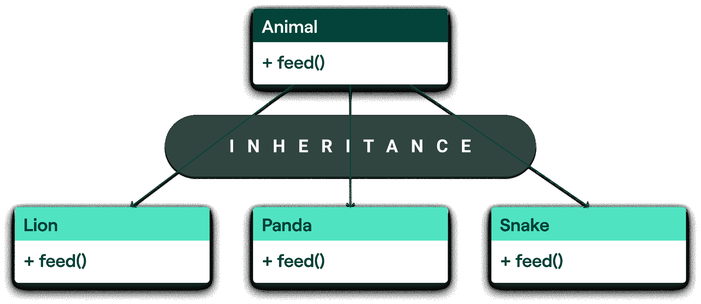

# 如何使用抽象类编写更简洁的 Python 代码

> 原文：<https://blog.teclado.com/python-abc-abstract-base-classes/>

什么是抽象类？它们为什么有用？你应该什么时候使用它们？我举几个例子说明一下吧！在这篇文章结束时，你将对 Python 中的 ABC 有一个牢固的理解，以及如何将它们添加到你的程序中。

我们开始吧！

## 没有抽象类的代码

我认为最好的学习方法是使用示例，所以让我们来看看下面的代码:

```
class Lion:
    def give_food(self):
        print("Feeding a lion with raw meat!")

class Panda:
    def feed_animal(self):
        print("Feeding a panda with some tasty bamboo!")

class Snake:
    def feed_snake(self):
        print("Feeding a snake with mice!")

# Animals of our zoo:
leo = Lion()
po = Panda()
sam = Snake() 
```

我们的工作是使用 Python 脚本喂养所有的动物。一种方法是:

```
leo.give_food()
po.feed_animal()
sam.feed_snake() 
```

这是可行的。但是想象一下，在一个大型动物园里，为每一只动物做这件事，重复同样的过程和代码几百次，要花多少时间。这也会使代码更难维护。

目前我们程序的结构看起来像这样:


我们希望优化流程，所以我们可以提出这样一个解决方案:

```
# Put all the animals in a list:
zoo = [leo, po, sam] # Could be many more animals there!

# Loop through the animals and feed them
for animal in zoo:
	# But what do we put here now?
	# Is it animal.give_food() or animal.feed_animal(), hmm?
	animal.feed() # This will throw an AttributeError! 
```

问题是每个类都有不同的方法名，喂狮子的时候是`give_food()`，喂熊猫的时候是`feed_animal()`，喂蛇的时候是`feed_snake()`。

这段代码很乱，因为做同样事情的方法应该被命名为相同的。

如果我们只能强制我们的类实现相同的方法名...

## 引入抽象类

原来*抽象类*才是我们需要的。本质上，它强制它的子类实现它的所有抽象方法。它是一个代表其子类外观的类。

一个更好的结构应该是这样的(`Animal`是一个抽象类):



通过引入抽象类(`Animal`)，每个从`Animal` **继承的类必须**实现来自`Animal`的抽象方法，在我们的例子中是方法`feed()`

让我们看一下代码:

```
from abc import ABC, abstractmethod
# abc is a builtin module, we have to import ABC and abstractmethod

class Animal(ABC): # Inherit from ABC(Abstract base class)
    @abstractmethod  # Decorator to define an abstract method
    def feed(self):
        pass 
```

当定义一个抽象类时，我们需要继承抽象基类- `ABC`。

要在抽象类中定义一个抽象方法，我们必须使用一个装饰器:`@abstractmethod`。内置的`abc`模块包含了这两者。

如果你从 Animal 类继承，但是没有实现抽象方法，你会得到一个错误:

```
class Panda(Animal): # If a class inherits from an ABC, it must implement all it's abstract methods!
    def wrong_name(self): # The method's name must match the name of the ABC's method
        print("Feeding a panda with some tasty bamboo!") 
```

如果我们试图实例化这个类(例如`po = Panda()`)，它会抛出一个`TypeError`，因为没有抽象方法`feed()`我们就无法实例化 Panda。

记住这一点，我们需要让我们的动物(这次是正确的):

```
class Lion(Animal):
    def feed(self):
        print("Feeding a lion with raw meat!") 

class Panda(Animal): 
    def feed(self): 
        print("Feeding a panda with some tasty bamboo!") 

class Snake(Animal): 
    def feed(self): 
        print("Feeding a snake with mice!") 
```

最后，这是我们创造和喂养动物所需的所有代码:

```
zoo = [Lion(), Panda(), Snake()]

for animal in zoo:
    animal.feed() # Now this won't throw an error! 
```

## 编写带参数的抽象方法

当一个抽象方法有参数时会发生什么？当子类实现方法时，它也必须包含所有的参数。如果需要，子类的实现也可以添加额外的参数。

```
from abc import ABC,abstractmethod 

class Animal(ABC):
    @abstractmethod  
    def do(self, action): # Renamed it to "do", and it has "action" parameter
        pass

class Lion(Animal): 
    def do(self, action, time): # It's still mandatory to implement action. "time" is our other parameter
        print(f"{action} a lion! At {time}") 

class Panda(Animal): 
    def do(self, action, time): 
        print(f"{action} a panda! At {time}") 

class Snake(Animal): 
    def do(self, action, time): 
        print(f"{action} a snake! At {time}") 
```

```
zoo = [Lion(), Panda(), Snake()]

for animal in zoo:
    animal.do(action="feeding", time="10:10 PM") 
```

运行上面的代码将会打印出:

```
feeding a lion! At 10:10 PM
feeding a panda! At 10:10 PM
feeding a snake! At 10:10 PM 
```

我们也可以使用默认参数，你可以在这里读到这些参数。

## 编写(抽象)属性

我们可能还想创建抽象属性，并强制我们的子类实现这些属性。这可以通过使用`@property`装饰器和`@absctractmethod`来完成。

由于动物通常有不同的饮食，我们需要在动物类中定义一个`diet`。由于所有的动物都继承自`Animal`，我们可以将`diet`定义为一个抽象属性。除了`diet`，我们将使`food_eaten`成为属性，它的`setter`将检查我们是否试图给动物喂食它的`diet`上没有的东西。

看一下`Animal`、`Lion`、`Snake`的代码:

```
from abc import ABC, abstractmethod

class Animal(ABC):
    @property                 
    def food_eaten(self):     
        return self._food

    @food_eaten.setter
    def food_eaten(self, food):
        if food in self.diet:
            self._food = food
        else:
            raise ValueError(f"You can't feed this animal with {food}.")

    @property
    @abstractmethod
    def diet(self):
        pass

    @abstractmethod 
    def feed(self, time):
        pass

class Lion(Animal):
    @property                 
    def diet(self):     
        return ["antelope", "cheetah", "buffaloe"]

    def feed(self, time):
        print(f"Feeding a lion with {self._food} meat! At {time}") 

class Snake(Animal):
    @property                 
    def diet(self):     
        return ["frog", "rabbit"]

    def feed(self, time): 
        print(f"Feeding a snake with {self._food} meat! At {time}") 
```

我们可以创建两个对象，设置我们要喂它们的食物，然后调用`feed()`方法:

```
leo = Lion()
leo.food_eaten = "antelope" 
leo.feed("10:10 AM")
adam = Snake()
adam.food_eaten = "frog"
adam.feed("10:20 AM") 
```

它将打印出:

```
Feeding a lion with antelope meat! At 10:10 AM
Feeding a snake with frog meat! At 10:10 AM 
```

如果我们试图给动物喂食它不吃的东西:

```
leo = Lion()
leo.food_eaten = "carrot" 
leo.feed("10:10 AM") 
```

`setter`将引发一个`ValueError`:

```
You can't feed this animal with carrot. 
```

在学习抽象类时，您可能遇到过元类。

一个类定义了该类的一个实例如何行为(例如，`Animal`描述了`Lion`将如何行为)。另一方面，元类定义了类的行为方式(`ABCMeta`描述了每个`ABC`类的行为方式)。类是元类的一个实例。

`abc`模块带有一个元类`ABCMeta`。回到过去，我们必须用它来定义带有`metaclass=abc.ABCMeta`的元类。
如今，只要从`ABC`继承就可以做同样的事情——所以你根本不用担心元类！

## 摘要

在这篇博文中，我们描述了 Python 抽象类的基础。当与其他开发人员在一个团队中工作，并且项目的各个部分并行开发时，它们特别有用。

以下是一些关键要点:

*   抽象类确保派生类实现抽象基类中定义的方法和属性。
*   无法实例化抽象基类。
*   我们使用`@abstractmethod`在抽象基类和`@property`与`@abstractmethod`的组合中定义一个方法，以定义一个抽象属性。

我希望你今天学到了新东西！如果你想进一步提升你的 Python 技能，请查看我们的[完整 Python 课程](https://go.tecla.do/complete-python-sale)。