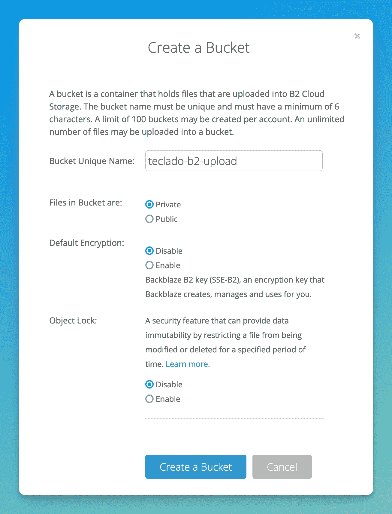
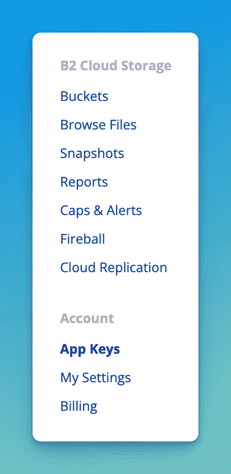
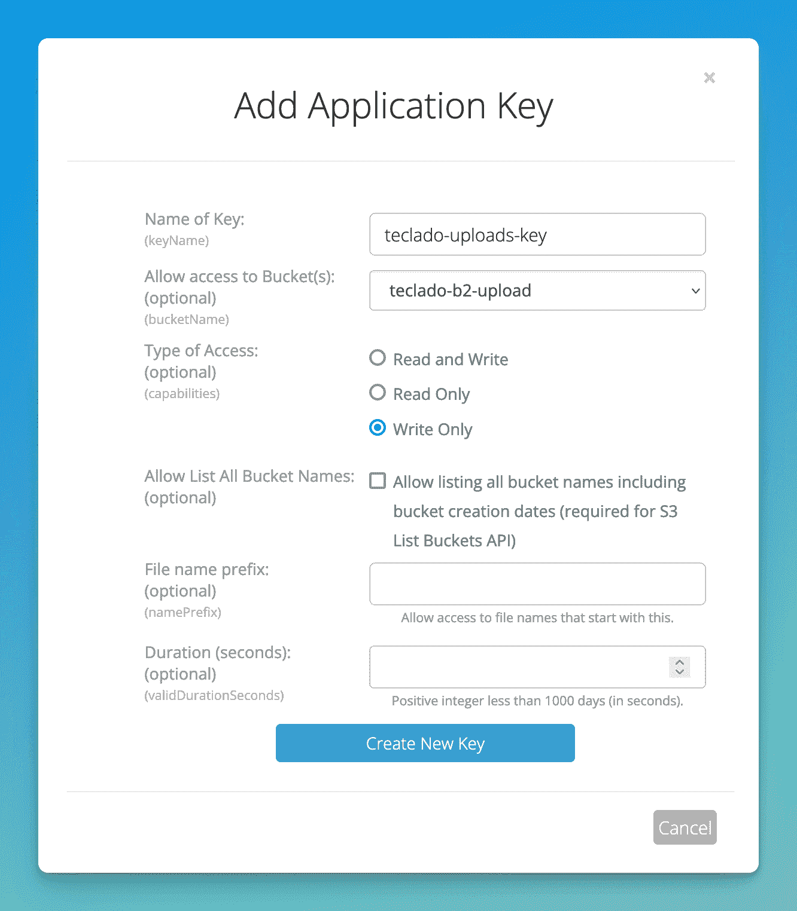
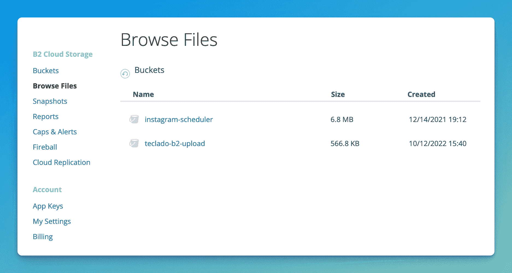
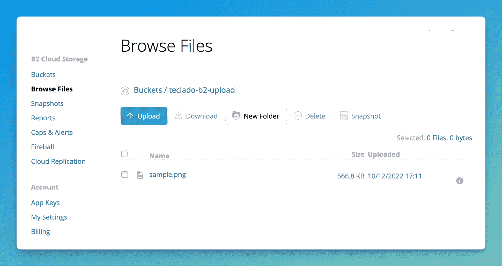
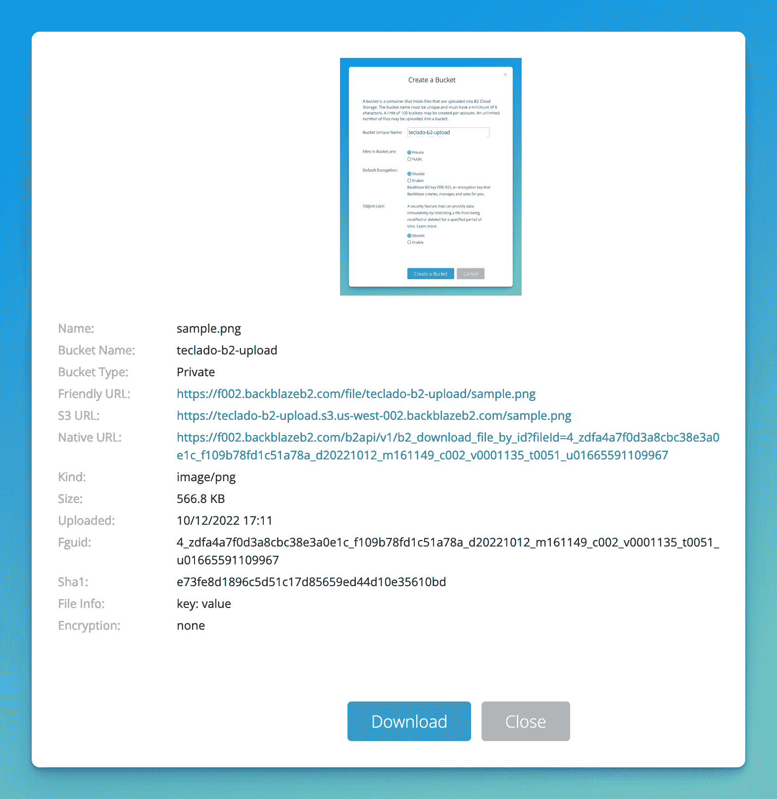

# 如何使用 Python 将文件上传到 Backblaze B2

> 原文：<https://blog.teclado.com/python-file-upload-backblaze-b2/>

如果您的应用程序接收用户上传的文件，那么您将面临许多令人头痛的问题。将文件存储在服务器中很难扩展，存储在数据库中通常会很慢(而且很贵！).最好的选择是将文件存储在专门为此设计的 web 服务中。

在本文中，我们来谈谈 Backblaze B2，这是一个文件存储解决方案，具有超级[易用的 API](https://b2-sdk-python.readthedocs.io/en/master/quick_start.html) 和慷慨的免费层。另外，它通过 [boto3](https://boto3.amazonaws.com/v1/documentation/api/latest/guide/quickstart.html) 与 AWS S3 API 完全兼容。

今天我将向你展示如何使用`b2-sdk-python`，他们的内部 API，而不是`boto3`。

## 设置您的 B2 帐户

首先，[通过他们的门户网站注册](https://www.backblaze.com/b2/sign-up.html?referrer=nopref)。

一旦完成，进入你的 [B2 云存储桶](https://secure.backblaze.com/b2_buckets.htm)，并创建一个。将文件设为私有，禁用加密(目前)，并禁用对象锁。



现在让我们用 Python 上传一个文件。之后，我将向您展示如何将上传到 B2 与您的 Flask 应用程序集成在一起。

## 使用 Python 上传到 Backblaze B2

上传文件到 Backblaze B2 需要几个步骤:

1.  授权您的帐户。
2.  打开你的桶。
3.  弄清楚你上传的是什么。
4.  实际上传文件。

### 使用 Backblaze B2 和 Python 进行帐户授权

为此，你需要你的应用密钥。请访问网站上“帐户”下的“应用程序密钥”部分获取应用程序密钥:



然后，滚动到底部，点击“添加新的应用程序密钥”。

在这里，您会想要:

*   为应用程序密钥命名。
*   只允许访问您希望在应用程序中使用的存储桶(如果您希望访问多个存储桶，则允许访问更多存储桶)。
*   使它“只写”，因为这个应用程序将允许文件上传，但它不允许我们读取文件。



然后，您会想要保存`keyID`和`applicationKey`。为此，在您的项目目录中创建一个`.env`文件，并将值放在那里(我的是假值):

```
B2_KEY_ID=045f47eaec1gfgg94100002
B2_APPLICATION_KEY=J131s4ffbaq6i41SR+Hk131k1kj1jak+ZI 
```

现在我们已经在这里得到了这些文件，如果您打算使用 Git 来做这件事，许多人肯定会将`.env`添加到您的`.gitignore`中:

```
.env
*.pyc
.DS_Store
.venv
# Other things you want to ignore 
```

好了，现在让我们安装 Backblaze B2 Python SDK。

首先让我们创建一个名为`requirements.txt`的文件，其中包含以下内容:

```
b2sdk
python-dotenv 
```

`python-dotenv`库将用于读取我们的`.env`文件的内容，并将它们放入环境变量中。然后，我将创建一个虚拟环境，激活它，并安装两个库:

```
$ pyenv local 3.10.7
$ pyenv exec python -m venv .venv
$ source .venv/bin/activate  # different on Windows
$ pip install -r requirements.txt 
```

接下来，为实际的文件上传创建一个 Python 文件，比如`app.py`。此时，最好找到一个文件或图像来测试上传，并把它放在你的项目文件夹中！

```
import os
import b2sdk.v2 as b2
from dotenv import load_dotenv

load_dotenv()

info = b2.InMemoryAccountInfo()
b2_api = b2.B2Api(info)

application_key_id = os.getenv("B2_KEY_ID")
application_key = os.getenv("B2_APPLICATION_KEY")

b2_api.authorize_account("production", application_key_id, application_key) 
```

上面的`"production"`就是境界。不幸的是[没有太多信息](https://b2-sdk-python.readthedocs.io/en/master/api/api.html#b2sdk.v2.B2Api.authorize_account)关于这意味着什么。

### 使用 SDK 访问您的存储桶

这个很简单:

```
bucket = b2_api.get_bucket_by_name("teclado-b2-upload") 
```

现在，我们必须找到想要上传的文件，并确定想要添加到图像中的任何元数据。

用最简单的话来说，就是这样做:

```
from pathlib import Path

file_name = "sample.png"
local_file = Path(file_name).resolve()
metadata = {"key": "value"} 
```

这里我使用了`pathlib`,虽然这并不是绝对必要的，这样以后如果你想开始把东西放在子目录中，这样做更容易一些。

### 用 SDK 实际处理上传

最后，要将文件推送到 B2 存储桶，请执行以下操作:

```
uploaded_file = bucket.upload_local_file(
    local_file=local_file,
    file_name=file_name,
    file_infos=metadata,
)

print(b2_api.get_download_url_for_fileid(uploaded_file.id_)) 
```

这样做上传你的文件，并给你一个网址，你可以看到你的文件...如果在创建存储桶时将文件设置为“public”。因为我们将它们设置为“private ”,所以在访问该 URL 时会出现 401 未授权错误。

### 如何通过 web 门户查看上传的文件

虽然文件在桶中，但你可以通过 B2 门户网站进入桶中看到它。首先访问您的存储桶:



然后你会看到那里的图像！



如果你点击图片，你可以看到它的样子，你也可以在“文件信息”下看到你的图片的存储信息:



## 最终代码

这是我的`app.py`上传文件到 Backblaze B2 的代码！

```
import os
import b2sdk.v2 as b2
from dotenv import load_dotenv
from pathlib import Path

load_dotenv()

info = b2.InMemoryAccountInfo()
b2_api = b2.B2Api(info)

application_key_id = os.getenv("B2_KEY_ID")
application_key = os.getenv("B2_APPLICATION_KEY")

b2_api.authorize_account("production", application_key_id, application_key)

bucket = b2_api.get_bucket_by_name("teclado-b2-upload")

file_name = "sample.png"
local_file = Path(file_name).resolve()
metadata = {"key": "value"}

uploaded_file = bucket.upload_local_file(
    local_file=local_file,
    file_name=file_name,
    file_infos=metadata,
)

print(b2_api.get_download_url_for_fileid(uploaded_file.id_)) 
```

## 整合 B2 上传与你的烧瓶应用程序

在最近的 Flask 博客文章中，我们提到了图片上传，但是我们留下了一个关键问题:如何处理上传的文件。

让我们将 Backblaze B2 上传与该项目相结合。如果您忘记了，该项目有一个 Flask 应用程序，它有两个路径:一个用于提供带有文件上传表单的页面，另一个用于接受文件“块”。每个块都是上传文件的一部分。分块是由库“Dropzone.js”完成的，这使得非常大的文件不会完全阻塞 Flask 应用程序。

我们的`requirements.txt`:

```
flask 
```

我们的`app.py`:

```
import os
from pathlib import Path

from flask import Flask, render_template, request
from werkzeug.utils import secure_filename

app = Flask(__name__)

@app.get("/")
def index():
    return render_template("index.html")

@app.post("/upload")
def upload_chunk():
    file = request.files["file"]
    file_uuid = request.form["dzuuid"]
    # Generate a unique filename to avoid overwriting using 8 chars of uuid before filename.
    filename = f"{file_uuid[:8]}_{secure_filename(file.filename)}"
    save_path = Path("static", "img", filename)
    current_chunk = int(request.form["dzchunkindex"])

    try:
        with open(save_path, "ab") as f:
            f.seek(int(request.form["dzchunkbyteoffset"]))
            f.write(file.stream.read())
    except OSError:
        return (
            "Error saving file.",
            500,
        )  # 400 and 500 error codes show up in Dropzone as errors

    total_chunks = int(request.form["dztotalchunkcount"])

    if current_chunk + 1 == total_chunks:
        # This was the last chunk, the file should be complete and the size we expect
        if os.path.getsize(save_path) != int(request.form["dztotalfilesize"]):
            return "Size mismatch.", 500

    return "Chunk upload successful.", 200 
```

我们的`index.html`:

```
<!DOCTYPE html>
<html lang="en">
<head>
    <meta charset="UTF-8">
    <meta http-equiv="X-UA-Compatible" content="IE=edge">
    <meta name="viewport" content="width=device-width, initial-scale=1.0">
    <script src="https://unpkg.com/[[email protected]](/cdn-cgi/l/email-protection)/dist/min/dropzone.min.js"></script>
    <link rel="stylesheet" href="https://unpkg.com/[[email protected]](/cdn-cgi/l/email-protection)/dist/min/dropzone.min.css" type="text/css" />
    <title>File Upload with Dropzone.js</title>
</head>
<body>
    <form
        method="POST"
        action="/upload"
        class="dropzone dz-clickable"
        id="dropper"
        enctype="multipart/form-data"
    >
    </form>

    <script type="application/javascript">
        Dropzone.options.dropper = {
            paramName: "file",
            chunking: true,
            forceChunking: true,
            url: "/upload",
            maxFilesize: 1025, // megabytes
            chunkSize: 10000 // bytes
        }
    </script>
</body>
</html> 
```

要将 B2 集成到这个应用程序中，我们所要做的就是连接到我们的应用程序并获取我们的 bucket，然后当我们接收完所有的文件块后，将完成的文件上传到 B2。

我们确实需要将文件*存储在某个地方*几秒钟，因为我们的上传方法要求文件在上传到 B2 之前在磁盘中。

我们的应用程序已经在这样做了，所以没有太多要添加的。概括一下:

1.  用你的`B2_KEY_ID`和`B2_APPLICATION_KEY`创建你的`.env`文件。
2.  授权您的帐户。
3.  去拿你的桶。
4.  上传您的文件。

### 授权您的 B2 帐户，并在创建应用程序时获得桶

在文件的顶部，创建应用程序后，我将添加我们已经看到的代码来授权帐户。我已经在已经存在的行上留下了评论。

```
import os  # existing code
import b2sdk.v2 as b2
from pathlib import Path  # existing code

from flask import Flask, render_template, request  # existing code
from werkzeug.utils import secure_filename  # existing code
from dotenv import load_dotenv

load_dotenv()

app = Flask(__name__)  # existing code

info = b2.InMemoryAccountInfo()
b2_api = b2.B2Api(info)

application_key_id = os.getenv("B2_KEY_ID")
application_key = os.getenv("B2_APPLICATION_KEY")

b2_api.authorize_account("production", application_key_id, application_key)

bucket = b2_api.get_bucket_by_name("teclado-b2-upload") 
```

### 当您收到最后一块时，请上传文件

目前，我们的上传端点中有这组 if 语句:

```
if current_chunk + 1 == total_chunks:
    # This was the last chunk, the file should be complete and the size we expect
    if os.path.getsize(save_path) != int(request.form["dztotalfilesize"]):
        return "Size mismatch.", 500 
```

我们正在检查我们已经完成了文件的上传，我们正在检查是否有错误。

我们可以在内部 if 语句中添加一个`else`分支，当上传成功时它将运行。在那里，我们将进行上传！记住文件应该已经在`./static/img/{filename}`了。还要记住从本地磁盘上删除文件，这样它们就不会永远存在了:

```
if current_chunk + 1 == total_chunks:
    # This was the last chunk, the file should be complete and the size we expect
    if os.path.getsize(save_path) != int(request.form["dztotalfilesize"]):
        return "Size mismatch.", 500
    else:
        # Upload successful, so let's put the file in B2
        uploaded_file = bucket.upload_local_file(
            local_file=save_path.resolve(),
            file_name=filename
        )
        os.remove(save_path)  # Delete file so they don't stick around forever

        print(b2_api.get_download_url_for_fileid(uploaded_file.id_)) 
```

就是这样！这应该上传你的文件(用一个独特的名字)到 Backblaze B2。

在这篇文章中，我们学习了如何使用 Python 将文件上传到 Backblaze B2，以及如何使用 Dropzone.js 将文件上传集成到 Flask 应用程序中。我希望你喜欢它！

如果您想了解更多关于使用 Flask 和 Python 进行 web 开发的知识，包括 HTML、CSS、设计 web 应用程序、交互性等等，请考虑参加我们的 [Web 开发者训练营 Flask 和 Python](https://go.tecla.do/web-dev-course-sale) ！