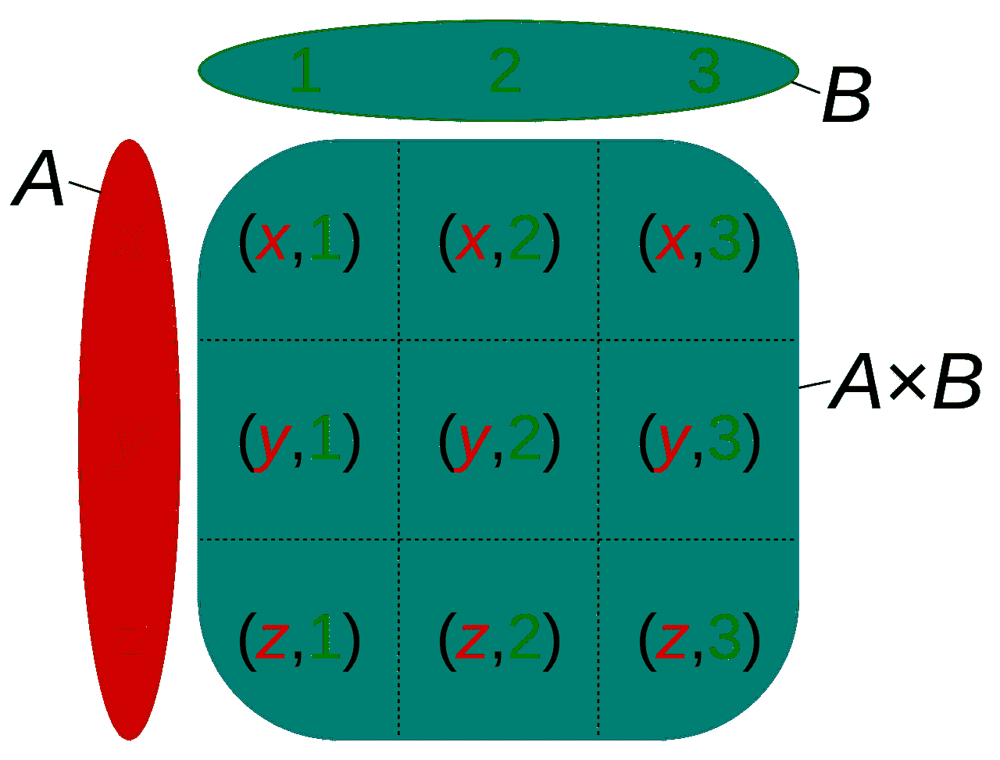

# Python Itertools 第 1 部分-产品

> 原文：<https://blog.teclado.com/python-itertools-part-1-product/>

`product`函数是包含在`itertools`模块中的几个方便的组合迭代器之一。组合迭代器与一个叫做枚举组合学的数学领域有关，它涉及一个给定模式可以形成的方式的数量。

`product`为我们提供了一种快速计算两个或更多集合的[笛卡尔积](https://en.wikipedia.org/wiki/Cartesian_product)的方法。下面是笛卡尔积的一个例子:



Image by Quartl, [CC BY-SA 3.0](https://creativecommons.org/licenses/by-sa/3.0/)

`product`也经常作为在列表理解中包含多个`for`子句的替代方法。

在[之前的帖子](https://blog.teclado.com/python-list-comprehensions/)中，我们提供了列表理解的代码，该代码将计算两个六面骰子所有可能的掷骰子组合。

```
roll_combinations = [(d1, d2) for d1 in range(1, 7) for d2 in range(1, 7)] 
```

我们可以使用`product`函数做同样的事情。

```
from itertools import product

dice_combinations = product(range(1, 7), repeat=2) 
```

这是怎么回事？

`product`函数接受任意数量的 iterables 作为位置参数，并有一个名为`repeat`的可选关键字 only 参数。

当我们提供两个或更多的 iterables 作为参数时，`product`函数将找到所有的方法来匹配这些 iterables 中的一个元素和其他 iterable 中的一个元素。例如，我们可能有这样一对列表:

```
list_1 = ["a", "b", "c"]
list_2 = [1, 2, 3] 
```

当我们将这些列表传递给 product 函数时，我们得到以下内容:

```
cartesian_product = product(list_1, list_2)
# ('a', 1) ('a', 2) ('a', 3) ('b', 1) ('b', 2) ('b', 3) ('c', 1) ('c', 2) ('c', 3) 
```

如果我们要添加第三个 iterable，这些元组中的每一个都将与第三个 iterable 中的一个条目匹配。例如，如果我们有包含`"x"`、`"y"`和`"z"`的第三个列表，我们将得到如下输出:

```
# ('a', 1, 'x') ('a', 1, 'y') ('a', 1, 'z') ('a', 2, 'x') ... etc. 
```

当我们想要多次使用同一个 iterable 时,`repeat`参数最有用。我们可以在寻找滚动组合的代码中看到这样的例子。通过增加`repeat`的值，我们可以轻松地添加越来越多的骰子。

如果当我们有多个可迭代对象时，我们将`repeat`的值设置为`2`或更大，`product`将复制**所有的可迭代对象，以便找到笛卡尔积。以下功能在功能上是相同的:**

```
c_product_1 = product(["a", "b", "c"], [1, 2, 3], repeat=2)
c_product_2 = product(["a", "b", "c"], [1, 2, 3], ["a", "b", "c"], [1, 2, 3]) 
```

这就结束了我们对`itertools` `product`函数的介绍。我希望您学到了一些新东西，我鼓励您尝试我们在这里介绍的东西，以便真正理解它是如何工作的。

我们每周一发布新的[片段帖子](https://blog.teclado.com/tag/python-snippets/)，周四发布更实质性的内容，但以防你忘记，你可能想在[推特](https://twitter.com/TecladoCode)上关注我们，以了解我们所有的最新内容。下周一我们将介绍一些其他很酷的`itertools`功能，所以请确保下周[回来查看](https://blog.teclado.com/ghost/#/editor/post/5cfcb0ef36f461647e469ee6/)！或者，您可以尝试一下我们的[完整 Python 课程](https://www.udemy.com/the-complete-python-course/?couponCode=BLOGGER)，在那里我们将深入探讨其中的一些主题。

我们也很想听听你认为我们应该写的很酷的技巧和诀窍，所以在 [Twitter](https://twitter.com/TecladoCode) 上联系，或者加入我们的 [Discord server](https://discord.gg/BBWwyMq) ！