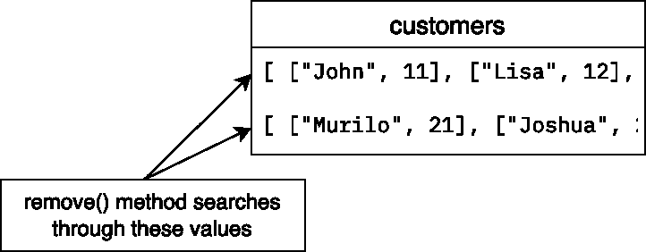

# Python 列表:remove()与 pop()

> 原文：<https://blog.teclado.com/python-lists-remove-vs-pop/>

如果您想在 Python 中从列表中删除一个条目，那么`remove()`和`pop()`方法可能会派上用场——但是它们确实有一些不同。

在本帖中，我们将比较这些方法，并向您展示如何在 Python 中使用它们！

## `remove()`法

此方法从列表中移除第一个匹配值。第一个匹配值是通过遍历列表找到的，直到给定的值等于(`==`)列表中项的值。

下面是如何在 Python 中使用`remove()`方法:

```
customers = [
    ['John', 1],
    ['John', 1],
    ['Lisa', 2],
    ['Rolf', 3],
    ['John', 4]
]

customers.remove(['John', 1]) 
```

如果运行这段代码，`customers`变量将如下所示:

```
customers = [
    ['John', 1],
    ['Lisa', 2],
    ['Rolf', 3],
    ['John', 4]
] 
```

这是因为只有第一个匹配值被从列表中删除。

在这种情况下，如果您想删除具有给定名称和 id 的客户，而不需要自己搜索列表，那么`remove()`方法就很有用。您可以在其他情况下使用它，在这些情况下，您知道要删除的项的值，但不知道该项的确切索引。

如果提供的值不在列表中，那么将引发一个`ValueError`。

## `pop()`法

方法用于从列表中移除一个条目并返回它。

从列表中逐个删除项目并检索它们的值会很有用。您可能想要处理删除的数据，将它保存在其他地方，等等。在 Python 中，我们使用了`pop()`方法！

如果使用不带任何参数的`pop()`，默认情况下，最后一项将从列表中删除并返回:

```
customers = [
    ['John', 1],
    ['Lisa', 2],
    ['Rolf', 3],
    ['John', 4]
]

customer = customers.pop()  # ['John', 4] 
```

`customers`列表更改为:

```
customers = [
    ['John', 1],
    ['Lisa', 2],
    ['Rolf', 3]
] 
```

`customer`变量现在看起来像这样:

```
customer = ['John', 4] 
```

此方法还可以接受一个参数，该参数是要移除的项的索引:

```
customers.pop(1) 
```

在这种情况下，第二项将从列表中删除并返回。请记住，您可以将返回值赋给变量。
最后，`customers`变量现在看起来像这样:

```
customers = [
    ['John', 1],
    ['Rolf', 3]
] 
```

## 从嵌套列表中移除项目

您可能会遇到如下所示的列表:

```
customers = [
    [["John", 11],["Lisa", 12],["Rolf", 13]],
    [["Murilo", 21],["Joshua", 22]]
] 
```

客户可能已经按照他们来自的城市、国家等进行了分组。

更高层次的嵌套要求您在使用上述方法时要精确，我们将在下面介绍这些方法。

### 对双重嵌套列表使用`remove()`

让我们像以前一样尝试从`customers`列表中删除`["John", 11]`:

```
customers.remove(["John", 11]) 
```

如果你运行这段代码，你会看到一个`ValueError`。出现错误是因为`["John", 11]`是嵌套列表中的一项，而嵌套列表是更大列表中的一项，如下图所示:



要删除此项，您需要先访问内部列表，然后删除它:

```
customers[0].remove(["John", 11]) 
```

在这一行中，我们访问了列表的第一项，即内部列表，然后删除了第一个匹配值。更改后的列表如下所示:

```
customers = [
    [["Lisa", 12],["Rolf", 13]],
    [["Murilo", 21],["Joshua", 22]]
] 
```

例如，如果您想要删除一整组客户，也可以删除整个内部列表。

```
customers.remove([["Lisa", 12],["Rolf", 13]]) 
```

在这种情况下，您不必访问主列表的任何项目，因为您正在以与我们在帖子的第一部分中所做的相同的方式删除它的项目。

### 对双重嵌套列表使用`pop()`

我们现在可以使用`pop()`方法从列表中删除一个项目:

```
customers = [
    [["John", 11],["Lisa", 12],["Rolf", 13]],
    [["Murilo", 21],["Joshua", 22]]
]

customer = customers.pop() # [["Murilo", 21],["Joshua", 22]] 
```

`customers`列表现在看起来像这样:

```
customers = [[["John", 11],["Lisa", 12],["Rolf", 13]]] 
```

这样做的原因是我们对整个`customers`列表应用了该方法，列表的条目是内部列表。

您还可以使用`pop()`方法从内部嵌套列表中删除项目:

```
customers[0].pop(1) 
```

我们现在将该方法应用于`customers`列表的第一项:

```
[["John", 11],["Lisa", 12],["Rolf", 13]] 
```

其中删除了它的第二项:`["Lisa", 12]`。之后，`customers`列表变成:

```
customers = [[["John", 11],["Rolf", 13]]] 
```

## 结论

在这篇文章中，我们看到了两种从 Python 列表中删除条目的方法:使用`remove()`和`pop()`方法。这两种方法在不同的情况下都很有用，所以我们鼓励你自己尝试一下！

如果你想学习更多关于 Python 的知识，可以考虑参加我们的[完整 Python 课程](https://go.tecla.do/complete-python-sale)，它将带你从初级到高级(包括 OOP、web 开发、异步开发等等！).我们有一个 **30 天退款保证**，所以你真的没有什么损失去尝试一下。我们很希望你能来！