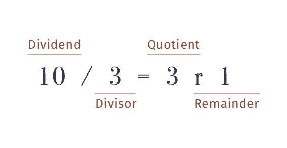

# Python 的模运算符和地板划分

> 原文：<https://blog.teclado.com/pythons-modulo-operator-and-floor-division/>

除了加减乘除的常用运算符，Python 标准库还包括一些您可能不太熟悉的算术运算符。在这篇文章中，我将讨论模(`%`)和底除法(`//`)运算符，以及一些与它们相关的常见陷阱。

## 模和地板除法是做什么的？

### 以…为模

模运算符用于执行欧几里得除法。你几乎肯定在学校学过欧几里德除法，即使你不知道它叫什么。

当执行欧几里德除法时，你从一个**被除数**(你要除的数)和一个**除数**(你要除被除数的数)开始。先说`10`和`3`。

在我们可能认为的“标准除法”中，`10 / 3`的结果是`3.333`重复出现，或者是`3`和第三个。在欧几里德除法中，我们不关心小数点后的数字。我们关心除法的整数结果(在本例中是`3`)，它被称为**商**。除法运算后剩下的数叫做**余数**，在这种情况下就是`1`。



再给你一个例子，`11 / 3`给我们一个`3`的商和一个`2`的余数。

在 Python 中，模运算符只产生余数:

```py
>>> 10 % 3
1
>>> 11 % 3
2 
```

### 楼层划分

底数除法也用于执行欧几里得除法，但与模运算符不同，底数除法产生的是**商**，而不是余数。

让我们看几个例子:

```py
>>> 10 // 3
3
>>> 9 // 2
4 
```

我们可以创建一个小函数来打印欧几里德除法的完整结果，如下所示:

```py
def euclidean_division(x, y):
	quotient = x // y
	remainder = x % y
	print(f"{quotient} remainder {remainder}")

euclidean_division(10, 3)  # 3 remainder 1
euclidean_division(11, 3)  # 3 remainder 2 
```

然而，有一个问题。当我们用负数调用函数时会发生什么？

```py
>>> euclidean_divison(10, -3)
-4 remainder -2 
```

这看起来不对劲。`-3`乘以`-4`等于`12`，高于`10`。我们应该得到的结果是`-3`余数`1`。这是怎么回事？

## 这是楼层部门的错

我之前给你们描绘的欧几里德除法并不完全准确。对于正整数，除底和取模的工作方式与欧几里得除法完全一样，但是对于负数，事情就变得更复杂了。

其原因与舍入有关。如果我们看一下关于算术运算符的 [Python 文档](https://docs.python.org/3/reference/expressions.html#binary-arithmetic-operations),我们会发现一条线索:

> [底数除法]的结果是对结果应用“底数”函数的数学除法的结果。

好的，让我们来看看`floor`函数的[文档](https://docs.python.org/3/library/math.html?highlight=floor#math.floor)。

> 返回 x 的下限，即小于或等于 x 的最大整数。

这就是问题所在。`-4`被视为小于`-3.333`的循环。它在数字线的更左边。这意味着，对于负数，下限除法将始终从零开始舍入，而对于正数，将向零舍入。

```py
>>> 10 // 3
3    # 3.333 rounds towards zero
>>> 10 // -3
-4    # -3.333 rounds away from zero
>>> 9 // 2
4    # 4.5 rounds towards zero
>>> 9 // -2
-5    # -4.5 rounds away from zero 
```

## 那么模有什么问题呢？

我们已经弄清楚为什么我们会从地板划分和负数中得到意想不到的结果，但是我们的余数也不是我们所期望的。为什么会这样呢？

事实证明，模和底除法是紧密相连的运算符，如果您在文档中看得更远一点，您可能已经读过这些运算符。模和地板划分由以下恒等式连接:`x = (x // y) * y + (x % y)`。

这意味着地板除法的结果对模运算的结果有直接影响。我们可以这样重新排列上面的:`(x % y) = x - (x // y) * y`。

让我们来试试我们之前的一个例子，`10 % -3`:

```py
10 % -3 = 10 - (-3) * (10 // -3)
10 % -3 = 10 - (-3) * (-4) # Remember, here floor division rounds away from zero
10 % -3 = 10 - 12
10 % -3 = -2 
```

我们得到了和之前完全一样的结果:`10 % -3 = -2`。

## 最后一点

在这最后一节，我只想提一些关于模和底除法的其他有趣的事情。然而，在我深入讨论之前，我认为重要的是要注意 Python 中的底除法和模运算的实现并不是一个 bug。然而，我确实认为理解这样的实现何时以及如何不同于我们的直觉理解是很重要的，因为这样我们就可以将这种实现作为一种工具来使用，并且它不再是令人沮丧的错误的来源。

### 类型转换

Python 中关于 floor division 的一个有趣的事情是，它不一定产生浮点数。事实上，在我们所有的例子中，结果都是一个整数。这与 Python 中的标准除法完全不同，后者总是产生浮点数。

模运算符的工作方式相同，如果两个操作数都是整数，则生成一个整数。

如果任一操作数是浮点数，模和底除法都会产生浮点数。

### 使用浮动

虽然这篇文章中的例子都是整数，但是对任何一个操作数使用浮点数都是完全可能的，而且它们的工作方式完全相同，它们只是产生一个浮点数。

文档中的一个例子是`3.14 % 0.7`，它将产生`0.34`。

### 复数

复数是具有实部和虚部的数。它们在这里值得一提，因为无论是模还是底除法都不接受复数作为操作数。试图使用复数进行除法或模运算会引发`TypeError`。

## 概述

*   对于正数，底数除法和模运算类似于欧几里得除法，分别产生商和余数。
*   对于负数，这两种操作都会产生稍微出乎意料的结果。
*   对于负数，除法运算总是从零开始舍入，所以`-3.5`会舍入到`-4`，但是对于正数，除法运算会向零方向舍入，所以`3.5`会舍入到`3`。
*   底数除法和模运算由下面的恒等式`x = (x // y) * y + (x % y)`联系起来，这就是为什么模运算*也*对负数产生意想不到的结果，而不仅仅是底数除法。

我希望你学到了一些新东西，如果你想进一步提升你的 Python 技能，请查看我们的[完整 Python 课程](https://go.tecla.do/complete-python-sale)。