# Tkinter 包装几何管理器中的侧值

> 原文：<https://blog.teclado.com/side-values-in-tkinters-pack-geometry-manager/>

上周我们简单看了一下 Tkinter 的 pack geometry manager，这是一个 Python 的 GUI 开发工具包。当我们查看名为`side`的 pack 配置时，我们遇到了一些问题。在这篇文章中，我们将仔细研究 pack，我们将弄清楚如何使用`side`，以及它能为我们做什么。

如果你对 Tkinter 不是很熟悉，或者你根本不知道它是什么，我推荐你看看[上周的帖子](https://blog.teclado.com/tkinters-pack-geometry-manager/)。我们在那里涵盖了一些基础知识。在我们的[完整 Python 课程](https://www.udemy.com/the-complete-python-course/?couponCode=BLOGGER)中，也有关于 Tkinter 的部分。

## 故事到此为止

我们已经使用一个简单的固定大小的窗口和几个矩形的`Label`部件探索了 pack。代码看起来像这样:

```py
import tkinter as tk

root = tk.Tk()
root.geometry("600x400")

rectangle_1 = tk.Label(root, text="Rectangle 1", bg="green", fg="white")
rectangle_1.pack(ipadx=10, ipady=10)

rectangle_2 = tk.Label(root, text="Rectangle 2", bg="red", fg="white")
rectangle_2.pack(ipadx=10, ipady=10)

root.mainloop() 
```

这里，我们为 pack 添加的唯一配置是一些内部填充，以使`Label`内容更容易阅读。

现在，应用程序看起来像这样:

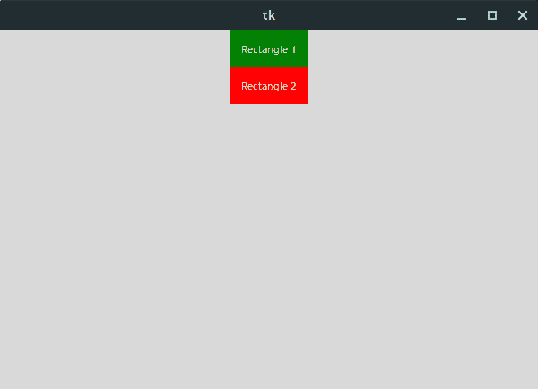

我们在上一篇文章中探讨了两种配置:`fill`和`expand`。

前者允许我们指定小部件实际填充了多少分配给小部件的区域。在 Tkinter 中，每个小部件在窗口中都被分配了一定的空间，但是小部件并不一定要使用所有的空间。例如，上面窗口中的`Label`窗口小部件水平居中于一个区域，该区域横跨应用程序窗口的整个宽度。

我们确实了解到`fill`的一点是它不允许小部件占用窗口中多余的空间。我们不能让任何一个`Label`小部件填充容器的高度，因为`rectangle_2`下面的区域没有分配给那些`Label`小部件。

如果我们想让小部件填充这个多余的空间，我们需要提供一个名为`expand`的额外配置，它接受一个布尔值。当`expand`设置为`True`时，窗口小部件将会增长以填充应用程序窗口中任何多余的空间。

例如，将`fill="both"`和`expand=True`设置为`rectangle_1`会产生以下结果:

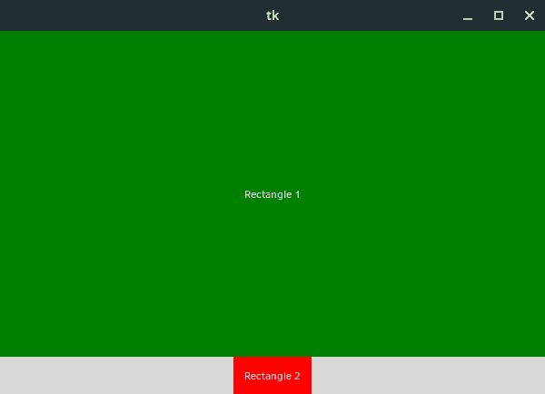

如果多个微件的`expand`配置设置为`True`，则微件共享可用空间，即使微件没有填满该空间:

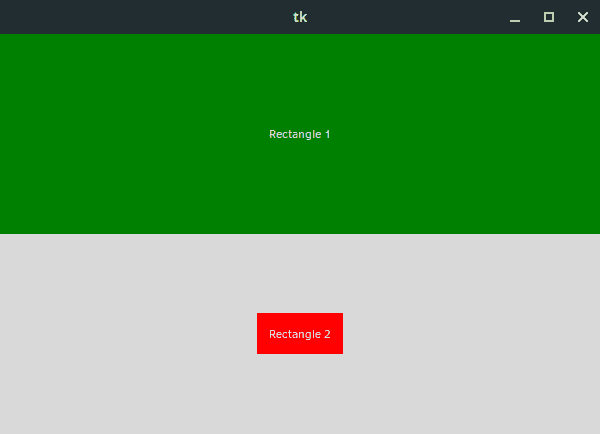

然而，当我们将其中一个小部件上的`side`配置设置为`"left"`时，我们发现这条规则并不成立。

当我们看这段代码时:

```py
import tkinter as tk

root = tk.Tk()
root.geometry("600x400")

rectangle_1 = tk.Label(root, text="Rectangle 1", bg="green", fg="white")
rectangle_1.pack(ipadx=10, ipady=10, side="left", expand=True, fill="both")

rectangle_2 = tk.Label(root, text="Rectangle 2", bg="red", fg="white")
rectangle_2.pack(ipadx=10, ipady=10, expand=True, fill="both")

root.mainloop() 
```

我们最终得到了以下结果:

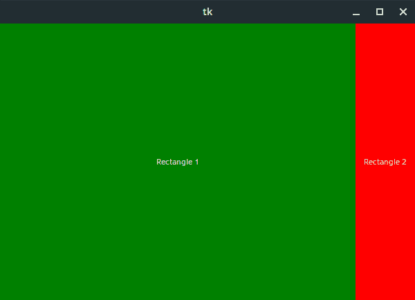

可用空间没有被平均分配，而是全部据为己有。

我们还发现，如果我们将`rectangle_2`的侧面配置设置为`"left"`，一切都会恢复正常，尽管窗口从左向右拆分，而不是从上到下:

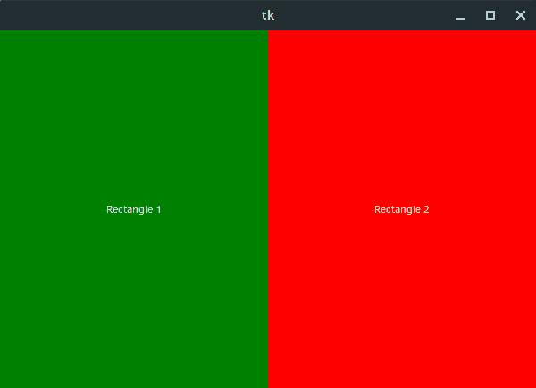

这是怎么回事？

## 侧面基础

在我们看`side`如何与`expand`交互之前，让我们看一些更简单的例子。

`side`可以取多个不同的值，每个值都是其容器的一个边或“边”。在我们的例子中，这是应用程序窗口。因此，我们可以提供`"top"`、`"bottom"`、`"left"`或`"right"`中的任何一个作为值。默认情况下，小部件的`side`值为`"top"`。

`side`的正常用例是改变小部件在其容器中的位置。例如，我们可以设置`side="bottom`让小部件锚定到容器的底部，而不是顶部。以这种方式使用`side`相当简单，但是当我们在一个容器中组合不同的方面时，我们会遇到问题，尤其是当那些小部件被允许扩展时。

让我们看看当`rectangle_1`被设置为`side="left"`并且两个矩形的`fill`配置都被设置为`"both"`时会发生什么。这将向我们显示由包分配给每个小部件的默认空间。

```py
import tkinter as tk

root = tk.Tk()
root.geometry("600x400")

rectangle_1 = tk.Label(root, text="Rectangle 1", bg="green", fg="white")
rectangle_1.pack(ipadx=10, ipady=10, side="left", fill="both")

rectangle_2 = tk.Label(root, text="Rectangle 2", bg="red", fg="white")
rectangle_2.pack(ipadx=10, ipady=10, fill="both")

root.mainloop() 
```

上面的代码给了我们这样一个布局:

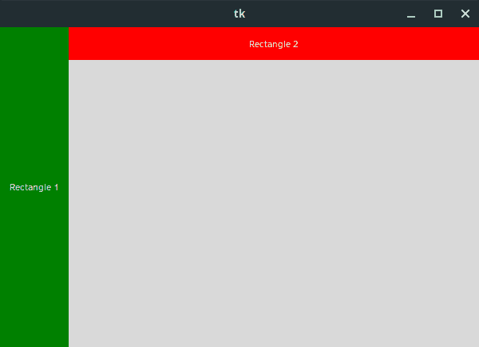

这很有趣，因为我们可以看到,`rectangle_1`被分配了一个扩展窗口整个高度的区域，而`rectangle_2`被分配了一个扩展窗口宽度的区域。

我们还可以看到`rectangle_1`被赋予了优先权。我们可能会假设`side="left"`优先于默认的`side="top"`，因为我们在每种情况下都见过这种情况，但这将是一个错误。它实际上完全取决于项目添加到窗口的顺序。

如果我们在代码中将`rectangle_1`移到`rectangle_2`下面，我们会看到相反的情况:

```py
import tkinter as tk

root = tk.Tk()
root.geometry("600x400")

rectangle_2 = tk.Label(root, text="Rectangle 2", bg="red", fg="white")
rectangle_2.pack(ipadx=10, ipady=10, fill="both")

rectangle_1 = tk.Label(root, text="Rectangle 1", bg="green", fg="white")
rectangle_1.pack(ipadx=10, ipady=10, side="left", fill="both")

root.mainloop() 
```

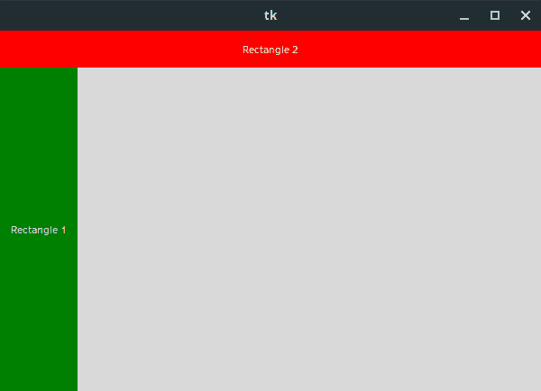

如果我们在应用程序窗口中添加更多的矩形，我们可以清楚地看到优先顺序完全取决于小部件的顺序:

```py
import tkinter as tk

root = tk.Tk()
root.geometry("600x400")

rectangle_1 = tk.Label(root, text="Rectangle 1", bg="green", fg="white")
rectangle_1.pack(ipadx=10, ipady=10, side="left", fill="both")

rectangle_2 = tk.Label(root, text="Rectangle 2", bg="red", fg="white")
rectangle_2.pack(ipadx=10, ipady=10, fill="both")

rectangle_3 = tk.Label(root, text="Rectangle 3", bg="blue", fg="white")
rectangle_3.pack(ipadx=10, ipady=10, side="left", fill="both")

rectangle_4 = tk.Label(root, text="Rectangle 4", bg="yellow", fg="black")
rectangle_4.pack(ipadx=10, ipady=10, fill="both")

rectangle_5 = tk.Label(root, text="Rectangle 5", bg="orange", fg="white")
rectangle_5.pack(ipadx=10, ipady=10, side="left", fill="both")

root.mainloop() 
```

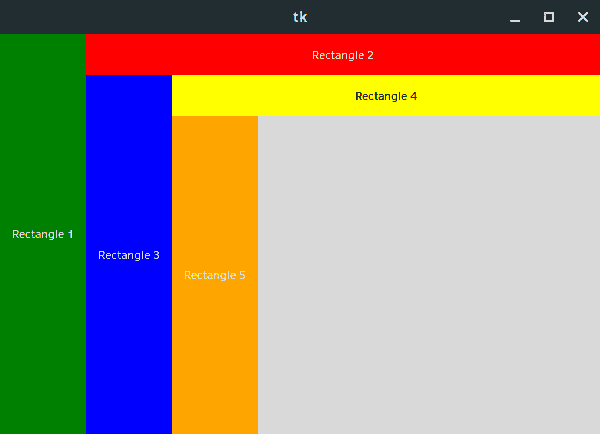

那么，这一切是如何与`expand`一起工作的呢？

## 带扩展的边

和以前一样，我们向窗口添加小部件的顺序对于`side`如何与`expand`交互非常重要。在下面的两个例子中，我们可以非常清楚地看到这一点。

首先，我们将为两个矩形设置`expand=True`和`fill="both"`，为`rectangle_1`设置`side="left"`。

```py
import tkinter as tk

root = tk.Tk()
root.geometry("600x400")

rectangle_1 = tk.Label(root, text="Rectangle 1", bg="green", fg="white")
rectangle_1.pack(ipadx=10, ipady=10, expand=True, side="left", fill="both")

rectangle_2 = tk.Label(root, text="Rectangle 2", bg="red", fg="white")
rectangle_2.pack(ipadx=10, ipady=10, expand=True, fill="both")

root.mainloop() 
```

这给了我们这样的布局:


如果我们现在交换一下，让`rectangle_2`变成`side="left"`,我们会得到如下结果:

```py
import tkinter as tk

root = tk.Tk()
root.geometry("600x400")

rectangle_1 = tk.Label(root, text="Rectangle 1", bg="green", fg="white")
rectangle_1.pack(ipadx=10, ipady=10, expand=True, fill="both")

rectangle_2 = tk.Label(root, text="Rectangle 2", bg="red", fg="white")
rectangle_2.pack(ipadx=10, ipady=10, expand=True, side="left", fill="both")

root.mainloop() 
```

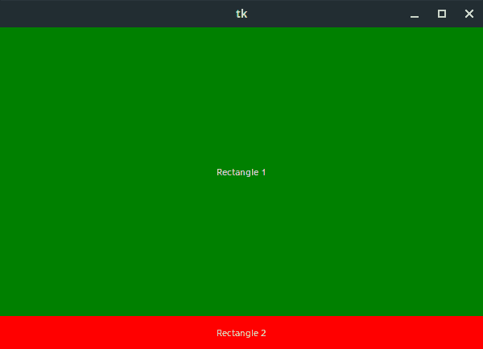

那么当我们有更多的小部件时会发生什么呢？

## 带侧边和扩展的复杂接口

让我们回到五个矩形的例子，但是这一次，让我们设置一些元素来扩展。

```py
import tkinter as tk

root = tk.Tk()
root.geometry("600x400")

rectangle_1 = tk.Label(root, text="Rectangle 1", bg="green", fg="white")
rectangle_1.pack(ipadx=10, ipady=10, expand=True, side="left", fill="both")

rectangle_2 = tk.Label(root, text="Rectangle 2", bg="red", fg="white")
rectangle_2.pack(ipadx=10, ipady=10, fill="both")

rectangle_3 = tk.Label(root, text="Rectangle 3", bg="blue", fg="white")
rectangle_3.pack(ipadx=10, ipady=10, expand=True, side="left", fill="both")

rectangle_4 = tk.Label(root, text="Rectangle 4", bg="yellow", fg="black")
rectangle_4.pack(ipadx=10, ipady=10, fill="both")

rectangle_5 = tk.Label(root, text="Rectangle 5", bg="orange", fg="white")
rectangle_5.pack(ipadx=10, ipady=10, expand=True, side="left", fill="both")

root.mainloop() 
```

现在所有奇数编号的矩形都有`expand=True`作为其包装配置的一部分。

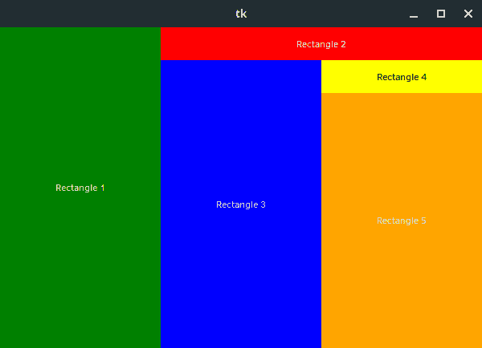

有趣的是，空间仍然在部件之间平均分配，而`side="left"`是它们配置的一部分。我们在窗口中放置小部件的顺序不会影响具有相同`side`配置的小部件之间的空间共享。这也延伸到平行的侧面，因此`side="left"`和`side="right"`在共享空间方面是兼容的。

然而，当我们有垂直`side`值的小部件时，小部件被添加的顺序决定了小部件何时可以在应用程序窗口中要求空间。

例如，如果我们将`expand=True`添加到上面示例中的每个小部件，我们会得到以下结果:

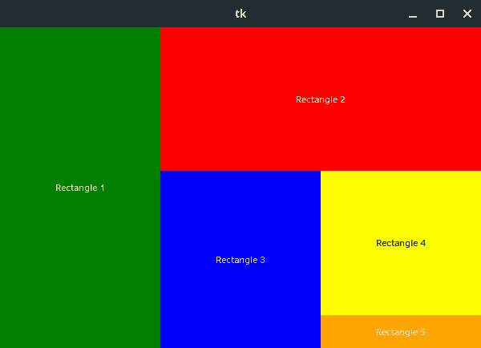

我们来分析一下。

`rectangle_1`是应用程序窗口中放置的第一个小部件，因此它获得分配给它的整个窗口高度，然后扩展到所有可用空间。此时，这是整个应用程序窗口。

当我们添加`rectangle_2`时，它在应用程序窗口的右边得到一个窄条，但是它确实填满了窗口的整个高度。

接下来我们添加`rectangle_3`，它的`side`值为`"left"`，并且已经被允许扩展。这里发生了许多事情。`rectangle_1`现在被迫与`rectangle_3`共享其水平空间，这意味着它现在只占用应用程序窗口宽度的一半。这意味着`rectangle_2`现在有了更多的水平空间，所以它占据了窗口宽度的一半，并继续占据所有可能的垂直空间。它不能再填满窗口的整个高度，因为`rectangle_3`已经占据了右下角的空间，但它仍然填满了窗口的大部分高度。

此时，我们的窗口看起来像这样:

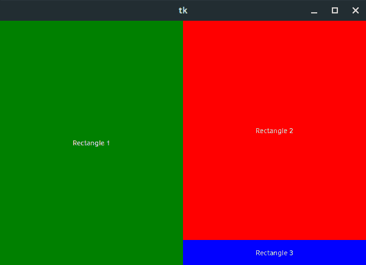

接下来，我们添加了`rectangle_4`,现在强制`rectangle_2`共享它的垂直空间。`rectangle_4`插在`rectangle_3`旁边，占据了水平空间的一个狭长条，却是垂直空间的一半。随着`rectangle_2`现在共享垂直空间，`rectangle_3`现在有空间增加高度，所以`rectangle_3`现在也共享应用程序窗口的一半高度。

我们现在有了这个:

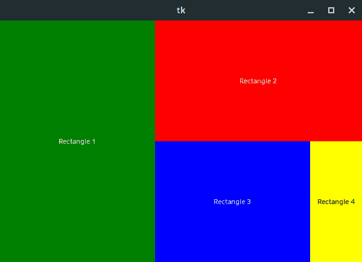

最后，我们添加了`rectangle_5`,这导致了一些变化。这是另一个左对齐的小部件，所以它迫使`rectangle_1`和`rectangle_3`减少他们在水平方向上要求的额外空间。现在每个都只有总宽度的三分之一。

`rectangle_1`和`rectangle_3`的减少使得`rectangle_2`和`rectangle_4`的宽度也可以增加，其中`rectangle_2`占据了应用程序窗口的三分之二。

`rectangle_5`现在插入到`rectangle_4`下面，给出我们之前看到的结果:


## 包扎

这就是本周关于`side`价值观和包装的帖子！如果你有兴趣学习更多关于 Tkinter 和 GUI 开发的知识，请查看我们全新的课程:[用 Python 和 Tkinter 进行 GUI 开发](https://www.udemy.com/course/desktop-gui-python-tkinter/?referralCode=8A984196616D9BF14DD0)。

你可能也想在 [Twitter](https://twitter.com/TecladoCode) 上关注我们，因为我们将在不久的将来在 Tkinter 上发布更多帖子，包括一些小型项目演练。