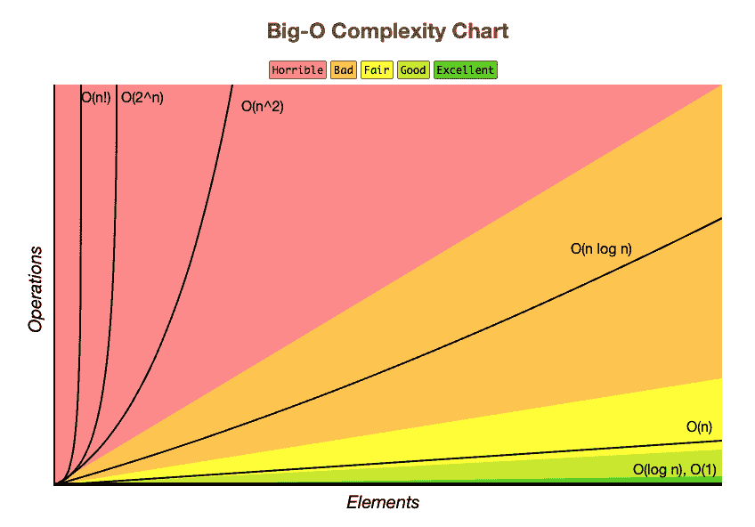
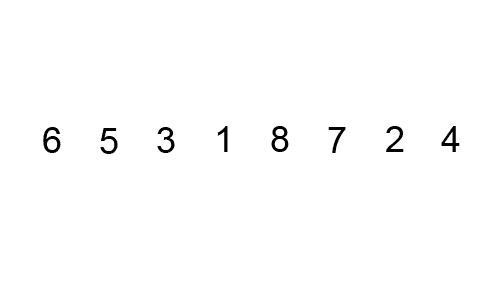

# 时间复杂度和 BigO 符号解释(用 Python)

> 原文：<https://blog.teclado.com/time-complexity-big-o-notation-python/>

时间复杂度告诉我们，相对于输入的大小，一个算法执行需要多长时间。这是理解算法相对性能的一种快捷方式。

下图让我们快速了解了本文将要涉及的时间复杂性:



目录:

1.  [**什么是时间复杂度？**](#1whatistimecomplexity)
2.  [**什么是 BigO？**](#2whatisbigo)
3.  [**O(1)常数时间**](#3o1constanttime)
4.  [**O(logn)对数时间**](#4olognlogarithmictime)
5.  [**O(n)线性时间**](#5onlineartime)
6.  [**【o(n^2】二次时间**](#6on2polynomialtime)
7.  [**【o(2^n】指数时间**](#7o2nexponentialtime)

在这篇文章中，我将谈论时间复杂性，什么是 BigO 以及 BigO 如何帮助我们改进我们的算法。

那么让我们从什么是时间复杂度开始。

## 1.什么是时间复杂性

时间复杂度是一个算法执行需要多少时间。但是我们不会计算一个算法执行的确切时间。相反，我们将计算输入大小对算法执行时间的影响。

## 2.BigO 是什么？

> “BigO 符号是一种数学符号，它描述了当自变量趋向特定值或无穷大时函数的极限行为。”-维基百科

例如，我们有代表恒定时间的`O(1)`，这意味着我们的算法的执行时间不随输入大小而改变。

既然我们已经了解了时间复杂度和 BigO 的含义，那么让我们看看我们有什么样的 BigO 符号以及它们的含义。

## 3.O(1)常数时间

一种时间复杂度不随输入大小变化的算法。就这么简单！

例如，从列表中获取第一个元素。输入大小不影响该算法，因为无论输入大小如何，第一个元素总是第一个。

```
def get_first(data):
    return data[0]

data = [1, 2, 3, 4]
get_first(data) 
```

## 4.O(logn)对数时间

下面是“什么是对数”的快速参考:[https://byjus.com/maths/logarithms/](https://byjus.com/maths/logarithms/)。对数算法每次运行时都会将列表或其他数据结构分割成较小的部分。

具有`O(logn)`时间复杂度的算法的最好例子是“二分搜索法”。二分搜索法必须在一个排序列表上执行。

我们来看看实现。

```
# Iterative Binary Search Function
# It returns the index of x in the given list if present,
# else returns -1
def binary_search(lst, x):
    low = 0
    high = len(lst) - 1
    mid = 0

    while low <= high:

        mid = (high + low) // 2

        # If x is greater, ignore the left half
        if lst[mid] < x:
            low = mid + 1

            # If x is smaller, ignore the right half
            elif lst[mid] > x:
            high = mid - 1

            # means x is present in mid
            else:
                return mid

        # If we reach here, then the element was not present
        return -1

# Test list
lst = [ 2, 3, 4, 10, 40 ]
x = 10

# Function call
result = binary_search(lst, x)

if result != -1:
    print("Element is present at index", str(result))
else:
    print("Element is not present in list") 
```

让我用英语解释一下这个算法是怎么回事。

1.  转到列表中间。
2.  查看该元素是否是我们正在搜索的。
3.  如果不是，那么检查我们正在寻找的元素是否大于中间的元素。
4.  如果是，那么忽略 now 之后这个列表的右边，否则忽略 now 之后这个列表的左边。
5.  对于剩下的列表，重复步骤 1 到 4。


*与线性(顺序)搜索相比*

## 5.O(n)线性时间

在线性时间算法中，输入中的每个元素都被访问一次。随着输入大小的增加，我们算法的运行时间也随着输入的大小而增加。

线性搜索是线性复杂度算法的一个例子。

下面是实现过程:

```
#Define the linear search function
def search(lst, x):

    for i in range(len(lst)):

        if lst[i] == x:
            return i

    return -1

#Let's give it a try
lst = ["a","b","c","find me","d"]

print(search(lst, "find me"))

>>3 
```

## 6.O(n^2)多项式时间

可以访问每个元素一次的算法是线性算法，`O(n)`。通常这是通过一个遍历列表中每个元素的循环来实现的。

但是如果你有嵌套循环，就像这个例子？

```
lst = [1, 3, 5]
for x in lst:
    for y in lst:
        pass 
```

如果这是一个`O(n)`算法，我们将总共执行 3 次迭代，因为列表有 3 个元素。但是对于嵌套循环，我们最终执行 9 次迭代。这就是为什么时间复杂度是多项式，`O(n^2)`，因为`3^2 = 9`。

冒泡排序就是一个很好的例子:

```
def bubbleSort(lst):
    n = len(lst)

    # Traverse through all list elements
    for i in range(n):

        # Last i elements are already in place
        for j in range(0, n-i-1):

            # traverse the list from 0 to n-i-1
            # Swap if the element found is greater
            # than the next element
            if lst[j] > lst[j+1] :
                lst[j], lst[j+1] = lst[j+1], lst[j]

# Driver code to test above
lst = [64, 34, 25, 12, 22, 11, 90]

bubbleSort(lst) 
```

冒泡排序算法取第一个数字，如果顺序不对，就与相邻的数字交换。它对每个数字都这样做，直到所有的数字都按正确的顺序排列——从而排序。



## 7.O(2^n)指数时间

这绝对是最差的一个因为它是最慢的！

指数时间是`2^n`，所以运行时间随着输入的大小呈指数增长。

假设我们有一个仅由数字组成的密码(所以有 10 个数字，从 0 到 9)。我们想要破解一个长度为 n 的密码，所以我们将使用`10^n`来暴力破解每个组合。

例如，假设我们想要创建一个长度为 15 个字符的密码！所有组合的数量将等于`10^15 = 1.000.000.000.000.000`！

指数时间算法的一个例子是斐波那契数的递归计算:

```
def fibonacci(n):
    if n <= 1:
        return n
    return fibonacci(n-1) + fibonacci(n-2) 
```

所以，很明显我们不想使用一个有`O(2^n)`权利的算法？我们能做什么来处理这个问题？我举个例子解释一下。

假设我们要计算`10^4`。我们需要这样做:

> 10 * 10 * 10 * 10 = 10^2 * 10^2

如你所见，我们必须计算两次`10^2`。为什么不计算一次，再用同样的结果呢？这种方法叫做`Dynamic Programming`。这里有一篇[文章](https://skerritt.blog/dynamic-programming/)来了解更多！

不要忘记，了解时间复杂性可以让我们建立更好的算法。我们可以使用我们的知识来改进算法，因为我们知道什么导致更差或更好的时间复杂度。

如果你想可视化我们讨论过的算法，你可以访问 [visualgo](https://visualgo.net/en/) ！

在这张图中，您可以看到我们讨论过的时间复杂性。


感谢您的阅读，希望对您有所帮助！

如果你想看我的其他文章和关于 Python 和后端开发的帖子，可以看看我的 [Twitter](https://twitter.com/burak_uren101) 和[博客](https://medium.com/@burakuren101)。

额外阅读: