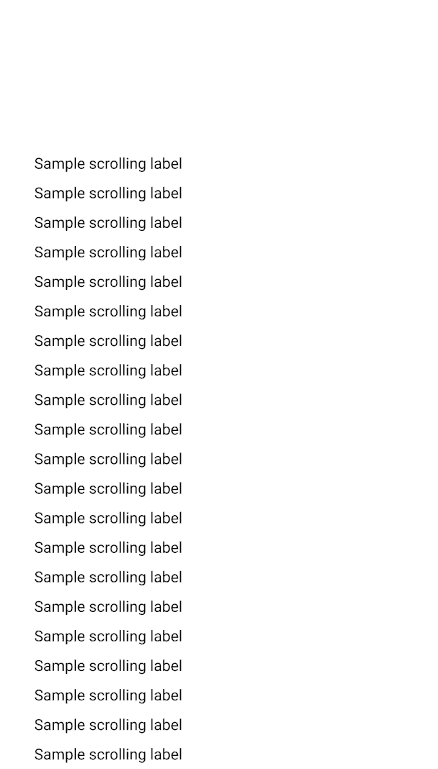

# Tkinter 中的可滚动框架

> 原文：<https://blog.teclado.com/tkinter-scrollable-frames/>

在 Tkinter 中，只有 Canvas 小部件是本机可滚动的容器。这意味着它的实际尺寸可以大于屏幕尺寸，并且您可以移动正在查看的区域。这就是滚动的真正含义！

看看这张图表:



内容(背景最暗)是“实际大小”，通常也是“可滚动区”。

用户看到的是可滚动的框架，你可以把它想象成一个“窗口”,让你看到可滚动的区域。

我们将要做的是创建一个画布，并在其中创建一个窗口。

窗口可以包含我们想要的任意多的内容，但是它是我们将放在应用程序中的画布。

这意味着我们可以将画布的大小设置为我们想要的任何值，然后当我们滚动时，我们将沿着它里面的窗口移动。

为了做到这一点，我们还必须指定什么是可滚动区。通常，可滚动区与内部窗口的内容相匹配——但如果我们愿意，它也可以是不同的。

让我们从创建我们需要的所有小部件开始。这些是:

*   一个应用程序窗口(一个`tk.Tk`对象)
*   我们的画布和滚动条的容器框架
*   画布
*   滚动条
*   将成为可滚动框架的框架

几乎所有这些小部件都像普通的 Tkinter 小部件一样工作(也就是说，你把它们放在它们的容器中，然后使用 Pack 或 Grid)。但是，可滚动框架的行为会有所不同。我们将创建它，给它画布作为它的容器，但是不使用 Pack 或 Grid，我们将使用 canvas 的'`create_window`方法在画布中创建一个窗口，显示可滚动框架的内容。

创建小部件非常简单:

```py
import tkinter as tk
from tkinter import ttk

root = tk.Tk()
container = ttk.Frame(root)
canvas = tk.Canvas(container)
scrollbar = ttk.Scrollbar(container, orient="vertical", command=canvas.yview)
scrollable_frame = ttk.Frame(canvas) 
```

现在让我们添加一些代码，每当可滚动框架的内容改变时，这些代码将调用一个函数。这是必要的，因为我们必须告诉画布框架将有多大，以便它知道它可以滚动多少:

```py
scrollable_frame.bind(
    "<Configure>",
    lambda e: canvas.configure(
        scrollregion=canvas.bbox("all")
    )
) 
```

每当`scrollable_frame`改变大小时，我们在这里绑定的`<Configure>`事件就会触发——也就是说，通常当我们在其中添加或删除小部件时。

只有当它改变大小时，我们才需要改变滚动属性。

变化是我们将画布'`scrollregion`修改为大小为`canvas.bbox("all")`。

调用`canvas.bbox("all")`给我们一个 4 值元组，描述了一个矩形的两个角的位置，这是一个滚动区域。

接下来，我们必须告诉画布在它自己内部绘制`scrollable_frame`:

```py
canvas.create_window((0, 0), window=scrollable_frame, anchor="nw") 
```

值`(0, 0)`告诉画布在哪个位置绘制窗口。参数`anchor="nw"`告诉画布将框架的左上角放在位置`(0, 0)`上。

最后，我们必须配置画布，以便当它的 y 位置改变时，滚动条移动:

```py
canvas.configure(yscrollcommand=scrollbar.set) 
```

一旦你完成了这些，你就可以添加元素到`scrollable_frame`中，它会像你期望的那样工作！

另外，不要忘记使用 Pack 或 Grid 将容器、画布和滚动条添加到应用程序窗口中。

最终的代码可能如下所示:

```py
import tkinter as tk
from tkinter import ttk

root = tk.Tk()
container = ttk.Frame(root)
canvas = tk.Canvas(container)
scrollbar = ttk.Scrollbar(container, orient="vertical", command=canvas.yview)
scrollable_frame = ttk.Frame(canvas)

scrollable_frame.bind(
    "<Configure>",
    lambda e: canvas.configure(
        scrollregion=canvas.bbox("all")
    )
)

canvas.create_window((0, 0), window=scrollable_frame, anchor="nw")

canvas.configure(yscrollcommand=scrollbar.set)

for i in range(50):
    ttk.Label(scrollable_frame, text="Sample scrolling label").pack()

container.pack()
canvas.pack(side="left", fill="both", expand=True)
scrollbar.pack(side="right", fill="y")

root.mainloop() 
```

为了使创建可滚动的框架更容易一些，你可能想编写一个易于使用的类。

我们已经为您完成了，所以您不必再做了！

这里有一个`ScrollableFrame`类，你可以用它作为一个普通的框架！

```py
import tkinter as tk
from tkinter import ttk

class ScrollableFrame(ttk.Frame):
    def __init__(self, container, *args, **kwargs):
        super().__init__(container, *args, **kwargs)
        canvas = tk.Canvas(self)
        scrollbar = ttk.Scrollbar(self, orient="vertical", command=canvas.yview)
        self.scrollable_frame = ttk.Frame(canvas)

        self.scrollable_frame.bind(
            "<Configure>",
            lambda e: canvas.configure(
                scrollregion=canvas.bbox("all")
            )
        )

        canvas.create_window((0, 0), window=self.scrollable_frame, anchor="nw")

        canvas.configure(yscrollcommand=scrollbar.set)

        canvas.pack(side="left", fill="both", expand=True)
        scrollbar.pack(side="right", fill="y") 
```

如果你想使用这个类，记得把东西放在`self.scrollable_frame`里面，而不是直接放在这个类的一个对象里:

```py
root = tk.Tk()

frame = ScrollableFrame(root)

for i in range(50):
    ttk.Label(frame.scrollable_frame, text="Sample scrolling label").pack()

frame.pack()
root.mainloop() 
```

## 包扎

差不多就是这样！可滚动的框架可能是一个巨大的痛苦，直到你知道如何制作它们。即使这样，它看起来也很奇怪，因为您不会想到您会使用画布(这意味着绘图)来支持在不相关的组件上滚动。

但是现在你知道它们是如何相互作用的，以及为什么它是必要的。

如果您想了解更多关于 Tkinter 的知识，并学习构建真实世界的项目，请查看我们的[用 Python 和 Tkinter 开发 GUI](https://go.tecla.do/tkinter-gui-course-sale)课程。它包含超过 10 小时的优质内容，让您了解 Tkinter 提供的一切。

下次见！