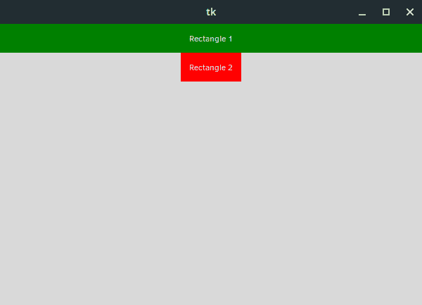

# Tkinter 的包装几何管理器

> 原文：<https://blog.teclado.com/tkinters-pack-geometry-manager/>

本周我们将和 Tkinter 一起深入 GUI 开发的世界。在本帖中，我们将讨论几何管理器，尤其是包装几何管理器。Tkinter 实际上有几个不同的几何管理器，我们将在后续的帖子中看到。

## Tkinter 是什么？

首先，我肯定你们中的一些人想知道这到底是什么？Tkinter *(tee-kay-in-ter)* 是一个用 Python 创建图形用户界面的工具包。它绝不是唯一可用的，我们也有像 Kivy 或 PyQt 这样的选项。然而，Tkinter 是用 Python 创建 GUI 的默认选项，实际上大多数 Python 安装都附带了 tkinter。

您可以通过打开 Python shell 并键入以下命令来进行检查:

```
import tkinter 
```

如果你没有得到一个错误，你是好的。对于那些仍在使用 Python 2 的人，您需要使用这个导入:

```
import Tkinter 
```

在本文中，我们将重点关注 Python 3。

如果你是 Tkinter 的新手，我们在[完整的 Python 课程](https://www.udemy.com/the-complete-python-course/?couponCode=BLOGGER)中有一个介绍性的部分来帮助你入门。

## 什么是几何管理器？

当我们着手用 Tkinter 创建一个 GUI 时，我们从一个或多个窗口开始，在这个 windows live 中有许多小部件。小部件类似于一个组件。这些小部件或组件一起构成了我们完整的应用程序。我们可能有按钮、容器、文本区和菜单。这些都是小部件。

几何图形管理器负责控制这些小部件如何适合我们的应用程序窗口，以及这些小部件最终放置的位置。

正如我在这篇文章开始时提到的，Tkinter 有许多以不同方式运行的几何图形管理器。在这里，我们将重点关注 pack geometry manager，它最适合界面不是特别复杂的简单应用程序。

虽然 pack 很容易上手，但有时很难想象元素是如何组合在一起的，这就是为什么我们可能不会在复杂的界面中使用它。

事不宜迟，让我们开始使用 pack。

## 基本包装

在这篇文章的剩余部分，我们将关注一个简单的例子:一个包含两个左右矩形的固定大小的窗口。它不会非常漂亮，但应该很容易看到发生了什么。

首先，让我们导入`tkinter`并设置我们的窗口:

```
import tkinter as tk

root = tk.Tk()
root.geometry("600x400")

root.mainloop() 
```

这里的代码实际上都是样板文件，不是我们需要特别关注的东西。我们已经创建了一个新的`Tk`对象，并将其分配给`root`。这是我们的主应用程序窗口。然后我们使用`geometry`方法设置窗口的大小，指定宽度为 600 像素，高度为 400 像素。

然后我们在底部有了这个`mainloop`方法，这是 Tkinter 如何在我们的应用程序内部监控事情的方法。我们需要调用这个方法在屏幕上创建应用程序窗口。

完成所有这些后，我们有了一个非常令人兴奋的盒子，看起来像这样:


请注意，如果您继续跟进，您可能会看到一些稍微不同的东西。我们使用 Tkinter 创建的窗口根据我们使用的操作系统有不同的外观。我们在上面看到的是我们使用的是 Solus Linux，但是如果你使用其他系统，它看起来肯定会有所不同。

好了，让我们在应用程序窗口中获取矩形！

为了做到这一点，我们首先为每个矩形定义一个小部件。Widgets 都是 Tkinter 对象，有很多可以选择。我们将在这里使用`Label`小部件。

```
import tkinter as tk

root = tk.Tk()
root.geometry("600x400")

rectangle_1 = tk.Label(root, text="Rectangle 1", bg="green", fg="white")
rectangle_2 = tk.Label(root, text="Rectangle 2", bg="red", fg="white")

root.mainloop() 
```

我们已经在矩形上设置了许多属性，还传入了对这个`root`对象的引用。通过传入`root`，我们告诉 Tkinter 这个小部件的父窗口是主应用程序窗口。换句话说，这些矩形直接存在于它的内部。

我们设置的属性是`text`、`bg`和`fg`。`bg`和`fg`分别代表背景和前景，在这种情况下，它们负责背景颜色和文本颜色。它们不是必需的，但是当我们开始处理`pack`时，看看小部件实际上在哪里会很有用。

说到`pack`，目前还不见踪影。此外，如果我们试图运行应用程序，我们仍然得到一个空窗口。

虽然我们已经创建了两个矩形小部件，但它们不会显示在应用程序窗口中，直到我们为它们指定了一些几何管理器。没有关于它们如何适应应用程序窗口的信息，所以 Tkinter 对它们不做任何事情。

我们可以通过在两个对象上调用`pack`方法来解决这个问题，就像这样:

```
import tkinter as tk

root = tk.Tk()
root.geometry("600x400")

rectangle_1 = tk.Label(root, text="Rectangle 1", bg="green", fg="white")
rectangle_1.pack(ipadx=10, ipady=10)

rectangle_2 = tk.Label(root, text="Rectangle 2", bg="red", fg="white")
rectangle_2.pack(ipadx=10, ipady=10)

root.mainloop() 
```

我们在这里设置的`ipax`和`ipady`值只是内部填充。我们可以摆脱这些，一切都会好的。在这种情况下，添加它们只是为了更容易阅读文本，因为它不会触及`Label`的所有侧面。

现在，如果我们再次运行应用程序，我们最终会在应用程序窗口中看到一些内容:


正如你所看到的，`pack`只是把我们的矩形小部件一个接一个地堆积起来。有时这正是我们想要的，但我们可以比这更微妙一些。让我们来看看我们能做些什么来配置`pack`。

## 配置`pack`

为`pack`设置配置只是向`pack`方法添加关键字参数和值的一个例子。我们已经看到了一个关于`ipadx`和`ipady`的例子，但是我们还可以使用更多的选项。

特别是，我关心三个配置:`fill`、`side`和`expand`。

这些选项的文档相当混乱，所以我认为我们最好看一些例子。让我们从为`fill`指定一些值开始。

### 使用`fill`

`fill`接受三个不同的值作为选项:`x`、`y`和`both`。这些选项代表轴，因此我们可以告诉给定的小部件填充 x 轴、y 轴或两个轴上的可用空间。

先来试试`fill="x"`:

```
import tkinter as tk

root = tk.Tk()
root.geometry("600x400")

rectangle_1 = tk.Label(root, text="Rectangle 1", bg="green", fg="white")
rectangle_1.pack(ipadx=10, ipady=10, fill="x")

rectangle_2 = tk.Label(root, text="Rectangle 2", bg="red", fg="white")
rectangle_2.pack(ipadx=10, ipady=10)

root.mainloop() 
```

这里我们指定`rectangle_1`应该填充 x 轴上的所有可用空间。

如果我们运行我们的应用程序，我们会得到类似这样的结果:



这似乎有道理，但是如果我们改为指定`fill="y"`，我们会得到一些奇怪的东西:


如果我们指定`fill="both"`，我们得到`rectangle_1`再次填充水平空间，但是在这种情况下我们也没有得到垂直增长。这是怎么回事？

问题是，就 Tkinter 和`pack`而言，没有可供`rectangle_1`沿 y 轴生长的空间。考虑到`rectangle_2`地下的充裕空间，这可能看起来有点奇怪，但我们实际上在谈论不同的事情。

两个矩形在应用程序窗口中都被分配了空间。每个小部件都被分配了一个与其高度相等的区域，该区域横跨应用程序窗口的整个宽度。在上图中，两个矩形都水平居中。

当我们为这些小部件设置`fill`属性时，每个小部件可以填充的区域受到分配给它们的区域的限制。

正如我们所看到的，我们的小部件已经消耗了分配给它们的那一小段行中的所有垂直空间，所以当我们告诉小部件向两个方向填充时，我们看到的唯一增长是水平的。

这就把我们带到了`expand`选项，它允许我们克服这个限制。

### 使用`expand`

而`fill`用于确定一个小部件消耗了多少分配空间，`expand`关心的是给一个给定的小部件分配更多的空间。

让我们看看当我们为`rectangle_1`设置`expand=True`时会发生什么:

```
import tkinter as tk

root = tk.Tk()
root.geometry("600x400")

rectangle_1 = tk.Label(root, text="Rectangle 1", bg="green", fg="white")
rectangle_1.pack(ipadx=10, ipady=10, expand=True)

rectangle_2 = tk.Label(root, text="Rectangle 2", bg="red", fg="white")
rectangle_2.pack(ipadx=10, ipady=10)

root.mainloop() 
```

应用程序现在看起来像这样:


乍一看，这似乎是一个奇怪的结果，但如果我们仔细想想，它很有意义。我们的`rectangle_1`小部件没有设置为向任一方向填充，但是小部件现在已经被分配了应用程序窗口中所有可用的空间。它唯一没能占为己有的空间是分配给`rectangle_2`的空间。

因为`rectangle_1`没有向任何方向填充，所以它最终漂浮在它被分配的这个巨大区域的中间。

如果我们将`rectangle_1`上的 fill 属性设置为`both`，我们现在会看到它填充了大部分屏幕，如下所示:


我们仍然需要检查的一件事是，当两个项目都被允许占用更多空间时会发生什么？

```
import tkinter as tk

root = tk.Tk()
root.geometry("600x400")

rectangle_1 = tk.Label(root, text="Rectangle 1", bg="green", fg="white")
rectangle_1.pack(ipadx=10, ipady=10, expand=True, fill="both")

rectangle_2 = tk.Label(root, text="Rectangle 2", bg="red", fg="white")
rectangle_2.pack(ipadx=10, ipady=10, expand=True)

root.mainloop() 
```

这里绿色的`rectangle_1`小部件被设置为扩展，并填充整个分配区域。红色的`rectangle_2`设定为展开，但是没有任何`fill`配置。


我们最终得到的是小部件平均共享多余的空间，即使红色的`rectangle_2`没有消耗所有分配给它的空间。它最终浮在中间，而`rectangle_1`填充了整个区域。

这里的要点是，如果允许多个小部件扩展，空间将在它们之间平均分配。

### 使用`side`

还有一点我们还没有看到的配置:`side`。那么`side`到底是做什么的呢？

让我们来看看:

```
import tkinter as tk

root = tk.Tk()
root.geometry("600x400")

rectangle_1 = tk.Label(root, text="Rectangle 1", bg="green", fg="white")
rectangle_1.pack(ipadx=10, ipady=10, side="left", expand=True, fill="both")

rectangle_2 = tk.Label(root, text="Rectangle 2", bg="red", fg="white")
rectangle_2.pack(ipadx=10, ipady=10, expand=True, fill="both")

root.mainloop() 
```

这里，我们的两个小部件都被设置为扩展和填充整个分配的空间，但是`rectangle_1`现在有了一个额外的配置:`side="left"`。

让我们看看这是如何影响我们的应用程序的:


哇！不是说要平均分配空间吗？

我们可以看到`expand=True`确实适用于红色的`rectangle_2`小部件，因为它垂直填充了空间，但事情仍然没有按照我们的预期进行。

事实证明，我们需要扩展我们对`expand`实际工作方式的定义。是的，当两个窗口都设置为`expand=True`时，窗口小部件会平均共享可用空间，但是这仅限于它们共享一个锚端的情况。默认情况下，小部件被锚定到它们的父容器(在我们的例子中是应用程序窗口)的顶部，但是我们只是设置了一个矩形来使用左侧作为锚。

如果我们将两个小部件都设置为使用`side="left"`，或者即使我们将一个设置为`side="left"`，一个设置为`side="right"`，事情又会回到我们预期的样子:


这里唯一的视觉差异是，我们现在从左到右而不是从上到下分割应用程序。

查看具有不同`side`值的小部件如何交互，这本身就值得写一整篇文章，所以我们将在以后再回到这个话题。现在，知道你将得到一些有趣的结果就足够了。

### 包扎

这就是这篇关于`pack`入门的文章。确保在 [Twitter](https://twitter.com/TecladoCode) 上关注我们，这样你就不会错过我们即将发布的任何帖子。

如果你对一个专门的 Tkinter 课程感兴趣，我们刚刚发布了一个课程，我们将深入其中，涵盖你需要了解的关于 Tkinter 的一切。此外，我们还构建了大量很酷的应用程序！查看使用 Python 和 Tkinter 进行 GUI 开发的[课程！](https://www.udemy.com/course/desktop-gui-python-tkinter/?referralCode=8A984196616D9BF14DD0)