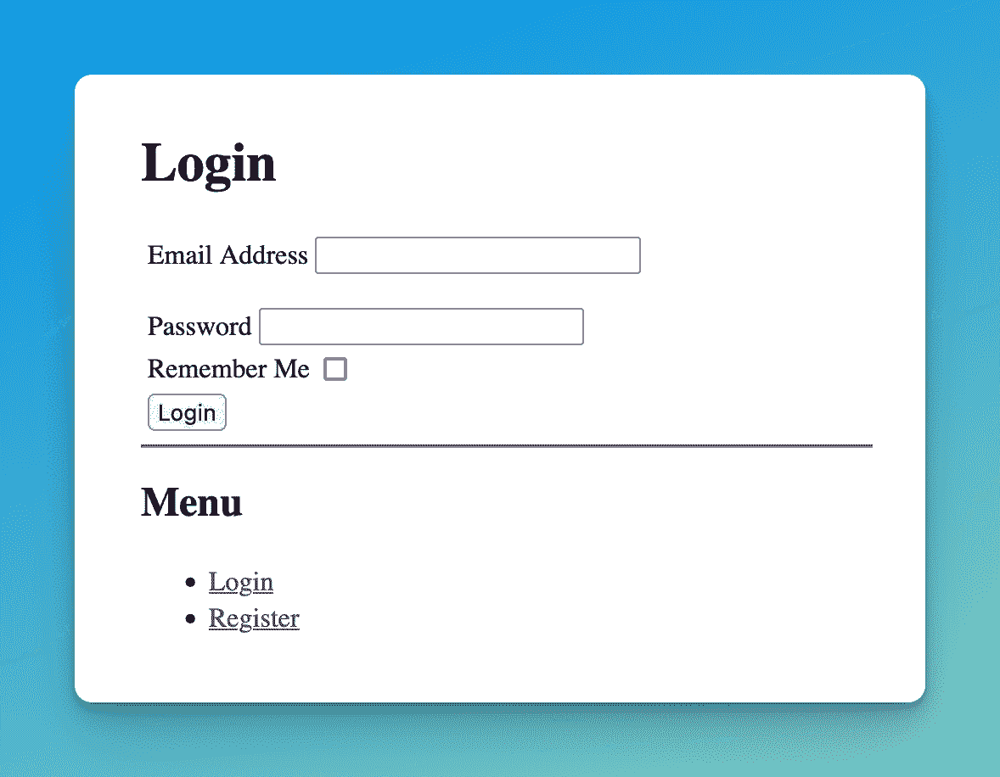

# 使用 Flask-Security-Too 在 Flask 中进行用户验证

> 原文：<https://blog.teclado.com/user-authentication-flask-security-too/>

向 web 应用程序添加用户身份验证使其能够判断哪个用户正在发出请求。然后，它可以向不同的用户返回不同的响应。这被称为“个性化”。

这是本系列博文的第 1 篇，共 3 篇，我将向您展示如何使用 Flask-Security:

1.  使用 Flask-Security-Too 在 Flask 中进行用户认证(本文)
2.  [用户电子邮件确认 Flask-Security-Too](https://blog.teclado.com/email-confirmation-flask-security-too/)
3.  [定制 Flask-Security-Too 的模板和电子邮件](https://blog.teclado.com/customise-pages-emails-flask-security-too/)

为了帮助您理解用户身份验证，提醒我们注意客户端和服务器之间的分离是很有用的。如果您正在开发 Flask 应用程序，那么您正在开发服务器。您的客户端是向您的应用程序发出请求的浏览器或移动应用程序。

对于本系列，让我们假设您正在开发一个 Flask 应用程序，它使用`render_template`向您的浏览器客户端发送 HTML。

在学习 Flask-Security-Too 之前，学习如何手动编写自己的用户身份验证代码可能会有所帮助。这并不十分困难，并且将真正有助于理解 Flask-Security-Too 是如何工作的。我们有两篇博文，我建议按顺序阅读:

阅读这两篇文章，并完成所提供的例子。完成后，您应该有一个支持用户注册和登录的 Flask 应用程序。这就是我们可以用 Flask-Security 替换大部分自定义逻辑的原因！

## 使用 Flask-Security-Too 添加用户注册和验证

这也是 Flask-Security 的饭碗！这是你需要的:

*   存储用户数据(用户名、密码等)的数据库。
*   Flask 应用程序中的一些配置选项(密钥和密码哈希 salt)。
*   当你创建你的`Flask`对象时，实际初始化 Flask-Security-too。

对于我们的数据库交互，我将使用 SQLAlchemy。我们没有任何关于使用 SQLAlchemy 的介绍性博客文章，但是我们的免费 REST APIs 电子书详细介绍了它。

在任何情况下，SQLAlchemy 都是相对简单的:定义一个 Python 类来表示数据库中的一个表。当您创建所述类的新的*对象*时，它们可以作为单独的行插入到数据库中。您还可以从数据库中检索 Python 对象形式的数据。

SQLAlchemy 的目标是通过将所有东西都称为 Python 对象来简化使用 Python 处理数据，而不是自己编写 SQL。

要使用 Flask 应用程序处理 SQLAlchemy，通常使用`flask-sqlalchemy`库。

让我们从安装它和`flask-security-too`开始。我将把它添加到我的`requirements.txt`文件中:

```
flask
flask-sqlalchemy
flask-security-too
flask-mailman
bcrypt
python-dotenv 
```

添加`python-dotenv`库是为了在运行 Flask 应用程序时更容易加载`.env`文件。稍后会有更多内容！`flask-mailman`库用于发送确认邮件(在本系列的第 2 部分中)。`bcrypt`库用于密码散列。

安装库:

```
pip install -r requirements.txt 
```

现在让我们创建`SQLAlchemy`对象，我们将使用它来连接数据库。在`database.py`中，写下以下内容:

```
from flask_sqlalchemy import SQLAlchemy

db = SQLAlchemy() 
```

接下来，让我们创建数据库模型。这些是代表我们数据库中的表的 Python 类。

在一个`models`文件夹中，创建`auth.py`并编写以下内容:

```
from database import db
from flask_security import UserMixin, RoleMixin
from sqlalchemy import Boolean, DateTime, Column, Integer, String, ForeignKey
from sqlalchemy.orm import relationship, backref

class RolesUsers(db.Model):
    __tablename__ = "roles_users"
    id = Column(Integer(), primary_key=True)
    user_id = Column("user_id", Integer(), ForeignKey("user.id"))
    role_id = Column("role_id", Integer(), ForeignKey("role.id"))

class Role(db.Model, RoleMixin):
    __tablename__ = "role"
    id = Column(Integer(), primary_key=True)
    name = Column(String(80), unique=True)
    description = Column(String(255))

class User(db.Model, UserMixin):
    __tablename__ = "user"
    id = Column(Integer(), primary_key=True)
    email = Column(String(255), unique=True)
    username = Column(String(255), unique=True, nullable=True)
    password = Column(String(255), nullable=False)
    last_login_at = Column(DateTime())
    current_login_at = Column(DateTime())
    last_login_ip = Column(String(100))
    current_login_ip = Column(String(100))
    login_count = Column(Integer)
    active = Column(Boolean())
    premium = Column(Boolean())
    fs_uniquifier = Column(String(255), unique=True, nullable=False)
    confirmed_at = Column(DateTime())
    roles = relationship(
        "Role", secondary="roles_users", backref=backref("users", lazy="dynamic")
    ) 
```

如您所见，这定义了三个表:一个用于用户，一个用于角色(类似于权限)，一个用于链接用户和角色。我们不会在本教程中使用角色，但是 Flask-Security 也需要它。

最后，在`app.py`中，让我们创建我们的 Flask 应用程序并设置 Flask-Security:

```
import os
from flask import Flask
from flask_security import SQLAlchemySessionUserDatastore, Security
from dotenv import load_dotenv
from database import db
from models.auth import User, Role

load_dotenv()

app = Flask(__name__)

app.config["SECRET_KEY"] = os.environ.get(
    "SECRET_KEY", "0aedgaii451cef0af8bd6432ec4b317c8999a9f8g77f5f3cb49fb9a8acds51d"
)
app.config["SECURITY_PASSWORD_SALT"] = os.environ.get(
    "SECURITY_PASSWORD_SALT",
    "ab3d3a0f6984c4f5hkao41509b097a7bd498e903f3c9b2eea667h16",
)
app.config["SQLALCHEMY_TRACK_MODIFICATIONS"] = False
app.config["SECURITY_REGISTERABLE"] = True

uri = os.getenv("DATABASE_URL")
app.config["SQLALCHEMY_DATABASE_URI"] = uri
db.init_app(app)
user_datastore = SQLAlchemySessionUserDatastore(db.session, User, Role)
security = Security(app, user_datastore)

@app.route("/")
def home():
	return "Hello, world!" 
```

现在我们已经得到了这个，我们需要设置我们的环境变量。至少，我们需要`DATABASE_URL`，来告诉我们的 Flask 应用程序连接到哪个数据库。

在名为`.env`的新文件中，写下以下内容:

```
DATABASE_URL="sqlite:///data.db" 
```

现在让我们创建我们的表。在控制台中(激活虚拟环境)，键入:

```
flask shell 
```

在那里，键入:

```
>>> from app import app, db
>>> with app.app_context():
	 	db.create_all() 
```

这将使用应用程序配置创建您的数据库，这将创建一个`instance`文件夹，并在其中创建`data.db`。如果以后你删除了`instance/data.db`，只需重新运行`flask shell`并输入这些命令来重新创建它。

现在您可以运行您的 Flask 应用程序了！首先退出 shell(通过按 CTRL+D ),然后键入:

```
flask run 
```

现在，您可以访问 Flask-Security-Too 为您添加到 Flask 应用程序中的登录和注册页面。例如，进入[http://127 . 0 . 0 . 1:5000/log in](http://127.0.0.1:5000/login)应该会看到这样的内容:



如果您使用该页面中的菜单转到“注册”页面(或手动导航到[http://127 . 0 . 0 . 1:5000/Register](http://127.0.0.1:5000/register))，那么您将看到一个非常相似的表单，其中添加了一个密码确认字段。

这些页面已经包含了错误处理和对“记住我”复选框的 cookie 支持。

然而，他们看起来不太好。要解决这个问题，您可以添加一些针对现有元素的 CSS 代码，也可以编写自己的登录和注册页面。我们不会在这篇博文中讨论这个问题，但是如果你想让我写些什么，请在最后留下评论。

现在我们已经添加了用户认证，我们可以在本系列的下一篇文章中继续讨论电子邮件确认。感谢您的阅读，我们在那里见！

如果你想学习更多关于使用 Flask 进行 web 开发的知识，可以考虑参加我们的 [Web 开发者训练营 Flask 和 Python](https://go.tecla.do/web-dev-course-sale) ！这是一个完整的视频课程，涵盖了使用 Flask 构建和部署多个 web 应用程序。