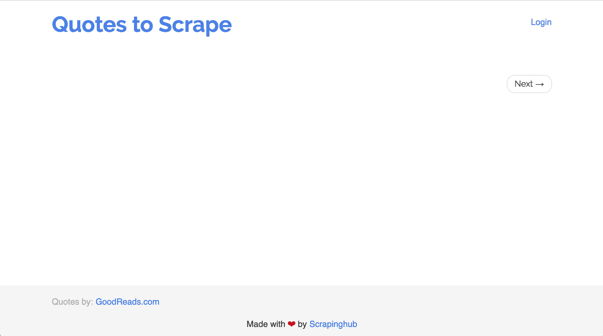
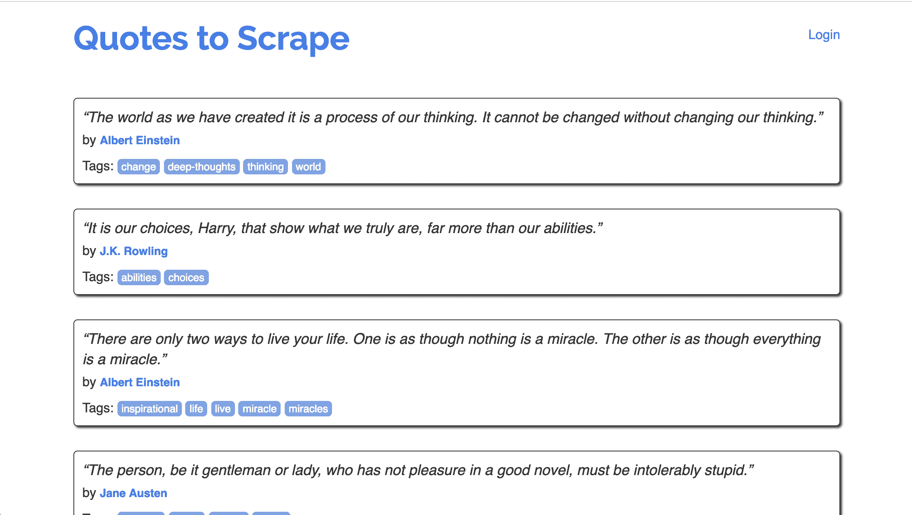

# 为什么用 requests 和 BeautifulSoup 抓取会失败？

> 原文：<https://blog.teclado.com/why-scraping-fail-requests-beautifulsoup-python/>

您是否有一些适用于某些网站但不适用于其他网站的抓取代码，尽管您确信从网站获取数据的方法运行良好？

或者，当您提出请求时，页面内容与您在浏览器中看到的内容大相径庭？

问题很可能是 JavaScript。或者，我应该说，缺乏 JavaScript。

* * *

在我的课程中，我会教你如何通过使用两个流行的 Python 库:`requests`和`beautifulsoup4`快速而简单地构建 web 抓取系统。然而，有时刮不太管用。

当您使用浏览器加载您想要抓取的网站时，浏览器将向页面服务器发出请求以检索页面内容。这通常是一些 HTML 代码、一些 CSS 和一些 JavaScript。

当我们进行网络抓取时，我们感兴趣的只是 HTML。这是因为 HTML 通常包含页面中的所有信息。CSS 是用来执行样式化的，我们的抓取程序并不关心页面是什么样子的。

所以我们使用`requests`模式加载 HTML，并使用`BeautifulSoup`解析它...瞧！我们有我们需要的信息，我们可以把它输入到我们的程序中。

使用浏览器加载页面和使用`requests`获取页面内容的一个关键区别在于，浏览器会执行页面附带的任何 JavaScript 代码。有时，您会看到初始页面内容(在 JavaScript 运行之前)一会儿，然后 JavaScript 开始运行。

这是 JavaScript 出现之前的一个示例页面:

Example page (http://quotes.toscrape.com/js/) right before JavaScript runs.

这里是几毫秒后，一旦 JavaScript 开始运行:

Example page (http://quotes.toscrape.com/js/) right after JavaScript has finished running.

如您所见，初始页面(在 JavaScript 运行之前)没有我们感兴趣的数据。JavaScript 运行后，就有了我们想要的数据。

当我们使用`requests`请求页面内容时，JavaScript 不会运行。因此，您只会看到初始页面。

这是我的课程中经常遇到的问题。不幸的是，在 JavaScript 运行后获取页面的唯一方法是运行 JavaScript。为了做到这一点，你需要一个 JavaScript 引擎。这意味着你需要一个浏览器或类似浏览器的程序来获得最终的页面。

使用`requests`和`BeautifulSoup`您无法实现这一点，但是有其他库可以提供帮助。

*   [Selenium](https://selenium-python.readthedocs.io/getting-started.html) 是一个浏览器自动化工具，也就是说你可以用 Selenium 来控制一个浏览器。您可以让 Selenium 加载您感兴趣的页面，评估 JavaScript，然后获取页面内容。
*   [requests-html](https://requests.readthedocs.io/projects/requests-html/en/latest/) 是另一个库，可以让你在获取页面后评估 JavaScript。它使用`requests`获取页面内容，然后通过 Chrome 浏览器引擎(Chromium)运行页面，以便“计算”出最终页面。然而，它仍然在积极开发中，我已经遇到了一些问题。

## 刮削的另一个问题是

在少数情况下——虽然不太常见——可能会出现另一个问题:**根本无法到达初始页面内容**！

这可能是因为许多网站想阻止我们抓取它们。毕竟，想想看:我们的机器人不会购买任何东西，我们的机器人也不会看广告或受广告影响。然而，我们的机器人将加载页面，这意味着该网站必须花钱购买为我们的机器人提供页面服务的服务器。

在很多情况下，这对他们来说真的是双输，所以他们阻止我们。

大多数网站都有一个名为`robots.txt`的文件，它告诉我们网站的哪些部分允许我们刮，哪些部分不允许我们刮。注意*不被允许并不意味着我们会被屏蔽*，只是你不应该这么做。

例如，这里有亚马逊的`robots.txt`:[https://www.amazon.co.uk/robots.txt](https://www.amazon.co.uk/robots.txt)

你可以看到亚马逊的很多部分都是`Disallowed`，也就是说你不应该刮。亚马逊*可能会*屏蔽你的机器人，如果它确定是机器人的话。

有很多方法可以尝试绕过阻塞，但这是一件很讨厌的事情！

## 刮擦的替代方法

许多网站提供 API 供你访问他们的数据，而不是抓取。例如，Twitter 是一个大网站，你应该使用他们的 API，而不是抓取它们。

网站提供 API 而不允许抓取有几个原因。第一个是他们对访问有更多的控制，因此可以有多个访问计划，他们向你收费。第二，他们对谁可以访问数据有更多的控制权(例如，Twitter 要求你申请 API 访问)。第三，就服务器和带宽成本而言，通过 API 向您提供原始数据通常比提供完整页面并让您找到所需信息更便宜。

此外，API 通常更容易使用，而不是刮擦。在开始一个抓取项目之前，检查你感兴趣的站点是否没有公共 API！