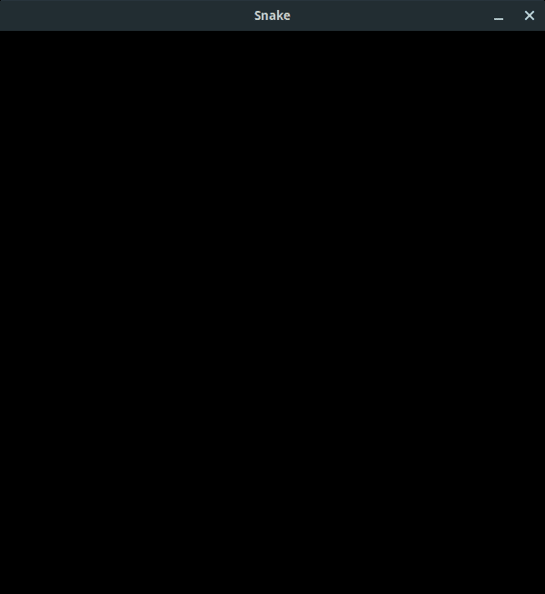
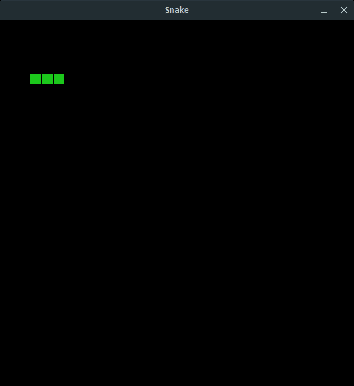
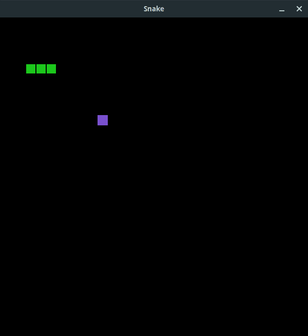
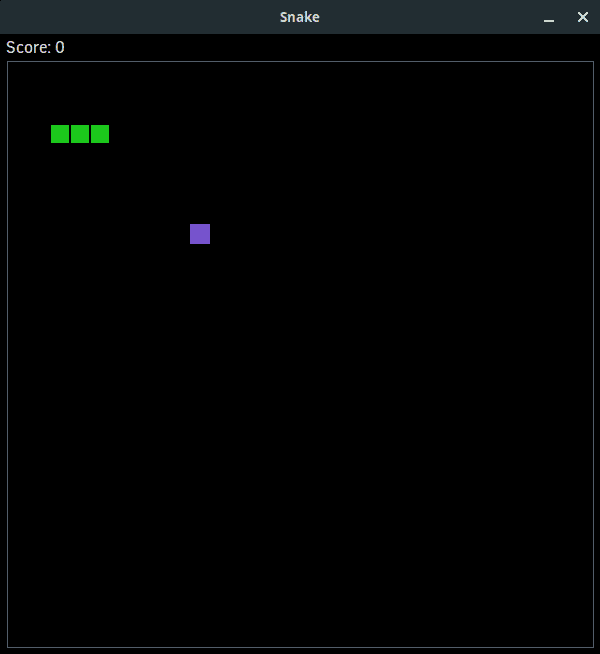

# 使用 Tkinter 的 Canvas 小部件创建 Snake(第 1 部分)

> 原文：<https://blog.teclado.com/write-snake-game-python-tkinter-part-1/>

你好，欢迎来到关于用 Tkinter 开发 GUI 的另一篇文章。本周我们暂时停止学习 Tkinter 的技术细节，我们将使用 Tkinter 非常强大的`Canvas`小工具重新制作流行的街机游戏 Snake。

这篇文章将会更高级一点，所以如果你以前从未使用过 Tkinter，我建议你看看我们之前的文章，这样你会对 Tkinter 的工作原理有更多的了解。

您可以在下面的链接中找到这个小项目的完整代码，但我真的建议您和我一起编写代码，因为这将有助于让概念变得清晰:[https://github . com/tecladocode/tkinter-snake/blob/master/app . py](https://github.com/tecladocode/tkinter-snake/blob/master/app.py)

您还会发现我们在应用程序中使用的少量资源，因此请确保获取它们！

如果你更喜欢看视频，Jose 已经在 YouTube 上为你创建了一个很棒的演示！

## 设置主窗口

首先，我们将编写大量样板 tkinter 代码，导入 Tkinter 模块并设置主应用程序窗口。

```py
import tkinter as tk

root = tk.Tk()
root.mainloop() 
```

这些都是我们在之前的帖子中见过的东西。

既然我们正在开发一个重要的应用程序，我们还将添加一些新的配置。我们将为应用程序窗口添加一个标题，并防止窗口被调整大小。我们的贪吃蛇游戏将在一个固定尺寸的棋盘上进行，所以允许窗口调整大小并没有太大的意义。

我们还将添加执行像素缩放的线条，这将使我们的文本和图像在更高的 dpi 显示器上看起来更清晰。

```py
import tkinter as tk

root = tk.Tk()
root.title("Snake")
root.resizable(False, False)
root.tk.call("tk", "scaling", 4.0)

root.mainloop() 
```

非常简单，但是其他两行可能需要一些解释。

`root.resizable`是我们用来防止窗口被调整大小的。它有两个不同的参数，因为如果我们愿意，我们可以阻止窗口只沿 x 或 y 轴调整大小。在这里，我们通过为两个值传入`False`来禁用两个维度的大小调整。

`root.tk.call("tk", "scaling", 4.0)`行告诉 Tkinter 使用 4x 像素缩放。我们可以设置一个不同的值，比如这里的`2.0`:我只是选择了一个更高的缩放级别来考虑非常密集的显示。

这样，我们就可以让主窗口工作，并按照我们想要的方式进行设置。现在让我们看看如何添加我们的`Canvas`小部件，它将构成应用程序的主体。

## 定义纸板

对于这个应用程序，我们将采用面向对象的方法来编写我们的 Tkinter 代码，这是我们以前从未见过的。

如果你不熟悉面向对象编程，我们有[完整的视频课程](https://go.tecla.do/complete-python-sale)供你选择，或者有[免费的 30 天文本课程](https://teclado.com/30-days-of-python/python-30-day-0-getting-set-up/)涵盖你需要知道的一切。

对于我们的应用程序，我们将定义一个`Snake`类，它将是`Canvas`小部件的子部件。这意味着我们将可以访问`Canvas`对象可用的属性和方法，但我们也将定义大量自己的属性和方法。

首先，让我们定义我们的`Snake`类，并定义`__init__`方法，这样我们可以传入一些配置。我们还将利用`super`来访问`Canvas`小部件的`__init__`方法，这样我们就可以定义`Canvas`本身的一些初始配置。

```py
import tkinter as tk

class Snake(tk.Canvas):
    def __init__(self):
        super().__init__(
            width=600, height=620, background="black", highlightthickness=0
        )

root = tk.Tk()
root.title("Snake")
root.resizable(False, False)
root.tk.call("tk", "scaling", 4.0)

root.mainloop() 
```

这里我们创建了一个 600 乘 620 像素的小部件，它有一个黑色背景，没有边框高亮。

然而，目前我们的应用程序窗口中不会显示任何内容，因为我们还没有指定要使用的几何管理器，我们也没有实例化我们的类。

我们将在这个应用程序中使用`pack`几何管理器，因为布局非常简单，我们将调用`Snake`类的`__init__`方法中的`pack`方法。我们所有的配置都将存在于这个`__init__`方法中。

我们还将实例化我们的`Snake`类的一个对象，并将其命名为`board`。

```py
import tkinter as tk

class Snake(tk.Canvas):
    def __init__(self):
        super().__init__(
            width=600, height=620, background="black", highlightthickness=0
        )

        self.pack()

root = tk.Tk()
root.title("Snake")
root.resizable(False, False)
root.tk.call("tk", "scaling", 4.0)

board = Snake()

root.mainloop() 
```

这样，我们现在有了一个非常令人兴奋的黑盒子:



我们开始放些东西进去吧。

## 向我们的`Canvas`添加项目

我们将在画布上添加一些不同类型的元素。我们的资产文件夹中有一些 png 图像，一些内置形状，还有一些文本。

让我们从图像开始，因为这是迄今为止最复杂的过程。我们将使用两种不同的方法将图像添加到我们的`Canvas`中。第一个负责将图像加载到我们的应用程序中，第二个负责将东西放到`Canvas`中。

### 加载我们的图像资产

因此，我们的第一步是加载我们的资产。在我们的资产文件夹中有两个不同的图像:一个小的绿色方块代表蛇的部分，一个小的紫色方块代表水果。如果你想让你的代币更精致，那就去做吧！

我们将定义一个`load_assets`方法来处理这两种资产。

在`load_assets`中，我们将定义一个`try` / `except`块，这样我们就可以处理加载文件时出现的任何潜在错误。我们不会在这里做任何花哨的事情。我们将打印错误并销毁根窗口对象。

在`try`块中，我们将加载并处理图像。为了处理我们的 png 图像，我们需要利用`PIL` (Python 图像库)，所以我们需要导入它。Python 没有附带它，所以你必须使用`pip`来安装它。

```py
pip install pillow 
```

如果你已经用`pipenv`建立了一个虚拟环境，就像我们的仓库一样，你应该用`pipenv`来安装它。

我们需要来自`PIL`的`Image`类和`ImageTk`类，因此我们的导入将如下所示:

```py
from PIL import Image, ImageTk 
```

一旦我们在`try`块中处理了我们的图像，我们就可以在`__init__`中调用`load_assets`方法。

你可以在下面看到这个样子:

```py
import tkinter as tk
from PIL import Image, ImageTk

class Snake(tk.Canvas):
    def __init__(self):
        super().__init__(
            width=600, height=620, background="black", highlightthickness=0
        )

        self.load_assets()
        self.pack()

    def load_assets(self):
        try:
            self.snake_body_image = Image.open("./assets/snake.png")
            self.snake_body = ImageTk.PhotoImage(self.snake_body_image)

            self.food_image = Image.open("./assets/food.png")
            self.food = ImageTk.PhotoImage(self.food_image)
        except IOError as error:
            print(error)
            root.destroy()

root = tk.Tk()
root.title("Snake")
root.resizable(False, False)
root.tk.call("tk", "scaling", 4.0)

board = Snake()

root.mainloop() 
```

当我们想要将蛇的身体添加到`Canvas`中时，我们现在可以使用`self.snake_body`作为图像，这同样适用于我们以这种方式定义的任何其他资产。

### 将我们的图像添加到`Canvas`

现在我们已经装载了资产，我们可以开始向`Canvas`添加东西了。我们将为此使用另一个名为`create_objects`的自定义方法。

`Canvas`小部件实际上附带了一个名为`create_image`的方法，我们将用它来将图像资产添加到`Canvas`。这个方法接受对象的 x 和 y 位置，一个传递给`image`参数的处理过的图像，以及一个可选的`tag`，我们将为所有的`Canvas`项定义它，因为它使得在我们的代码中更容易找到它们。

首先，让我们添加蛇的身体。我们将从一条有三个身体部分的蛇开始游戏，所以我们必须在画布上添加三个独立的对象。

在我看来，跟踪所有的蛇段在哪里是很有用的，因为我们以后要检查碰撞等等。，所以我认为我们应该在我们的`__init__`方法中为蛇指定起始坐标，然后我们可以在蛇每次移动时更新坐标。

```py
class Snake(tk.Canvas):
    def __init__(self):
        super().__init__(
            width=600, height=620, background="black", highlightthickness=0
        )

        self.snake_positions = [(100, 100), (80, 100), (60, 100)]

        self.load_assets()
        self.pack() 
```

我们的`self.snake_positions`属性被绑定到一个元组列表，其中每个元组包含一个 x 和一个 y 坐标。

我们现在可以在我们的`create_objects`方法中为每个坐标添加一个蛇段。由于我们一遍又一遍地重复相同的代码，我将使用一个 for 循环和一些[析构](https://blog.teclado.com/destructuring-in-python/)来添加每一段:

```py
class Snake(tk.Canvas):
    def __init__(self):
        super().__init__(
            width=600, height=620, background="black", highlightthickness=0
        )

        self.snake_positions = [(100, 100), (80, 100), (60, 100)]

        self.load_assets()
        self.create_objects()

        self.pack()

    def load_assets(self):
        try:
            self.snake_body_image = Image.open("./assets/snake.png")
            self.snake_body = ImageTk.PhotoImage(self.snake_body_image)

            self.food_image = Image.open("./assets/food.png")
            self.food = ImageTk.PhotoImage(self.food_image)
        except IOError as error:
            print(error)
            root.destroy()

    def create_objects(self):
        for x_position, y_position in self.snake_positions:
            self.create_image(
                x_position, y_position, image=self.snake_body, tag="snake"
            ) 
```

如果我们运行我们的代码，我们现在有一些漂亮的绿色方块在画布上代表我们的蛇！



加入食物是非常相似的。首先我们要定义一个新的属性来跟踪食物在哪里，然后我们要使用`create_image`将`self.food`图像添加到`Canvas`中。

现在，我们将为食物的起始位置指定一个静态位置，但是稍后我们将定义一个方法，将食物随机放置在`Canvas`上，确保避开蛇。

食物的位置也是一个包含 x 和 y 坐标的元组，所以我们可以在`create_image`方法中解包这个元组，使用`*`一次性提供 x 和 y 坐标值:

```py
class Snake(tk.Canvas):
    def __init__(self):
        super().__init__(
            width=600, height=620, background="black", highlightthickness=0
        )

        self.snake_positions = [(100, 100), (80, 100), (60, 100)]
        self.food_position = (200, 200)

        self.load_assets()
        self.create_objects()

        self.pack()

    def load_assets(self):
        try:
            self.snake_body_image = Image.open("./assets/snake.png")
            self.snake_body = ImageTk.PhotoImage(self.snake_body_image)

            self.food_image = Image.open("./assets/food.png")
            self.food = ImageTk.PhotoImage(self.food_image)
        except IOError as error:
            print(error)
            root.destroy()

    def create_objects(self):
        for x_position, y_position in self.snake_positions:
            self.create_image(
                x_position, y_position, image=self.snake_body, tag="snake"
            )

        self.create_image(*self.food_position, image=self.food, tag="food") 
```

我们现在在`Canvas`上有一个漂亮的紫色方块代表食物:



这样，我们所有的图像都被添加进去了！

### 添加其他`Canvas`对象

我们可能已经添加了所有的图像，但是我们还没有把东西放到`Canvas`上。我们仍然需要添加一些文本来显示当前的分数，我们需要一个框来定义可玩的区域。

为了将分数文本添加到`Canvas`中，我们需要定义另一个属性来跟踪当前分数。

向`Canvas`添加文本与添加图像非常相似，我们只是使用了`create_text`方法。同样，我们的前两个参数是一组 x 和 y 坐标，但是我们也将为`text`、`tag`、`fill`和`font`提供值。

`text`只是我们想要定位的实际字符，而`tag`将以与您的图像类似的方式使用。它让我们可以在出于某种原因需要时快速获得画布部件，

`fill`用于设置文本颜色，这里我们用十六进制的`#fff`来写简单的白色。如果你想要不同的颜色，你可以把它换成任何你想要的颜色！

在我们的例子中，`font`将用于设置字体大小，但是如果你愿意，你也可以指定一种字样。为此，首先用字样传入一组值。

我们更新后的`create_objects`方法如下所示:

```py
def create_objects(self):
    self.create_text(
        35, 12, text=f"Score: {self.score}", tag="score", fill="#fff", font=10
    )

    for x_position, y_position in self.snake_positions:
        self.create_image(
            x_position, y_position, image=self.snake_body, tag="snake"
        )

    self.create_image(*self.food_position, image=self.food, tag="food") 
```

我们还将把`self.score = 0`添加到我们的`__init__`方法中。

最后，我们将为可玩区域添加一个边界，以便玩家知道边界在哪里。为此，我们将使用 Tkinter 的`Canvas`小部件固有的形状之一，我们用另一个内置方法:`create_rectangle`创建它。

在 Tkinter `Canvas`中定义矩形时，我们实际上需要四个值。前两个值是左上角的 x 和 y 坐标，后两个值是右下角的 x 和 y 坐标。根据这些值，Tkinter 可以计算出其他角的位置。

我们的坐标看起来会有点奇怪，因为我添加了 3 个像素的偏移量，这样当蛇沿着其中一条边移动时，它就不会碰到边界。只是有一点空隙看起来更好。如果你想消除差距，你可以把所有的数字四舍五入到最接近的 10。

除了指定矩形的坐标，我们还将通过向参数`outline`传递一个十六进制颜色值来定义轮廓颜色。

```py
def create_objects(self):
    self.create_text(
        35, 12, text=f"Score: {self.score}", tag="score", fill="#fff", font=10
    )

    for x_position, y_position in self.snake_positions:
        self.create_image(
            x_position, y_position, image=self.snake_body, tag="snake"
        )

    self.create_image(*self.food_position, image=self.food, tag="food")
    self.create_rectangle(7, 27, 593, 613, outline="#525d69") 
```

这样，我们所有的物品都在`Canvas`上:



## 包扎

我们都准备好了，我想现在是停下来的好地方。在下一篇文章中，我们将负责添加所有的功能，到最后，我们将有一个工作的 snake 应用程序供您使用！

我希望你喜欢和我一起创建这个应用程序，如果你有兴趣学习更多关于 GUI 开发的知识，我们刚刚发布了关于这个主题的整个课程！查看使用 Python 和 Tkinter 进行 GUI 开发的[课程！](https://go.tecla.do/tkinter-gui-course-sale)