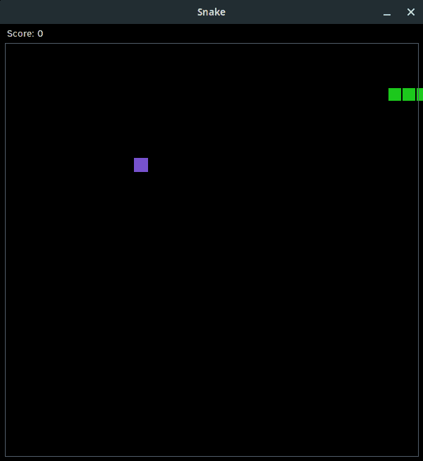

# 使用 Tkinter 的 Canvas 小部件创建 Snake(第 2 部分)

> 原文：<https://blog.teclado.com/write-snake-game-python-tkinter-part-2/>

在上周的帖子中，我们开始使用 Tkinter 的`Canvas`小工具重新制作流行的街机游戏 Snake。在之前的文章中，我们设置了应用程序窗口，加载了我们的资产，并将所有东西放在了`Canvas`上。本周我们将添加实际玩游戏所需的所有逻辑，到本文结束时，我们应该会有一个可用的 snake 版本！

如果你错过了我们之前的帖子，你可以在这里找到它，如果你刚刚开始，我们也有许多关于 GUI 开发的其他帖子。您可以在下面的链接中找到这些内容:

[https://blog.tecladocode.com/tag/gui-development/](https://blog.teclado.com/tag/gui-development/)

我们也有一个完整的视频演示这篇文章中的代码，以及这个系列的前一篇文章，你可以在下面找到:

## 到目前为止的代码

```py
import tkinter as tk
from random import randint
from PIL import Image, ImageTk

class Snake(tk.Canvas):
    def __init__(self):
        super().__init__(
            width=600, height=620, background="black", highlightthickness=0
        )

        self.snake_positions = [(100, 100), (80, 100), (60, 100)]
        self.food_position = (200, 200)

        self.load_assets()
        self.create_objects()

        self.pack()

    def load_assets(self):
        try:
            self.snake_body_image = Image.open("./assets/snake.png")
            self.snake_body = ImageTk.PhotoImage(self.snake_body_image)

            self.food_image = Image.open("./assets/food.png")
            self.food = ImageTk.PhotoImage(self.food_image)
        except IOError as error:
            print(error)
            root.destroy()

    def create_objects(self):
        self.create_text(
            35, 12, text=f"Score: {self.score}", tag="score", fill="#fff", font=10
        )

        for x_position, y_position in self.snake_positions:
            self.create_image(
                x_position, y_position, image=self.snake_body, tag="snake"
            )

        self.create_image(*self.food_position, image=self.food, tag="food")
        self.create_rectangle(7, 27, 593, 613, outline="#525d69")

root = tk.Tk()
root.title("Snake")
root.resizable(False, False)
root.tk.call("tk", "scaling", 4.0)

board = Snake()

root.mainloop() 
```

在这个阶段，我们的 Snake 应用程序看起来很像，但是它并没有真正做什么。我们有一个游戏板，一个分数计数器，所有我们需要的资源都被加载到画布上，但是我们不能玩这个游戏。

让我们开始实现游戏逻辑吧！

## 移动蛇

在我们做任何其他事情之前，我认为这是一个好主意，实际上动画我们的蛇。如果我们甚至不能移动这条蛇，那么剩下的功能就有点无关紧要了。

我们将在我们的`Snake`类中定义一个名为`move_snake`的新方法。

```py
def move_snake(self):
    pass 
```

目前，我们在一个名为`self.snake_positions`的属性中拥有所有蛇段的位置。这个属性的值是一个元组列表，其中每个元组的第一个值是 x 坐标，第二个值是 y 坐标。

我们的`move_snake`的工作方式是，我们要找出蛇的头部应该在哪里，然后我们要让每一段蛇占据前面一段的旧位置。

首先，我们需要知道头在哪里:

```py
def move_snake(self):
    head_x_position, head_y_position = self.snake_positions[0] 
```

我在这里使用了析构来避免使用嵌套索引。如果你不知道解构，看看这篇文章:[https://blog.tecladocode.com/destructuring-in-python/](https://blog.teclado.com/destructuring-in-python/)

现在我们有了当前的头部位置，我们将修改坐标，使它们代表蛇的头部应该在哪里。这包括创建一个新的元组，因为元组是不可变的。

首先，我们要让蛇向右移动。

```py
def move_snake(self):
    head_x_position, head_y_position = self.snake_positions[0]
    new_head_position = (head_x_position + 20, head_y_position) 
```

我在这里使用了 20px 的值，因为这就是我们的蛇段的大小。然而，这是一个我们会经常用到的值，所以我们应该把它提取到我们的`app.py`顶部的一个常量中。

```py
MOVE_INCREMENT = 20 
```

我们现在可以在我们的`move_snake`方法中使用这个常数:

```py
def move_snake(self):
    head_x_position, head_y_position = self.snake_positions[0]
    new_head_position = (head_x_position + MOVE_INCREMENT, head_y_position) 
```

正如我前面说过的，其他的蛇将从前面的蛇段继承它们的位置。为了实现这一点，我们将获取原始蛇位置的一部分，去掉最后一个值。然后我们可以将它附加到`new_head_position`中，这将给我们一个与旧列表长度相同的新列表。

如果你对切片不熟悉，我们有几篇关于这方面的文章可以帮助你:

[https://blog.tecladocode.com/python-slices/](https://blog.teclado.com/python-slices/)

[https://blog.tecladocode.com/python-slices-part-2/](https://blog.teclado.com/python-slices-part-2/)

```py
def move_snake(self):
    head_x_position, head_y_position = self.snake_positions[0]
    new_head_position = (head_x_position + MOVE_INCREMENT, head_y_position)

    self.snake_positions = [new_head_position] + self.snake_positions[:-1] 
```

最后一步是更新所有线段的位置。

我们将使用`zip`将蛇段与`self.snake_positions`列表结合起来。我们可以使用`find_withtag`方法获得所有蛇段的列表，这将允许我们获得所有带有标签`"snake"`的画布元素。

如果`zip`对你来说是新事物，我们再一次为你报道:[https://blog.tecladocode.com/python-zip/](https://blog.teclado.com/python-zip/)

```py
def move_snake(self):
    head_x_position, head_y_position = self.snake_positions[0]
    new_head_position = (head_x_position + MOVE_INCREMENT, head_y_position)

    self.snake_positions = [new_head_position] + self.snake_positions[:-1]

    for segment, position in zip(self.find_withtag("snake"), self.snake_positions):
        self.coords(segment, position) 
```

我们在这里调用的`coords`方法在 Tkinter 中有两个作业。如果我们调用它时只引用了`Canvas`上的一个对象，它将返回该项目的一组坐标。然而，如果我们传递新的坐标作为第二个参数，我们可以用这些新的坐标替换现有的坐标。

这允许我们通过更新它们的坐标来“移动”项目。

就这样，对吗？这条蛇现在能动了吗？

不完全是。虽然编写了允许我们的蛇移动的逻辑，但是我们目前没有在任何地方调用我们的`move_snake`方法。我们也不知道如何调用它，因为我们需要它每秒运行几次。

我们实际上将使用一个名为`after`的内置方法来触发我们的`move_snake`方法。`after`取一个数值作为第一个参数，代表一段等待的时间。第二个参数是要调用的函数或方法。然而，我们不打算直接调用`move_snake`，因为我们希望在每个周期结束时发生许多事情。相反，我们将创建一个名为`perform_actions`的方法，它将在每个周期后调用所有相关的方法。

因此，在我们的`__init__`方法中，我们需要编写:

```py
self.after(75, self.perform_actions) 
```

所以 75 毫秒后，我们要调用`self.perform_action`。注意，我们只将方法*名称*传递给`after`。

现在我们要像这样创建出`perform_actions`方法:

```py
def perform_actions(self):
    self.move_snake()
    self.after(75, self.perform_actions) 
```

注意，我们还在`perform_actions`内部调用`after`，这意味着我们可以每隔 75 毫秒重复调用该函数，并做我们需要做的一切。

然而，我们在几个地方有 75 毫秒，所以让我们把它提取到一些常数:

```py
MOVES_PER_SECOND = 15
GAME_SPEED = 1000 // MOVES_PER_SECOND 
```

现在我们可以使用`MOVES_PER_SECOND`来设置每回合要走多少步，并且我们可以传入`GAME_SPEED`来代替毫秒值。您可以随意调整该值，找到您喜欢的速度。

有了它，我们的蛇应该会动了！

## 冲突检出

所以，我们让我们的蛇移动，这是非常令人兴奋的。然而，它很快从屏幕的右侧滑落，再也看不到了。再见，蛇！

我们需要确保它不能离开板，所以让我们来看看实现一些碰撞检测。目前我们需要检查几样东西。我们需要检查蛇没有咬自己，我们需要检查蛇是否撞到了棋盘的边缘。

无论哪种情况，我们都想停止游戏。

因为这是我们每次移动后都要检查的东西，所以我们将创建一个名为`check_collisions`的新方法，我们将在`perform_actions`内部调用它。

`check_collisions`方法其实很简单。我们再次从我们的`self.snake_positions`列表中找到我们的蛇头，然后我们可以使用一些条件逻辑。

我们将使用`or`布尔运算符，而不是一系列 if 语句。我们要检查 3 个条件，如果其中任何一个是`True`，我们要返回`True`。因此，我们可以这样写:

```py
def check_collisions(self):
    head_x_position, head_y_position = self.snake_positions[0]

    return (
        head_x_position in (0, 600)
        or head_y_position in (20, 620)
        or (head_x_position, head_y_position) in self.snake_positions[1:]
    ) 
```

我们的第一个条件是检查`head_x_position`既不是`0`，也不是`600`。这些是我们棋盘的水平边界。

第二个条件检查`head_y_position`不是`20`或`620`，它们是我们棋盘的垂直边界。我们有一个高于可玩区域的分数，所以垂直限制不在`0`。

最后，我们检查头部的完整坐标与任何其他分段坐标是否相同。

如果满足这些条件中的任何一个，方法返回`True`，我们可以在我们的`perform_actions`方法中检查返回值:

```py
def perform_actions(self):
    if self.check_collisions():
        return

    self.move_snake()
    self.after(GAME_SPEED, self.perform_actions) 
```

现在，如果蛇碰到任何一面边界墙，游戏就会停止。



## 控制蛇

虽然我们可以让蛇沿着屏幕移动，我们可以在蛇撞到墙上时结束游戏，但我认为可以说这不是一个游戏。我们甚至无法控制蛇向哪个方向移动！

那么，我们如何解决这个问题呢？这实际上是一个多阶段的过程。

首先，我们需要一些方法来跟踪蛇的当前方向。用户每轮按下按钮，一次不能移动蛇一格。这条蛇自己朝同一个方向移动，直到我们告诉它改变。

一旦我们有了存储蛇的方向的地方，我们需要监听用户的按键并确定它们的意思。然后我们可以利用这些信息为这条蛇设定一个新的方向。

最后，我们需要更新我们的`move_snake`定义，这样我们可以根据蛇移动的方向以不同的方式改变头部的坐标。

让我们从听琴键开始。

### 监听按键

Tkinter 实际上附带了一对名为`bind`和`bind_all`的非常容易处理的方法，它们允许我们监听键盘或鼠标事件以及其他事件，并在这些事件发生时执行一些操作。

因此，我们将向我们的`__init__`方法添加两个新属性:

```py
self.direction = "Right"
self.bind_all("<Key>", self.on_key_press) 
```

这里我们已经为我们的蛇设置了开始方向，即`"Right"`，并且我们已经使用`bind_all`创建了一个监听器，它将在任何键被按下时激活。

当该事件触发时，我们执行的操作是调用`self.on_key_press`，这是一个尚不存在的方法。所以让我们一起努力吧。

### 处理按键事件

我们的`on_key_press`方法将负责在相关键被按下时设置`self.direction`属性。我们将在一个名为`e`的参数中捕获关于触发事件的信息，这个参数是由`bind_all`方法在调用`self.on_key_press`时传入的。

我们可以对此事件做的一件巧妙的事情是从中获得一个`keysym`。这是 Tkinter 为某些键绑定使用的一个特殊名称，在我们的例子中，它们非常易读。

例如，向上箭头的`keysym`为`"Up"`。因此，我们新方法的第一行将找出被触发键的`keysym`是什么。

```py
def on_key_press(self, e):
    new_direction = e.keysym 
```

我们现在要定义一个包含棋盘上所有可能方向的元组，这样我们就可以过滤掉我们不关心的按键。例如， **f** 键对我们没有任何作用，所以我们可以忽略它。

除了方向的集合之外，我们还将这些方向的对立面定义为一对集合。这将允许我们避免当玩家意外地按下与他们当前要去的方向相反的方向时杀死这条蛇。

```py
def on_key_press(self, e):
    new_direction = e.keysym

    all_directions = ("Up", "Down", "Left", "Right")
    opposites = ({"Up", "Down"}, {"Left", "Right"}) 
```

现在我们已经设置好了所有这些，我们可以使用 if 语句来过滤掉我们想要忽略的按键，并在有效的按键被按下时设置一个新的方向。

```py
def on_key_press(self, e):
    new_direction = e.keysym

    all_directions = ("Up", "Down", "Left", "Right")
    opposites = ({"Up", "Down"}, {"Left", "Right"})

    if (
        new_direction in all_directions
        and {new_direction, self.direction} not in opposites
    ):
        self.direction = new_direction 
```

条件的第一部分相当简单:我们只需检查分配给`new_direction`的`keysym`是否是我们定义的方向之一。然而，第二个条件有点棘手。

首先，我们定义一个由新方向和当前方向组成的新集合。集合的几个有趣的属性是它们不保持顺序，并且不允许重复条目。

这意味着集合`{"Up", "Down"}`与集合`{"Down", "Up"}`相同。

因此，当我们在`opposites`中执行成员资格检查时，只要当前方向和新方向相反，我们就会得到一个匹配，这会导致条件失败。因此,`self.direction`属性不会被更新。

因为两个条件都必须评估为`True`以满足`and`操作符，所以我们只在按下方向键时更新方向，并且该方向与当前方向不相反。

太好了！所以我们现在可以更新`self.direction`属性，但是我们目前不使用它来确定蛇的移动方向。我们需要更新我们的`move_snake`方法。

### 在`move_snake`中说明方向

我们的方法大部分可以保持原样。我们只需要添加一些条件，这样我们就可以根据蛇的移动方向来改变蛇的头部坐标。

当蛇向左移动时，我们需要从 x 坐标或当前头部位置减去`MOVE_INCREMENT`，因为较低的 x 轴值在棋盘的左边。

向右移动时，我们只需添加`MOVE_INCREMENT`即可。

对于 down 和 up，我们需要分别从 y 坐标值中加减`MOVE_INCREMENT`。

我们完成的方法如下所示:

```py
def move_snake(self):
    head_x_position, head_y_position = self.snake_positions[0]

    if self.direction == "Left":
        new_head_position = (head_x_position - MOVE_INCREMENT, head_y_position)
    elif self.direction == "Right":
        new_head_position = (head_x_position + MOVE_INCREMENT, head_y_position)
    elif self.direction == "Down":
        new_head_position = (head_x_position, head_y_position + MOVE_INCREMENT)
    elif self.direction == "Up":
        new_head_position = (head_x_position, head_y_position - MOVE_INCREMENT)

    self.snake_positions = [new_head_position] + self.snake_positions[:-1]

    for segment, position in zip(self.find_withtag("snake"), self.snake_positions):
        self.coords(segment, position) 
```

## 喂蛇

所以，我们的蛇现在到处滑行，但它不碰它的食物。我们需要实现一个方法来处理与`Canvas`上的食物项目的冲突。

自然，我们将在这里定义另一个方法，这次称为`check_food_collisions`。

实际的逻辑是一个单一的 if 块，我们最初检查蛇的头部位置是否与当前的食物位置相同。

请记住，我们在一个名为`self.food_position`的属性中有这个集合，所以我们不需要在`Canvas`中寻找它。

如果条件评估为`False`，我们就立即返回默认值`None`，然后继续。然而，如果条件评估为`True`，我们需要做相当多的事情。

首先，我们需要增加分数，并给蛇添加一个新的分段:

```py
def check_food_collision(self):
    if self.snake_positions[0] == self.food_position:
        self.score += 1
        self.snake_positions.append(self.snake_positions[-1]) 
```

在这里，我们只是复制最后一段蛇的坐标，因为蛇会立即移动，留下新的尾段在原来的位置。

当然，我们也必须把它放在`Canvas`上，所以我们需要在我们的`Canvas`小部件上调用`create_image`方法:

```py
def check_food_collision(self):
    if self.snake_positions[0] == self.food_position:
        self.score += 1
        self.snake_positions.append(self.snake_positions[-1])

        self.create_image(
            *self.snake_positions[-1], image=self.snake_body, tag="snake"
        ) 
```

我们在这里使用`*`解包从元组中获取 x 和 y 坐标，并将它们作为单独的参数传入。

当我们更新`Canvas`上的内容时，我们也需要更新乐谱文本。到目前为止，我们刚刚更新了属性。

```py
def check_food_collision(self):
    if self.snake_positions[0] == self.food_position:
        self.score += 1
        self.snake_positions.append(self.snake_positions[-1])

        self.create_image(
            *self.snake_positions[-1], image=self.snake_body, tag="snake"
        )

        score = self.find_withtag("score")
        self.itemconfigure(score, text=f"Score: {self.score}", tag="score") 
```

最后，我们需要在我们的`perform_actions`方法中检查食物碰撞:

```py
def perform_actions(self):
    if self.check_collisions():
        return

    self.check_food_collision()
    self.move_snake()

    self.after(GAME_SPEED, self.perform_actions) 
```

我们还没有完全完成，因为我们还希望食物移动到一个新的随机点。然而，我们还没有为此实现任何东西。

## 使食物的位置随机化

为了随机化食物的位置，我们将创建另一个方法，这个方法叫做`set_new_food_position`。

在这个方法中，我实际上要从一个 while 循环开始，因为我想继续随机选择一个地方放食物，直到我们找到一个没有被蛇占据的地方。

我们将使用来自`random`模块的`randint`函数生成一个给定范围内的随机整数，然后我们将它们乘以`MOVE_INCREMENT`，这样我们就不会得到超出 20px 网格的值。这些值将成为我们食物对象的坐标。

注意，您必须导入`random`模块，我们是这样做的:

```py
from random import randint 
```

一旦我们有了一对随机数，我们将为坐标构建一个元组，并检查这些坐标是否在`self.snake_positions`中。如果是，我们重新开始循环，但是如果我们发现一个没有被蛇占据的空间，我们返回我们生成的坐标，这将结束循环。

```py
def set_new_food_position(self):
    while True:
        x_position = randint(1, 29) * MOVE_INCREMENT
        y_position = randint(3, 30) * MOVE_INCREMENT
        food_position = (x_position, y_position)

        if food_position not in self.snake_positions:
            return food_position 
```

现在我们有了这个方法，我们可以用它来为食物设置一个随机的起始位置，我们也可以在`check_food_collision`内部使用它来移动食物。

该属性现在看起来像这样:

```py
self.food_position = self.set_new_food_position() 
```

我们给`check_food_collision`方法添加了几行新代码:

```py
def check_food_collision(self):
    if self.snake_positions[0] == self.food_position:
        self.score += 1
        self.snake_positions.append(self.snake_positions[-1])

        self.create_image(
            *self.snake_positions[-1], image=self.snake_body, tag="snake"
        )

        self.food_position = self.set_new_food_position()
        self.coords(self.find_withtag("food"), *self.food_position)

        score = self.find_withtag("score")
        self.itemconfigure(score, text=f"Score: {self.score}", tag="score") 
```

## 添加游戏结束画面

如果我们想，我们可以就此打住。游戏完全正常，我们已经实现了所有重要的功能。

然而，我认为在游戏结束时清除`Canvas`并告诉用户他们的分数会很好。因此，我们将实现最后一个方法`end_game`。

`end_game`方法非常简单。我们从删除`Canvas`中的所有内容开始，这可以用`delete`方法完成，传入`tk.ALL`，它选择所有的`Canvas`对象。

然后我们在`Canvas`上放置一个新项目:一行文字，告诉玩家游戏已经结束，以及他们的得分。

```py
def end_game(self):
    self.delete(tk.ALL)
    self.create_text(
        self.winfo_width() / 2,
        self.winfo_height() / 2,
        text=f"Game over! You scored {self.score}!",
        fill="#fff",
        font=("", 14)
    ) 
```

我们现在可以在我们的`perform_actions`方法中调用这个方法，而不是在检测到冲突时才返回:

```py
def perform_actions(self):
    if self.check_collisions():
        self.end_game()

    self.check_food_collision()
    self.move_snake()

    self.after(GAME_SPEED, self.perform_actions) 
```

## 完成的代码

就这样，我们结束了！

最后，我的代码看起来像这样:

```py
import tkinter as tk
from random import randint
from PIL import Image, ImageTk

MOVE_INCREMENT = 20
MOVES_PER_SECOND = 15
GAME_SPEED = 1000 // MOVES_PER_SECOND

class Snake(tk.Canvas):
    def __init__(self):
        super().__init__(
            width=600, height=620, background="black", highlightthickness=0
        )

        self.snake_positions = [(100, 100), (80, 100), (60, 100)]
        self.food_position = self.set_new_food_position()
        self.direction = "Right"

        self.score = 0

        self.load_assets()
        self.create_objects()

        self.bind_all("<Key>", self.on_key_press)

        self.pack()

        self.after(GAME_SPEED, self.perform_actions)

    def load_assets(self):
        try:
            self.snake_body_image = Image.open("./assets/snake.png")
            self.snake_body = ImageTk.PhotoImage(self.snake_body_image)

            self.food_image = Image.open("./assets/food.png")
            self.food = ImageTk.PhotoImage(self.food_image)
        except IOError as error:
            print(error)
            root.destroy()

    def create_objects(self):
        self.create_text(
            35, 12, text=f"Score: {self.score}", tag="score", fill="#fff", font=(10)
        )

        for x_position, y_position in self.snake_positions:
            self.create_image(
                x_position, y_position, image=self.snake_body, tag="snake"
            )

        self.create_image(*self.food_position, image=self.food, tag="food")
        self.create_rectangle(7, 27, 593, 613, outline="#525d69")

    def check_collisions(self):
        head_x_position, head_y_position = self.snake_positions[0]

        return (
            head_x_position in (0, 600)
            or head_y_position in (20, 620)
            or (head_x_position, head_y_position) in self.snake_positions[1:]
        )

    def check_food_collision(self):
        if self.snake_positions[0] == self.food_position:
            self.score += 1
            self.snake_positions.append(self.snake_positions[-1])

            self.create_image(
                *self.snake_positions[-1], image=self.snake_body, tag="snake"
            )

            self.food_position = self.set_new_food_position()
            self.coords(self.find_withtag("food"), *self.food_position)

            score = self.find_withtag("score")
            self.itemconfigure(score, text=f"Score: {self.score}", tag="score")

    def end_game(self):
        self.delete(tk.ALL)
        self.create_text(
            self.winfo_width() / 2,
            self.winfo_height() / 2,
            text=f"Game over! You scored {self.score}!",
            fill="#fff",
            font=("", 14)
        )

    def move_snake(self):
        head_x_position, head_y_position = self.snake_positions[0]

        if self.direction == "Left":
            new_head_position = (head_x_position - MOVE_INCREMENT, head_y_position)
        elif self.direction == "Right":
            new_head_position = (head_x_position + MOVE_INCREMENT, head_y_position)
        elif self.direction == "Down":
            new_head_position = (head_x_position, head_y_position + MOVE_INCREMENT)
        elif self.direction == "Up":
            new_head_position = (head_x_position, head_y_position - MOVE_INCREMENT)

        self.snake_positions = [new_head_position] + self.snake_positions[:-1]

        for segment, position in zip(self.find_withtag("snake"), self.snake_positions):
            self.coords(segment, position)

    def on_key_press(self, e):
        new_direction = e.keysym

        all_directions = ("Up", "Down", "Left", "Right")
        opposites = ({"Up", "Down"}, {"Left", "Right"})

        if (
            new_direction in all_directions
            and {new_direction, self.direction} not in opposites
        ):
            self.direction = new_direction

    def perform_actions(self):
        if self.check_collisions():
            self.end_game()

        self.check_food_collision()
        self.move_snake()

        self.after(GAME_SPEED, self.perform_actions)

    def set_new_food_position(self):
        while True:
            x_position = randint(1, 29) * MOVE_INCREMENT
            y_position = randint(3, 30) * MOVE_INCREMENT
            food_position = (x_position, y_position)

            if food_position not in self.snake_positions:
                return food_position

root = tk.Tk()
root.title("Snake")
root.resizable(False, False)
root.tk.call("tk", "scaling", 4.0)

board = Snake()

root.mainloop() 
```

实际上，我鼓励你修改代码，扩展游戏。也许你可以制作一个简短的菜单，让用户可以控制游戏的速度，或者改变配色方案。也许你可以添加选项来重放游戏。

还有一个受欢迎的 snake 版本，你可以穿过地图的墙壁，最终到达对面。实现这一点可能也是一个有趣的挑战！

## 包扎

我希望你喜欢和我一起创建这个小游戏，并且我希望它给你一些关于如何使用 Tkinter 的`Canvas`小部件的想法。

如果你喜欢这个，并想了解更多关于 GUI 开发的知识，我们有一个全新的课程，它将更深入地介绍 Tkinter 是如何工作的，在整个课程中，我们将制作大量其他很酷的应用程序。如果你对此感兴趣，可以去看看这个课程:[用 Python 和 Tkinter 开发 GUI](https://www.udemy.com/course/desktop-gui-python-tkinter/?referralCode=8A984196616D9BF14DD0)。

希望在那里见到你！